# DayDreams — Documento de Diseño de Juego (GDD)

> **Versión 0.1 — 24 de agosto de 2026.** Documento vivo. Anclado en el estado real del
> repositorio a esta fecha: 19 escenas registradas, 419 tests en verde, build limpio.

**Autor del proyecto:** Jean Rojas · **Repositorio:** `daydreams` (Rust, OpenGL 3.3 core)
**Base técnica:** port a Rust del motor no euclidiano de CodeParade
([HackerPoet/NonEuclidean](https://github.com/HackerPoet/NonEuclidean), MIT)

---

## Cómo leer este documento

Este GDD tiene dos trabajos a la vez: **describir lo que el juego ya hace** y **proponer hacia
dónde va**. Los dos se mezclan en cada capítulo, así que todo bloque relevante lleva una etiqueta:

| Etiqueta | Significa | Qué puedes hacer con ello |
|---|---|---|
| **[IMPLEMENTADO]** | Ya está en el build, se puede ejecutar hoy | Diséñalo encima con confianza; no lo re-especifiques |
| **[PARCIAL]** | Existe, pero incompleto o solo en algunas escenas | Confirma el alcance real antes de depender de ello |
| **[PROPUESTA]** | No existe. Es una propuesta de este documento | Discútela y apruébala antes de producir arte o niveles |

**Nada etiquetado [IMPLEMENTADO] es una opinión.** Cada cifra, tecla, nombre de escena y
constante de este documento salió de leer el código; donde hay una referencia tipo
`ext/grab.rs` puedes ir a verificarla.

### Convenciones

- Los **identificadores de código, nombres de archivo, nombres de escena y teclas** se dejan en
  inglés, porque así están en el código y en la pantalla: `ext/grab.rs`, `p_scale`, "Pool Rooms",
  tecla `E`. El texto que los rodea va en español.
- Las **medidas de UI** se expresan como fracción de la altura del *drawable*, que es como está
  escrito el código: `0.86` significa "al 86 % de la altura, desde arriba".
- Las **distancias del mundo** están en metros; una unidad del motor es un metro.
- **Ranura** = *slot* del inventario. **Prop** = objeto suelto del mundo. **Hint line** = la línea
  de texto del HUD que anuncia una acción disponible. El glosario completo cierra el capítulo 9.

### Índice

| # | Capítulo | Para quién es, sobre todo |
|---|---|---|
| 1 | Visión, pilares y alcance | Todo el equipo. Léelo primero |
| 2 | Mecánicas núcleo: el verbo del juego | Diseño de niveles, programación |
| 3 | Geometría imposible: el catálogo no euclidiano | Diseño de niveles, programación |
| 4 | Sistemas de soporte | Diseño de niveles, programación |
| 5 | Bucle de juego, progresión y ritmo | Diseño, dirección |
| 6 | Historia, tono y narrativa | Narrativa, arte, audio |
| 7 | Niveles: catálogo, plantilla y guía de construcción | Diseño de niveles |
| 8 | UI, HUD y experiencia de usuario | UI/UX |
| 9 | Dirección de arte, audio, controles y producción | Arte, audio, producción |
| A | Anexo: cómo se reproducen las capturas | Todo el equipo |

---


## 1. Visión, pilares y alcance

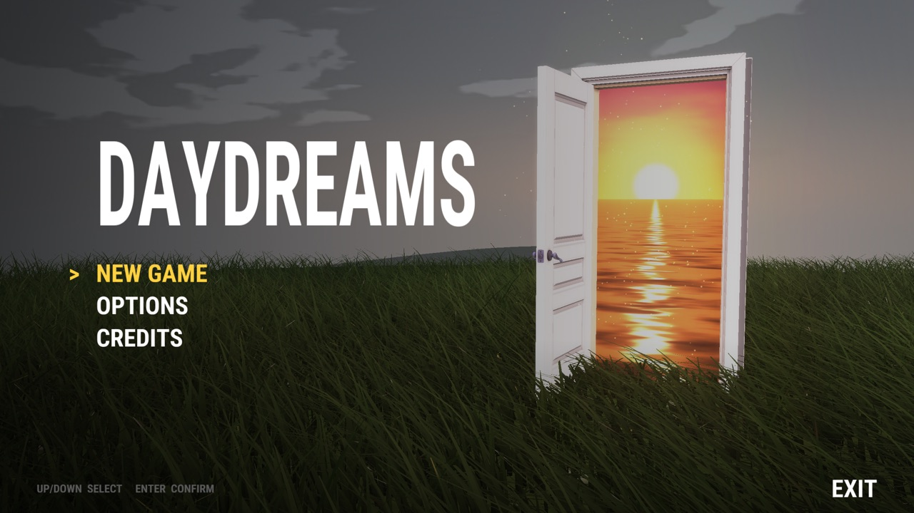
*La pantalla de título, tal como sale del build: el menú corre sobre una escena viva, la puerta blanca ocupa el tercio derecho y el atardecer existe solo del otro lado del umbral.*


### 1.1 Ficha técnica

**[IMPLEMENTADO]** salvo donde se indique lo contrario.

| Campo | Valor |
|---|---|
| Nombre | **DayDreams** |
| Género | Puzle en primera persona de espacio no euclidiano y perspectiva forzada |
| Cámara | Primera persona, sin cortes. `GH_FOV` = 60° en juego; 36° (`meadow::TITLE_FOV`) solo en la pantalla de título |
| Jugadores | 1, sin conexión de red |
| Plataformas objetivo | macOS, Windows y Linux de escritorio. Requisito duro: **OpenGL 3.3 Core** (macOS entrega 4.1 Core). Solo entry points de core profile |
| Entrada | Teclado + ratón (completa). Gamepad **[PARCIAL]**: `gilrs` + base SDL, stick analógico, correr en L3, saltar en Cross, agarrar en Square/R2, rotar con R1, navegación de menús con D-pad; el inventario (`F`, `G`, rueda) queda **deliberadamente fuera** del pad |
| Motor | Rust ≥ 1.85 sobre winit + glutin + glow; `rapier3d` para cuerpos rígidos; `kira` para audio. Port fiel de HackerPoet/NonEuclidean (MIT, © 2018 CodeParade), con 225 comentarios `// PORT:` y todo lo nuevo bajo `// EXT:` en `src/ext/` y `src/level7..18.rs` |
| Escenas | 19 registradas en `src/ext/scenes.rs` (índices 0–6, el port original, intactas; 7–18 nuevas) |
| Estado actual | `cargo build --release` y `--profile dist`: 0 errores, 0 warnings. `cargo test --release`: **419 pasan**. `clippy -D warnings`, `fmt --check` y `cargo deny check` limpios. CI en macos-14, ubuntu-latest y windows-latest |
| Rendimiento medido | M3 Max a 3456×2168: frame de título **2.28 ms** (p95 3.6), spawn con portal a la vista **1.77 ms**, carga de escena **34 ms**, arranque a primer frame **0.62 s**, pico residente **269 MB**, assets en disco **1.3 MB GLB** |

**[PROPUESTA]** Equipo objetivo por rol para llevar el build actual a Vertical Slice y luego a juego completo.

| Rol | VS | Juego completo | Responsabilidad concreta |
|---|---|---|---|
| Dirección de diseño | 0.5 | 1 | Custodia de los pilares; decide qué se corta |
| Ingeniería de motor/gráficos | 1 | 1.5 | Portales, post-proceso, presupuesto de frame, backends |
| Ingeniería de gameplay | 1 | 2 | `ext/grab.rs`, `ext/inventory.rs`, `ext/physics.rs`, props nuevos |
| Diseño de niveles | 1 | 2 | Layouts, ritmo, colocación de portales y props |
| Arte técnico / 3D | 0.5 | 1.5 | glTF, bakes de luz, atlas, `tools/gen_*.py` |
| Audio | 0.25 | 0.5 | Ampliar `tools/gen_sfx.py`; mezcla y ambientes por escena |
| QA / build | 0.25 | 1 | Matriz de 3 SO, firma de `.app`, pruebas dirigidas por CLI |
| **Total** | **4.5 FTE** | **9.5 FTE** | |

### 1.2 Pitch

**Una línea.** En DayDreams el tamaño de un objeto es la distancia a la que lo sueltas, y la habitación en la que estás es más grande por dentro que por fuera.

**Un párrafo.** DayDreams es un juego de puzles en primera persona construido sobre un motor no euclidiano real: los portales se renderizan de forma recursiva a framebuffers y el jugador se deforma al cruzar el plano, sin ray marching y sin distorsionar la geometría. Sobre eso se monta la mecánica de perspectiva forzada: agarras un objeto, y donde lo sueltas decide qué tan grande es de verdad — no aparentemente, sino en la física, la gravedad y la colisión. Las dos cosas se multiplican, porque el port conservó `p_scale` como una escala física genuina en lugar de un truco de render. El recorrido va de un prado gris con una puerta blanca hacia un laberinto de oficina escaneado, unas Pool Rooms inundadas y un pasillo tomado por la maleza, enlazados por un ascensor que sí viaja. No hay narrador, no hay tutoriales: hay una línea de HUD, seis bolsillos y una llave que sale de un cuadro.

**Elevator pitch, 30 s.** "¿Conoces Superliminal, donde agarras un objeto y al soltarlo lejos se vuelve gigante? ¿Y conoces el motor de CodeParade, el de las habitaciones más grandes por dentro? Nadie los ha juntado en un juego comercial. Nosotros sí: en DayDreams cargas un objeto pequeño a través de un túnel que reescala, y los dos efectos se multiplican sobre el mismo número. Es un juego de sueños lúcidos ambientado en espacios liminales — prados, oficinas vacías, piscinas sin agua clorada — donde el espacio miente y la cámara nunca. Ya corre a menos de 2 ms por frame en las tres plataformas de escritorio, con 19 escenas construidas y cuatro jugables de principio a fin."

### 1.3 La fantasía del jugador

La fantasía es la del **sueño lúcido**: sabes que estás soñando, y descubres que las reglas ceden si las empujas en el lugar correcto. No eres un héroe ni un elegido; eres alguien que se dio cuenta de que la puerta del fondo es más grande si camina hacia atrás.

Qué se siente, momento a momento:

- **Desconfianza productiva del espacio.** Caminas un pasillo y vuelves al punto de partida sin haber girado. La reacción correcta no es frustración sino la sospecha de que la salida está en cómo miras, no en dónde buscas.
- **Poder doméstico.** El verbo es agarrar y soltar, no disparar. La sensación de poder viene de convertir un dado de mesa en un escalón de dos metros con un paso hacia atrás.
- **Soledad sin amenaza.** Los espacios están vacíos y la iluminación es honesta: en el prado de título, **todo lo cálido del encuadre sale de la puerta**; el prado se queda bajo un cielo cubierto. El juego no persigue al jugador, lo deja solo con una imagen.
- **Continuidad.** Lo que llevas es tuyo. Guardas la llave en el bolsillo, subes al ascensor, y sale del bolsillo en las Pool Rooms — el mismo objeto, no una copia, con su escala intacta.

### 1.4 Pilares de diseño

Cinco pilares. Cada uno vale por lo que **prohíbe**; un pilar que no cierra puertas no es un pilar.

#### Pilar 1 — La escala es física, no un efecto

**[IMPLEMENTADO]** — `ext/grab.rs`, `src/level9.rs`.

`p_scale` alimenta la cadena de transformación, la gravedad, la velocidad de caminata y el epsilon de colisión. Al agarrar se fija `k = p_scale / distancia` y cada frame se resuelve en forma cerrada `d = hit_dist / (1 + r·k)`, `p_scale = k·d`: el tamaño aparente no deriva nunca, y el objeto se apoya en la superficie en lugar de atravesarla.

| | |
|---|---|
| **Habilita** | Composición de efectos: llevar un objeto agarrado por un túnel que reescala multiplica su escala tres veces (escena "Compound"). Objetos que al crecer pesan más, caen más lento y colisionan más. Puzles cuya solución es *dónde te paras*, no qué botón pulsas |
| **Prohíbe** | Cualquier escalado "solo visual" o animación de tamaño que no pase por `p_scale`. Prohíbe UI que muestre el tamaño como número o barra. Prohíbe puzles que exijan romper la relación tamaño-distancia (p. ej. "agranda esto sin alejarte"). Prohíbe objetos con tamaño fijo por guion |

#### Pilar 2 — El espacio miente; la cámara, nunca

**[IMPLEMENTADO]** — `src/portal.rs`, `src/engine.rs`, `ext/occlusion.rs`.

El engaño es geométrico y se sostiene en primera persona continua. No hay cortes de cámara, no hay cinemáticas.

| | |
|---|---|
| **Habilita** | Habitaciones más grandes por dentro, ciclos de escaleras tipo Penrose, la ventana de `ext/window.rs` que es a la vez prop agarrable y portal reconectado 500 veces por segundo |
| **Prohíbe** | Cinemáticas que quiten el control de cámara y fundidos como solución de puzle (el único negro es el del ascensor, diegético y de 0.5 s). Prohíbe **portales inclinados o de suelo/techo**: `Physical::try_portal` solo reescribe `euler.y`, y `Portal::draw` lo afirma. Eso descarta por diseño los giros de gravedad tipo Manifold Garden y los corredores tipo botella de Klein |

#### Pilar 3 — Un verbo, muchas consecuencias

**[IMPLEMENTADO]** — `E` es agarrar, usar la llave y llamar al ascensor; `F`/`G`/rueda son el inventario; `Shift` correr; `Space` saltar; `R` rotar; `M` silenciar.

| | |
|---|---|
| **Habilita** | Que el jugador no consulte controles: si algo se puede hacer, se hace con `E`, y el HUD dice cuál de las tres cosas es. Prioridad resuelta en el engine: ascensor, luego llave sostenida, luego agarre |
| **Prohíbe** | Añadir un verbo nuevo por cada mecánica nueva. Prohíbe puzles cuya solución sea una tecla dedicada. Prohíbe menús radiales y ruedas de herramientas. En el pad, prohíbe que un botón signifique dos cosas según el contexto acumulado — por eso Cross es saltar y el agarre se movió a Square, y por eso el inventario no está en el pad |

#### Pilar 4 — Continuidad del objeto

**[IMPLEMENTADO]** — `ext/inventory.rs`: seis ranuras; una ranura **posee el objeto mismo** (el `Rc<RefCell<dyn ObjectT>>` que tenía la escena), no una descripción.

| | |
|---|---|
| **Habilita** | Llevar objetos entre niveles: el ascensor y la ventana son cargas de escena y el inventario las sobrevive a propósito. Un objeto sale del bolsillo con la escala, el estado y la identidad con que entró |
| **Prohíbe** | Puzles que dependan de despojar al jugador ("aquí pierdes todo"). Prohíbe consumibles y objetos que desaparezcan al usarse sin que el jugador lo decida. Prohíbe vaciar el inventario fuera de las cuatro acciones de menú que empiezan una partida distinta (NEW GAME, RESTART LEVEL, SWITCH LEVEL, MAIN MENU). Prohíbe objetos "de nivel" que no puedan guardarse salvo por una razón física declarada — la ventana se niega con `IT WILL NOT FIT`, no por bandera arbitraria |

#### Pilar 5 — El juego no explica: enseña con la imagen

**[IMPLEMENTADO]** — `ext/hud.rs`, `ext/hint.rs`, `ext/painting.rs`, `ext/doorlight.rs`.

Una sola hint line, baja en pantalla, con un único escritor por frame; un cursor de tres estados (punto, mano abierta, mano cerrada); la fila de ranuras pequeña y tenue en el borde.

| | |
|---|---|
| **Habilita** | Composición: en el título, la puerta cae en el tercio derecho y el texto ocupa la izquierda; la luz cálida solo sale del vano, con ejes volumétricos de 16 rebanadas y 340 motas calculadas en el vertex shader. Enseña la mecánica poniendo un objeto donde la perspectiva ya lo explica |
| **Prohíbe** | Diálogo, narrador, texto expositivo, tutoriales modales, marcadores de objetivo, minimapa, brújula. Prohíbe más de una línea de HUD simultánea. Prohíbe brillo sobre el tipo del título — es lo único del cuadro que no es fotografía. Prohíbe logros o pop-ups sobre la imagen |

### 1.5 Referencias comparadas

| Referencia | Qué tomamos | Qué NO tomamos |
|---|---|---|
| **Superliminal** | El agarre por perspectiva forzada como verbo central; el lenguaje de cursor de tres estados; la lectura de "espacio doméstico onírico" | Su narrador/terapeuta y su marco narrativo guiado; sus secuencias guionizadas; su escalado como capa sobre un motor euclidiano |
| **Portal** | La disciplina de introducir una regla por sala y verificarla antes de combinarla; el portal como objeto que el jugador coloca (nuestra ventana) | El humor y la voz antagonista; las armas y los verbos de combate; la estructura de cámaras de prueba etiquetadas |
| **Antichamber** | Geometría dependiente de la observación (`ext/visibility.rs`: estatuas que solo se mueven cuando no las miras); la ausencia de tutorial | Su estética de línea blanca y su mapa-hub de aforismos; su dificultad deliberadamente opaca sin retroalimentación |
| **Manifold Garden** | La ambición arquitectónica y el mundo que se repite hasta el infinito (el "Floorplan" heredado del original) | Los cambios de gravedad del jugador: **imposibles por construcción**, ya que el teletransporte solo reorienta el yaw. Tampoco su paleta saturada de plano infinito |
| **The Stanley Parable** | La confianza en que el jugador explore un interior de oficina sin objetivos explícitos | Toda su capa de narrador y de elección dialógica; su comedia metaficcional |
| **Estética Backrooms / liminal spaces** | El vacío habitado, la alfombra y los fluorescentes, las Pool Rooms embaldosadas, la sensación de lugar que existía antes que tú | El terror, la persecución y las entidades. **No es un juego de horror**: sin sustos de salto, sin medidor de cordura, sin muerte |

### 1.6 Público objetivo y propuesta de valor

| Segmento | Perfil | Gancho |
|---|---|---|
| Primario | Jugadores de puzle en primera persona, 25–40 años, PC, que ya jugaron Superliminal, Portal, The Witness | La combinación mecánica que ningún juego comercial ofrece |
| Secundario | Audiencia de estética liminal / Backrooms en video corto | Cada escena produce una captura compartible; el título ya está compuesto como póster |
| Terciario | Curiosos técnicos y desarrolladores | El motor no euclidiano real y su ascendencia en el video de CodeParade |

**Propuesta de valor diferencial.** Superliminal escala por perspectiva. El motor de CodeParade escala al cruzar un portal. Ambos operan sobre **el mismo campo**, `p_scale`, así que se multiplican — y el código lo dice sin adornos en `src/level9.rs`: es "lo único aquí que ni NonEuclidean ni Superliminal hacen por su cuenta". No se escribió código para que compusiera; sale gratis de haber conservado `p_scale` como escala física. Un objeto compuesto es más grande, más pesado y más lento en todos los sistemas a la vez. Esa es la frase que vende el juego y también la que define su techo creativo.

### 1.7 Alcance

#### MVP — **[IMPLEMENTADO]**, cumplido

Bucle jugable completo y verificable sin ayuda externa.

| Criterio de salida | Objetivo | Estado |
|---|---|---|
| Escenas registradas y construibles | ≥ 15 | 19 (test `every_constructor_builds`) |
| Verbos centrales | agarrar, guardar/sacar, correr, saltar, usar llave, viajar | Los seis existen |
| Menús | título, pausa, opciones, controles, créditos, selección de nivel | Los seis (`Screen` en `ext/menu.rs`) |
| Frame en la escena más pesada | < 5 ms a 3456×2168 | 2.28 ms |
| Carga de escena | < 100 ms | 34 ms |
| Higiene de build | 0 warnings, tests verdes, 3 SO en CI | Cumplido, 419 tests |

#### Vertical Slice — **[PROPUESTA]**

Un tramo continuo, sin usar SWITCH LEVEL: prado → Backrooms → llave del cuadro → ventana convertida en puerta → Overgrown → ascensor → Backrooms → ascensor → Pool Rooms → final del tramo. Los dos viajes son obligatorios porque el ascensor es un anillo de sentido único (ver 5.4).

| Criterio de salida | Objetivo medible |
|---|---|
| Duración | 25–35 min en la primera partida de un jugador que nunca lo vio |
| Puzles encadenados | ≥ 8, de los cuales ≥ 3 exijan combinar dos pilares (escala + portal) |
| Tasa de finalización sin ayuda | ≥ 70 % sobre 8 sesiones de playtest grabadas |
| Punto de abandono | Ningún puzle con > 6 min de mediana de resolución |
| Estabilidad | 0 crashes y 0 estados irrecuperables en 10 sesiones completas |
| Rendimiento mínimo | 60 fps sostenidos a 1080p en GPU integrada de gama 2019 |
| Audio | Cada acción del jugador con retorno sonoro; ambiente propio por nivel |
| Presentación | Título, pausa y créditos en estado final; primer minuto sin ningún texto explicativo |

#### Juego completo — **[PROPUESTA]**

| Criterio de salida | Objetivo medible |
|---|---|
| Duración | 2 h 15 m – 3 h de campaña, medida en 5 partidas completas |
| Contenido | 5 actos (0 a IV, ver 5.5), 12 niveles jugables; las 7 escenas del port quedan como galería opcional en SWITCH LEVEL |
| Curva | Cada acto de I a III introduce exactamente una regla nueva y la combina con las anteriores antes de cerrar; el acto IV no introduce ninguna |
| Localización | ES / EN de origen; ninguna línea del HUD supera los 40 caracteres |
| Accesibilidad | Sensibilidad separada de ratón y pad (ya existe, 10 muescas geométricas), remapeo de teclas, subtítulos de efectos, opción de desactivar el balanceo de cámara |
| Cierre | Un final alcanzable y una escena de créditos que no es un menú |
| Distribución | Builds firmados de los 3 SO desde el job `dist` en tags `v*`, con `THIRD_PARTY.md` completo |

### 1.8 Riesgos de alcance y orden de corte

| # | Riesgo | Probabilidad | Impacto | Mitigación |
|---|---|---|---|---|
| R1 | El diseño de niveles pide portales inclinados o gravedad rotada | Alta | Alto — es una limitación estructural del port | Declarado prohibido en el Pilar 2; el diseño se valida contra esa restricción antes de maquetar |
| R2 | Sin colisión objeto-contra-objeto en la ruta portada, los props no se apilan | Media | Alto — invalida puzles de "construye una escalera" | Los cuerpos rígidos de `ext/physics.rs` sí colisionan entre sí: cualquier puzle de apilado se diseña solo con esos props |
| R3 | El jugador no puede pararse sobre un prop de cuerpo rígido (cilindro cinemático) | Alta | Medio | Ningún puzle depende de subirse a un objeto agarrado; el ápice de salto (0.62 m) se documenta como paso de bordillo, no como escalón de puzle |
| R4 | Ambición artística por escena sin equipo de arte dedicado | Alta | Medio | Reutilizar el pipeline de bakes y `tools/gen_*.py`; presupuesto duro de 1.3 MB de GLB no negociable |
| R5 | La deriva entre README y código (ver anexo del capítulo técnico) | Media | Bajo | Una revisión de documentación por milestone |
| R6 | Alcance del gamepad crece hasta pedir inventario en pad | Media | Bajo | El Pilar 3 lo prohíbe explícitamente |

**Orden de corte, de primero a último.** Si hay que recortar, se corta en este orden y nunca fuera de él:

1. **Post-proceso en gameplay** — hoy solo corre en el título; ampliarlo es opcional.
2. **Retratos con gesto variable** (`ext/painting.rs`) — encantador, no estructural.
3. **Las 7 escenas del port (índices 0–6) fuera de la campaña** — permanecen como galería en SWITCH LEVEL, no se pulen.
4. **Pisos del ascensor más allá de los tres actuales** — el anillo funciona con Backrooms, Pool Rooms y Overgrown. Overgrown no se corta: es el destino de la ventana.
5. **Localización más allá de ES/EN.**
6. **Gamepad reducido a stick + mirar + confirmar** si `gilrs` da problemas en un SO.

Lo que **no se corta bajo ninguna circunstancia**: el agarre por perspectiva forzada, los portales reales, el inventario que sobrevive a la carga de escena, y la escena "Compound" — porque es la demostración de la única frase que este proyecto puede decir y ningún competidor.


## 2. Mecánicas núcleo: el verbo del juego

DayDreams tiene un solo verbo original: **agarrar**. Todo lo demás —mirar, caminar, correr, saltar—
existe para poder ejercerlo desde el lugar correcto. Este capítulo describe el verbo tal como está
compilado hoy, con las cifras que están en el código, y separa eso de lo que todavía es propuesta de
diseño.

### 2.1 Tabla de verbos del jugador

**[IMPLEMENTADO]** Todos los verbos de esta tabla están en el build y tienen pruebas unitarias
propias salvo donde se indique.

| Verbo | Teclado / ratón | Gamepad (DualSense) | Qué hace | Dónde vive | Estado |
|---|---|---|---|---|---|
| Mirar | Ratón | Stick derecho | Gira la cámara. `GH_MOUSE_SENSITIVITY` = 0.005 rad/px, multiplicada por la muesca de sensibilidad (1–10, la 5 es exactamente 1.0×) | `src/player.rs`, `src/input.rs`, `src/ext/settings.rs` | **[IMPLEMENTADO]** |
| Caminar | `W` `A` `S` `D` | Stick izquierdo (analógico) | Tope de 2.9 u/s, aceleración 50 u/s². El stick y el teclado se suman y se normalizan solo si la magnitud pasa de 1 | `src/player.rs` (`Move`), `src/game_header.rs` | **[IMPLEMENTADO]** |
| Correr | `Shift` (mantener) | L3 (clic para iniciar; también sirve mantenido) | Tope ×1.8 (5.22 u/s), aceleración ×1.5, cadencia de bob ×1.35, FOV +8°. Solo hacia adelante: exige que la componente frontal sea ≥ 0.3 del vector de movimiento | `src/ext/sprint.rs` | **[IMPLEMENTADO]** |
| Saltar | `Space` | Cross | Ápice de 0.62 m, impulso resuelto por bisección (≈3.911 u/s a `p_scale` 1), coyote 0.12 s, buffer 0.12 s | `src/ext/jump.rs` | **[IMPLEMENTADO]** |
| Agarrar | `E` | Square o R2 | Toma el objeto agarrable más cercano bajo la mira, dentro de 15 m y con línea de vista limpia. Fija `k = p_scale / distancia` | `src/ext/grab.rs` (`try_grab`) | **[IMPLEMENTADO]** |
| Soltar | `E` otra vez | Square o R2 | El mismo botón: es un interruptor, no un botón que se mantiene. Devuelve la gravedad y entrega `on_release(velocidad_de_la_mano)` | `src/ext/grab.rs` (`release`) | **[IMPLEMENTADO]** |
| Rotar | `R` o botón derecho del ratón (mantener) + mover el ratón | R1 (mantener) + stick derecho | Desvía el input de mirada al objeto: yaw y pitch, sin roll. La cámara se congela ese frame | `src/ext/rotate.rs` | **[IMPLEMENTADO]** |
| Guardar | `F` con algo en la mano | — (sin asignación de pad) | Mete el objeto en la ranura seleccionada de 6. El objeto sale del mundo pero conserva su identidad y su escala | `src/ext/inventory.rs` | **[PARCIAL]**: sin asignación de gamepad |
| Sacar | `F` con la mano vacía; `G` deja caer al suelo sin pasar por la mano; `1`–`6` y la rueda del ratón eligen ranura | — (sin asignación de pad) | Reaparece en el mundo a la escala física (`p_scale`) con la que se guardó | `src/ext/inventory.rs`, `src/engine.rs` | **[PARCIAL]**: sin asignación de gamepad |
| Usar | `E` | Square o R2 | Mismo enganche que agarrar, con prioridad: (1) ascensor si estás en la cabina, (2) llave en mano con cerradura a ≤ 2.5 m, (3) agarrar/soltar | `src/engine.rs`, `src/ext/elevator.rs`, `src/ext/key.rs` | **[IMPLEMENTADO]** |

Retroalimentación asociada, toda **[IMPLEMENTADO]**: cursor de tres estados —punto, mano abierta,
mano cerrada— en `src/ext/hud.rs`; contorno blanco de 3 px por silueta en espacio de pantalla sobre
el objeto sostenido (`src/ext/outline.rs`); hint line contextual vía `ObjectT::pick_hint`
(`src/ext/hint.rs`).

### 2.2 Perspectiva forzada, explicada sin código


*Cursor de mano abierta: hay algo agarrable bajo el retículo (la manzana, sobre la alfombra).*


*Cursor de mano cerrada: el objeto va en la mano y se apoya contra la superficie a la que apuntas.*

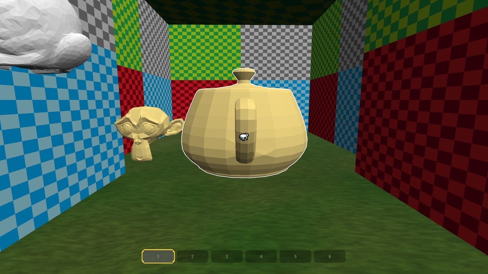
*Perspective Gallery. El contorno blanco marca el objeto sostenido; su tamaño en pantalla no cambiará mientras lo lleves.*


**[IMPLEMENTADO]**

Cuando levantas un objeto, el juego mide una sola cosa: **qué tan grande se ve en la pantalla**. Ese
tamaño aparente queda congelado. Mientras lo cargas, el objeto ya no tiene un tamaño real fijo:
tiene una *proporción* fija entre su tamaño y su distancia al ojo. Es el mismo truco de la foto
turística en la que alguien "sostiene" la Torre de Pisa.

Cada frame se lanza un rayo desde el centro de la mira. Donde ese rayo choca es donde el objeto va a
apoyarse. Si apuntas a una pared a un metro, el objeto tiene que ser diminuto para apoyarse ahí sin
atravesarla. Si apuntas al fondo de un pasillo de treinta metros, tiene que ser enorme para seguir
ocupando exactamente los mismos píxeles. En ningún momento cambia de tamaño en pantalla: cambia el
mundo alrededor.

Y es un tamaño **físico**, no cosmético. `p_scale` ya alimentaba la cadena de transformación, la
gravedad, la velocidad de caminata y el épsilon de colisión del motor portado. Un objeto grande pesa
en el mundo, ocupa espacio y colisiona como algo grande.

> **REGLA DE ORO DE DISEÑO**
> **Donde lo sueltas decide qué tan grande es.** Agarrar no cambia nada; soltar es el acto de
> diseño. Un puzle de DayDreams no pregunta "¿qué objeto?", pregunta "¿contra qué superficie?".

La fórmula, para quien la necesite. Al agarrar se guarda la proporción:

```
k = p_scale / distancia            (se fija una vez, en el momento del agarre)
```

Y cada frame, con `hit_dist` = distancia a lo que golpea el rayo y `r` = radio del objeto a escala 1:

```
d = hit_dist / (1 + r · k)         (dónde va el centro)
p_scale = k · d                    (qué tan grande es)
```

Forma cerrada, sin iteración: el objeto queda tangente a la superficie, ni flotando ni incrustado.

**El ajuste ("no puedes arrastrar objetos más grandes que la sala").** La fórmula solo consulta el
rayo central, así que un objeto ancho metería los flancos en las paredes laterales. Después del
cálculo hay una búsqueda binaria de 14 pasos (`FIT_ITERS`) que encoge el objeto hasta la mayor
colocación sin penetración, con 5% de margen (`FIT_CLEARANCE` = 1.05) y sin dejar que trague la
cámara (`PLAYER_CLEARANCE` = 0.3 m de hueco mínimo). Si el ajuste tuvo que recortar más del 15% del
tamaño pedido (`GHOST_THRESHOLD` = 0.85), se dibuja un **fantasma** translúcido en la posición y el
tamaño que pediste, mientras el objeto real se encoge suavemente (`SCALE_EASE` = 0.25 por frame,
≈0.12 s a 60 fps). El jugador siempre ve por qué no le alcanzó.


*Mano cerrada y `holding #20` en la fila SCALE: el cubo se apoya justo donde el retículo toca la alfombra (pitch -46.2 desde una POS de 1.50 m de alto: unos dos metros de rayo) y ahí mide 29 px de alto, tamaño casi natural. Ojo con el `p_scale 1.000` del panel: es el del JUGADOR, no el del objeto en la mano.*

*Sin soltarlo (`holding #20`) y desde la misma POS 998.05, 1.50, 0.10, con la mira levantada de la alfombra al fondo del pasillo: el cubo se fue a apoyar a decenas de metros y su silueta sigue midiendo unos veinte píxeles bajo la mano cerrada. La diferencia de forma con la toma anterior es el giro del cubo —de canto contra de frente—, no la distancia.*

*La fila SCALE ya no dice `holding`: el dado está soltado. Desde 23 m más al oeste (POS 974.99) ocupa 142 px de alto y, medido contra el fov 60 y el pitch -21.5 del propio panel, ronda 0.85 m de arista: catorce veces el dado de 6 cm que `src/level16.rs` deja en la alfombra.*

#### 2.2.5 Lo que el HUD delata de la perspectiva forzada — **[IMPLEMENTADO]**

La perspectiva forzada tiene un problema de documentación que ninguna otra mecánica del juego
tiene: **está diseñada para no verse**. El tamaño aparente del objeto en la mano está clavado por
construcción, así que dos capturas del mismo objeto a 2 m y a 23 m son idénticas en el único lugar
donde el jugador mira. `src/engine.rs` lo dice con todas las letras en el comentario del reporte de
`--shot`: el tamaño aparente está fijado a propósito, y solo los números dicen dónde está de verdad
el objeto y qué tan grande se puso. El modo debug (`F3` o `--debug`, `src/ext/debug.rs`) es lo que
convierte esa mecánica invisible en una **medible**.

**Qué dice cada fila, y la trampa de la fila SCALE.**

| Fila | Contenido | De dónde sale |
| --- | --- | --- |
| `SCENE` | índice y nombre de la escena registrada | `SCENES[cur_scene_ix]` |
| `POS` | posición del jugador, x/y/z, dos decimales | `Player::obj().pos` |
| `LOOK` | yaw y pitch en grados, plegados a (−180, 180] por `wrap_deg` | `Player::look_angles()` |
| `SCALE` | `p_scale` **del jugador**, fov actual, y `holding #N` si hay algo en la mano | `Player::obj().p_scale`, `ext::view::fov()`, `GrabState::held` |
| `FRAME` | media de ms por cuadro de la ventana reciente, y su recíproco en fps | `FrameClock::recent_ms()` |
| `SHOT` | la línea `--scene … --pos … --yaw … --pitch …` que reproduce la vista | `Info::command()` |

La trampa está en `SCALE`. Ese `p_scale` es el del **jugador**, no el del objeto sostenido
(`engine.rs`, donde se arma el `Info`): vale 1.000 en todo el pasillo de los Backrooms y solo se
mueve en los túneles escaladores y al cruzar un portal que redimensiona. Que una captura de
perspectiva forzada diga `p_scale 1.000` no es que la mecánica esté apagada: es exactamente lo que
debe decir, porque lo que cambia de tamaño es el objeto, no quien lo lleva. Del objeto, la fila solo
delata su **índice** (`holding #20`), y ese índice es la posición en el vector de objetos de la
escena, así que sirve para distinguir "sigo con el mismo prop" de "solté y tomé otro".

**Dónde sí está el número del objeto.** En la línea `[grab]` que `Engine::maybe_screenshot` escribe
al hacer un `--shot` con algo en la mano:

```
[grab] holding object #20 at 22.31 units, p_scale 14.037 (asked 14.037 at 22.31)
[grab] holding object #20 at 3.05 units, p_scale 1.918 (asked 6.240 at 9.91), shrunk to fit
```

Se lee así: **distancia actual de colocación**, **`p_scale` actual ya suavizado**, y entre paréntesis
el par **sin restringir** que pidió la fórmula cerrada — el que se obtendría si la sala no estorbara.
Cuando los dos pares coinciden, la colocación es limpia. Cuando difieren, el ajuste binario recortó,
y `shrunk to fit` aparece en cuanto el recorte pasa del 15 % (`GHOST_THRESHOLD`), que es el mismo
umbral con el que se dibuja el fantasma. Para afinar un puzle esto es el instrumento: el paréntesis
dice **cuánto le robó la sala al jugador**.

De esa línea sale también la constante que gobierna todo el acarreo, porque `k = p_scale / distancia`
es justo el cociente de los dos primeros números: 14.037 / 22.31 = 0.629 por metro.

**Medir un objeto ya soltado, con la captura sola.** El panel imprime las tres cosas que hacen falta
—altura del ojo (la `y` de `POS`), `pitch` y `fov`—, así que una captura con panel es autosuficiente.
Con `H` la altura de la imagen en píxeles y el fov vertical de 60° (`camera.rs` mete `e = 1/tan(fov/2)`
en la fila `y` de la proyección, así que **el fov es vertical**):

```
y_horizonte  = H/2 · (1 − tan(|pitch|) / tan(fov/2))
depresión(y) = |pitch| + atan( (y − H/2)/(H/2) · tan(fov/2) )
distancia horizontal de un punto del piso en la fila y = POS.y / tan(depresión(y))
```

Y con la distancia, el tamaño real sale del alto en píxeles del objeto. Aplicado a las tres figuras
de esta sección, en una imagen de 1000 × 627:

| Figura | Qué se mide | Resultado |
| --- | --- | --- |
| `forced-perspective-001` | dado sostenido, 29 px, rayo al piso a ~2.1 m (pitch −46.2, ojo a 1.50) | `p_scale` ≈ 1.2, o sea ~7 cm: tamaño de dado |
| `forced-perspective-002` | mismo `holding #20`, mira al fondo del pasillo | la silueta no cambia de tamaño; el punto de apoyo se fue a decenas de metros |
| `forced-perspective-003` | dado soltado, 142 px de alto, borde inferior a 2.9 m del ojo | ~0.85 m de arista, `p_scale` ≈ 14 |

Las tres tomas juntas son el ciclo completo de la mecánica hecho números: `k ≈ 0.63` fijado al agarrar
a dos metros, y a partir de ahí el tamaño real crece **linealmente con la distancia de colocación**.
Nótese también la fila `FRAME`: 125 fps con el dado a tamaño de dado y 117 con el mismo dado a
0.85 m. La escala es una transformación, no geometría nueva; lo que mueve la aguja es cuánto pasillo
entra en el encuadre, no cuán grande es el prop.

**De la distancia al tamaño, y del tamaño al puzle.** Con `k` fijado en el agarre y `r` el radio del
objeto a escala 1, la cadena entera es:

```
d       = hit_dist / (1 + r·k)          distancia del centro
p_scale = k · d                          tamaño real
```

o sea que **duplicar la distancia de apoyo duplica el tamaño**, y que el techo alcanzable de un
objeto queda decidido en el instante del agarre:

```
p_scale_máx = mín( MAX_P_SCALE , k · MAX_PLACE_DIST / (1 + r·k) )   con  k = p_scale₀ / d₀
```

Para el dado del pasillo (`r` = 0.052, agarrado a 2 m a escala 1, `k` = 0.63) eso da:

| Superficie a… | `p_scale` resultante | Arista del dado |
| --- | --- | --- |
| 1 m | 0.61 | 3.7 cm |
| 2 m | 1.22 | 7.3 cm |
| 5 m | 3.05 | 18 cm |
| 10 m | 6.10 | 37 cm |
| 23 m | 14.0 | 84 cm |
| 41 m o más (incluido "sin impacto", 60 m) | 25.0, tope duro | 1.50 m |

**Consecuencia de diseño, y el procedimiento para afinar un puzle.**

1. **Se decide el tamaño final, no la distancia.** Si la puerta pide un bloque de 1.2 m y el prop mide
   0.06 m, hace falta `p_scale` = 20; con `k` = 0.63 eso son `d` = 31.7 m de centro y una superficie
   a `hit_dist` = 31.7 · (1 + 0.052·0.63) ≈ 32.7 m. Si el pasillo más largo de la sala no llega a
   esos 33 m, el puzle **no se puede resolver como está**: hay que alargar el pasillo, acercar el
   punto de recogida (que sube `k`) o achicar la meta.
2. **El punto de recogida es un parámetro de nivel.** `k = p_scale₀ / d₀`: dejar el prop donde el
   jugador se agacha a tomarlo a 1 m duplica todo el rango respecto de dejarlo donde lo toma a 2 m.
   Un prop que el diseño quiere ver enorme se coloca **cerca de una pared**, para que el jugador no
   tenga más remedio que agarrarlo de cerca.
3. **Verificar contra el paréntesis, no contra el ojo.** Se corre la vista con `--debug`, se toma el
   lugar donde el jugador se pararía y se lee la línea `[grab]`. Si dice `shrunk to fit`, la sala está mordiendo
   y el jugador va a ver un fantasma: o se ensancha la sala o se baja la meta.
4. **Guardar la línea `SHOT`.** Es el objetivo entero del panel: `--scene N --pos X,Y,Z --yaw D
   --pitch D` reproduce la vista después de que el nivel cambie, y con `--shot` y `--frames` la
   convierte en una regresión visual. Los ángulos negativos salen escritos `--yaw=-24.8` a propósito,
   porque `clap` lee un `-` suelto como el comienzo de otra bandera.
5. **Para un `p_scale` sin manos**, la ventana tiene su propia bandera de dev (`--window-scale`), que
   la construye ya a una escala física dada dentro de los topes del agarre. Es la única forma de
   fotografiar un objeto redimensionado sin que haya alguien sosteniéndolo.

**Límite conocido del instrumento.** El panel no dice el `p_scale` del objeto en la mano y la línea
`[grab]` solo se escribe en una corrida con `--shot`. En una sesión a mano, el único número del objeto
es su índice. Medir un prop en una captura tomada con `Cmd`+`S`+`C` exige la trigonometría de arriba;
si esto se vuelve rutina, la fila `SCALE` debería imprimir también el `p_scale` del sostenido
— **[PROPUESTA]**, dos campos más en `debug::Info`.

### 2.3 Reglas y límites del agarre

**[IMPLEMENTADO]** salvo donde se marque.

| Regla | Comportamiento exacto |
|---|---|
| Qué es agarrable | Cualquier `Physical` con **exactamente una** hit sphere. Es el marcador que usa `as_grabbable`. El jugador tiene dos, así que no puede agarrarse a sí mismo |
| Radio de agarre | 15 m (`GRAB_REACH`). Generoso a propósito: la escena anamórfica exige tomar el cubo desde varios metros |
| Línea de vista | Un muro entre el ojo y el objeto lo bloquea. El bloqueador debe estar claramente delante: `LOS_SLACK` = 0.05 m de holgura. Un tabique más delgado que 5 cm pegado al objeto **no** bloquea |
| Radio de referencia | Derivado de la geometría (`bound_radius`), nunca escrito a mano: radio del mesh × la mayor componente de `scale`, mínimo 0.05 |
| Selección por esfera | Por defecto: `ray_sphere` contra la esfera envolvente en escala mundial |
| Selección por cara | Si el objeto responde `place_flat()` = true: `grab::face_rect`, el cuadrado inscrito en el círculo máximo de su esfera (semilado = `bound_radius / √2`), sobre su propio plano XY. Sin esto, una ventana del tamaño de una puerta se agarraba desde dentro de su esfera y se reducía a la mitad al tomarla |
| Colocación plana | El objeto se apoya **sobre** el punto de impacto, 0.01 m a lo largo de la normal (`FLAT_OFFSET`), orientado por `flat_euler`. Se salta el ajuste de esfera. Umbral pared/piso: `\|n.y\|` = 0.5 (`FLAT_FLOOR_NY`), o sea una rampa de 30° se pisa y una de 60° se usa como pared |
| Sin impacto | Si el rayo no golpea nada, `hit_dist` = 60 m (`MAX_PLACE_DIST`). Apuntar al cielo o al vacío da el tamaño máximo |
| Topes duros | `MIN_P_SCALE` = 0.05, `MAX_P_SCALE` = 25.0. Al morder el tope se re-deriva la distancia para que siga apoyado |
| Rotación | Yaw y pitch, sin roll, con la cámara congelada. 0.006 rad por píxel de ratón (500 px ≈ 172°); en pad, 0.8 × la tasa de mirada |
| Soltar (objeto simple) | Se restaura la gravedad (−9.8) y se pone la velocidad en cero: **cae muerto**, no hereda el movimiento de la cámara |
| Soltar (prop rígido rapier) | `on_release` recibe la velocidad de la mano del último frame, capada a 12 u/s (`MAX_THROW`), más un giro de 2.0 (`THROW_SPIN`) alrededor del eje transversal al lanzamiento. Soltar con la vista en movimiento = lanzar |
| Guardado rechazado | La ventana responde `can_stow()` = false → "IT WILL NOT FIT". Bolsillos llenos → "POCKETS FULL". Ranura vacía → "THAT SLOT IS EMPTY" |

Ganchos de `ObjectT` que un prop puede implementar: `on_grab`, `on_release`, `on_rescale`,
`on_stow`, `on_unstow`, `can_stow`, `stow_label`, `place_flat`, `pick_hint`, `accepts_key`. Hoy el
único objeto del juego con `place_flat` = true es la ventana (`src/ext/window.rs`).

### 2.4 Parámetros ajustables

**[IMPLEMENTADO]** Todos existen hoy con el valor indicado.

| Parámetro | Valor | Archivo | Qué se siente al moverlo |
|---|---|---|---|
| `GRAB_REACH` | 15.0 m | `ext/grab.rs` | Subirlo deja tomar props al otro lado de una sala; bajarlo rompe las escenas anamórficas, que solo funcionan desde lejos |
| `MAX_PLACE_DIST` | 60.0 m | `ext/grab.rs` | Techo del tamaño alcanzable apuntando al vacío. Bajarlo hace el mundo "más pequeño" |
| `MIN_P_SCALE` / `MAX_P_SCALE` | 0.05 / 25.0 | `ext/grab.rs` | El rango expresivo entero. 25× sobre un prop de 0.2 m de radio son 5 m de radio |
| `PLAYER_CLEARANCE` | 0.3 m | `ext/grab.rs` | Hueco mínimo ojo–objeto. Bajarlo produce la sensación de que el objeto te traga |
| `FIT_CLEARANCE` | 1.05 | `ext/grab.rs` | A 1.0 el objeto queda tangente y el paso de colisión lo empuja: temblor |
| `FIT_ITERS` | 14 | `ext/grab.rs` | Resolución del ajuste, ≈4 mm sobre 60 m. Bajarlo se ve como saltos de tamaño |
| `SCALE_EASE` | 0.25 / frame | `ext/grab.rs` | A 1.0 el encogimiento es un *pop*; a 0.05 el objeto "gotea" hacia su tamaño |
| `GHOST_THRESHOLD` | 0.85 | `ext/grab.rs` | Cuánto recorte hace falta para mostrar el fantasma. Subirlo lo hace aparecer todo el tiempo |
| `FLAT_OFFSET` / `FLAT_FLOOR_NY` | 0.01 m / 0.5 | `ext/grab.rs` | El primero evita z-fighting contra la pared; el segundo decide qué inclinación es piso y cuál pared |
| `LOS_SLACK` | 0.05 m | `ext/grab.rs` | Subirlo deja agarrar a través de tabiques finos; bajarlo hace que la alfombra bajo un dado bloquee el dado |
| `FIT_TRI_CAP` | 60 000 tris | `ext/grab.rs` | Mallas por encima se prueban solo por colliders. Un modelo pesado sin colliders deja de frenar el objeto |
| `MOUSE_ROT_SENS` / `PAD_ROT_SENS` | 0.006 rad/px / 0.8 | `ext/rotate.rs` | Sensación de "girar una pieza en la mano" contra "sacudirla" |
| `GH_WALK_SPEED` / `GH_WALK_ACCEL` | 2.9 u/s / 50 u/s² | `game_header.rs` | Ritmo base de exploración. Subirlo acorta la percepción de escala del edificio |
| `SPRINT_SPEED` / `SPRINT_ACCEL` / `SPRINT_BOB_FREQ` | ×1.8 / ×1.5 / ×1.35 | `ext/sprint.rs` | El *delta* entre andar y correr; si el bob no sube con la velocidad, correr se siente patinar |
| `SPRINT_FOV_KICK_DEG` / `SPEED_TAU` | 8° / 0.1 s | `ext/sprint.rs` | El golpe de FOV es casi toda la sensación de velocidad. `SPEED_TAU` evita el frenazo de 1 160 u/s² |
| `FORWARD_MIN` | 0.3 | `ext/sprint.rs` | Cuánto hay que ir de frente para que cuente como carrera |
| `APEX` | 0.62 m | `ext/jump.rs` | Altura de salto. El impulso se resuelve por bisección contra el drag real, no se escribe a mano |
| `COYOTE_TIME` / `BUFFER_TIME` / `LAUNCH_LOCKOUT` | 0.12 / 0.12 / 0.05 s | `ext/jump.rs` | Perdón de input. A 0 el salto se siente "pegajoso" a 500 Hz |
| `LANDING_MIN_AIR` / `HARD_LANDING` | 0.08 s / 4.0 u/s | `ext/jump.rs` | Umbral entre roce y golpe al aterrizar, y el filtro que evita que las costuras del piso escaneado suenen a escalera |
| `MAX_THROW` / `THROW_SPIN` | 12.0 u/s / 2.0 | `ext/rigid.rs` | Techo del lanzamiento y cuánto tumbo lleva |
| `USE_REACH` | 2.5 m | `ext/key.rs` | Distancia a la que la llave se ofrece a una cerradura |
| Muescas de sensibilidad | 1–10, la 5 = 1.0×, razón 1.25 (0.41×–3.05×) | `ext/settings.rs` | Escalera geométrica: cada muesca se nota igual en toda la escala |
| `CAPACITY` | 6 ranuras | `ext/inventory.rs` | Cuántos problemas puede llevar abiertos el jugador a la vez |

### 2.5 Gramática de puzles

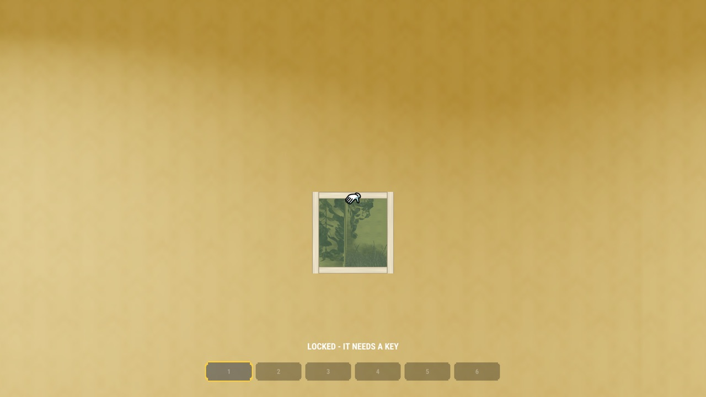
*Patrón «la llave gigante», paso 1: la ventana cuelga a 30 cm, cerrada. La hint line dice LOCKED - IT NEEDS A KEY.*

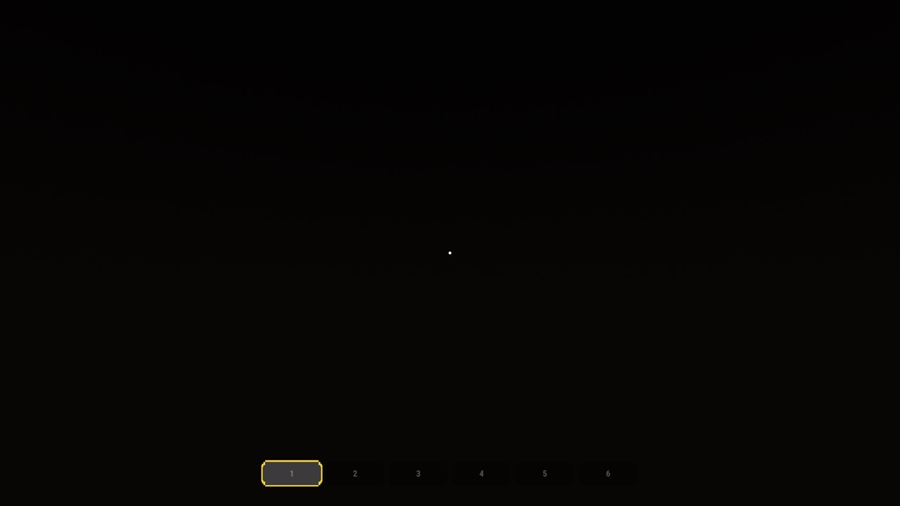
*Paso 3: la misma ventana, agarrada y soltada lejos, mide 2.1 m. Ahora es una puerta.*


**[PROPUESTA]** Los diez patrones siguientes son propuestas de diseño; los marcados como *ya en el build*
ya existen en alguna forma en el build. Dificultad en escala 1–5.

| # | Patrón | Descripción en una línea | Dif. | Qué enseña |
|---|---|---|---|---|
| 1 | **La llave gigante** | Una pieza demasiado pequeña para su encaje: se toma de cerca y se suelta apuntando al fondo de un pasillo hasta que entra (*ya en el build*: la ventana que crece a puerta de 2.1 m) | 1 | La regla de oro |
| 2 | **La miniatura** | Lo inverso: un objeto demasiado grande para un nicho; agarrarlo pegado a una pared cercana lo encoge | 1 | Que la regla corre en ambas direcciones |
| 3 | **El pasillo como regla graduada** | El único tamaño que sirve solo se consigue apuntando a la línea de vista más larga de la sala | 2 | Que la geometría del nivel *es* la herramienta |
| 4 | **El punto de estación** | El objeto solo se lee (o solo existe) desde un único lugar del suelo (*ya en el build*: la llave anamórfica en el cuadro, el cubo de la escena 8) | 3 | Que dónde te paras es un input |
| 5 | **Descolgar el cuadro** | Un objeto plano hay que sacarlo de una pared y montarlo en otra; en el piso se niega con "STAND IT UP ON A WALL" | 2 | `place_flat` y la orientación por normal |
| 6 | **El fantasma como pista** | Se pide deliberadamente un tamaño que no cabe: el fantasma translúcido muestra la meta y el reto es hallar un sitio donde el ajuste no muerda | 3 | El límite "nada más grande que la sala" |
| 7 | **El bolsillo que cruza la puerta** | La pieza que hace falta en la sala B solo existe en la A: `F` para guardarla y llevarla por el ascensor (*ya en el build*: llave guardada en Backrooms, sacada en Pool Rooms) | 2 | Persistencia del inventario entre escenas |
| 8 | **La reja** | El objeto se ve pero un vidrio o una reja corta el rayo: hay que rodear hasta un ángulo con línea de vista limpia | 3 | La compuerta de línea de vista |
| 9 | **El empujón** | Un prop rígido debe quedar en una marca del suelo y la única forma es caminar contra él: el cilindro cinemático del jugador lo arrastra | 2 | Que el cuerpo del jugador también es una herramienta |
| 10 | **El señuelo de tamaño** | Dos objetos idénticos a distintas distancias se ven iguales; solo uno es el correcto | 4 | A desconfiar del tamaño aparente — la lección tardía del juego |

Progresión sugerida **[PROPUESTA]**: 1 → 2 → 3 en el primer nivel (enseñar), 5 → 7 → 8 en el segundo
(complicar), 4 → 6 → 10 en el último tercio (subvertir). El patrón 9 es un intermedio de ritmo, no
un pico de dificultad.

### 2.6 Lo que el motor NO puede hacer hoy

**[IMPLEMENTADO — límites reales del build.]** Esta sección existe para ahorrarle semanas al equipo
de niveles. No son "todavía no": son consecuencias estructurales del motor portado.

| Límite | Causa técnica | Qué **no** diseñar |
|---|---|---|
| **Los portales deben estar verticales** | `Physical::try_portal` solo reescribe `euler.y` al teletransportar; un portal inclinado o rolado dejaría al jugador sin reorientar | Portales de piso o techo, corredores tipo botella de Klein, giros de gravedad estilo Manifold Garden. La gravedad *por objeto* sí es un `Vector3` arbitrario, así que los objetos no están afectados |
| **No hay colisión objeto contra objeto en la ruta portada** | El paso portado prueba las hit spheres de cada `Physical` contra los *mesh colliders* de los otros; los props agarrables se atraviesan entre sí | **Apilar props.** Excepción: los props rígidos de rapier (manzana, dado, rey) sí colisionan entre ellos, pero con nada de la ruta portada salvo el cilindro del jugador |
| **No puedes pararte sobre un prop** | El jugador se espeja en rapier como un cilindro **cinemático** de 0.28 m de radio: la relación es unidireccional por construcción. El jugador empuja los props; los props nunca mueven al jugador | **La rampa improvisada**, **el escalón imposible**, la torre de cajas, cruzar un hueco sobre un objeto agrandado. Saltar sobre el dado lo atraviesa y aterriza en la alfombra |
| **No hay lógica de *step-up*** | El jugador son dos esferas de radio 0.2 m (una en el ojo, otra 1.3 m debajo) empujadas fuera de la geometría; solo se sube un desnivel si el empuje tiene componente vertical, y el guard `push.y > 0.7` es lo que impide rodar por pendientes | Escaleras de peldaño alto. Usa rampas, o desniveles del orden del radio (≈0.2 m), o exige el salto (ápice 0.62 m). Ninguna superficie de las escenas enviadas ha sido saltada encima a propósito |
| **Un portal del tamaño de una puerta solo mide lo que su hueco** | El portal de la puerta del prado mide 1.7 u de alto y el ojo camina a 1.5: un salto bien cronometrado pasa **por encima** del quad y aterriza detrás de la puerta | No pongas un portal-puerta donde saltárselo rompa el nivel, o dale dintel con colisión |
| **Rotación sin roll** | `ext/rotate.rs` aplica solo yaw y pitch, a propósito | Puzles que exijan alinear una pieza en los tres ejes |
| **Mallas > 60 000 triángulos no frenan el objeto sostenido** | `FIT_TRI_CAP`: por encima de ese número el mesh no conserva lista de triángulos y solo cuenta con sus colliders | Escenografía pesada y sin colliders como pared de contención para un objeto agrandado |

**[PROPUESTA]** Si el equipo necesita "pararse sobre un prop" como verbo, el costo es conocido y
está acotado: darle al jugador un cuerpo dinámico en rapier y sacar su movimiento del `Physical`
portado. Es un proyecto aparte, no un ajuste, y arrastra consigo el bob, el warp de portal y el
épsilon de colisión. Debe decidirse antes de que ningún nivel lo asuma.


## 3. Geometría imposible: el catálogo no euclidiano

Este capítulo es el inventario de los trucos de espacio que el juego ya sabe hacer, escrito para
quien tiene que decidir con cuál resolver un problema concreto de diseño. No hay curvatura, no hay
ray marching y no hay ningún "espacio no euclidiano" en el motor. Hay un cuadrilátero —`Portal`—
que fotografía otro sitio del mundo y, cuando alguien lo atraviesa, le sustituye la posición, el
rumbo y la escala por las coordenadas equivalentes del otro lado. Todo lo demás —el pasillo que
mide diez metros dentro de un tabique de uno, la casa de cuatro cuadrantes con seis cuartos, el
corredor que baja para siempre, el jugador que sale del túnel midiendo la mitad— es esa misma
pieza cableada de otra manera. Por eso el capítulo abre explicando la pieza (3.1) y cierra con sus
reglas duras, su presupuesto y sus modos de fallo (3.10): entre medio, cada sección es una forma
de conectarla.

La distinción que gobierna la lectura es que **esto son herramientas, no demostraciones**. Las
escenas que aparecen aquí se ven, casi todas, como demos: un prado vacío con dos montículos, una
sala con un pilar, una oficina sin muebles. Eso es un accidente de su origen, no una propiedad del
truco. Un portal impasable con un tinte verdoso ya es la ventana cerrada de la campaña; el anillo
de vanos de `Floorplan` ya es la gramática espacial de los Backrooms; la anamorfosis del capítulo
`Level12` es, sin cambiar una línea, la llave escondida en el vestido de la Mona Lisa que abre esa
ventana. Cada sección se lee por lo tanto en tres capas: **qué ve el jugador**, **cómo está hecho,
con las cifras verificadas contra el código**, y **qué puzles habilita** —esto último marcado
[PROPUESTA] cuando todavía no existe, frente a [IMPLEMENTADO] para lo que ya corre y [PARCIAL]
para lo que corre a medias. Nada de lo marcado [PROPUESTA] necesita motor nuevo; ese es el criterio
para haberlo puesto aquí.

Sobre la autoría, que conviene tener clara antes de leer una sola cifra: el motor de portales es de
**CodeParade** (`HackerPoet/NonEuclidean`, licencia MIT), y las **escenas 0 a 6 del registro
—Tunnels, Three Rooms, Six Rooms, Pillar Rooms, Sloped Tunnel, Scaling Tunnel y Floorplan— son
suyas, portadas fielmente**: mismas mallas, mismas posiciones, mismo cableado, y los comentarios
`PORT:` del código marcan cada punto donde la traducción a Rust obligó a apartarse. **De la escena
7 en adelante todo es trabajo nuevo de este proyecto** —Perspective Gallery, Penrose Ascent,
Compound, Unobserved, Anamorphic Chamber, The Painted Cube, Relativity y las escenas de la
campaña—, igual que las dos
extensiones del propio `Portal` (`passable` y `tint`, 3.1.6) y el sistema de observación de 3.9.
Los índices `--scene N` que aparecen en los comandos de captura son índices 0-based sobre la tabla
de `src/ext/scenes.rs`, que es el único sitio donde una escena se declara.

### 3.1 Cómo funciona un portal, para quien diseña


*A 0.13 unidades del plano del portal, el cuadro anterior al teletransporte: el pasaje ya ocupa toda la pantalla y el hueco claro del fondo — pasto, horizonte y cielo — es la salida del OTRO túnel, dibujada por el pase anidado. El paso siguiente, de 2 ms, reescribe posición, velocidad y yaw de una sola vez; no hay costura ni parpadeo que fotografiar.*


Todo el catálogo de este capítulo —túneles más largos por dentro, casas con cuartos de más,
corredores que cambian el tamaño del jugador— se arma con una sola pieza. Vale la pena entenderla
antes de leer los trucos, porque la pieza es mucho más simple de lo que el resultado sugiere, y
esa simplicidad es la razón de que todo lo demás salga barato.

#### 3.1.1 El principio: dos quads y una matriz — [IMPLEMENTADO]

**Qué ve el jugador.** Un vano, una ventana, un hueco en un muro. Del otro lado hay otro lugar,
con su propia luz, su propio piso y su propio horizonte. Se cruza caminando, sin transición, sin
pantalla de carga y sin que la imagen parpadee.

**El truco.** No hay ray marching, no hay deformación de la geometría y no hay ningún espacio
curvo. Un portal es un `Object` cuya malla es `Meshes/double_quad.obj`: cuatro vértices, cuatro
triángulos (dos por cara, para que el quad se vea y se cruce desde ambos lados) y un shader de
dieciocho líneas. Cuando llega el momento de dibujarlo, el motor **vuelve a renderizar la escena
completa** desde una segunda cámara, guarda ese render en una textura y la pega sobre el quad
proyectándola en espacio de pantalla (`Shaders/portal.frag`: una división por `w`, un
`texture()`, un `mix` con el tinte). La geometría del mundo nunca se toca. Lo único que existe
es una matriz que dice dónde pararse para tomar la segunda foto.

Esto es lo que hay que llevarse: **el portal no dobla el espacio, lo fotografía**. Por eso el
costo de un portal es el costo de un render extra de la escena, no el de una simulación
geométrica; por eso los trucos se combinan libremente entre sí; y por eso las reglas duras de la
sección 3.10 son tan tajantes —son las de una foto, no las de una topología.

#### 3.1.2 Qué es un `Warp` y qué hace `connect(a, b)` — [IMPLEMENTADO]

Un `Warp` es la matriz. Cada portal tiene dos, uno por cara (`front` y `back`), y cada uno guarda
tres cosas: `delta` (la matriz de la cámara), `delta_inv` (la del viajero, que es su inversa) y
`to_portal` (el identificador del portal del otro lado).

`connect(a, b)` es la llamada que un nivel hace para emparejar dos portales. Por dentro escribe
cuatro warps con dos productos de matrices (`src/portal.rs`):

- `a.front` se aparea con `b.back`, y `a.back` con `b.front`.
- `delta = a.local_to_world() * b.world_to_local()`.

En español: *"tomá un punto expresado en el marco de A y volvé a leerlo como si estuviera en el
marco de B, en las mismas coordenadas locales"*. Si el jugador entra por el centro de A a un
metro de profundidad, sale por el centro de B a un metro de profundidad. Si los dos quads tienen
distinto tamaño, ese metro se escala —de ahí sale todo el asunto de `p_scale`, más abajo.

Tres consecuencias que el diseñador debe conocer:

1. **Un portal son dos puertas, no una.** La cara delantera y la trasera se conectan por separado
   y pueden ir a lugares distintos. Los ciclos de tres del catálogo (Pillar Rooms, Six Rooms) se
   arman con `connect_warps(a, Side::Front, b, Side::Back)`, la versión fina que escribe un solo
   lado.
2. **Un portal puede conectarse consigo mismo.** `connect_warps(&a, Side::Front, &a, Side::Back)`
   es legal y da la identidad: se entra por un lado y se sale por el otro, sin desplazamiento.
3. **`connect` congela las transformadas del momento en que se lo llama.** Lee `local_to_world()`
   de los dos portales una sola vez y guarda el producto. Mover un portal después de conectarlo
   deja los warps viejos y el portal miente. Posicionar siempre primero, conectar después.

#### 3.1.3 Por qué el teletransporte es imperceptible — [IMPLEMENTADO]

La simulación corre a paso fijo de `GH_DT = 0.002` s, es decir 500 pasos por segundo,
independientemente de los cuadros que dibuje la GPU. En cada paso el jugador guarda dónde estaba
(`prev_pos`), se mueve, y recién entonces el motor pregunta a cada portal si el **segmento**
`prev_pos → pos` atravesó su quad (`Physical::try_portal`, `Portal::intersects`).

Si lo atravesó, un solo paso reescribe cinco cosas **a la vez**, sin interpolar nada y sin que se
dibuje ningún cuadro en el medio:

| Qué se reescribe | Cómo |
|---|---|
| Posición | `pos = delta_inv * (pos - bump*2)` |
| Velocidad | `velocity = delta_inv.mul_direction(velocity)` — gira y se escala con el marco |
| Posición previa | `prev_pos = pos`, para que el paso siguiente no vuelva a cruzar |
| Rumbo de cámara | `euler.y = -atan2(new_dir.x, -new_dir.z)` sobre el forward rotado |
| Escala física | `p_scale *= delta_inv.x_axis().mag()` |

A pie el jugador avanza `2.9 × 0.002 = 5.8 mm` por paso. El cruce ocurre dentro de esos 5.8 mm y
la cámara ya venía mirando la textura del portal, que es exactamente lo que va a ver del otro
lado. No hay nada que disimular: el cuadro anterior y el posterior son continuos porque muestran
el mismo contenido.

Dos detalles del motor sostienen la ilusión en el borde:

- **El `bump`.** Antes de probar el cruce, el plano se desplaza `2 × GH_NEAR_MIN × p_scale =
  0.002 × p_scale` hacia el lado donde estaba el jugador, y al teletransportar se resta el doble.
  Eso evita que el jugador quede exactamente sobre el plano y oscile entre los dos lados.
- **El plano cercano se encoge.** La cámara principal usa
  `near = clamp(distancia_al_portal_más_cercano × 0.5, 0.001, 0.1)`, y el pase anidado agrega un
  recorte oblicuo de `min(distancia × 0.5, 0.1)` sobre el plano del portal. Pegado al vano, el
  jugador puede meter la cabeza sin que se recorte la geometría ni se filtre el otro lado.

| Cifra | Valor | Dónde |
|---|---|---|
| Paso de simulación | 0.002 s (500 Hz) | `GH_DT` |
| Pasos máximos por cuadro | 30 | `GH_MAX_STEPS` |
| Avance por paso caminando | 5.8 mm (`GH_WALK_SPEED = 2.9`) | `player.rs` |
| Segmento probado | `prev_pos → pos`, **el punto central del jugador** | `Physical::try_portal` |
| Desplazamiento del plano (`bump`) | `0.002 × p_scale` | `Physical::try_portal` |
| Cruces por objeto y por paso | 1 (el bucle corta con `break`) | `Engine::update`, pase de portales |

El segmento probado es un **punto**, no el cuerpo del jugador: las dos esferas de colisión de
radio 0.2 (una en el ojo, otra en el pie a −1.3) no participan del cruce. De ahí sale la regla de
autoría de 3.10: el quad tiene que contener la altura del ojo (1.5) o el jugador nunca cruza.

#### 3.1.4 La recursión: el portal se dibuja a sí mismo por dentro — [IMPLEMENTADO]

Cuando el motor dibuja la escena para llenar la textura de un portal, esa escena también tiene
portales, que también quieren llenar su textura. La cadena se corta por contador:
`GH_MAX_RECURSION = 4`. El pase principal arranca en 4 y cada pase anidado descuenta uno; al
llegar a cero, en lugar de otro render el portal pinta un **quad magenta liso** (shader `pink`,
`Shaders/pink.frag`, RGB (1, 0, 1) plano), que es el indicador de "aquí se acabó la cadena".

Practicamente: la escena se dibuja hasta **cuatro veces** a lo largo de una cadena (el pase
principal más tres anidados), y hay **tres framebuffers**, uno por nivel de recursión, compartidos
por todos los portales de la escena.

Lo que hace que un nivel sea caro no es la profundidad sino la **ramificación**: cada pase dibuja
todos los portales de la escena menos el del otro lado del que se está mirando (`skip_portal`).
Si desde adentro de un portal se ven otros dos, cada uno abre su propia cadena.

**Por eso "Six Rooms" (escena 2) es la escena más cara que hay medida.** Sus tres portales están
conectados en ciclo (`p1.front→p2.back`, `p2.front→p3.back`, `p3.front→p1.back`) y desde ciertos
ángulos entran dos al frustum a la vez, así que un cuadro puede pagar dos pases anidados en vez de
uno. El README la mide en 1.48 ms por cuadro antes de las optimizaciones y 1.12 ms después; el
resto de las escenas, con un portal a la vista, quedan dentro del ruido. Conviene leer eso junto
con 3.3.5: la geometría de esa casa **no** llega a encadenar cuatro niveles —los dos portales de
la segunda casa son coplanares y el tercero está a 200 unidades— así que lo que la encarece es la
ramificación, no la profundidad, y la cadena de cuatro niveles sigue sin tener una escena que la
ejercite de verdad (el candidato es `Floorplan`, escena 6).

| Cifra | Valor | Dónde |
|---|---|---|
| Tope de recursión | 4 | `GH_MAX_RECURSION` |
| Framebuffers anidados | 3 (`GH_MAX_RECURSION - 1`), compartidos por todos los portales | `engine.rs::ensure_portal_fbos` |
| Tamaño de cada uno | el del drawable, tope `GH_FBO_SIZE = 4096` por lado | `game_header.rs` |
| Formato | `RGB8` + profundidad de 16 bits, filtro `NEAREST`, `CLAMP_TO_EDGE` | `frame_buffer.rs` |
| Al agotarse la cadena | quad magenta liso (shader `pink`) | `portal.rs::draw_pink` |
| Portales por escena | 16 como tope duro | `GH_MAX_PORTALS` |
| Peor caso medido | Six Rooms, 3 portales en ciclo: 1.48 → 1.12 ms | README |

#### 3.1.5 `p_scale` es escala **física**, no un truco de render — [IMPLEMENTADO]

Al cruzar, el viajero multiplica su `p_scale` por la magnitud del eje X del warp
(`p_scale *= delta_inv.x_axis().mag()`, `Physical::try_portal`). Ese número es, literalmente, el
**cociente de anchos entre los dos quads**: si se entra por una puerta de 0.6 de semiancho y se
sale por una de 0.3, el viajero sale al doble de tamaño.

Aquí está el puente con el capítulo 2, y hay que decirlo explícitamente: **`p_scale` es el mismo
campo que escribe el agarre por perspectiva forzada**. No es una escala de dibujo: alimenta la
gravedad, el tope de velocidad al caminar, el impulso de salto, los umbrales de colisión y el
tamaño real de la malla y de los colisionadores. **La tabla completa, con las fórmulas y las
referencias de línea, está en 3.4, "La escala es física, no cosmética"**, y no se repite aquí.

La consecuencia de diseño es que los dos sistemas **se multiplican sin que nadie los haya
integrado**. La escena "Compound" (`src/level9.rs`, escena 9) existe justamente para mostrarlo, y
el detalle de cómo se encadenan las dos operaciones —y por qué un objeto *en mano* no es lo mismo
que un objeto *suelto*— es materia de 3.7.

| Cifra | Valor |
|---|---|
| Factor de escala al cruzar | `|delta_inv.x_axis()|` = cociente de anchos de los dos quads |
| "Scaling Tunnel" (escena 5) | puerta grande 0.6 / puerta chica 0.3 → ×2 al salir por la chica, ×0.5 al volver |
| `p_scale` inicial | 1.0 para todo objeto | `Object::new` |

**Cuidado.** Como el factor es el cociente de anchos, **cualquier** diferencia de ancho entre dos
quads conectados cambia el tamaño del jugador, se haya buscado o no. Dos puertas de 1.2 y 1.3 m
conectadas por descuido dejan al jugador un 8% más grande cada vez que cruza, acumulativo.

#### 3.1.6 Dos extensiones del proyecto: `passable` y `tint` — [IMPLEMENTADO]

El port original no las tiene; son de este proyecto y viven en `src/portal.rs`.

**`Portal::passable`** (por defecto `true`). Si es `false`, `try_portal` devuelve `false` antes de
hacer cualquier cosa: el portal **se sigue dibujando y sigue recursando**, pero no se cruza. Es un
vidrio. En el juego lo usa la ventana de los Backrooms (`src/ext/window.rs`), que además pone un
rectángulo de colisión sobre el vano para que el jugador ni siquiera se asome.

**`Portal::tint`** (por defecto `[0,0,0,0]`). Un color RGBA que `Shaders/portal.frag` mezcla sobre
el lado lejano según su alfa. Alfa cero es el port original, píxel por píxel. La ventana cerrada
usa `LOCKED_TINT = [0.55, 0.70, 0.55, 0.45]`: un vidrio verdoso que se aclara solo cuando la llave
la abre.

Para qué sirven en diseño — [PROPUESTA]:

- **Escaparate.** Un portal impasable enseña el objetivo del nivel desde el principio (la sala
  final, la llave sobre una mesa) sin dejar llegar. El jugador aprende la geometría antes de
  poder usarla.
- **Estado legible sin HUD.** El tinte es la única señal que el jugador necesita para saber si un
  vano está abierto: verde turbio = cerrado, transparente = pasable. La transición del tinte es la
  animación de "desbloqueado".
- **Coartada de material.** Un tinte azul y una superficie impasable convierten el mismo quad en
  agua, vidrio o hielo sin una sola línea de shader nueva, y la recursión sigue funcionando
  detrás.

---

### 3.2 El interior no cabe en el exterior


**[IMPLEMENTADO]** Todo lo de esta sección corre hoy en `--scene 0` y `--scene 3`.

El motor no deforma el espacio. No hay curvatura, ni un shader que estire la geometría, ni un
cálculo de "espacio no euclidiano" en ninguna parte. Lo único que hay es un par de cuadriláteros
—`Portal`— que, cuando el jugador los cruza o los mira, sustituyen su posición y su cámara por
las coordenadas equivalentes en otro cuadrilátero del mundo (`connect_warps`, `src/portal.rs`).
El delta entre ambos es una matriz: `a.local_to_world() * b.world_to_local()`. Nada más.

De ahí sale la regla que gobierna todo este capítulo:

> Dos trozos de mundo que el jugador nunca puede ver al mismo tiempo pueden ocupar el mismo lugar
> aparente. La distancia real entre ellos no cuesta nada.

"No cuesta nada" es literal. Separar dos salas 200 unidades no agrega un triángulo, no agrega un
draw call, no agrega un portal. El costo de render de un portal es el mismo si su destino está a
2 unidades o a 400 (`Portal::draw` arma una cámara y renderiza un pase anidado; la distancia no
entra en la cuenta). Lo único que la separación compra es la garantía de que las dos piezas jamás
compartan un pixel.

**La cifra real: 200 unidades.** Es la separación que usan tanto `Level3` (salas de pilar en
`x = 0`, `x = 200`, `x = 400`) como la variante de seis cuartos de `Level2` (segunda casa en
`x = 200`). No es un número arbitrario: `GH_FAR = 100` (`src/game_header.rs:48`). La copia lejana
queda al doble del plano lejano, así que ni un error de culling, ni un portal mal conectado, ni
una cámara que se escape puede llegar a dibujarla. **200 = 2 × GH_FAR** es la regla práctica para
cualquier truco nuevo de este tipo.

`Level1` es el caso contrario y por eso conviene entenderlo primero: sus dos piezas están a 4.8
unidades una de otra, a plena vista, sobre el mismo pasto. No esconde nada. Lo que intercambia
son los *interiores*.

---


*Los dos bultos desde el pasto, con `p_scale` en 1.000: por el vano del terraplén largo (izquierda) se ven cielo, horizonte y pasto —el otro lado está a 1.2 unidades—, mientras que el vano del tabique de 1.2 (derecha) es un rectángulo negro, porque detrás hay 9.6 unidades de corredor. Los interiores ya están cruzados y se nota sin caminar un paso. SHOT: `--scene 0 --pos 0.00,1.50,6.48 --yaw 0.1 --pitch 0.4`*

*El mismo par desde el oeste (`x = -4.26`), el ángulo en el que se puede medir el espesor de cada pieza por el canto superior: el bulto grueso sigue mostrando cielo por su vano y el delgado sigue opaco. Conviven en un cuadro "pieza gruesa con vano claro" y "pieza delgada con vano cerrado". SHOT: `--scene 0 --pos -4.26,1.50,6.36 --yaw=-11.0 --pitch=-1.9`*

*Desde el flanco este (`x = 3.65`) la lectura se invierte: el vano del terraplén largo queda casi de canto y se reduce a una ranura oscura en lo alto, mientras el tabique, visto a unos 30 grados, muestra su espesor en el canto y un interior en sombra sin fondo visible. SHOT: `--scene 0 --pos 3.65,1.50,7.78 --yaw 13.5 --pitch=-0.9`*

*Nada en el cuadro delata el portal: el muro del fondo corre continuo de esquina a esquina y el pilar baja limpio hasta su basa, sin marco, sin vano y sin umbral. La cámara está en `POS 0.00, 1.50, 3.00`, es decir exactamente sobre el plano de corte `x = 0`, que por eso proyecta una línea de ancho cero.*

*Sala 1 desde el hueco de atrás del pilar (`POS -0.85, 1.50, -1.60`, ya del lado −x del plano): el fuste ocupa el borde izquierdo y al fondo, a `z = 9`, está la tetera dorada. Este encuadre —`yaw -179.5`, `pitch -2.6`— es el que repiten las tres tomas siguientes.*

*El mismo encuadre en la sala 2, `POS 200.50, 1.50, -2.00`: mismo damero de paredes, mismo techo, mismo piso, y en el mismo `z = 9` un conejo (`bunny.obj`, escala 14) que ocupa medio cuarto. El pilar aparece a la derecha porque aquí el jugador está 0.50 al este del plano, no 0.85 al oeste.*

*La sala 3 con el mismo ángulo: en `z = 9` ahora está la cabeza de `suzanne.obj`. Mirar la franja derecha del cuadro, donde el plano de `x = 400` se proyecta casi de canto: el fuste del pilar la cubre entera y no queda ni un borde ni una costura en toda la imagen.*

*Misma sala y mismo ángulo, pero 1.91 unidades más al oeste (`POS 398.82`, o sea del otro lado del plano `x = 400`): Suzanne sigue ahí y el pilar se pasó al borde izquierdo. Cruzar la línea del plano con la vista no produce ningún corte en el damero — el portal no tiene geometría propia que ver.*

#### 3.2.1 Truco: el túnel de largo negociable (`Level1`, `--scene 0`) [IMPLEMENTADO]

**Qué ve el jugador.** Dos montículos de pasto sobre una pradera vacía, separados por unos tres
metros de césped. El de la izquierda es un terraplén largo, como un dique: se ve claramente que
tiene fondo. El de la derecha es una pared delgada, un tabique de pasto de un palmo de grosor,
con un agujero. Si entra por el terraplén largo, sale por el otro extremo casi de inmediato: dos
pasos y ya está afuera, aunque por fuera medía diez metros. Si entra por el tabique delgado, se
encuentra caminando por un pasillo largo, oscuro, con la salida al fondo, dentro de una pared que
desde afuera se veía plana. Nadie le dijo que cambió de túnel. Los dos siguen ahí, visibles,
detrás de él.

**El truco.** Cada túnel tiene un portal en cada boca. La boca de entrada del túnel largo está
conectada con la boca de entrada del túnel corto, y la boca de salida del largo con la de salida
del corto. Entonces las bocas siguen siendo las de siempre —el jugador entra y sale por donde
esperaba— pero los interiores están cruzados: el que camina por dentro del terraplén largo está
en realidad caminando dentro del tabique, y viceversa. Como las dos parejas de portales tienen la
misma orientación y la misma escala, el warp es una traslación pura: no hay giro, no hay cambio
de tamaño, no hay nada que el jugador pueda notar en el momento de cruzar.

**Los números.**

Geometría (`src/level1.rs`, malla `Meshes/tunnel.obj`: cáscara `x ∈ [-0.8, 0.8]`, pasaje
`x ∈ [-0.6, 0.6]`, `y ∈ [0, 6]` con el pasaje hasta `y = 2`, extrusión `z ∈ [-1, 1]`):

| Pieza | Prop | `pos` | `scale` | Extensión en x | Extensión en z | Largo exterior |
|---|---|---|---|---|---|---|
| `tunnel1` | `tunnel(TunnelType::Normal)` | `(-2.4, 0, -1.8)` | `(1, 1, 4.8)` | `-3.2 … -1.6` | `-6.6 … 3.0` | **9.6** |
| `tunnel2` | `tunnel(TunnelType::Normal)` | `(2.4, 0, 0)` | `(1, 1, 0.6)` | `1.6 … 3.2` | `-0.6 … 0.6` | **1.2** |
| `ground1` | `ground(slope = false)` | `(0, 0, 0)` | `(480, 1, 480)` | — | — | — |

Portales (4 en total, 2 parejas, `connect` bidireccional):

| Portal | Cara | `pos` mundo | Tamaño del cuadro | `euler` | Conecta con |
|---|---|---|---|---|---|
| `portal1` | `tunnel1` door1 (boca +z) | `(-2.4, 1.0, 3.0)` | 1.2 × 2.0 | `(0,0,0)` | `portal2` |
| `portal2` | `tunnel2` door1 (boca +z) | `(2.4, 1.0, 0.6)` | 1.2 × 2.0 | `(0,0,0)` | `portal1` |
| `portal3` | `tunnel1` door2 (boca −z) | `(-2.4, 1.0, -6.6)` | 1.2 × 2.0 | `(0,0,0)` | `portal4` |
| `portal4` | `tunnel2` door2 (boca −z) | `(2.4, 1.0, -0.6)` | 1.2 × 2.0 | `(0,0,0)` | `portal3` |

Deltas y recorridos:

| Magnitud | Valor |
|---|---|
| Separación entre los dos túneles (centros) | 4.8 en x |
| Pasto libre entre las dos cáscaras | 3.2 |
| Delta `portal1 → portal2` | traslación `(+4.8, 0, -2.4)`, sin rotación ni escala |
| Delta `portal4 → portal3` | traslación `(-4.8, 0, -6.0)`, sin rotación ni escala |
| Entrar por el terraplén largo | 9.6 de mundo recorridos caminando **1.2** |
| Entrar por el tabique delgado | 1.2 de mundo recorridos caminando **9.6** |
| Recursión de portales exigida | 1 nivel (ningún portal es visible dentro de la vista de otro) |
| Spawn del jugador | `(0, 1.5, 5)`, mirando a −z, con las dos bocas al frente |

Verificado en corrida: entrando por la boca larga en `(-2.4, 1.5, 4)` con `--forward`, el jugador
termina en `z = -8.92` habiendo caminado 4.52 unidades; entrando por la boca delgada en
`(2.4, 1.5, 1.6)` termina en `z = -2.42` habiendo caminado 12.42. La diferencia en ambos casos es
exactamente 8.4 = 9.6 − 1.2.

**Cómo armo uno nuevo.**

1. Construye dos túneles con `tunnel(gl, res, TunnelType::Normal)` y guárdalos en un
   `Rc<RefCell<Tunnel>>` (el `Rc` se usa después para colocar los portales, así que no lo sueltes
   al hacer `objs.push`).
2. Ponles la misma `scale.x` y la misma `scale.y`. **Esto no es opcional**: `tunnel_set_door1`
   escala el portal por `t.base.scale.x`, y dos portales conectados con escalas distintas
   redimensionan al jugador (ese es otro truco, el de 3.4, no este).
3. La `scale.z` es la mitad del largo exterior, porque la malla se extruye de `-1` a `1`. Un
   terraplén de 12 unidades lleva `scale.z = 6`.
4. Cuatro `Portal::new(res)`. `tunnel_set_door1` para la boca `+z` de cada uno,
   `tunnel_set_door2` para la boca `−z`.
5. `connect(&entrada_A, &entrada_B)` y `connect(&salida_A, &salida_B)`. Cruzado: entrada con
   entrada, salida con salida. Si conectas entrada de A con salida de A, el túnel se convierte en
   un lazo cerrado y el jugador nunca sale.
6. Empuja todo a `objs` y `portals`, y registra la escena como un `SceneEntry` en
   `src/ext/scenes.rs`. No hace falta tocar nada más: el menú de niveles y el mapeo de teclas
   leen de esa tabla.
7. Mantén ambos túneles con `euler = 0`. `Portal::draw` tiene un `debug_assert!(euler.x == 0.0)`
   y otro para `euler.z`: un portal inclinado revienta en debug y se ve mal en release.

**Qué puzles habilita. [PROPUESTA]**

- **El atajo honesto.** Dos accesos al mismo destino: el que *parece* más largo se cruza en dos
  pasos. El puzle es una puerta con temporizador al final; sólo se llega a tiempo eligiendo la
  boca que se ve imposiblemente lejos.
- **La vara larga.** Con el agarre por perspectiva del capítulo 2, el jugador carga una viga que
  mide más que el tabique delgado. Por fuera no cabe; por dentro sí, porque por dentro hay 9.6
  unidades de pasillo. La solución es meter la viga por donde parece imposible.
- **Perseguido.** Algo entra al terraplén detrás del jugador. Él sale en dos pasos; su
  perseguidor, que entró por el tabique, tiene 9.6 unidades por delante. El truco se vuelve
  distancia de ventaja.
- **Medir el mundo.** Una tarea explícita de medición: contar pasos por fuera y por dentro del
  mismo montículo. Es el tutorial del capítulo: enseña la mecánica sin decir nada.
- **El pasillo que se acorta.** Reconectar los portales en vivo (dos `connect` nuevos) para que
  un mismo corredor pase de 9.6 a 1.2 mientras el jugador está adentro.

**Límites.**

- **No se puede mirar de lado.** El truco sólo funciona porque el jugador nunca ve el interior y
  el exterior del mismo túnel a la vez. Una ventana lateral, un agujero en el techo o una vista
  aérea lo destruyen de inmediato.
- **Escalas iguales o el jugador cambia de tamaño.** El delta de `connect_warps` incluye la
  escala. Diferencia de escala entre los dos portales = redimensionamiento del jugador.
- **Sin rotación en x ni en z.** Los portales asumen `euler.x == euler.z == 0`.
- **Las bocas deben ser idénticas.** El cuadro del portal mide 1.2 × 2.0 y el pasaje de la malla
  también. Si un túnel tuviera una boca de otro tamaño, se vería el borde del cuadro flotando
  dentro del hueco.
- **Sombras y física no cruzan.** El pase de colisión trata cada túnel como geometría separada.
  Un objeto que ruede por el suelo cruza el portal (el pase de portales lo warpea), pero nada de
  iluminación ni de audio espacial atraviesa la costura.
- **El cuerpo del túnel ocupa espacio real.** Las 9.6 unidades del terraplén largo siguen
  existiendo en el mundo; no se puede poner otra cosa ahí. La compresión es de recorrido, no de
  volumen.

---

#### 3.2.2 Truco: tres salas en el mismo sitio, a 200 unidades (`Level3`, `--scene 3`) [IMPLEMENTADO]

**Qué ve el jugador.** Una sala larga y cerrada, con un pilar blanco de mármol justo al frente,
casi pegado a la pared del fondo. Al otro extremo, una tetera dorada sobre el piso. El jugador
rodea el pilar —pasa por el hueco entre el pilar y la pared— y al girarse la tetera ya no está:
ahora hay un conejo dorado, enorme. Vuelve a rodear el pilar en el mismo sentido y el conejo se
convirtió en una cabeza de mono. Una vuelta más y la tetera está de nuevo. La sala es idéntica
las tres veces: mismo piso, mismas paredes, mismas medidas. Sólo cambia lo que hay adentro. No
hubo ninguna puerta.

**El truco.** Hay tres salas reales, con tres pilares reales, separadas 200 unidades en el eje x.
Cada una tiene un portal plano metido en el hueco entre su pilar y su pared del fondo —un
rectángulo vertical de 2.2 × 3.3 que ocupa exactamente ese hueco. Los tres portales están
encadenados en ciclo: el 1 lleva al 2, el 2 al 3, el 3 al 1. Rodear el pilar por detrás es cruzar
ese plano, y como el delta entre salas es una traslación pura de 200 unidades, el jugador no
percibe nada: la sala a la que llega está calzada pixel a pixel sobre la que dejó. El pilar
existe para dar una razón física de por qué el jugador pasa por ahí y para tapar la costura
mientras la cruza.

**Los números.**

Geometría (`src/level3.rs`; malla `Meshes/pillar_room.obj`: `x ∈ [-2, 2]`, `y ∈ [0, 3]`,
`z ∈ [-2, 10]`, `scale = 1.1`; `Meshes/pillar.obj`: `±2.25` en x/z, `y ∈ [0, 32]`,
`scale = 0.1`):

| Sala | `pillar_room` `pos` | Caja del cuarto (mundo) | Pilar | Estatua | `scale` estatua |
|---|---|---|---|---|---|
| 1 | `(0, 0, 0)` | `x ∈ [-2.2, 2.2]`, `y ∈ [0, 3.3]`, `z ∈ [-2.2, 11]` | `(0,0,0)`, ⌀0.45, alto 3.2 | `teapot.obj` en `(0, 0.5, 9)` | `0.5` |
| 2 | `(200, 0, 0)` | igual, desplazada +200 en x | `(200,0,0)` | `bunny.obj` en `(200, -0.4, 9)` | `14.0` |
| 3 | `(400, 0, 0)` | igual, desplazada +400 en x | `(400,0,0)` | `suzanne.obj` en `(400, 0.9, 9)` | `1.2` |

Cada sala lleva además su propio `ground` con `scale = (800, 1, 800)`.

Portales (3 en total, uno por sala, todos con `pillar_room_set_portal`):

| Portal | `pos` mundo | Plano | Extensión del cuadro | `euler.y` | Warp |
|---|---|---|---|---|---|
| `portal1` | `(0, 1.65, -1.1)` | `x = 0` | `z ∈ [-2.2, 0]`, `y ∈ [0, 3.3]` | `-π/2` | `front → portal2.back` |
| `portal2` | `(200, 1.65, -1.1)` | `x = 200` | ídem, +200 | `-π/2` | `front → portal3.back` |
| `portal3` | `(400, 1.65, -1.1)` | `x = 400` | ídem, +400 | `-π/2` | `front → portal1.back` |

| Magnitud | Valor |
|---|---|
| Separación entre salas | **200** unidades (`GH_FAR` = 100) |
| Piezas duplicadas por sala | 4 (`pillar`, `pillar_room`, `ground`, `statue`) |
| Delta entre portales consecutivos | traslación pura de `(200, 0, 0)` |
| Ancho del hueco pilar–pared | 2.2, exactamente el ancho del cuadro del portal |
| Alto del portal | 3.3 = alto completo del cuarto |
| Ciclo | 3 saltos para volver al punto de partida |
| Spawn del jugador | `(0, 1.5, 3)`, mirando al pilar |

**Cómo armo uno nuevo.**

1. Decide cuántas copias necesitas y sepáralas `200 * n` en un eje que la escena no use para
   nada más. No las separes menos: por debajo de `GH_FAR = 100` la copia lejana puede aparecer en
   el horizonte de la cercana.
2. Duplica **toda** la sala en cada copia: piso, paredes, iluminación, props. Cualquier cosa que
   olvides es la pista que delata el truco.
3. Cambia **exactamente una** cosa por copia. `Level3` cambia la estatua y nada más. Dos
   diferencias ya no leen como "el mismo cuarto cambió", leen como "otro cuarto".
4. Coloca el portal en un hueco que el jugador tenga que atravesar por otra razón: detrás de un
   pilar, en el codo de un pasillo, bajo un arco. El cuadro debe llenar el hueco de pared a pared
   y de piso a techo; un borde visible es una costura visible.
5. Encadena con `connect_warps(&p1, Side::Front, &p2, Side::Back)` para cada eslabón, y cierra el
   ciclo con el último apuntando al primero. Con `connect` (bidireccional) el ciclo no se forma:
   quedarían pares independientes y rodear el pilar dos veces devolvería al jugador al inicio.
6. El sentido importa: rodear el pilar por un lado avanza 1 → 2 → 3, por el otro retrocede
   3 → 2 → 1. Diséñalo sabiendo que el jugador puede volver.

**Qué puzles habilita. [PROPUESTA]**

- **El inventario que viaja.** Un objeto tomado en la sala 2 sigue en la mano en la sala 1. El
  puzle es transportar tres piezas que sólo existen una por copia hasta un mismo pedestal.
- **La cerradura de tres vueltas.** Un mecanismo que sólo se abre si el jugador da tres vueltas
  al pilar en el mismo sentido, sin invertir. Enseña que el ciclo tiene dirección.
- **El testigo.** Una figura que sólo está en una de las copias y que se mueve entre visitas. El
  jugador tiene que atraparla eligiendo el sentido correcto de la vuelta.
- **La sala vacía.** Una cuarta copia idéntica pero sin nada: el jugador se da cuenta de que
  perdió la cuenta de dónde está.
- **Dejar marcas.** Soltar un objeto en cada copia para poder contarlas. Es la contramecánica
  natural, y vale la pena que funcione.

**Límites.**

- **La copia se paga entera.** Tres salas son tres veces la geometría, tres `ground` de 800×800 y
  tres estatuas. No hay instanciación: `Level3` empuja 12 objetos a `objs`. Con salas grandes
  esto se vuelve el costo dominante de la escena.
- **Cualquier vista larga rompe la ilusión.** Si el jugador puede ver más de 100 unidades en el
  eje de la separación, verá la copia. `GH_FAR` la protege por accidente, no por diseño.
- **El plano del portal corta el cuarto.** El portal de `Level3` es un plano en `x = 0` que
  parte la mitad trasera de la sala. Un objeto físico que quede a caballo sobre ese plano se ve
  cortado.
- **Sincronizar estados es manual.** Si una copia tiene una puerta abierta y otra no, hay que
  escribirlo. El motor no comparte nada entre las copias.
- **El jugador puede volver.** Nada impide rodear el pilar al revés. Si el diseño necesita un
  camino de una sola dirección, hace falta bloquear el hueco por detrás.

---


#### 3.2.3 Lo que la silueta delata antes de entrar — **[IMPLEMENTADO]**

Las tres capturas de `--scene 0` de esta serie se tomaron desde el pasto, sin cruzar nada, y
muestran algo que 3.2.1 no dice: **el intercambio de interiores es legible desde afuera, sin
caminar un paso**. La variable que lo delata no es la forma del bulto —eso ya lo sabíamos— sino
el **brillo de su vano**.

Desde `(0, 1.5, 6.48)`, a 3.48 unidades de la boca `+z` del terraplén largo y 2.4 fuera de su
eje, el vano del terraplén de 9.6 muestra cielo, línea de horizonte y pasto: se ve el campo
abierto del otro lado. Es correcto, y es exactamente el truco. Detrás de ese vano está
`portal1`, y lo que el pase anidado dibuja es el interior de `tunnel2`, que mide 1.2. En el mismo
cuadro, el vano del tabique de 1.2 —la pieza cuyo canto superior deja ver que apenas tiene
espesor— es un rectángulo negro sin fondo, porque detrás está `portal2` y lo que se dibuja es el
interior de `tunnel1`: 9.6 unidades de corredor cuya salida, vista desde fuera del eje, ya cayó
fuera de la línea de visión.

De ahí sale una regla operativa que vale para cualquier par de túneles cruzados:

> El vano de un túnel es una ventana a su interior *prestado*. Un pasaje corto con salida
> abierta se lee **claro** (cielo y horizonte llenan el hueco); un pasaje largo se lee **negro**
> apenas el observador se sale del eje. El jugador puede estimar el largo real de cada interior
> por la luminancia del hueco, desde el spawn y sin moverse.

Las otras dos tomas confirman que no es un ángulo afortunado:

- Desde `(-4.26, 1.5, 6.36)`, al oeste de las dos piezas, el terraplén largo sigue mostrando
  cielo por su vano y el tabique sigue en negro. El ángulo además deja ver el espesor de cada
  pieza por el canto superior, así que en un mismo cuadro conviven "pieza gruesa con vano claro"
  y "pieza delgada con vano opaco": las dos mitades de la contradicción, juntas.
- Desde `(3.65, 1.5, 7.78)`, al este de las dos, el vano del terraplén queda casi de canto y se
  reduce a una ranura oscura en lo alto, mientras el tabique conserva un interior en sombra sin
  fondo visible. En ese flanco la lectura se invierte y el bulto grande es el que parece cerrado.
  Conclusión de autoría: **el flanco desde el que se aborda el par decide qué mentira ve el
  jugador primero**, y eso es una decisión de colocación del spawn, no de geometría.

**Qué hacer con esto. [PROPUESTA]**

- Si el descubrimiento tiene que ocurrir **al entrar**, las dos bocas no pueden verse desde un
  mismo punto del exterior, o hay que quebrar el pasaje: un codo dentro del túnel corto elimina
  la vista al campo abierto y los dos vanos vuelven a leerse iguales.
- Si tiene que ocurrir **desde lejos** —el caso del tutorial "Medir el mundo" que propone
  3.2.1— el spawn en `(0, 1.5, 5)` ya está bien puesto: las dos bocas caen en el mismo cuadro y
  la diferencia de luminancia es lo primero que el jugador ve.
- La luminancia sirve también como verificación de autoría: si al colocar un par de túneles los
  dos vanos se ven igual de oscuros, o los dos igual de claros, es que los interiores **no**
  quedaron cruzados y hay un `connect` mal escrito.

**Nota de medición.** Las tres capturas reportan `p_scale` 1.000, `fov` 60 y `FRAME` de 8.64,
8.67 y 8.64 ms (115–116 fps) con los cuatro portales de la escena cargados. La diferencia entre
ellas es menor que el ruido: el ángulo de cámara no mueve el costo.


#### 3.2.4 El portal sin marco: esconder con un pilar — **[IMPLEMENTADO]**

El truco de 3.2.2 depende de un detalle que conviene aislar, porque es reutilizable fuera de
`Level3`: **este portal no tiene marco**. En `Level1` el cuadro del portal está calzado dentro de
la boca del túnel y la malla `tunnel.obj` lo enmarca al milímetro (1.2 × 2.0 el cuadro, 1.2 × 2.0
el pasaje). En `Level3` no hay nada. `pillar_room_set_portal` (`src/props.rs`) deja un cuadro de
2.2 × 3.3 sobre el plano `x = 0`, y ninguna malla de la escena marca ese plano: no hay jamba, no
hay dintel, no hay umbral, no hay cambio de material. El plano corta el aire.

Las cinco capturas se tomaron para probarlo. En `--pos 0.00,1.50,3.00` la cámara está *sobre* el
plano y el cuarto se lee como una caja cerrada. En el par `400.73` / `398.82` se fotografía la
misma sala desde los dos lados de `x = 400` con el mismo `yaw` y el mismo `pitch`, y en ninguno
de los dos cuadros aparece un borde. `p_scale` marca `1.000` en las cinco: los tres portales
comparten `scale`, así que el ciclo es traslación pura y el cuerpo del jugador no cambia de
tamaño en ningún momento.

**Por qué funciona.**

1. **Lo que el portal dibuja ya es casi lo que hay.** Un marco existe para tapar una diferencia de
   contenido. Aquí no hay diferencia: los dos lados del plano son la misma malla
   (`pillar_room.obj`), la misma textura (`three_room.bmp`), la misma escala (1.1), el mismo
   `ground` y el mismo pilar. La única cosa distinta entre copias es la estatua, y está a `z = 9`,
   nueve unidades por delante del plano. Las figuras `…-002`, `…-005` y `…-003` son el mismo
   encuadre en las tres salas: el damero de las paredes coincide pixel a pixel y sólo cambia la
   figura dorada del fondo.
2. **El plano tiene un solo borde libre.** Tres de sus cuatro cantos mueren contra geometría
   sólida: `y = 0` en el piso, `y = 3.3` en el techo (el alto completo del cuarto, `3 × 1.1`) y
   `z = -2.2` contra el muro del fondo. El cuarto canto, la vertical en `z = 0`, es el único lugar
   donde la imagen puede discrepar consigo misma.
3. **Un plano de corte produce una costura vertical, y un pilar es un ocluidor vertical.** El
   canto libre queda dentro de la huella del pilar (⌀0.45 centrado en `x = 0`, `z = 0`). La forma
   del ocluidor y la forma del defecto son la misma. Una alfombra, un escalón o una viga
   horizontal no servirían para esto.

**Qué le exige a la geometría de alrededor.**

| Requisito | Por qué | Valor en `Level3` |
|---|---|---|
| El cuadro llega a piso y techo | un canto horizontal suelto se ve como un rectángulo flotando | `y ∈ [0, 3.3]`, exactamente el alto del cuarto |
| Un extremo muere contra muro | ídem, en vertical | `z = -2.2`, el muro del fondo |
| El canto libre cae dentro del ocluidor | es el único punto donde la costura puede aparecer | canto en `z = 0`; pilar de ⌀0.45 centrado en `(0, 0)` |
| El ocluidor es vertical y llega al techo | la costura es una línea vertical de 3.3 de alto | pilar de 3.2 de alto sobre un cuarto de 3.3 — **quedan 0.1 sin tapar** |
| Mismo nivel de piso en los dos lados | una diferencia de altura se siente como escalón al cruzar | los tres `ground` en `y = 0` |
| Misma `scale` en los dos portales | cualquier diferencia se convierte en `p_scale` (ver 3.4) | `(1.1, 1.65, 1.1)` en los tres; `p_scale 1.000` verificado en las cinco tomas |
| Copias fuera del plano lejano | que ninguna asome en el horizonte de la otra | 200 = 2 × `GH_FAR` |

Los 0.1 que sobran arriba del capitel son el punto débil real del montaje: entre `y = 3.2` y
`y = 3.3` el canto libre del portal no está tapado por nada. No se ve en estas capturas —el
encuadre corta antes—, pero sale de las medidas (`pillar.obj`, `y ∈ [0, 32]`, `scale = 0.1`
contra un cuarto de 3.3), y en cualquier copia nueva de este truco hay que cerrarlo: ocluidor de
piso a techo, o bajar el canto superior del cuadro.

**El hueco de adelante no es portal.** Vale la pena decirlo porque cambia cómo se juega la sala:
el cuadro cubre `z ∈ [-2.2, 0]`, o sea sólo la bolsa que queda **detrás** del pilar. El cuarto
mide 13.2 de largo (`z ∈ [-2.2, 11]`); cruzar la línea `x = 0` en cualquier punto con `z > 0`
—que es el 83 % del cuarto, incluido todo el trayecto hacia la estatua— no dispara ningún warp.
El mismo pilar ofrece entonces dos maneras de rodearlo: por delante no pasa nada, por detrás se
avanza un eslabón del ciclo. Es una asimetría gratuita y el diseño puede apoyarse en ella.

**Tres usos de diseño. [PROPUESTA]**

- **Encadenar niveles sin puertas.** Cualquier sólido vertical que llegue al techo y muera contra
  un muro puede cargar el plano: una columna, una pilastra, un armario, el tronco de un árbol, el
  codo de un pasillo. Cuesta un `Portal` y cero triángulos nuevos. Es la herramienta para escenas
  que no deben tener puertas —el registro Backrooms de 3.5— sin renunciar a encadenar espacios.
- **La ida y la vuelta que no son la misma.** Portalar sólo la bolsa trasera, como aquí, y dejar
  la delantera limpia. El jugador que pasa por delante conserva el cuarto; el que pasa por detrás
  lo cambia. Un objeto dejado en la mitad delantera sigue ahí al volver; el mismo objeto dejado
  en la bolsa trasera "desaparece". Enseña la regla sin un solo texto.
- **El objeto que sólo existe de un lado.** Poner un prop dentro de la bolsa trasera en una sola
  de las copias. Desde el largo del cuarto el pilar lo tapa —es literalmente un objeto escondido
  detrás del pilar—, y sólo aparece después de cruzar. Con tres copias eso da tres bolsas y una
  sola con premio: el puzle es acordarse de cuál.

**Límites propios del portal sin marco.**

- Un objeto físico apoyado a caballo del plano se ve cortado, y en la bolsa trasera hay 2.2 × 4.4
  de piso donde el jugador puede soltar cosas.
- Cualquier asimetría entre copias que no sea la prevista (una luz, una mancha en la textura, un
  prop olvidado) se ve en el mismo cuadro que su original, porque el portal muestra las dos a la
  vez.
- La sombra del pilar no cruza la costura: iluminación y audio no atraviesan el portal (ver los
  límites de 3.2.1), así que dos copias con luces distintas delatan el corte.
- El ocluidor se adelgaza en pantalla a medida que el jugador se le acerca; el ancho útil hay que
  medirlo desde el punto más desfavorable de la bolsa, no desde el centro del cuarto.

**Costo medido.** Las cinco tomas reportan `FRAME` entre 8.57 y 8.71 ms (115–117 fps) con las
tres salas cargadas y un portal dibujándose. Es el número que le faltaba a "la copia se paga
entera" de 3.2.2: triplicar la sala cuesta memoria y draw calls, no cuadro.

**Reproducción.** Líneas `SHOT` tal como las imprime el panel de debug (`F3`); anteponer
`--windowed --mute --no-gamepad` como el resto de las corridas del proyecto.

| Figura | `SHOT` |
|---|---|
| `objects-hidden-behind-pillars-001` | `--scene 3 --pos 0.00,1.50,3.00 --yaw 0.0 --pitch 0.0` |
| `objects-hidden-behind-pillars-002` | `--scene 3 --pos -0.85,1.50,-1.60 --yaw=-179.5 --pitch=-2.6` |
| `objects-hidden-behind-pillars-005` | `--scene 3 --pos 200.50,1.50,-2.00 --yaw=-179.5 --pitch=-2.6` |
| `objects-hidden-behind-pillars-003` | `--scene 3 --pos 400.73,1.50,-1.61 --yaw=-179.5 --pitch=-2.6` |
| `objects-hidden-behind-pillars-004` | `--scene 3 --pos 398.82,1.50,-2.00 --yaw=-179.5 --pitch=-2.6` |

### 3.3 La casa cuyo número de cuartos no cuadra


**[IMPLEMENTADO]** `--scene 1` ("Three Rooms") y `--scene 2` ("Six Rooms"), ambas construidas por
`src/level2.rs` con el mismo código y la misma malla.

Este es el truco de la casa de *Antichamber* y *Superliminal*: una construcción cuyo exterior el
jugador puede rodear y medir con los ojos, y cuyo interior contiene un número de cuartos que no
cabe. Es el más caro de explicar y el más barato de construir de todo el catálogo: `Level2` mide
124 líneas y las dos variantes comparten cuerpo.


*Parado todavía dentro de la puerta de calle (POS local `(2.69, 19.87)`, y el muro sur va de 19.5 a 20): azul de A4 a los pies, rojo de A1 por el vano izquierdo, verde de A2 por el derecho —que es el portal de `door4`— y otra vez una franja de rojo al fondo del verde. Cuatro parches de piso y el anillo de tres completo, antes de entrar. SHOT: `--scene 1 --pos 2.69,1.50,-0.13 --yaw=-32.3 --pitch=-7.9`*

*Un paso más adentro que la anterior (local `(3.50, 19.28)`, ya pasado el muro) y con 4 grados menos de yaw: los mismos cuatro parches siguen en cuadro. Lo que aporta es que la vista imposible no es un punto al milímetro, aguanta que el jugador se mueva. SHOT: `--scene 1 --pos 3.50,1.50,-0.72 --yaw=-28.5 --pitch=-7.0`*

*Desde el fondo de A4 (local `(0.70, 14.09)`), el verde de A2 aparece dos veces en el mismo cuadro: al fondo del rojo de A1, por la cadena honesta `door1` + `door2`, y a la derecha por el portal de `door4`. El mismo cuarto a dos distancias y por dos caminos: así se ve un anillo cerrándose. SHOT: `--scene 1 --pos 0.70,1.50,-5.91 --yaw=-56.7 --pitch=-4.7`*

*La toma de control de la escena 1: desde A1 (local `(3.08, 9.23)`), el verde de A2 por `door2`, un vano común sin ningún portal. Mira el borde entre los dos pisos, la jamba de 0.5 y la luz: son idénticos a los de un salto de portal. SHOT: `--scene 1 --pos 3.08,1.50,-10.77 --yaw=-40.7 --pitch=-5.0`*

*Cuatro colores de piso y dos casas en un cuadro, desde la puerta de calle (local `(2.97, 19.59)`): azul de A4, rojo de A1 a la izquierda, naranja de B2 por el vano de `door4` —200 unidades de mundo— y, más allá y por un segundo vano, una franja morada de B1. Uno más que los tres que reporta 3.3.5. SHOT: `--scene 2 --pos 2.97,1.50,-0.41 --yaw=-25.5 --pitch=-7.6`*

*Desde B2, a `x = 212.30`, mirando de vuelta por el portal: el piso azul de A4 al otro lado del hueco y, al fondo, la puerta de calle de la casa 1 con pasto y cielo. Desde la casa lejana se ve la única salida del circuito. SHOT: `--scene 2 --pos 212.30,1.50,-14.85 --yaw=-48.3 --pitch=-11.6`*

*Dentro de la casa 2 (local `(5.97, 7.55)`): morado de B1 y naranja de B2 por `door2`, un vano común. Fíjate en los muros y el techo —el mismo damero gris que en la casa 1—: lo único que cambia de una casa a la otra es el tono del piso. SHOT: `--scene 2 --pos 205.97,1.50,-12.45 --yaw 54.1 --pitch=-11.7`*

*Desde A3 (local `(14.63, 11.83)`), el cuadrante que en `--scene 1` es inalcanzable: por el vano de `door4` no aparece el azul de A4 que pide la planta física, sino el morado de B1, a 200 unidades. Mismo agujero de muro de 4 × 3, otro destino. SHOT: `--scene 2 --pos 14.63,1.50,-8.17 --yaw 136.0 --pitch=-9.2`*

*Desde A2 hacia A3 por `door3`, vano común (local `(11.04, 3.80)`): el piso de A3 es un damero blanco y gris, la misma familia cromática que los muros. Es el único cuarto del circuito de seis que el código de color no alcanza a nombrar. SHOT: `--scene 2 --pos 11.04,1.50,-16.20 --yaw=-137.1 --pitch=-7.6`*

*El mismo tramo A1 → A2 que la toma de control de `--scene 1`, ahora con tres portales cargados en vez de dos: casi el mismo encuadre, los mismos dos colores y el mismo `FRAME` de 8.60 ms. Los cuartos que no tocan un portal son idénticos en las dos variantes. SHOT: `--scene 2 --pos 3.50,1.50,-11.17 --yaw=-53.0 --pitch=-6.8`*

#### 3.3.1 El plano de `square_rooms.obj` [IMPLEMENTADO]

Toda la sección depende de una sola malla, así que conviene tenerla clara. `square_rooms.obj` se
carga con `scale = (1, 3, 1)`, de modo que la altura útil es 3.

- Un cuadrado de 20 × 20 con muro perimetral de 0.5 de espesor (interior de `0.5` a `19.5`).
- Un muro en cruz de 0.5 de espesor (`x ∈ [9.75, 10.25]` y `z ∈ [9.75, 10.25]`) que parte el
  cuadrado en **cuatro cuartos de ≈ 9.25 × 9.25**.
- Cuatro vanos de **4 unidades de ancho**, uno en cada brazo de la cruz: en `z ∈ [2, 6]` y
  `z ∈ [14, 18]` del muro `x = 10`, y en `x ∈ [2, 6]` y `x ∈ [14, 18]` del muro `z = 10`.
- Una puerta de calle en el muro sur (`z = 20`), de `x = 2` a `x = 4` y 0.9 de alto de malla
  (2.7 reales).
- Un delantal de piso alrededor, de `-20` a `40` en x y en z, que es todo el "jardín" que existe.
  `Level2` no agrega ningún `ground`.

Los cuatro vanos forman un **anillo**, no una cruz de circulación: cada vano une dos cuartos
vecinos y los cuatro cuartos quedan en ciclo. Nombramos los cuadrantes por su posición en
coordenadas locales de la casa:

| Cuadrante | Rango local | Piso observado (casa 1) |
|---|---|---|
| A1 | `x < 10`, `z < 10` | rojo |
| A2 | `x > 10`, `z < 10` | verde |
| A3 | `x > 10`, `z > 10` | gris — inalcanzable en `--scene 1`, parte del circuito en `--scene 2` |
| A4 | `x < 10`, `z > 10` | azul — es donde entra la puerta de calle |

Los cuatro vanos, tal como los coloca `props.rs`, con la casa 1 en `pos = (0, 0, -20)`:

| Helper | Local | Mundo (casa 1) | `euler.y` | Normal (`front`) | Une |
|---|---|---|---|---|---|
| `house_set_door1` | `(4, 0.5, 10)` | `(4, 1.5, -10)` | `0` | −z, hacia A1 | A1 ↔ A4 |
| `house_set_door2` | `(10, 0.5, 4)` | `(10, 1.5, -16)` | `-π/2` | +x, hacia A2 | A1 ↔ A2 |
| `house_set_door3` | `(16, 0.5, 10)` | `(16, 1.5, -10)` | `-π` | +z, hacia A3 | A2 ↔ A3 |
| `house_set_door4` | `(10, 0.5, 16)` | `(10, 1.5, -4)` | `-3π/2` | −x, hacia A4 | A3 ↔ A4 |

Los cuatro portales miden lo mismo: `scale = (2, 0.5, 1) * (1, 3, 1)` sobre `double_quad.obj`
(que va de `-1` a `1`), es decir **4 de ancho por 3 de alto** — exactamente el vano y exactamente
la altura del muro. Las cuatro normales apuntan al cuarto "siguiente" del anillo, en el mismo
sentido de giro. Esa consistencia es lo que permite encadenarlos con `front → back` sin pensar.

El jugador aparece en `(3, 1.5, 3)`: **afuera**, tres unidades frente a la puerta de calle,
mirando a −z. Puede rodear la casa, contar 20 × 20 de planta y ver que sólo tiene una puerta,
antes de entrar. Eso es la mitad del truco.

---

#### 3.3.2 Truco: la casa de 3 cuartos (`Level2::new(3)`, `--scene 1`) [IMPLEMENTADO]

**Qué ve el jugador.** Entra por la única puerta a un cuarto de piso azul. A su derecha hay un
vano; lo cruza y está en un cuarto de piso verde. Sigue girando en el mismo sentido, cruza otro
vano, y está en un cuarto de piso rojo. Un vano más y volvió al azul, de donde salió. Tres
cuartos, tres puertas, la vuelta cerrada. Pero afuera contó una casa cuadrada con un muro en cruz
—cuatro cuadrantes— y por dentro sólo hay tres. Si se para en el vano correcto puede ver los tres
pisos a la vez, azul, verde y rojo, uno detrás del otro, en un cuadrado de 20 × 20 donde no caben
tres cuartos en fila.

**El truco.** La casa física tiene cuatro cuartos y cuatro vanos. Dos de esos vanos —el 3 y el
4— llevan un portal, y los dos portales están conectados entre sí. Cruzar el vano 3 desde A2 no
lleva a A3: lleva a A4. El cuadrante A3 queda amputado del anillo, con sus dos vanos convertidos
en atajo hacia otra parte, y el circuito de cuatro cuartos se cierra en tres. A3 sigue existiendo
—ocupa su cuadrante, se dibuja, tiene piso— y no hay manera de entrar.

**Los números.**

| Elemento | Valor |
|---|---|
| Casas | **1** (`three_room.bmp`), en `pos = (0, 0, -20)` |
| Cuartos físicos | 4 |
| Cuartos recorribles | **3** (A1, A2, A4) |
| Cuartos huérfanos | 1 (A3) |
| Vanos | 4 |
| Portales | **2** |
| `portal1` | `house_set_door3(house1)` → `(16, 1.5, -10)`, plano `z = -10`, cuadro 4 × 3 |
| `portal2` | `house_set_door4(house1)` → `(10, 1.5, -4)`, plano `x = 10`, cuadro 4 × 3 |
| Conexión | `connect(&portal1, &portal2)` — bidireccional: `front↔back` en los dos sentidos |
| Delta `portal1 → portal2` | giro de 90° en y más traslación; sin cambio de escala |
| Vueltas para cerrar el circuito | 3 vanos |
| Recursión de portales exigida | 1 nivel |

Verificado en corrida: partiendo de `(16, 1.5, -13)` (en A2) y caminando hacia +z con `--forward`,
el jugador termina en `(6.99, 1.50, -4.00)`, que en coordenadas locales de la casa es
`(6.99, 16)` — A4, el otro lado del cuadrado, al que llegó cruzando el vano que apuntaba a A3.

Además, `portal1.front` (el lado que mira a A3) queda conectado a `portal2.back` (que también
mira a A3). Los dos vanos de A3 están conectados **entre sí**: si el jugador pudiera aparecer
dentro de A3, cualquiera de las dos puertas lo devolvería a A3. Es una burbuja cerrada de un solo
cuarto.

**Cómo armo uno nuevo.**

1. Parte de una planta anular: N cuartos en ciclo, N vanos, cada vano entre dos vecinos. La malla
   `square_rooms.obj` da N = 4; cualquier planta con esa topología sirve.
2. Elige dos vanos **no adyacentes en el anillo** y ponles un portal cada uno con el helper
   correspondiente.
3. `connect(&a, &b)`. Bidireccional, porque el jugador tiene que poder volver por donde vino.
4. Cuenta lo que quedó: el circuito pasa de N cuartos a N − k, donde k es el número de cuartos
   que quedaron encerrados entre los dos vanos elegidos. Con door3 y door4 en `square_rooms`,
   k = 1 y quedan 3.
5. Dale a cada cuarto un piso o un detalle distinto. En `three_room.bmp` cada cuadrante tiene su
   color; sin eso el jugador no puede contar y el truco no se percibe, sólo desorienta.
6. Deja el cuarto huérfano en su sitio. Borrarlo no ahorra nada visible y sí abre la posibilidad
   de que se vea el vacío desde una rendija.

**Qué puzles habilita. [PROPUESTA]**

- **Contar cuartos.** El objetivo explícito es determinar cuántos cuartos tiene la casa. La
  respuesta correcta es "tres por dentro, cuatro por fuera", y decirla abre la puerta siguiente.
- **La habitación sellada.** A3 es visible en un plano de la casa colgado en la pared pero no se
  puede alcanzar. El puzle es reconfigurar los portales —un interruptor que llama a `connect` con
  otra pareja de vanos— para que A3 entre al circuito.
- **El rastro de migas.** El jugador suelta un objeto en cada cuarto. Al completar la vuelta
  encuentra tres objetos, no cuatro: la prueba física de lo que acaba de vivir.
- **Persecución en anillo.** Algo camina el anillo en sentido contrario. En un anillo de tres,
  el encuentro es inevitable cada vuelta y media.
- **La casa que se encoge.** Pasar de 4 a 3 a 2 cuartos mientras el jugador está dentro,
  reconectando portales. Cada reconfiguración deja menos sitio donde esconderse.

**Límites.**

- **El muro tiene espesor y el portal no.** El muro en cruz va de `9.75` a `10.25`; el cuadro del
  portal está en `10`, a la mitad. Mirando el vano muy de costado se ven 0.25 de jamba del cuarto
  equivocado antes de que aparezca el cuadro. Con vanos de 4 unidades y muros de 0.5 es aceptable;
  con muros gruesos, no.
- **Los dos vanos deben medir lo mismo.** 4 × 3 los dos. Un vano más ancho que el otro deja el
  borde del cuadro flotando.
- **El cuarto huérfano se sigue dibujando.** No hay culling que sepa que A3 es inalcanzable.
- **La cuenta se rompe si el jugador ve el techo.** La malla tiene techo cerrado; una claraboya,
  un salto lo bastante alto o un modo cámara libre desarma el conteo en un segundo.
- **Un pasillo recto delata.** La puerta de calle (`x ∈ [2, 4]`) y el vano `door1`
  (`x ∈ [2, 6]`) están alineados: desde afuera se ve en línea recta a través de dos huecos. Ese
  eje es geometría plana y no miente. Cualquier eje recto nuevo es una oportunidad de que el
  jugador mida.

---

#### 3.3.3 Truco: la casa de 6 cuartos (`Level2::new(6)`, `--scene 2`) [IMPLEMENTADO]

**Qué ve el jugador.** La misma casa. La misma puerta de calle, el mismo cuadrado de 20 × 20, el
mismo cuarto azul al entrar. Camina el anillo en el mismo sentido y cuenta: azul, naranja, morado,
y sigue contando, y sigue habiendo cuartos. Seis puertas y seis cuartos después vuelve al azul.
Los colores de la mitad del recorrido no son los de la casa que rodeó desde afuera: son de otro
juego de texturas, más saturado. Parado en el vano correcto ve tres pisos distintos de una vez —el
azul en el que está, el naranja del siguiente cuarto y, más allá, por un segundo vano, el morado
del tercero— cuando desde la calle no hay lugar para tres cuartos en esa dirección.

**El truco.** Hay dos casas idénticas, la segunda a 200 unidades, con otra textura. Tres
portales, no dos, y esta vez encadenados en **ciclo de una sola dirección** con `connect_warps`:
el 1 lleva al 2, el 2 al 3, el 3 al 1. El vano `door4` de la primera casa deja de llevar a A3 y
lleva a un cuadrante de la segunda; dos cuartos de la segunda casa se insertan en el anillo; y el
tercer eslabón devuelve al jugador a la primera casa por otro vano. El recorrido cerrado pasa por
seis cuartos y seis puertas. Es el mismo `Level2`, la misma malla, los mismos cuatro helpers de
puerta: lo único que cambió es cuántos portales hay y cómo se encadenan.

**Los números.**

| Elemento | Valor |
|---|---|
| Casas | **2** — `house1` `three_room.bmp` en `(0, 0, -20)`, `house2` `three_room2.bmp` en `(200, 0, -20)` |
| Separación | **200** unidades en x (`GH_FAR` = 100) |
| Cuartos físicos | 8 (4 + 4) |
| Cuartos en el circuito | **6** |
| Cuartos huérfanos | 2 (B3 y B4 de la segunda casa) |
| Vanos totales | 8 |
| Portales | **3** |
| `portal1` | `house_set_door4(house1)` → `(10, 1.5, -4)`, plano `x = 10`, cuadro 4 × 3 |
| `portal2` | `house_set_door3(house2)` → `(216, 1.5, -10)`, plano `z = -10`, cuadro 4 × 3 |
| `portal3` | `house_set_door1(house2)` → `(204, 1.5, -10)`, plano `z = -10`, cuadro 4 × 3 |
| Conexiones | `connect_warps(p1, Front, p2, Back)`, `(p2, Front, p3, Back)`, `(p3, Front, p1, Back)` |
| Ciclo | de un solo sentido; cada eslabón es un giro de 90° más una traslación de ~200 |
| Recursión de portales exigida | 1 nivel (ver 3.3.5) |

El circuito completo, cuadrante por cuadrante, empezando donde entra la puerta de calle:

| Paso | Cuarto | Piso | Se sale por | Tipo |
|---|---|---|---|---|
| 1 | A4 (casa 1) | azul | `door4` = `portal1` | portal (+200 en x) |
| 2 | B2 (casa 2) | naranja | `door2` de la casa 2 | vano común |
| 3 | B1 (casa 2) | morado | `door1` = `portal3` | portal (−200 en x) |
| 4 | A3 (casa 1) | gris | `door3` de la casa 1 | vano común |
| 5 | A2 (casa 1) | verde | `door2` de la casa 1 | vano común |
| 6 | A1 (casa 1) | rojo | `door1` de la casa 1 | vano común |
| → | A4 otra vez | azul | — | — |

Seis cuartos, seis puertas, tres de ellas portales y tres huecos comunes. B3 y B4 quedan fuera:
están unidos entre sí por el vano `door4` de la casa 2 **y** por el par
`portal2.front ↔ portal3.back`, así que forman una burbuja de dos cuartos que se comunican dos
veces entre ellos y ninguna con el resto.

Verificado en corrida, los dos saltos del circuito que cruzan de casa:

- Partiendo de `(4, 1.5, -4)` (A4) hacia +x con `--forward`, el jugador termina en
  `(216.00, 1.50, -12.93)` — locales `(16, 7)` de la casa 2, es decir **B2**.
- Partiendo de `(204, 1.5, -13)` (B1) hacia +z con `--forward`, termina en
  `(11.04, 1.50, -3.79)` — locales `(11.04, 16.21)` de la casa 1, es decir **A3**.

Un paso, 200 unidades de mundo, en los dos sentidos del anillo.

**Cómo armo uno nuevo.**

1. Dos copias de la planta anular, separadas ≥ 2 × `GH_FAR`. Texturas distintas: es lo único que
   le dice al jugador que el recuento va en serio.
2. Elige un vano de la casa A como salida (`portal1`) y **dos** vanos de la casa B (`portal2` y
   `portal3`). Los dos de B deben estar separados por al menos un cuarto en el anillo de B: son
   los que definen cuántos cuartos de B se insertan en el circuito.
3. Encadena con `connect_warps(..., Side::Front, ..., Side::Back)` los tres eslabones y cierra el
   ciclo con el tercero apuntando al primero. **No uses `connect`**: `connect` es bidireccional y
   convierte el ciclo en tres pares sueltos.
4. El número de cuartos del circuito es (cuartos de A que quedan en el anillo) + (cuartos de B
   entre `portal2` y `portal3`). Con `door4` en A y `door3`/`door1` en B: 4 + 2 = 6.
5. Verifica el sentido caminando. Un eslabón invertido no da error: da un circuito distinto, casi
   siempre más corto, y es difícil de notar leyendo el código.
6. Para la variante de 5 cuartos, `Level2` ya trae el cableado (`door4` de A con `door2` y
   `door1` de B). Sólo hay que registrarla.

**Qué puzles habilita. [PROPUESTA]**

- **El censo.** Recorrer la casa y marcar cada cuarto con un objeto del inventario. El puzle se
  resuelve al descubrir que hacen falta seis marcas para una casa de cuatro.
- **La casa que crece.** Un interruptor que agrega el tercer portal en vivo: la misma casa pasa
  de 3 a 6 cuartos mientras el jugador la recorre. Es el mismo `Level2` con otro `num_rooms`.
- **El vecino de al lado.** Desde la ventana de un cuarto "de la casa 2" se ve un jardín que no
  es el jardín de la casa 1. La pista está afuera, no adentro.
- **Los dos cuartos sellados.** B3 y B4 forman una burbuja de dos cuartos, comunicados entre sí
  por dos caminos y con el resto por ninguno. Es un escondite, o una prisión, ya construida.
- **La llave que se queda.** Dejar un objeto en el cuarto naranja y encontrarlo seis puertas
  después. Confirma que el anillo es un anillo y no un truco de memoria.

**Límites.**

- **Todo lo de 3.3.2 sigue aplicando**: espesor de muro, vanos iguales, techo cerrado, ejes
  rectos.
- **El sentido único es una trampa de diseño.** El ciclo `front → back` no impide volver
  (cruzar un portal al revés usa el otro warp), pero sí hace que ir y volver por el mismo vano no
  sea simétrico en términos de qué cuarto se atraviesa. Hay que caminarlo en los dos sentidos
  antes de dar la escena por buena.
- **Dos casas es el doble de todo.** Ocho cuartos dibujados para recorrer seis.
- **El delantal de piso termina.** `square_rooms.obj` trae suelo de `-20` a `40` en local; entre
  las dos casas (mundo `x` de 40 a 180) no hay nada. Salir de la casa 2 por el jardín equivocado
  deja al jugador al borde del mundo.
- **Los colores tienen que ser distintos pero coherentes.** `three_room2.bmp` es visiblemente
  otro juego de colores. Si fuera idéntico, el jugador no contaría seis: creería estar dando
  vueltas por los mismos cuatro.

---

#### 3.3.4 Las variantes que el registro no expone [PARCIAL]

`Level2::load` tiene ramas para `num_rooms` = 1, 2, 3, 4, 5 y 6. El registro de escenas
(`src/ext/scenes.rs`) sólo instancia dos: `Level2::new(3)` en el índice 1 y `Level2::new(6)` en
el índice 2. Las otras cuatro existen, compilan y funcionan; nadie puede llegar a ellas.

| `num_rooms` | Portales | Cableado | Estado |
|---|---|---|---|
| 1 | 2 | `door1` + `door4` de la casa 1, `connect` | [PARCIAL] sin registrar |
| 2 | 2 | `door2` + `door4` de la casa 1, `connect` | [PARCIAL] sin registrar |
| 3 | 2 | `door3` + `door4` de la casa 1, `connect` | [IMPLEMENTADO] `--scene 1` |
| 4 | 0 | ninguno: la casa euclidiana de cuatro cuartos | [PARCIAL] sin registrar |
| 5 | 3 | `door4` de casa 1 + `door2` y `door1` de casa 2, ciclo | [PARCIAL] sin registrar |
| 6 | 3 | `door4` de casa 1 + `door3` y `door1` de casa 2, ciclo | [IMPLEMENTADO] `--scene 2` |

La variante de **4 cuartos** es la más valiosa de las cuatro y la que falta con más urgencia:
es la casa honesta, la línea base contra la cual el jugador mide todas las demás. Registrarla
cuesta una línea:

```rust
SceneEntry { name: "Four Rooms", make: || Rc::new(Level2::new(4)) },
```

**[PROPUESTA]** Registrar 4 y 5, en ese orden en la tabla, para que el menú de niveles muestre la
progresión completa 3 → 4 → 5 → 6 y el truco se lea como una escala, no como dos casos sueltos.

---

#### 3.3.5 Lo que este truco le cuesta al render [IMPLEMENTADO]

Vale la pena dejarlo escrito porque la intuición engaña.

El motor renderiza cada portal visible con un pase anidado completo de la escena
(`Portal::draw` → `FrameBuffer::render`). `GH_MAX_RECURSION = 4` acota la cadena: hay
framebuffers para `GH_MAX_RECURSION - 1 = 3` niveles anidados, y cuando `rec_level` llega a 0 el
portal se pinta de rosa con `Shaders/pink.frag` en vez de abrir otro pase. `GH_MAX_PORTALS = 16`
acota cuántos portales puede haber por escena.

Ahora, la parte contraintuitiva: **ninguna variante de `Level2` llega a anidar portales.** La
razón es geométrica y se puede verificar leyendo las posiciones:

- En la variante de 3 cuartos los dos portales están en planos perpendiculares (`z = -10` y
  `x = 10`) y cada uno queda del lado *recortado* del plano de corte oblicuo del otro. Mirar por
  uno nunca muestra al otro.
- En la de 6 cuartos, `portal2` y `portal3` son **coplanares** (los dos en `z = -10`, a 12
  unidades uno del otro): la vista a través de cualquiera de ellos se recorta exactamente en el
  plano donde vive el otro. Y `portal1` está a 200 unidades, más del doble de `GH_FAR`, así que
  jamás entra en el frustum de un pase que ocurre en la otra casa.

Es decir: la casa de seis cuartos exige **un solo nivel de recursión**, igual que un túnel de
`Level1` — y eso obliga a matizar lo que dice el `README`, que la clasifica entre las escenas
"cuyos portales anidan varios niveles" al reportar su medición de 1.48 → 1.12 ms por cuadro. La
medición es real y es el peor caso medido del juego (ver 3.1.4); lo que la explica es la
ramificación, no la profundidad. Su costo real son uno o dos pases anidados por frame: `portal2` y `portal3` están en el
mismo muro de la casa 2 y desde ciertos ángulos entran los dos al frustum, pero cada uno abre un
pase de un solo nivel. Es el peor caso de `Level2` —tres portales contra dos— y no el del juego.
La cadena de tres niveles y el rosa del final los ejercita una escena con portales **no
coplanares en el mismo cuarto**; el candidato obvio es `Floorplan` (`--scene 6`), cuyos seis
portales forman dos tríos perpendiculares entre sí (`props.rs::floorplan_add_portals`: tres en
planos `z` y tres en planos `x`, todos dentro de la misma planta). Queda pendiente medirlo.

Lo que sí es récord en la casa de seis: **cuántos cuartos caben en un mismo cuadro**. Desde el
vano de `door4` se ven tres pisos distintos de dos casas separadas 200 unidades, en un frame en
el que el jugador no ha caminado nada. Esa es la figura `ne-casa-seis-cuartos`.

---


#### 3.3.7 Cómo se lee la mentira desde dentro — **[IMPLEMENTADO]**

Las secciones anteriores describen el cableado. Esta describe lo que el jugador tiene
efectivamente en pantalla mientras recorre las dos casas, medido sobre diez capturas de
`--scene 1` y `--scene 2` con el panel de debug encendido. La conclusión corta: **la casa entrega
toda su información por el piso, y ninguna por la costura.**

##### El piso es el único canal

En las diez tomas, muros y techo son siempre el mismo material: dameros y franjas en escala de
grises. `three_room2.bmp` no cambia eso —la casa 2 tiene muros y techo del mismo gris que la casa
1—. Lo único que cambia de un cuarto a otro, y de una casa a la otra, es el **tono del piso**:

| Cuarto | Piso observado | Verificado en |
|---|---|---|
| A1 | rojo | `--scene 1 --pos 3.08,1.50,-10.77`, local `(3.08, 9.23)` |
| A2 | verde | `--scene 2 --pos 11.04,1.50,-16.20`, local `(11.04, 3.80)` |
| A3 | damero blanco y gris | `--scene 2 --pos 14.63,1.50,-8.17`, local `(14.63, 11.83)` |
| A4 | azul | `--scene 1 --pos 2.69,1.50,-0.13`, local `(2.69, 19.87)` |
| B1 | morado | `--scene 2 --pos 205.97,1.50,-12.45`, local `(5.97, 7.55)` |
| B2 | naranja | `--scene 2 --pos 212.30,1.50,-14.85`, local `(12.30, 5.15)` |

Consecuencia inmediata y verificable en el propio panel: **las diez tomas tienen `pitch`
negativo**, entre −4.7 y −11.7 grados. No es pulso del fotógrafo. Para leer esta casa hay que
mirar al piso, y eso fija la postura de lectura del truco en cabeza abajo. De ahí se sigue dónde
puede vivir cualquier otra información de la escena: un cartel a la altura de los ojos compite
con el único dato que el jugador está buscando, y un evento en el techo directamente no existe.

**A3 es el agujero del sistema.** Su piso es un damero blanco y gris: la misma familia cromática
que los muros. En `--scene 1` da igual, porque A3 es el cuadrante huérfano y nadie entra. En
`--scene 2` es el paso 4 de seis, y es el único cuarto del circuito que el jugador no puede
nombrar por color; quien cuente mirando el piso cuenta cinco colores y un cuarto "sin color".
**[PROPUESTA]** Darle a A3 un tono propio en `three_room.bmp` es una edición de textura, no de
código, y convierte la casa de seis en una casa contable de verdad.

##### La costura no se ve, y hay tomas de control que lo prueban

Entre las seis capturas de `--scene 2` quedan retratadas cinco de las seis costuras del circuito,
tres de ellas vanos comunes y dos de ellas portales de 200 unidades:

| Costura | Tipo | Toma |
|---|---|---|
| A1 → A2 (`door2`, casa 1) | vano común | `--pos 3.50,1.50,-11.17` |
| A2 → A3 (`door3`, casa 1) | vano común | `--pos 11.04,1.50,-16.20` |
| B1 → B2 (`door2`, casa 2) | vano común | `--pos 205.97,1.50,-12.45` |
| A4 → B2 (`door4` = `portal1`) | portal, +200 en x | `--pos 2.97,1.50,-0.41` |
| A3 → B1 (`door4` = `portal1`, lado `back`) | portal, −200 en x | `--pos 14.63,1.50,-8.17` |

En las cinco, el piso lejano arranca exactamente en la línea del vano, a la misma altura, con la
misma jamba de 0.5 y con la misma iluminación plana. No hay borde, no hay brillo, no hay
desalineación vertical, no hay diferencia de saturación entre el material cercano y el lejano.
Un cuadro de un vano común y un cuadro de un salto de 200 unidades son indistinguibles salvo por
el color del piso que aparece del otro lado. Esa es la afirmación central de la sección 3.3 y
ahora está fotografiada con su control al lado.

De ahí sale el argumento comparado más limpio del capítulo: la toma desde A1 hacia A2 es
prácticamente la misma en las dos escenas (`--scene 1 --pos 3.08,1.50,-10.77` y
`--scene 2 --pos 3.50,1.50,-11.17`, ambas con `FRAME` 8.60 ms), porque ese tramo del anillo no
toca ningún portal. **Lo que separa una casa de tres cuartos de una de seis no está en ningún
cuarto: está en cuál vano lleva a dónde.**

Detalle que conviene tener presente al autorar: en `--scene 2`, el vano `door4` de la casa 1
—que en la planta física une A3 con A4— ya no une nada de eso. Desde A3, por ese hueco, lo que se
ve es el morado de B1. Es el mismo agujero de muro de 4 × 3 de siempre; sólo cambió el destino, y
nada en la imagen lo anuncia.

##### Cuántos pisos entran en un cuadro

Es la métrica útil de este truco, y da más de lo que dice 3.3.5.

**`--scene 1`, desde la puerta de calle.** Parado todavía dentro del muro sur (local
`(2.69, 19.87)`; el muro va de 19.5 a 20 y la puerta ocupa `x ∈ [2, 4]`), el jugador tiene en
pantalla **cuatro manchas de piso y tres colores**: el azul de A4 a sus pies, el rojo de A1 por
el vano izquierdo, el verde de A2 por el derecho —que es el portal de `door4`— y otra vez el rojo
de A1 al fondo del verde, alcanzado por la cadena portal + `door2`. El anillo de tres cuartos
completo, con uno repetido, en el primer cuadro de la escena y antes de dar un paso.

Y no es un punto de vista al milímetro: un paso más adentro y 4 grados menos de yaw
(`--pos 3.50,1.50,-0.72 --yaw=-28.5`, local `(3.50, 19.28)`) devuelve los mismos cuatro parches.
**La vista imposible es el estado por defecto de la escena, no un premio a la puntería.** Eso
cambia cómo hay que pensar el tutorial: no hace falta guiar al jugador a un punto exacto, hace
falta darle una razón para mirar el piso.

**`--scene 1`, desde el fondo de A4.** Desde local `(0.70, 14.09)` el que se repite es el verde:
A2 aparece al fondo del rojo de A1 —por la cadena honesta `door1` + `door2`— y otra vez a la
derecha, por el portal de `door4`. Ver **el mismo cuarto dos veces, a dos distancias distintas y
por dos caminos distintos, dentro de un frame** es el argumento visual más fuerte que tiene la
escena: demuestra que el anillo cierra sin pedirle al jugador que recuerde nada.

**`--scene 2`, desde la puerta de calle.** Desde local `(2.97, 19.59)` hay **cuatro colores de
piso de dos casas separadas 200 unidades**: azul de A4, rojo de A1, naranja de B2 y, por un
segundo vano detrás del naranja, una franja de morado de B1. Son cuatro cuartos, no tres. La
figura `ne-casa-seis-cuartos` que reclama 3.3.5 se queda corta: el récord medido es de **cuatro
cuartos y dos casas por cuadro**, y se consigue en el umbral de la puerta de calle, que es donde
el jugador está obligado a pasar.

##### El cielo es la pista que el color no puede falsear

La toma desde B2 (`--pos 212.30,1.50,-14.85`) mira de vuelta por el portal y encuentra, en orden:
el naranja de B2 donde está parado, el azul de A4 al otro lado del hueco y —al fondo, por la
puerta de calle de la casa 1— **pasto y cielo**. Desde un cuarto que está a 212 unidades en x del
origen, el jugador ve la única salida del circuito.

Eso tiene dos lecturas de diseño y las dos importan:

- **A favor.** El circuito nunca se siente un laberinto sin fondo: la salida está a la vista. Si
  la escena es un tutorial, es exactamente lo que se quiere.
- **En contra.** El cielo y el delantal de pasto son las únicas superficies de la escena que no
  se repiten en ninguna otra parte. Un jugador que quiera orientarse deja de contar colores y se
  ancla al recuadro de cielo. Si el objetivo es que pierda la cuenta, **ningún portal puede tener
  la puerta de calle en su línea de visión**; con `door4` de la casa 1 como `portal1`, la tiene.

##### Lo que el panel dice del costo, y lo que no

Las trece capturas de esta serie reportan `FRAME` entre 8.13 y 8.74 ms (114–123 fps), y las tres
escenas —`--scene 0` con cuatro portales, `--scene 1` con dos y `--scene 2` con tres portales,
dos casas y ocho cuartos dibujados— caen todas dentro de esa misma banda de 0.6 ms. La lectura
correcta **no** es "los portales son gratis": es que **la línea `FRAME` del panel no es un
medidor de costo de portal**, porque está dominada por otra cosa. Para el costo real de esta
escena vale la medición de 3.3.5 (1.48 → 1.12 ms) y no esta línea. Queda escrito porque la
tentación de citar el panel es grande y el número no significa lo que parece.

Las trece se tomaron además con `p_scale` en 1.000 y `fov` 60: en esta sección no hay nada de
escala en juego, a diferencia de 3.4.

##### Reglas prácticas para quien diseñe una casa así

1. **Un solo canal de identidad, y que esté en el piso.** Muros y techo iguales en todas partes;
   el color abajo. Es donde el jugador mira al caminar y es lo único que sobrevive a estar parado
   en un vano viendo tres cuartos a la vez.
2. **N cuartos, N colores.** Si un cuarto comparte familia cromática con los muros —el caso de
   A3— ese cuarto no existe para el conteo, y el conteo es el puzle.
3. **Ten siempre una toma de control.** Para cada portal, encuadra un vano común equivalente. Si
   se distinguen —jamba, altura del piso, luz, saturación— hay un error de autoría, no un efecto.
4. **Vanos idénticos, los ocho.** 4 × 3 en todas las puertas de `square_rooms.obj`. Un vano de
   otra medida deja el cuadro del portal flotando dentro del hueco.
5. **Mide en pisos por cuadro, no en cuartos por casa.** Cuatro parches de piso en el primer
   cuadro es lo que hace la escena; ocho cuartos existiendo en el mundo no dicen nada.
6. **Repite un cuarto a propósito.** Que un mismo color aparezca dos veces en un frame, a dos
   distancias, es lo único que demuestra que el circuito cierra. Búscalo al elegir dónde va el
   portal, no lo descubras después.
7. **Cuida la línea de visión hacia el exterior.** Cielo, pasto y horizonte son coordenadas
   absolutas. Cualquier portal alineado con una salida al exterior le regala al jugador un norte.
8. **Diseña para `pitch` negativo.** El jugador va a recorrer la casa mirando el piso. Nada
   importante a la altura de los ojos, nada en el techo.
9. **Deja los cuartos huérfanos en su sitio.** A3 en `--scene 1`, B3 y B4 en `--scene 2`: no
   cuestan nada visible y evitan que se vea el vacío por una rendija.
10. **Camina el anillo en los dos sentidos antes de cerrarlo.** Un eslabón invertido no da error:
    da otro circuito. La única verificación es recorrerlo y anotar los colores en orden.

### 3.4 El túnel que te cambia de tamaño


Convención de unidades para toda esta sección: 1 unidad del motor = 1 metro. La referencia dura es
`GH_PLAYER_HEIGHT = 1.5` (`src/game_header.rs`), que es la altura de los ojos del jugador, no su
estatura total.

---


*Con `p_scale` 1.000 y el ojo a 1.50, el talud entra entero de perfil: 2.2 unidades de alto en la boca cercana y 1.1 en la lejana, la misma proporción 2:1 que separa a los dos portales. El bloque diminuto del fondo, a la derecha, es la regla de medir de la escena (`tunnel3`).*

*De frente al vano grande, a 2.4 unidades y todavía a `p_scale` 1.000: el corredor no tiene fondo propio — se ven el pasto y el cielo del otro lado — y el rectángulo verde que flota en el centro no es una pieza del túnel, es la regla de medir vista al final de la cadena de portales, ya aumentada.*

*Mismo `p_scale` 1.000, ahora del lado angosto: el talud termina en una cara de 1.1 unidades que queda íntegra por debajo de la línea del horizonte, y la regla de medir del centro levanta 0.55 contra los 1.50 del ojo. A este tamaño no se cruza ninguna de las dos.*

*El panel delata la copia lejana: POS x = 201.38, a 202.4 unidades del túnel de las tomas anteriores, con `p_scale` ya en 0.500 y el ojo a 0.75. La franja oscura de la derecha es la pared del corredor gemelo; todo el resto del cuadro se ve a través del portal de salida, incluida la regla de medir de costado — 1.2 de ancho por 0.55 de alto.*

*La prueba fotográfica del factor: `p_scale` 0.500 y POS y = 0.75, exactamente la mitad de `GH_PLAYER_HEIGHT`, sin que nada en la imagen se vea deformado. A la izquierda, el extremo angosto del talud (1.1 de alto) convertido en puerta cómoda; a la derecha, la misma regla de medir, con su vano de 0.5 ya a dos tercios de la altura del ojo.*

*Segunda vuelta: `p_scale` 0.250, ojo a 0.38. La regla de medir — 0.55 de alto, vano de 0.3 × 0.5 — es ahora un pórtico que se cruza caminando; se ve el pasto del otro lado por el vano y el espesor del muro por dentro. Entre esta toma y la del lado angosto a escala 1 no cambió un solo vértice de la escena.*

*Misma escala 0.250 pero mirando hacia arriba (pitch 16.4): la boca angosta del talud — 0.8 de ancho por 1.1 de alto en el mundo — tapa el cielo, y su vano de 1.0 mide casi tres veces la altura del ojo. Es el mismo extremo que a `p_scale` 1.000 no llegaba a la línea del horizonte.*

*El spawn literal de `Level4` (POS 0.00, −0.50, 8.00) de frente a la boca baja, con `p_scale` clavado en 1.000: acá los cuatro portales miden lo mismo y lo único que cambia es la altura. El vano claro del fondo, encuadrado en el centro del corredor, queda unos 11 grados por debajo de la línea de vista.*

*El mismo encuadre corrido 1.75 unidades a la derecha, sin tocar yaw ni pitch: aparecen el flanco del talud y, sobre todo, el borde recto del suelo. El ojo, a −0.50, está por debajo del labio alto del parche de `ground_slope.obj`, y por eso ese borde corta por encima de la línea del horizonte.*

*El otro extremo del mismo túnel: el ojo volvió a 1.50 — el jugador subió las 2 unidades enteras — y `p_scale` sigue en 1.000, que es todo el argumento de la escena. La diagonal limpia que cruza el bloque es la rasante del pasadizo vista casi en su eje, y la rendija clara de arriba es el otro extremo del corredor.*

#### 3.4.1 Túnel escalador — "Scaling Tunnel" (`src/level5.rs`, escena 5) — **[IMPLEMENTADO]**

**Qué ve el jugador.** Camina hacia la boca de un pasadizo abierto en un talud de pasto. Es una
puerta normal: le llega bastante por encima de la cabeza. Entra, recorre un corredor corto y sale
por el otro lado. Nada parpadeó, nada se cortó, no hubo pantalla de carga. Pero el prado es otro
prado: el pasto es más grueso, el horizonte bajó, y un tunelito que antes le llegaba a los ojos
ahora le dobla la altura. Camina y avanza menos por paso. Salta y sube menos. Se da vuelta y la
boca por la que salió, que desde adentro parecía una puerta cualquiera, es un agujero de medio
metro de ancho en un talud enorme. Vuelve a entrar por ahí y todo regresa a su tamaño.

**El truco.** Las dos bocas del túnel no son la misma puerta: son dos portales de tamaño distinto.
Cada portal es un rectángulo con su propia escala, y al conectar dos rectángulos desiguales el
motor guarda la transformación que lleva de uno al otro. Cuando el jugador cruza, el motor lo
teletransporta con esa transformación y además multiplica un solo número suyo — `p_scale` — por
cuánto agranda o achica esa transformación (la magnitud del eje X del warp). En este nivel los dos
rectángulos están exactamente en proporción 2:1, así que cruzar en un sentido multiplica `p_scale`
por 2.0 y en el otro por 0.5. El corredor por dentro no lo recorre nadie: los portales están
plantados en las bocas mismas, y el jugador que entra por la boca grande ya salió por la copia
lejana antes de tocar el estrechamiento.

**Los números.**

| Elemento | Valor real (`src/level5.rs`, `src/props.rs`) |
| --- | --- |
| `tunnel1` | `TunnelType::Scale`, pos `(-1.2, 0, 0)`, scale `(1.0, 1.0, 2.4)`, malla `tunnel_scale.obj` |
| `tunnel2` | `TunnelType::Normal`, pos `(201.2, 0, 0)`, scale `(1.0, 1.0, 2.4)`, malla `tunnel.obj` |
| `tunnel3` | `TunnelType::Normal`, pos `(-1.0, 0, -4.2)`, scale `(0.25, 0.25, 0.6)`, `euler.y = π/2`. Sin portales: es la regla de medir |
| `ground1` / `ground2` | `ground.obj` plano, scale base `(400, 1, 400)` × 1.2 → ±480 unidades; el segundo en `(200, 0, 0)` |
| Portales | 4 en total (`GH_MAX_PORTALS = 16`) |
| `portal1` = door1 de `tunnel1` | pos `(-1.2, 1.0, 2.4)`, semiejes `(0.6, 0.999, 1.0)` → vano 1.2 × 2.0 |
| `portal2` = door1 de `tunnel2` | pos `(201.2, 1.0, 2.4)`, semiejes `(0.6, 0.999, 1.0)` |
| `portal3` = door2 de `tunnel1` | pos `(-1.2, 0.5, -2.4)`, semiejes `(0.3, 0.499, 0.5)` → vano 0.6 × 1.0 |
| `portal4` = door2 de `tunnel2` | pos `(201.2, 1.0, -2.4)`, semiejes `(0.6, 0.999, 1.0)` |
| Conexiones | `connect(portal1, portal2)` (factor 1.0) y `connect(portal3, portal4)` |
| Factor de escala real | cruzar `portal3` → **×2.0**; cruzar `portal4` → **×0.5**. Es el cociente `0.6 / 0.3` |
| Separación entre las dos geometrías | 202.4 unidades en X (`201.2 − (−1.2)`) |
| Estrechamiento físico de la malla | de `x ±0.6, y 0..2.0` en `z = +1` a `x ±0.3, y 0..1.0` en `z = −1` (local) |
| Colisionadores | `tunnel_scale.obj` = 9 rectángulos; `tunnel.obj` = 10; `ground.obj` = 1 |
| Recursión de portal | `GH_MAX_RECURSION = 4` |
| Spawn del jugador | `(0.0, 1.5, 5.0)` — 1.2 unidades a la derecha del eje del túnel |
| Todos los `euler` | 0: los cuatro portales miran a −z, así que el warp es traslación pura más escala |

**Cómo armo uno nuevo.**

1. Duplica la geometría. El truco necesita **dos** corredores: el que se ve y la copia lejana donde
   el jugador realmente aparece. `Level5` los separa 202.4 unidades en X y le da a cada uno su
   propio `ground`. Cualquier separación mayor que `GH_FAR = 100` sirve.
2. Construye el cercano con `tunnel(gl, res, TunnelType::Scale)` y el lejano con
   `TunnelType::Normal`, ambos con la **misma** `scale` (`(1.0, 1.0, 2.4)` en el nivel).
3. Crea cuatro `Portal::new(res)` y llénalos con `tunnel_set_door1` / `tunnel_set_door2` de cada
   túnel. `tunnel_set_door2` es la única función que ramifica por tipo: sobre un túnel `Scale`
   escribe semiejes `(0.3, 0.499, 0.5)` en vez de `(0.6, 0.999, 1.0)`.
4. `connect` el par de puertas iguales (factor 1, es el que mueve al jugador a la copia lejana) y
   `connect` el par desigual (el que cambia la escala).
5. Para otro factor no toques la malla: escribe `portal.base.scale` **después** de
   `tunnel_set_doorN`. Mantén las tres componentes en la misma proporción; sólo la X alimenta
   `p_scale` (`src/physical.rs:116`), así que un rectángulo con X e Y en proporciones distintas se
   ve estirado sin que la física lo sepa.
6. Verifica la puerta de vuelta. `Portal::intersects` prueba **el origen del objeto** — para el
   jugador, sus ojos — contra el rectángulo, y nada más. El vano chico de `Level5` va de `y = 0.001`
   a `y = 0.999`, y los ojos están a `1.5 × p_scale`: el jugador sólo puede entrar por ahí si
   `p_scale < 0.666`. A tamaño 1 esa boca es un muro, aunque los pies quepan.
7. Los portales tienen que estar de pie: `Portal::draw` afirma `euler.x == 0` y `euler.z == 0`.
8. Presupuesto: 16 portales por escena, 4 niveles de recursión.

**Qué puzles habilita.** **[PROPUESTA]**

- **Llave sobredimensionada.** La llave del capítulo 4 no entra en la cerradura; hay que pasarla por
  el túnel para que entre.
- **El vano de 0.6.** Un pasaje de 0.6 × 1.0 en la ruta principal: sólo lo cruza quien ya se achicó,
  y achicarse cuesta dejar del otro lado todo lo que se cargaba.
- **Contrapeso.** Una placa de presión que sólo aguanta un prop grande: encogerlo lo vuelve
  inservible, agrandarlo lo vuelve la solución.
- **Salto imposible.** Una repisa a 1.0 unidades de altura. El apex del salto es `0.62 × p_scale`
  (`src/ext/jump.rs`), así que es inalcanzable a tamaño 1 y trivial a tamaño 2.
- **El escalón que crece.** Un escalón de 0.15 unidades: se sube a tamaño 1 (radio de pie 0.2) y es
  un muro a tamaño 0.5 (radio 0.1). El nivel no cambió; el jugador sí.
- **Carrera de ida y vuelta.** Una puerta temporizada al otro lado del túnel: la velocidad tope es
  `2.9 × p_scale`, así que achicarse para pasar cuesta la mitad del tiempo restante.

**Límites.**

- El factor se fija al cargar la escena y no cambia en tiempo de ejecución. No hay portal de escala
  variable.
- Sólo hay un `p_scale` escalar. No existe escalado no uniforme: si los semiejes X e Y del par no
  guardan la misma proporción, la vista se deforma y la física no se entera. El propio `Level5`
  tiene una discrepancia de 0.1 % (`0.499/0.999 = 0.4995` frente a `0.3/0.6 = 0.5`), inofensiva pero
  real.
- La prueba de cruce mira el origen del objeto, no su volumen. Un jugador cuya cabeza no cabe pero
  cuyos ojos sí cruzan, cruza; y al revés.
- El error de punto flotante se acumula al multiplicar. Este par (2.0 y 0.5) es exacto en binario;
  un factor como 1.5 deriva tras muchas idas y vueltas.
- El costo de autoría es una copia entera del corredor más su suelo, y esa copia se dibuja.
- **Los props rígidos son la excepción a "la escala es física".** `Physical::try_portal` escribe
  `p_scale` directamente (`src/physical.rs:116`) y **no** llama a `on_rescale`, que es lo único que
  reconstruye el colisionador de rapier (`src/ext/rigid.rs:228`). Hoy el único que lo llama es el
  agarre (`src/ext/grab.rs:601`). Un prop rígido que cruza el portal solo, rodando o caído, se ve
  del tamaño nuevo y choca con el tamaño viejo. Es un bug de integración, no del truco.

---

#### 3.4.2 La escala es física, no cosmética — **[IMPLEMENTADO]**

`p_scale` no es un multiplicador de la matriz de dibujo. Es un campo de `Object`
(`src/object.rs:51`) que entra en la matriz de mundo y en la inversa
(`src/object.rs:154-170`), y de ahí en todos los sistemas. Las tres consecuencias medibles:

| Consecuencia | Dónde vive | Fórmula real | A `p_scale = 0.5` |
| --- | --- | --- | --- |
| **Gravedad** | `src/physical.rs:61` | `velocity += gravity * p_scale * GH_DT`, con `GH_GRAVITY = -9.8` | cae a −4.9 u/s² |
| **Velocidad de caminata** | `src/player.rs:243` | `velocity.clip_mag(p_scale * GH_WALK_SPEED * sprint)`, con `GH_WALK_SPEED = 2.9` y sprint 1.8× | tope 1.45 u/s (2.61 corriendo) |
| **Colisión** | `src/object.rs:166-170` | `world_to_local` divide por `scale * p_scale`, así que las dos esferas de `GH_PLAYER_RADIUS = 0.2` (`src/player.rs:68-72`) miden 0.1 en mundo | cápsula de 0.1 de radio y 0.75 de alto |

Y de yapa, por el mismo campo: el impulso de salto (`src/ext/jump.rs:140`, apex `0.62 × p_scale`),
el empujón de separación al cruzar un portal (`2 × GH_NEAR_MIN × p_scale`, `src/physical.rs:100`),
el umbral bajo el cual una colisión no altera la velocidad (`1e-8 × p_scale`,
`src/physical.rs:78`), y la altura de las suelas para los pasos (`GH_PLAYER_HEIGHT * p_scale`,
`src/engine.rs:1603`).

El detalle que hace que el truco se lea como *el mundo creció* y no como *me volví lento*: todas
esas cantidades escalan juntas, así que **medido en alturas de jugador nada cambia**. El tiempo de
caída es idéntico, el salto sigue midiendo 0.41 alturas de ojo, y hasta la cadencia del cabeceo
está normalizada por `p_scale` (`src/player.rs:103-104`). Lo único que cambió es el tamaño
absoluto del mundo alrededor. Ese es exactamente el efecto que queremos.

---

#### 3.4.3 El puente con el capítulo 2: "Compound" — **[IMPLEMENTADO]**

La escena **"Compound"** (`src/level9.rs`, escena 9) existe por una sola razón: el agarre por
perspectiva forzada del capítulo 2 y el portal de escalado de esta sección **escriben el mismo
campo**. El agarre fija la escala aparente de lo que el jugador carga
(`p_scale = k · distancia`, `src/ext/grab.rs`) y el portal multiplica `p_scale` al cruzar
(`src/physical.rs:116`). No se escribió código para que compusieran: compone porque el port
conservó `p_scale` como escala física y no como truco de render.

El nivel reusa la geometría exacta de `Level5` — las dos copias del túnel a 202.4 unidades — y le
agrega props agarrables a los dos lados de la frontera de tamaño. **El detalle de cómo se
encadenan las dos operaciones, y en qué orden, es materia de 3.7.1.**

---

#### 3.4.4 El caso hermano: rampa en vez de escala — "Sloped Tunnel" (`src/level4.rs`, escena 4) — **[IMPLEMENTADO]**

**Qué ve el jugador.** Está al pie de una loma. Sube por un pasadizo en cuesta, sale arriba, y se
encuentra otra vez al pie de la misma loma. Sube de nuevo. Y otra vez. Puede subir toda la tarde:
el cuerpo dice que trepó cincuenta metros y el horizonte dice que no se movió.

**El truco.** Es el mismo mecanismo que 3.4 con un cambio: los cuatro portales miden **exactamente
lo mismo**, así que `p_scale` no se toca. Lo que difiere entre las dos bocas de cada túnel es la
altura — una arriba y una abajo — y el cruzado de las conexiones manda la boca alta de un túnel a
la boca baja del otro. Se sube dos unidades y se reaparece dos unidades más abajo, sin costura.

**Los números.**

| Elemento | Valor real (`src/level4.rs`) |
| --- | --- |
| `tunnel1` | `TunnelType::Slope`, pos `(0, 0, 0)`, scale `(1, 1, 5)`, `euler.y = π` |
| `tunnel2` | `TunnelType::Slope`, pos `(200, 0, 0)`, scale `(1, 1, 5)` |
| `ground1` / `ground2` | `ground_slope.obj`, scale `(10, 2, 10)` → baja 2 unidades sobre 10 de largo |
| `portal1` (door1 de `tunnel1`) | pos `(0, 1, −5)`, semiejes `(0.6, 0.999, 1.0)` |
| `portal2` (door2 de `tunnel1`) | pos `(0, −1, 5)`, semiejes `(0.6, 0.999, 1.0)` |
| `portal3` (door1 de `tunnel2`) | pos `(200, 1, 5)`, `euler.y` corregido en −π |
| `portal4` (door2 de `tunnel2`) | pos `(200, −1, −5)`, `euler.y` corregido en −π |
| Conexiones | `connect(portal1, portal4)` y `connect(portal2, portal3)` — cruzadas |
| Factor de escala | **1.0**. Los cuatro portales tienen el mismo `scale.x` |
| Desnivel del túnel | 2 unidades sobre 10 de largo = 20 % de pendiente = 11.3° |
| Separación entre geometrías | 200 unidades en X |
| Colisionadores | `tunnel_slope.obj` = 8 rectángulos; `ground_slope.obj` = 3 |
| Spawn del jugador | `(0.0, −0.5, 8.0)` — ojos a −0.5 porque el suelo bajo él está a −2.0 |

**Cómo armo uno nuevo.** Igual que 3.4, con dos diferencias: usa `TunnelType::Slope` (su
`tunnel_set_door2` pone la puerta en `(0, −1, −1)` local en vez de `(0, 1, −1)`), y **cruza** las
conexiones — alto con bajo — en vez de emparejar iguales con iguales. Cuida que la pendiente
resultante quede bajo el límite de caminata: `Player::on_collide` sólo declara "estoy en el piso" si
la componente vertical normalizada del empuje supera 0.7, es decir hasta unos 45.6° de inclinación.
Los 11.3° de `Level4` sobran.

**Qué puzles habilita.** **[PROPUESTA]**

- **El ascensor de a pie.** Un objeto pesado que hay que subir: cada vuelta lo deja al pie otra vez,
  salvo que se lo suelte en la repisa del medio.
- **Contar vueltas.** Una marca en la pared que el jugador deja y vuelve a encontrar: el puzle es
  darse cuenta de que dio la vuelta, no salir.
- **Vista contra tacto.** Una puerta visible desde arriba de la rampa que no se alcanza subiendo,
  sólo bajando la rampa opuesta.

**Límites.** El bucle no gana altura, así que no sirve para llegar a ningún lado: es una promesa
falsa por diseño y hay que dosificarla. La rampa cuesta el doble de geometría que una escalera
equivalente. Y la pendiente está acotada por el mismo umbral de 0.7 que hace caminable el suelo.

---

#### 3.4.5 Por qué este juego usa rampas y no escaleras — **[IMPLEMENTADO]**

No es una preferencia estética. El jugador es dos esferas de `GH_PLAYER_RADIUS = 0.2` — una en los
ojos y otra 1.3 unidades más abajo (`src/player.rs:68-72`) — y la pasada de colisión
(`src/engine.rs`, `Collider::collide` en `src/collider.rs:44`) empuja la esfera fuera del rectángulo
más cercano, y nada más. **No hay lógica de "subir escalón".**

La consecuencia es exacta: contra la cara vertical de un peldaño, el punto más cercano del
rectángulo está a la misma altura que el centro de la esfera, así que el empuje sale horizontal
puro y el jugador se frena. Sólo si el peldaño mide **menos que el radio de la esfera del pie**
(0.2 unidades a `p_scale` 1) el punto más cercano pasa a ser el canto superior, el empuje adquiere
componente vertical, y la esfera lo monta. Una escalera de peldaños de 0.18 se sube; una de 0.25 es
un muro.

Sobre una rampa, en cambio, el empuje sale perpendicular a la superficie, y mientras su componente
vertical normalizada pase de 0.7 (`Player::on_collide`), el motor anula el deslizamiento lateral y
declara al jugador en el suelo. Rampas hasta ~45.6°: caminables, saltables, y — el punto de todo
este capítulo — deformables por `p_scale` sin que dejen de funcionar. Una escalera afinada para un
jugador de tamaño 1 se vuelve infranqueable en cuanto el mismo jugador cruza un portal de escalado
y su radio de pie baja a 0.1.

---


#### 3.4.6 Leer la escala en el HUD: cómo se verifica sin adivinar — **[IMPLEMENTADO]**

La escala del jugador no tiene indicador dentro del juego, y ese es exactamente el punto: si el
HUD dijera "estás a la mitad", el truco dejaría de ser *el mundo creció*. Pero sí tiene lectura de
desarrollo, y las diez figuras de esta sección se tomaron con ella encendida. `F3` prende y apaga
el panel (`src/ext/debug.rs`); `--debug` arranca con él puesto (`src/app/cli.rs`). No se guarda en
los ajustes a propósito: una lectura olvidada en una build entregada es peor que tener que apretar
`F3` de nuevo.

##### Las seis filas, y cuál es la que importa acá

| Fila | Formato exacto que imprime | Para qué sirve en 3.4 |
| --- | --- | --- |
| `SCENE` | `5  Scaling Tunnel` | Confirma que se está en la escena 5 y no en la 9 ("Compound"), que reusa la misma geometría y podría confundirse en una captura. |
| `POS` | `x, y, z`, dos decimales | La `y` **es la altura del ojo**, no la de los pies. La `x` dice en cuál de las dos copias se está: cerca de 0 o cerca de 201. |
| `LOOK` | `yaw {:.1}   pitch {:.1}` | El yaw sale plegado a (−180, 180] por `wrap_deg`: el del jugador se acumula sin límite y después de unas vueltas vale varios miles de grados. |
| `SCALE` | `p_scale {:.3}   fov {:.0}` | **La fila de este capítulo.** Tres decimales, así que 0.500 y 0.499 se distinguen. Si se lleva un prop agarrado agrega `holding #i`. |
| `FRAME` | `{:.2} ms   {:.0} fps` | Lo que cuesta la escena con cuatro portales y dos suelos: 8.26–8.76 ms en las diez capturas, sin diferencia medible entre escala 1 y escala 0.25. |
| `SHOT` | `--scene N --pos X,Y,Z --yaw D --pitch D` | La línea que reproduce el encuadre. Los ángulos negativos se escriben `--yaw=-4.3`, con signo igual, porque clap lee el `-` inicial como el comienzo de otra bandera. |

##### El invariante: `POS.y == GH_PLAYER_HEIGHT × p_scale`

Parado sobre suelo plano a `y = 0`, la altura del ojo del jugador **es** `1.5 × p_scale`. No es una
coincidencia de presentación: `p_scale` entra en la matriz de mundo de `Object`
(`src/object.rs:154-170`) y la cámara cuelga de ahí. La consecuencia práctica es que hay **dos
lecturas independientes de la misma magnitud** en el panel, y tienen que coincidir:

- `SCALE` la dice explícitamente, con tres decimales;
- `POS` la dice de refilón, en la `y`.

Si el jugador no nota nada raro en pantalla — que es el objetivo del truco — la `y` del panel es lo
único del cuadro que delata que ya cruzó. En `scaling-tunnel-004` el `p_scale` dice 0.500 y la `y`
dice 0.75: dos maneras de leer el mismo hecho. Cuando **no** coinciden, el jugador no está sobre
suelo plano a `y = 0` (está sobre el talud, en el aire, o en `Level4`, cuyo suelo baja hasta −2).

##### Valores esperados — prueba de regresión manual

Estos son los números que tienen que seguir saliendo si alguien toca `src/level5.rs`,
`src/props.rs` o `src/physical.rs`. Se comprueban con `F3` puesto, sin instrumentación adicional.

| Punto de control | Cómo llegar | `POS` esperado | `p_scale` esperado | Qué se rompió si no sale |
| --- | --- | --- | --- | --- |
| Spawn de la escena | `--scene 5` | `0.00, 1.50, 5.00` | `1.000` | `player.base.set_position` en `level5.rs:81` |
| Frente al vano grande | `--scene 5 --pos -1.11,1.50,4.82 --yaw 4.0 --pitch=-14.6` | `-1.11, 1.50, 4.82` | `1.000` | nada todavía: es el "antes" |
| Después de cruzar el par desigual una vez (`portal4` → `portal3`) | caminar de la copia lejana hacia −z | `y = 0.75` | `0.500` | el cociente `0.3 / 0.6` de `tunnel_set_door2` |
| Después de cruzarlo dos veces | ídem, otra vuelta | `y = 0.38` (0.375 real) | `0.250` | la multiplicación acumulativa de `physical.rs:116` |
| En sentido inverso, una vez (`portal3` → `portal4`) | entrar por la boca chica | `y = 3.00` | `2.000` | el warp inverso |
| En sentido inverso, dos veces | ídem | `y = 6.00` | `4.000` | ídem |
| Cruzando el par **igual** (`portal1` ↔ `portal2`) | entrar por la boca grande | `x` salta ±202.4, `y` no cambia | `1.000` | ese par tiene factor 1.0 y **no debe** tocar la escala |
| Spawn de `Level4` | `--scene 4` | `0.00, -0.50, 8.00` | `1.000` | `GH_PLAYER_HEIGHT - 2.0` en `level4.rs:76` |
| Extremo alto de `Level4` | `--scene 4 --pos -0.96,1.50,-8.41 --yaw=-172.6 --pitch=-10.1` | `y = 1.50` | `1.000` | el desnivel de 2 unidades **no** debe tocar `p_scale` |

Los únicos `p_scale` legales en la escena 5 son potencias de 2 (`… 0.25, 0.5, 1, 2, 4 …`), porque el
único factor de la escena es 2.0 y su inverso, y ambos son exactos en binario. **Cualquier valor
fuera de esa serie es un bug**, no una deriva de punto flotante: si el panel muestra `0.499` o
`2.001`, alguien escribió `portal.base.scale` a mano y rompió la proporción entre semiejes.

##### Lo que cambia con `p_scale`, y por cuánto

Todas estas cantidades salen del mismo campo, así que **medidas en alturas de jugador nada cambia**
(3.4.2). La tabla sirve para el caso contrario: cuando algo se siente mal y hay que saber qué
número mirar.

| Cantidad | Fórmula | `1.000` | `0.500` | `0.250` | `2.000` |
| --- | --- | --- | --- | --- | --- |
| Altura del ojo (= `POS.y`) | `1.5 · s` | 1.50 | 0.75 | 0.375 | 3.00 |
| Radio de cada esfera de colisión | `0.2 · s` | 0.20 | 0.10 | 0.05 | 0.40 |
| Separación entre las dos esferas | `1.3 · s` | 1.30 | 0.65 | 0.325 | 2.60 |
| Tope de caminata (u/s) | `2.9 · s` | 2.90 | 1.45 | 0.725 | 5.80 |
| Apex del salto | `0.62 · s` | 0.62 | 0.31 | 0.155 | 1.24 |
| Gravedad (u/s²) | `9.8 · s` | 9.80 | 4.90 | 2.45 | 19.60 |
| ¿Pasa por el vano chico? (`1.5 · s < 0.999`) | — | no | **sí** | **sí** | no |
| ¿Pasa por el vano de la regla de medir? (`1.5 · s < 0.5`) | — | no | no | **sí** | no |

Las dos últimas filas son el criterio duro de 3.4.1 punto 6 llevado a números: `Portal::intersects`
prueba **el origen del objeto** — los ojos del jugador — contra el rectángulo, así que la puerta
chica se abre en `p_scale < 0.666` y no antes. `scaling-tunnel-004` (0.500) y `scaling-tunnel-006`
(0.250) son las dos mitades de esa tabla fotografiadas.

##### Lo que la línea `SHOT` **no** guarda — **[PARCIAL]**

`Info::command` arma `--scene`, `--pos`, `--yaw` y `--pitch`, y nada más
(`src/ext/debug.rs`). No existe una bandera `--p-scale` en `src/app/cli.rs`, y la línea `[shot]`
del log (`src/engine.rs:861`) reporta posición y fov pero tampoco la escala. La consecuencia es
concreta y hay que tenerla presente al documentar:

> **Pegar la línea `SHOT` de una captura tomada a `p_scale` 0.500 devuelve el encuadre con
> `p_scale` 1.000.** La cámara vuelve al lugar exacto; el jugador vuelve a tamaño normal.

Por eso las cuatro figuras de esta sección que muestran `p_scale ≠ 1.000` no son reproducibles con
un solo comando: hay que cruzar el túnel. La receta sin manos, con las banderas que ya existen:

```
cargo run --release -- --windowed --mute --scene 5 \
  --pos -1.11,1.50,4.82 --yaw 4.0 --forward --frames 240 --shot /tmp/t.bmp
```

`--forward` mantiene `W` apretado durante toda la corrida y `--frames` decide cuántos cuadros
pasan antes de la foto, así que el jugador entra por la boca grande, sale por la copia lejana,
recorre los 4.8 del corredor y cruza el par desigual. Después se lee la escala en la línea
`[shot] … player at (x, y, z)`: **dividir la `y` por 1.5 da el `p_scale`**, que es el mismo
invariante de arriba usado como sonda automática. Nótese que el spawn por defecto `(0, 1.5, 5)`
está 1.2 unidades a la derecha del eje del túnel: caminando derecho desde ahí no se entra por
ningún lado.

> **[PROPUESTA]** Agregar `--p-scale S` a `src/app/cli.rs` (con `requires = "scene"`, como
> `--window-scale`) y sumar `p_scale` a `Info::command` cuando difiera de 1. Con eso, cada figura
> de este capítulo vuelve a ser un solo comando y la tabla de arriba se convierte en un test.

##### Corrección: la regla de medir mide 0.55 dibujado y 1.5 de colisión — **[IMPLEMENTADO]**

`tunnel3` — el tunelito sin portales de `level5.rs:72-79`, `TunnelType::Normal` con
`scale (0.25, 0.25, 0.6)` — es la única referencia de tamaño fija de la escena, y las capturas
obligan a corregir su cota. **Su techo dibujado está a `y = 0.55`, no a 1.5.** El motivo está en la
malla: `Meshes/tunnel.obj` declara vértices hasta `y = 6`, pero **ninguna cara los referencia**; las
24 caras dibujadas sólo usan `y ∈ {0, 2.0, 2.2}`. Escalado por 0.25, eso da:

| Medida de `tunnel3` | Valor real en mundo |
| --- | --- |
| Alto del bloque dibujado | 0.55 (`2.2 × 0.25`) |
| Vano transitable | 0.3 de ancho × 0.5 de alto (`1.2 × 0.25`, `2.0 × 0.25`) |
| Largo del pasadizo | 1.2 (`2.0 × 0.6`), en el eje X por su `euler.y = π/2` |
| Espesor de cada muro | 0.05 por lado |
| **Alto de la barrera de colisión** | **1.5** (`6.0 × 0.25`) |

Los vértices a `y = 6` no son basura: son **colisionadores**. El formato `.obj` del motor marca un
rectángulo de colisión con una línea `c *` que toma los tres últimos vértices del archivo
(`src/mesh.rs:240-260`), y cuatro de los diez colisionadores de `tunnel.obj` son paredes que suben
hasta `y = 6`, más dos dinteles de `y = 2` a `y = 6` sobre cada boca. De ahí sale el 1.5 que se
venía citando como "techo": es la altura del **muro invisible**, que a `p_scale` 1 coincide
exactamente con `GH_PLAYER_HEIGHT`.

Esto tiene consecuencia de juego, no sólo de documentación: **a `p_scale` 1 el jugador no puede
pasar por encima de un bloque que le llega a la rodilla**, porque hay una pared sin dibujar de 1.5
unidades encima. Se ve en `scaling-tunnel-002` (el bloque es bajísimo) y se resuelve en
`scaling-tunnel-006` (a 0.250 se cruza por el vano, que es lo que el diseño espera). El talud
cercano no tiene ese problema: `tunnel_scale.obj` trae 9 colisionadores y ninguno pasa de `y = 2.2`,
la altura de su propia malla.

> **[PROPUESTA]** Bajar los colisionadores altos de `tunnel.obj` a `y = 2.2` — o, mejor, dejarlos y
> **subir la malla dibujada** a 6 en las copias que hacen de tapón — para que ningún talud bloquee
> más arriba de lo que se ve. Hoy la discrepancia es de 3.45 unidades en `tunnel2` y de 0.95 en
> `tunnel3`.

##### `Level4`, el caso de control

El túnel en cuesta sirve de testigo negativo de todo lo anterior: sus cuatro portales llevan los
mismos semiejes `(0.6, 0.999, 1.0)`, el factor es 1.0, y **`p_scale` tiene que quedarse en 1.000 en
las tres capturas de la escena 4**. Lo que cambia es la `y` de `POS`, y cambia por geometría, no
por escala. Los números que lo sostienen:

| Elemento | Valor real (`level4.rs`, `Meshes/ground_slope.obj`) |
| --- | --- |
| Parche de suelo | 20 × 20 unidades (`scale (10, 2, 10)` sobre una malla de ±1), y se corta ahí: lo que se ve más allá es la pradera de fondo |
| Perfil del suelo | plano a `y = 0` de `z = −10` a `z = −5`; rampa de `y = 0` a `y = −2` entre `z = −5` y `z = +5`; plano a `y = −2` de `z = +5` a `z = +10` |
| Colisionadores del suelo | 3, uno por tramo — la rampa empieza y termina **exactamente** donde empiezan y terminan las bocas del túnel |
| Pendiente | 2 en 10 = 20 % = 11.3°, muy por debajo del umbral de 0.7 (~45.6°) de `Player::on_collide` |
| Ojo en el extremo bajo | −0.50 (`GH_PLAYER_HEIGHT − 2`) — `sloped-tunnel-001` y `-002` |
| Ojo en el extremo alto | 1.50 (`GH_PLAYER_HEIGHT`) — `sloped-tunnel-003` |

La diferencia entre esas dos últimas filas es 2.00 exactas: el jugador de `sloped-tunnel-003` está
dos unidades más arriba que el de `sloped-tunnel-001` con el mismo `p_scale`. Ese par de capturas
es la prueba de regresión de la escena 4 completa.

##### Síntomas: qué se ve cuando el par está mal armado

| Lo que muestra el panel | Causa probable |
| --- | --- |
| `p_scale` cambia al cruzar el par que debía ser neutro | se llamó `connect` sobre portales de distinto `scale.x` sin querer |
| `p_scale` correcto pero la vista se estira | los semiejes X e Y del par no guardan la misma proporción; sólo la X alimenta `p_scale` (`physical.rs:116`) |
| `p_scale` correcto y `POS.y` no lo acompaña | el jugador no está sobre suelo plano, o algo escribió la posición sin pasar por el warp |
| `p_scale` deriva de las potencias de 2 tras muchas vueltas | el factor del par no es exacto en binario; con 2.0 / 0.5 no puede pasar |
| Se cruza la boca chica a `p_scale` 1 | `tunnel_set_door2` dejó de ramificar por `TunnelType::Scale` y escribió `(0.6, 0.999, 1.0)` en las cuatro puertas |

##### Líneas de reproducción de las figuras de 3.4

| Captura | Línea `SHOT` del panel |
| --- | --- |
| `scaling-tunnel-001` | `--scene 5 --pos 6.20,1.50,3.94 --yaw 41.0 --pitch=-6.8` |
| `scaling-tunnel-003` | `--scene 5 --pos -1.11,1.50,4.82 --yaw 4.0 --pitch=-14.6` |
| `scaling-tunnel-002` | `--scene 5 --pos 4.74,1.50,-1.88 --yaw 60.2 --pitch=-11.9` |
| `scaling-tunnel-005` | `--scene 5 --pos 201.38,0.75,-1.54 --yaw=-4.3 --pitch=-4.3` |
| `scaling-tunnel-004` | `--scene 5 --pos 1.35,0.75,-3.50 --yaw 85.7 --pitch=-6.5` |
| `scaling-tunnel-006` | `--scene 5 --pos 0.95,0.38,-4.16 --yaw 77.4 --pitch=-4.0` |
| `scaling-tunnel-007` | `--scene 5 --pos -2.57,0.38,-4.58 --yaw=-150.3 --pitch 16.4` |
| `sloped-tunnel-001` | `--scene 4 --pos 0.00,-0.50,8.00 --yaw=-0.4 --pitch=-8.0` |
| `sloped-tunnel-002` | `--scene 4 --pos 1.75,-0.50,8.01 --yaw=-0.4 --pitch=-8.0` |
| `sloped-tunnel-003` | `--scene 4 --pos -0.96,1.50,-8.41 --yaw=-172.6 --pitch=-10.1` |

Recordatorio: esas líneas devuelven el **encuadre**, no la **escala** (ver arriba). Las cuatro que
muestran `p_scale` 0.500 o 0.250 hay que ganárselas caminando.

### 3.5 La planta infinita


*Mirar el piso, a dos metros del spawn: el enladrillado rojo y el empedrado amarillo se tocan en una línea recta y a ras, sin umbral ni pieza de transición, y por el vano del fondo asoma un tercer acabado. En esta planta el material cambia todo el tiempo, y por eso un cambio de material no prueba nada.*

*El cuarto de ladrillo rojo de frente desde el pasillo (`POS 0.35, 1.50, 1.35`): el vano mide 1.219 m de ancho y sube los 3.048 m completos, sin dintel, sin jamba y sin hoja. Ningún portal pasa por aquí, y aun así el hueco es idéntico a los que sí lo llevan.*

*El pasillo de empedrado pegado al muro oeste (`POS 0.35, 1.50, 4.80`, mirando al este): bloque gris de piso a techo, sin ventanas, sin luminarias y sin una sola puerta con hoja. Al borde izquierdo asoma el canto de otro vano con piso de madera detrás.*

*El portal `p1` de frente y de cerca — a 0.94 m, contra los 2.886 m de la figura `ne-planta-infinita`. Mirar la línea del piso: el granito gris termina en seco contra un entablonado de madera, y ese corte es el plano del portal; el cuarto de papel tapiz claro que se ve detrás está 6.248 m más al sur.*

*El mismo vano `p1` desde la otra cara, 1.26 m al sur de él (`POS 5.16, 1.50, 5.15`): detrás ya no hay papel tapiz claro sino un entablado rojo oscuro. Es el cuarto que está 6.248 m al **este** — la misma puerta enseña dos cuartos distintos según de qué lado se la mire.*

*Parado sobre la alfombra azul de lunares y mirando al **oeste** por el vano de `p6`, a 2.62 m: el cuarto de piso de ladrillo y papel rayado que se ve al fondo no está al oeste, está 6.248 m al **este** del jugador. 8.07 ms / 124 fps, el cuadro más rápido de las siete, con un pase de portal en pantalla.*

*Tres acabados en un solo cuadro sin puerta ni marco de por medio: entablonado en primer plano, alfombra azul de lunares detrás del vano y ladrillo rojo por el hueco de la derecha, todo bajo el mismo papel tapiz crema. El jugador está en `z = 12.30 m`, de espaldas al muro sur del edificio, y nada en la imagen anuncia que ahí se termina.*

#### 3.5.1 Planta de oficina que se repite — "Floorplan" (`src/level6.rs`, escena 6) — **[IMPLEMENTADO]**

**Qué ve el jugador.** Una oficina. Alfombra, tabiques, techo bajo, sin ventanas, sin muebles, sin
nadie. Cruza el vano de una pared y sigue caminando por más oficina. Cruza otro y hay más. Al
principio cree que el edificio es grande. Después nota que el vano que acaba de cruzar no da al
cuarto que estaba viendo hace diez segundos, que las paredes que dejó a su izquierda no reaparecen
donde deberían, y que ningún pasillo llega nunca a una ventana ni a una escalera. La planta no
tiene salida: cada cuarto está sellado salvo por sus vanos, y cada vano lleva a otro cuarto
sellado. Camina en línea recta y vuelve a empezar.

**El truco.** La planta es un solo mesh de 85 × 85 unidades escalado a metros, dividido en cuatro
cuadrantes de unos 6.1 × 6.1 m por paredes dobles. Los cuadrantes **no** están conectados por
geometría: están conectados por seis portales invertidos en los vanos. Y no se conectan de a pares,
sino en **dos anillos de tres**. Un anillo se ocupa del viaje en ±z y el otro del viaje en ±x. Como
cada portal manda su cara delantera a un destino y su cara trasera a otro, tres puertas alcanzan
para cerrar un ciclo: cruzas una, llegas a la segunda, cruzas la segunda, llegas a la tercera,
cruzas la tercera y estás de vuelta en la primera. Los tres saltos suman cero, así que el mundo
cierra sin contradecirse.

**Los números.**

| Elemento | Valor real (`src/level6.rs`, `src/props.rs`) |
| --- | --- |
| Malla | `floorplan.obj`: 483 vértices, 120 caras |
| Escala del objeto | `Vector3::splat(0.1524)` — 6 pulgadas por unidad |
| Extensión | 85 × 85 unidades = **12.954 × 12.954 m**; altura de muro 20 unidades = **3.048 m** |
| Techo | una sola cara de 83 × 83 unidades a `y = 20` (12.649 m de lado, a 3.048 m) |
| **Colisionadores** | **85 rectángulos**: 84 muros (todos de `y = 0` a `y = 20`) + 1 piso de 85 × 85 |
| **Portales** | **6**, en dos anillos de 3 (`GH_MAX_PORTALS = 16`) |
| Escala de cada portal | `(4, 10, 1) × 0.1524` → semiejes `(0.6096, 1.524, 0.1524)` |
| Vano resultante | **1.219 m de ancho × 3.048 m de alto** — de piso a techo, sin dintel |
| `p1` / `p2` / `p3` | unidades `(33, 10, 25.5)`, `(74, 10, 25.5)`, `(33, 10, 66.5)`; `euler.y = 0` (miran a ±z) |
| `p4` / `p5` / `p6` | unidades `(63.5, 10, 48)`, `(63.5, 10, 7)`, `(22.5, 10, 48)`; `euler.y = π/2` (miran a ±x) |
| Anillo A | `p1.front→p3.back`, `p1.back→p2.front`, `p3.front→p2.back` → ciclo `p1 → p3 → p2 → p1` |
| Anillo B | `p4.front→p6.back`, `p4.back→p5.front`, `p6.front→p5.back` → ciclo `p4 → p6 → p5 → p4` |
| Salto por cruce | 41 unidades = **6.248 m**. Los tres saltos de cada anillo suman `(0, 0)` |
| Factor de escala | **1.0** en los seis: todos comparten `scale.x`, así que `p_scale` no se mueve |
| Espesor de la pared del vano | 1 unidad (0.1524 m); el portal va en el medio, en `z = 25.5` entre muros en 25 y 26 |
| Ancho del hueco en el muro | 8 unidades (1.219 m), exactamente el ancho del portal |
| Textura | `floorplan_textures.bmp` como atlas 4 × 4, shader `texture_array` |
| Spawn del jugador | `(2.0, 1.5, 2.0)` m — cuadrante noroeste |

**Cómo armo uno nuevo.**

1. Modela la planta como **un solo objeto** con líneas `c` para la colisión, y escálalo por la
   conversión de unidades (`Vector3::splat(0.1524)`). Multiplica cada posición de portal por esa
   misma `fp.scale`: `floorplan_add_portals` trabaja en unidades de plano, no en metros.
2. Abre cada puerta como un hueco en una **pared doble** de 1 unidad de espesor y planta el portal
   en el medio de las dos hojas. Así el vano no tiene jamba visible y el corte no se lee.
3. Dale a los tres portales de un anillo **la misma** `base.scale`. Cualquier diferencia se convierte
   en un cambio de `p_scale` (ver 3.4), que aquí no queremos.
4. Cablea el anillo con **`connect_warps`, no con `connect`**. `connect` ata las dos caras de A a
   las dos caras de B: eso es un par, no un anillo. `connect_warps` nombra la cara, y es lo que
   permite que la cara delantera y la trasera del mismo vano lleven a lugares distintos. Tres
   llamadas: frente de cada uno contra dorso del siguiente.
5. Un anillo por eje. Portales con `euler.y = 0` resuelven el viaje en ±z; con `euler.y = π/2`, el
   viaje en ±x. Mezclarlos en un mismo anillo produce giros que el jugador sí nota.
6. **Verifica que el anillo cierre**: suma los desplazamientos de los tres saltos y tiene que dar
   cero. En el anillo A son `(0, +41)`, `(+41, −41)` y `(−41, 0)` unidades.
7. Sella el perímetro. El "no hay salida" no lo dan los portales: lo da que cada cuadrante esté
   cerrado por muros salvo por su vano. En `Level6` los huecos residuales del perímetro miden 1
   unidad (0.15 m) frente a un jugador de 0.4 m de diámetro.

**Qué puzles habilita.** **[PROPUESTA]**

- **Marca el camino.** El jugador deja props del capítulo 2 en el piso y descubre el período del
  bucle cuando vuelve a encontrarlos: el puzle es medir el espacio, no atravesarlo.
- **La tercera puerta.** Un objetivo que sólo aparece si se cruza el mismo vano tres veces en la
  misma dirección; cruzarlo dos veces y volver lo cancela.
- **Perímetro imposible.** Una cinta métrica diegética: el jugador debe comprobar que el pasillo
  exterior mide más por dentro que el edificio por fuera, y ese número es la combinación.
- **Lo que se ve por el vano.** Un objeto visible al otro lado de una puerta que en realidad está
  detrás del jugador; hay que aprender a leer los vanos como espejos de posición y no como huecos.

**Límites.**

- **No es infinito: es un ciclo de período 3.** Tres cruces en la misma dirección devuelven al
  jugador al primer vano. Un jugador que marque el piso lo descubre en menos de un minuto. Para
  cansancio genuino hay que aumentar el anillo o encadenar anillos.
- **No hay repetición visual anidada.** Ningún par de portales del mismo anillo es colineal, así que
  el vano nunca muestra el efecto de espejos enfrentados. La repetición sólo se siente caminando,
  no mirando. Si se quiere la imagen del pasillo que se repite hasta el infinito hay que alinear
  dos portales del mismo anillo y gastar los 4 niveles de `GH_MAX_RECURSION`.
- **Los cuatro cuadrantes tienen plantas distintas.** Eso ayuda (parece un edificio, no un cuarto
  repetido) y estorba (el jugador puede orientarse por la forma de los tabiques). Si el diseño
  quiere desorientación total hay que homogeneizar los cuadrantes; si quiere "esto sigue y sigue",
  dejarlos distintos.
- Los portales van clavados a mitad de una pared de 0.15 m. Una puerta con jamba profunda, un marco
  o una hoja rompe la ilusión: se vería el corte.
- Sólo cruzan los objetos que son `Physical`. La escenografía estática no viaja.

---

#### 3.5.2 Esto es la parte Backrooms del juego — **[IMPLEMENTADO]** / **[PROPUESTA]**

Vale decirlo sin rodeos: **`Level6` es el prototipo espacial de la estética Backrooms del juego.**
La escena de arranque de NEW GAME es "Backrooms" (`src/level16.rs`, escena 16; el índice se resuelve
por nombre en `src/ext/scenes.rs`), y lo que `Level6` ya tiene implementado es la gramática que esa
escena necesita:

- **Espacio como amenaza.** No hay enemigo, no hay temporizador, no hay daño. La presión la ejerce
  la planta: 12.95 m de edificio que no se terminan nunca, con 3.048 m de techo y sin una sola
  ventana.
- **Pérdida de orientación.** El jugador no puede construir un mapa mental porque las adyacencias
  mienten. Cruzar un vano lo desplaza 6.25 m sin girarlo ni cambiarle la escala: nada en su cuerpo
  le avisa. La brújula interna falla en silencio, que es peor que fallar ruidosamente.
- **El "no hay salida" literal.** Cada cuadrante está sellado por muros salvo por sus vanos, y cada
  vano lleva a otro cuadrante sellado. No es que sea difícil salir: es que no existe el afuera.

**[PROPUESTA]** Lo que falta para llevarlo de demo a nivel: vestir la planta con la paleta y la
iluminación de `Level16`, subir el período del anillo de 3 a 5 o más, y meter un objetivo que
obligue a recorrer el bucle entero — porque el bucle, sin razón para recorrerlo, se agota en un
minuto.

---


#### 3.5.4 Recorrer la planta: qué se siente y cómo se pierde uno — **[IMPLEMENTADO]**

Siete capturas siguiendo un recorrido desde el spawn `(2.0, 1.5, 2.0)`. Todas con el panel de
debug abierto, todas con `p_scale 1.000` y los ojos a 1.50 m: en esta escena nada escala nunca,
y esa constancia es parte del problema.

**El recorrido, toma por toma.**

| Figura | `POS` (m) | Mirando | Qué hay en el cuadro | `SHOT` |
|---|---|---|---|---|
| `…-001` | `0.35, 1.50, 0.59` | sureste, `pitch -21.1` | ladrillo rojo y empedrado amarillo tocándose a ras del piso | `--scene 6 --pos 0.35,1.50,0.59 --yaw=-139.4 --pitch=-21.1` |
| `…-004` | `0.35, 1.50, 1.35` | este | el cuarto de ladrillo rojo, vano de 1.219 × 3.048 m sin dintel | `--scene 6 --pos 0.35,1.50,1.35 --yaw=-103.1 --pitch=-13.1` |
| `…-002` | `0.35, 1.50, 4.80` | este | pasillo de empedrado contra el muro oeste, techo a 3.048 m | `--scene 6 --pos 0.35,1.50,4.80 --yaw=-103.3 --pitch=-15.6` |
| `…-005` | `5.04, 1.50, 2.95` | sur | `p1` a 0.94 m, cara norte: papel tapiz claro y madera detrás | `--scene 6 --pos 5.04,1.50,2.95 --yaw=-176.4 --pitch=-21.0` |
| `…-003` | `5.16, 1.50, 5.15` | norte | `p1` a 1.26 m, cara sur: entablado rojo oscuro detrás | `--scene 6 --pos 5.16,1.50,5.15 --yaw=-9.6 --pitch=-13.5` |
| `…-007` | `6.05, 1.50, 7.24` | oeste | `p6` a 2.62 m, cara este: ladrillo y papel rayado detrás | `--scene 6 --pos 6.05,1.50,7.24 --yaw 73.9 --pitch=-5.5` |
| `…-006` | `3.64, 1.50, 12.30` | norte | tres acabados en un cuadro, contra el muro sur | `--scene 6 --pos 3.64,1.50,12.30 --yaw 14.2 --pitch=-16.8` |

**El inventario de acabados.** El atlas `floorplan_textures.bmp` (4 × 4, shader `texture_array`)
reparte un acabado distinto por cuarto. Los que aparecen en estas siete tomas:

| Piso | Muro | Dónde se ve |
|---|---|---|
| enladrillado rojo | bloque blanco | `…-001`, `…-004`, `…-006` (al fondo), `…-007` (al otro lado del portal) |
| empedrado amarillo | bloque gris | `…-001`, `…-002` |
| entablonado de madera clara | entablado rojo oscuro | `…-003` |
| entablonado de madera clara | papel tapiz claro con ondas | `…-005`, `…-006` |
| alfombra azul de lunares | papel tapiz crema | `…-006`, `…-007` |
| granito gris | bloque gris | `…-005` (el cuarto donde está parado el jugador) |

Esto matiza lo que dice 3.5.1: la escena no se lee como una oficina con alfombra y tabiques, se
lee como **vivienda** —madera, alfombra estampada, boiserie, papel tapiz, ladrillo de cocina—
metida dentro de una caja de bloque de hormigón sin ventanas. Es exactamente la incongruencia que
el nombre de trabajo del autor recoge ("packed rooms in home"). **[PROPUESTA]** conviene alinear
las dos cosas: o el texto de 3.5.1 pasa a describir vivienda, o el atlas se rehace hacia oficina.

**La misma puerta enseña dos cuartos.** `Object::forward()` devuelve el `−Z` de la rotación
(`src/object.rs:140`), así que con `euler.y = 0` la cara **Front** de `p1`, `p2` y `p3` es la que
mira al norte (−z). De ahí sale el resultado más útil de esta tanda: las figuras `…-005` y
`…-003` son **el mismo vano** fotografiado desde sus dos caras, y muestran cuartos distintos.

| Cara de `p1` | Dónde está el jugador | Warp | A dónde da | Figura |
|---|---|---|---|---|
| Front (norte, `z < 3.886`) | `5.04, 2.95` | `p1.front → p3.back` | el cuarto de `p3`: **6.248 m al sur** | `…-005` |
| Back (sur, `z > 3.886`) | `5.16, 5.15` | `p1.back → p2.front` | el cuarto de `p2`: **6.248 m al este** | `…-003` |

Lo mismo pasa en el anillo B: en `…-007` el jugador mira **al oeste** por `p6` desde su cara
trasera (`p6.back ↔ p4.front`) y lo que ve es el cuarto de `p4`, que está **6.248 m al este** de
él. La propuesta "Lo que se ve por el vano" de 3.5.1 —un objeto visible al otro lado de una
puerta que en realidad está detrás del jugador— no es una propuesta: ya está implementada, y
`…-007` es la prueba. Sólo falta poner el objeto.

**Sólo uno de los tres cruces lleva hacia donde se camina.** Los deltas del anillo A ya están en
3.5.1; leídos desde el cuerpo del jugador, dicen esto:

| Cruce, rumbo sur | Delta (u) | Delta (m) | Lo que le pasa al jugador |
|---|---|---|---|
| `p1.front → p3` | `(0, +41)` | `(0, +6.248)` | avanza 6.25 m de golpe en la dirección en que camina — honesto |
| `p3.front → p2` | `(+41, −41)` | `(+6.248, −6.249)` | sigue caminando al sur y aparece 6.25 m al este **y 6.25 m atrás** |
| `p2.front → p1` | `(−41, 0)` | `(−6.249, 0)` | se corre 6.25 m al oeste sin avanzar nada |

Dos de cada tres cruces son desplazamientos **laterales**, sin rotación y sin cambio de escala. Ese
es el mecanismo exacto por el que se pierde uno: la navegación a estima (cuántos pasos di, hacia
dónde) sigue funcionando perfecto —el jugador camina derecho y el oído interno no reporta nada—
mientras el mundo debajo se corre de costado. No es que el jugador se confunda: es que su cuenta
es correcta y el resultado no.

**Las pistas que tendría, y por qué ninguna sirve.**

- **El material cambia al pisar el umbral.** En `…-005` el granito gris del cuarto termina en seco
  contra el entablonado justo sobre el plano de `p1`. Pero en `…-001` dos acabados se tocan a ras
  del piso sin ningún portal de por medio, y en `…-006` hay tres acabados en un solo cuadro. La
  planta produce tantos cambios de material falsos que el verdadero se pierde en el ruido.
- **La forma del vano.** Todos los huecos son iguales: 1.219 m de ancho por los 3.048 m completos
  de alto, cortados en una pared de 0.1524 m, sin dintel, sin jamba, sin hoja. Comparar `…-004`
  (hueco común) con `…-005` (hueco con portal): son el mismo hueco.
- **El cuerpo.** `p_scale 1.000` en las siete tomas, ojos a 1.50 m, techo siempre a 3.048 m. Ningún
  cruce toca la escala, así que no hay la señal que sí da `Level5` (3.4).
- **El rendimiento.** `FRAME` va de 8.07 a 8.78 ms (114–124 fps) en las siete, y la más rápida
  —`…-007`, 124 fps— es justamente una que está dibujando un pase de portal. No hay tirón que
  delate el cruce.
- **La repetición visual anidada.** No existe: ningún par del mismo anillo es colineal (ya en
  3.5.1), así que el vano nunca se ve como dos espejos enfrentados.

Lo que **sí** funciona, y conviene protegerlo como contramecánica legítima:

1. **Mirar el mismo vano desde las dos caras** (`…-005` contra `…-003`). Es gratis, es diegético y
   es prueba concluyente. Un jugador atento lo descubre solo.
2. **Contar pasos entre vanos**: el salto es siempre 41 unidades = 6.248 m, y el edificio mide
   12.954 m de lado. Dos saltos ya no caben adentro.
3. **Dejar objetos** (los props del capítulo 2), que es la propuesta "Marca el camino" de 3.5.1.
4. **El acabado como referencia de zona, no de cuarto.** La alfombra azul de lunares aparece en
   `…-007` y otra vez en `…-006`, a unos 5 m de distancia: el acabado identifica una zona, no un
   cuarto, así que reconocerlo no dice dónde se está.

**Por qué esta es la escena más Backrooms del juego.** 3.5.2 lo argumenta en abstracto; las
capturas lo vuelven un inventario concreto, y es el inventario lo que hay que copiar a
`Level16`:

- **Cero mobiliario y cero utilería.** Siete cuadros, seis cuartos distintos, ni un objeto.
- **Cero aberturas al exterior.** Ninguna ventana, ningún vidrio, ninguna escalera, ningún hueco
  de ascensor. En `…-006` el jugador está a menos de 0.7 m del borde sur del edificio y nada en el
  cuadro lo anuncia: el afuera no está cerrado, no existe.
- **Cero puertas.** Ninguna hoja, ningún herraje, ningún marco: sólo cortes de 1.219 m en las
  paredes. Un edificio sin puertas es un edificio donde nada se puede cerrar ni asegurar.
- **Iluminación plana y sin fuente.** Todo está iluminado y no hay una sola luminaria a la vista.
  La luz existe sin origen, que es la señal más barata y más eficaz de "esto no es un lugar real".
- **Acabados domésticos en un contenedor institucional.** Boiserie roja y alfombra de lunares
  contra bloque de hormigón visto. Cada cuarto parece de una casa distinta, y ninguno es de esta.

**[PROPUESTA]** El paso siguiente, ya con esta base medida: subir el período de los anillos de 3 a
5 (3.5.2 ya lo pide) y **quitar la mitad de los cambios de acabado**. Con menos ruido de material,
el jugador empieza a creer que el acabado es una pista fiable — y ahí el desplazamiento lateral
de dos de cada tres cruces se vuelve verdaderamente cruel.

### 3.6 El ciclo imposible: bajar para siempre

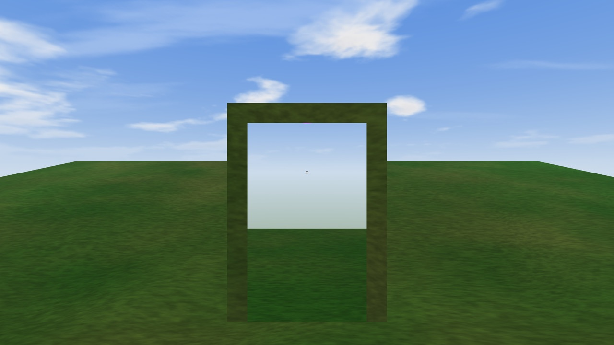
*Un corredor de "Penrose Ascent": cuatro rampas descendentes cerradas en ciclo, de modo que caminar hacia adelante es caer para siempre.*

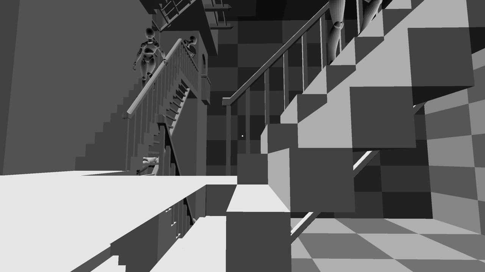
*"Relativity", la escultura de Escher hecha caminable: solo las superficies que miran hacia el "arriba" del jugador se pisan; el resto es pared y techo.*


Los trucos anteriores de este capítulo deforman una habitación. Este deforma el *recorrido*: no
cambia el tamaño ni la cantidad de cuartos, cambia a dónde llega el pasillo cuando se termina.
Un corredor que desemboca en sí mismo convierte una pendiente ordinaria en una caída sin fondo,
sin una sola línea de lógica de juego. Todo el efecto vive en cómo están cableados los portales.

#### 3.6.1 La escalera de Penrose jugable — `src/level8.rs`, "Penrose Ascent" (escena 8) [PARCIAL]

**Qué ve el jugador.** Un pasillo de tierra con paredes de pasto, techo bajo y una bajada muy
suave. Al fondo se ve la salida, y detrás de la salida hay otro pasillo igual, y detrás de ese
otro. El jugador camina, la salida llega, la cruza sin corte ni parpadeo, y sigue bajando en un
pasillo que es idéntico al anterior. No hay teletransporte visible, no hay carga, no hay un
"clic". Después de tres o cuatro tramos empieza a sospechar y se da la vuelta: ahora sube, y
subir tampoco llega a ninguna parte. Lo que un tester dice, textual, es "creo que es el mismo
pasillo, pero no lo puedo probar".

**El truco.** Hay cuatro corredores reales, físicamente separados en el mundo, cada uno con una
rampa que baja de verdad. Cada corredor tiene dos bocas, y cada boca lleva un portal. El portal
de la boca baja del corredor *i* está conectado con el portal de la boca alta del corredor
*i+1*, y el del cuarto está conectado con el del primero. Cruzar una boca baja no te deja fuera
del cerro: te deja arriba del siguiente corredor, en su punto más alto. Como los cuatro
corredores son idénticos y la cámara no se sacude al cruzar, la única señal de que pasó algo
sería la altura del terreno — y el portal ya te devolvió a la altura de partida. La geometría es
honesta: cuatro rampas de 11.31°. Lo imposible es la topología, no las paredes.

```
  ELEVACIÓN DE UN TRAMO (todos iguales; sólo cambia la x)

     boca alta  T_i                                          boca baja  B_i
     (x, +1, -5)                                             (x, -1, +5)
   y=0  ┌───────┐
        │       ╲────                 10 u de recorrido
        │            ╲────                                      ┌───────┐
        │                 ╲────   pendiente 2/10 = 11.31°       │       │
        │                      ╲────                            │       │
        └───────────────────────────╲───────────────────────────┴───────┘  y=-2
        meseta alta                  rampa                       meseta baja
        z ∈ [-10, -5]                z ∈ [-5, 5]                 z ∈ [5, 10]


  PLANTA DEL CICLO (los cuatro tramos, separados 200 u en x; nunca se ven juntos)

     x = 0            x = 200          x = 400          x = 600
   ┌─────────┐      ┌─────────┐      ┌─────────┐      ┌─────────┐
   │ T0 ▸ B0 │      │ T1 ▸ B1 │      │ T2 ▸ B2 │      │ T3 ▸ B3 │
   └────┬────┘      └────┬────┘      └────┬────┘      └────┬────┘
        │ B0──▶T1        │ B1──▶T2        │ B2──▶T3        │ B3──▶T0
        └────────────────┘────────────────┘────────────────┘        │
        ▲                                                           │
        └───────────────────  el cierre  ───────────────────────────┘

   Caminar hacia adelante: T_i ▸ B_i ▸ T_(i+1) ▸ B_(i+1) ▸ ...  bajar para siempre.
   Darse la vuelta:        B_i ▸ T_i ▸ B_(i-1) ▸ T_(i-1) ▸ ...  subir para siempre.
```

**Los números.**

| Dato | Valor | De dónde sale |
|---|---|---|
| Tramos en el ciclo | 4 (`FLIGHTS`) | `src/level8.rs:37` |
| Separación entre tramos | 200.0 u en x (`FLIGHT_SPACING`) | `src/level8.rs:39` |
| Portales | 8 (dos por tramo), 4 conexiones `connect` | `src/level8.rs:103-105` |
| Malla del corredor | `tunnel_slope.obj`, `TunnelType::Slope`, escala (1, 1, 5), `euler.y = PI` | `src/level8.rs:59-65` |
| Extensión real del corredor | x [-0.8, 0.8], y [-2, 2.2], z [-5, 5] | malla × escala |
| Boca alta (`door1`) | centro (x, +1.0, -5.0), semiejes (0.6, 0.999, 1.0) | `props.rs:189-193` |
| Boca baja (`door2`, Slope) | centro (x, -1.0, +5.0), semiejes (0.6, 0.999, 1.0) | `props.rs:200-202` |
| Vano útil de cada boca | 1.2 u de ancho × 2.0 u de alto | 2 × semiejes |
| Terreno | `ground_slope.obj`, escala (10, 2, 10) | `src/level8.rs:67-72` |
| Desnivel por tramo | 2.0 u | meseta y=0 → meseta y=-2 |
| Recorrido de la rampa | 10.0 u (z de -5 a +5) | `ground_slope.obj` |
| **Ángulo de la rampa** | **11.31°** (atan 2/10) | derivado |
| Cambio de escala al cruzar | ×1.0 — ninguno; ambas bocas miden 0.6 en x | `delta_inv.x_axis().mag()` |
| Recursión de portal visible | 4 tramos anidados (`GH_MAX_RECURSION`) | `game_header.rs:54` |
| Caja de límites por tramo | centro (x, -2.0, 0), muros de 10 u, ±10 en x/z | `src/level8.rs:94-98` |
| Spawn actual | (0.0, -0.5, 8.0) = `(0, GH_PLAYER_HEIGHT - 2, 8)` | `src/level8.rs:109` |

**Por qué el jugador no lo detecta.** Tres razones, todas medibles:

1. **11.31° está por debajo del umbral.** En un corredor de textura uniforme, sin horizonte ni
   línea de techo que contradiga, una pendiente de 1:5 se lee como piso plano. La cámara del
   motor no rota con el terreno: `Player` sólo escribe yaw y pitch de ratón, así que no hay
   ninguna señal de inclinación en la imagen.
2. **El cruce no es un evento.** `Physical::try_portal` mueve al jugador dentro del mismo paso
   de física, le aplica el `bump` de `2·GH_NEAR_MIN·p_scale` para que no rebote, y el portal ya
   estaba dibujando el otro lado en vivo. No hay fundido, no hay carga, no hay sonido (en las
   escenas portadas `portal_audible` es falso a propósito).
3. **Los cuatro tramos son el mismo objeto repetido.** No hay marca, número, ni prop que
   distinga el tramo 0 del tramo 2. Sin referencia, contar es imposible.

Los 200 u de separación son el idioma de CodeParade y la regla `200 = 2 × GH_FAR` de 3.2: como
los tramos nunca se ven juntos, no hay razón para que sean vecinos, y la distancia garantiza que
ninguna cámara escapada llegue a dibujar la copia. El terreno de cada tramo mide 20 × 20 u, así
que 200 sobra por diez veces.

**Cómo armo uno nuevo.** El patrón se generaliza a N tramos:

1. Elegí N (cualquier N ≥ 2 cierra; 4 da la huella cuadrada clásica) y una separación mayor que
   la huella del terreno — con `ground_slope` a escala 10 son 20 u, así que 200 es holgado.
2. Por cada tramo *i*, en x = i·SEPARACIÓN:
   - `tunnel(gl, res, TunnelType::Slope)` con `scale = (1, 1, RECORRIDO/2)` y `euler.y = GH_PI`;
   - `ground(gl, res, true)` **sin rotar**, con `scale *= (1, DESNIVEL, 1)` — la malla baja 1 u
     en espacio unitario, el factor vertical la estira hasta el desnivel que querés;
   - `bounds_box` con centro en `(x, -DESNIVEL, 0)`. El `y` del centro es el **piso** de la caja,
     no su mitad (`ext/bounds.rs`): ponerlo en 0 deja los muros arriba de las esferas de choque
     del jugador en la mitad baja del tramo y se puede caminar al vacío.
3. Sacá los dos portales con `tunnel_set_door1` (boca alta) y `tunnel_set_door2` (boca baja),
   empujá los dos al vector de portales y guardá las referencias en dos vectores paralelos.
4. Cerrá el ciclo con un solo bucle: `connect(&bottoms[i], &tops[(i + 1) % N])`. Esa línea es
   todo el truco; sin el `% N` tenés una escalera larga y con él tenés una infinita.
5. **Ubicá el spawn dentro del primer corredor**, con z estrictamente entre -RECORRIDO/2 y
   +RECORRIDO/2, y la altura del ojo sobre la rampa en ese z. `--pos 0,0.4,2.0` deja al jugador
   dentro del primer corredor: la rampa en z = 2 está a y = −1.4 (baja 2 u entre z = −5 y z = +5),
   así que el ojo se asienta cerca de y = 0.1, y `--forward --yaw 180` recorre el ciclo completo
   (tramo 0 → 1 → 2 …). Ver **Límites**: el spawn que hoy trae la escena no cumple esto.
6. Si querés que el ciclo además cambie el tamaño, dale a las dos bocas escalas distintas — es
   exactamente el mecanismo de 3.7.1, y se compone sin escribir nada nuevo. Un ciclo que multiplica
   por 0.5 en cada vuelta es una espiral, no una escalera.

**Qué puzles habilita.**

- **Cuatro puertas, una marca** [PROPUESTA]. Un solo prop visible en un tramo. El jugador debe
  volver a él: la respuesta es "camina cuatro veces" y descubrirla es el puzle.
- **El desnivel que se acumula** [PROPUESTA]. Una puerta en la meseta alta que sólo abre cuando
  recibe un objeto traído desde dos tramos más abajo; como bajar no cuesta nada, el costo real
  es orientarse.
- **El objeto que baja solo** [PROPUESTA]. Un prop soltado en la rampa rueda, cruza portales por
  su cuenta (a diferencia de uno en mano, ver 3.7) y desaparece hacia abajo para siempre. El
  jugador debe atraparlo en un tramo concreto, lo que obliga a correr más rápido que él.
- **La subida imposible** [PROPUESTA]. La meta está arriba y a la vista. El pasillo baja. La
  solución es darse la vuelta: el mismo corredor, recorrido al revés, es una subida infinita, y
  lo que hace falta es una razón para creer que sirve.

**Límites.**

- **El spawn no entra al corredor.** Este es el defecto que hace que la escena esté marcada
  [PARCIAL]. El spawn está en (0, -0.5, 8.0): pies a y = -2, sobre la meseta baja, **3 u afuera**
  de la boca baja (que está en z = 5). Cruzar una boca desde afuera es el sentido inverso del
  ciclo: te deja **afuera** de la boca del tramo vecino, no adentro. Medido: `--scene 8 --forward`
  desde el spawn cruza una vez, aparece en (200.00, 1.50, -5.32) — meseta alta del tramo 1, del
  lado de afuera — y sigue caminando hasta chocar la cerca en (200.00, 1.50, -9.80). Darse la
  vuelta devuelve a la meseta baja del tramo 0. El jugador rebota entre dos mesetas y nunca entra
  a un corredor. La bajada infinita **sí existe y funciona** una vez adentro (medido: desde
  `--pos 0,0.4,2.0 --yaw 180 --forward` el jugador pasa por los tramos 0 → 1 → 2 …), así que el
  arreglo es de una línea: mover el spawn adentro. Comparar con `src/level4.rs`, que sí entra
  porque alterna la rotación de los dos túneles y corrige `euler.y -= GH_PI` en los portales del
  segundo — Level8 usa la misma rotación en los cuatro y no corrige.
- **Cuatro tramos anidados y se acaba el presupuesto.** `GH_MAX_RECURSION = 4`: mirando por la
  boca baja se ven cuatro corredores encadenados y el quinto no se dibuja: en su lugar el motor
  pinta el quad magenta liso del shader `pink` (ver 3.1.4), que es la marca deliberada de fin de
  cadena y no un búfer sin escribir. Es visible en la figura `ne-penrose-ciclo-corredor`. En un
  nivel de producción hay que tapar ese fondo con niebla, una curva o una caída de luz.
- **Nada distingue un tramo del otro.** Es lo que hace que el truco funcione y también lo que
  lo hace ilegible: sin una marca, el jugador no puede formar la hipótesis y el efecto se lee
  como "el nivel no avanza". Un puzle basado en esto necesita al menos una referencia.
- **La rampa no se puede subir corriendo con props pesados.** La gravedad se aplica escalada por
  `p_scale` (`Physical::update`), así que un prop grande baja la rampa por su cuenta. Cualquier
  puzle que pida dejar algo quieto en la pendiente necesita una repisa plana.
- **Sin escaleras.** Toda escalera de Penrose en este motor tiene que ser una rampa: la esfera
  del pie choca contra cada contrahuella y se detiene. El porqué exacto, con el umbral y las
  medidas, está en 3.4, "Por qué este juego usa rampas y no escaleras".

#### 3.6.2 El pariente artístico: la escultura caminable — `src/level13.rs`, "Relativity" (escena 13) [IMPLEMENTADO]

Penrose Ascent es el mismo tema resuelto por topología. Relativity es el mismo tema resuelto por
composición: en vez de mentir sobre a dónde va el pasillo, se camina una estructura que ya está
dibujada como imposible y se deja que el cuerpo del jugador descubra que sólo una de las tres
gravedades del dibujo es la suya.

**Qué ve el jugador.** Un edificio de arcilla blanca, sin textura, todo escaleras y barandas y
arcos, plantado en un cuarto de damero gris. Hay figuras en las escaleras. El jugador aparece en
un descanso adentro de la estructura y puede caminar: sube rampas, cruza pasillos, sale a
balcones. Algunas escaleras que ve claramente no lo dejan pisarlas — están de costado o al revés
respecto de su propio "arriba". No son decorado inaccesible por un muro invisible: son
literalmente pared y techo de su mundo, del mismo modo que lo son para dos de las tres
poblaciones del grabado.

**El truco.** El modelo es una malla de 660k triángulos; el motor colisiona esferas contra
rectángulos a 500 Hz, así que los triángulos crudos no pueden ser la colisión. `tools/gen_walkable.py`
extrae una cáscara: se queda con las superficies que miran hacia arriba, las rasteriza en un mapa
de alturas multicapa (multicapa porque el edificio tiene pisos superpuestos) y emite 532
rectángulos de colisión inclinados según el gradiente, escritos como líneas `c` dentro del propio
archivo `.obj` — el dialecto que el motor ya entiende. El objeto es a la vez el visual y la
geometría caminable: no hay lógica, no hay seguimiento, es un edificio.

**Los números.**

| Dato | Valor | De dónde sale |
|---|---|---|
| Malla | `Meshes/escher_relativity.obj`, 660 274 caras, 1 319 588 vértices, 47 MB | archivo |
| Colisionadores embebidos | **532** líneas `c` | archivo (el test exige > 300) |
| Bbox del modelo reescalado | x [-4.7, 4.7], y [0.0, 9.8], z [-5.1, 5.1] | `tools/gen_walkable.py` |
| Cuarto contenedor | `room.obj`, semiejes (12, 13, 12) (`ROOM_HALF`) | `src/level13.rs` |
| Spawn | (-0.63, 2.15 + 1.5, -3.15) = (-0.63, **3.65**, -3.15) | `SPAWN` |
| Portales | **0** — la escena no usa ninguno | `_portals` sin usar |
| Contrahuella implícita tras el reescalado | ~0.17 u | doc de `level13.rs` |
| Sistemas de gravedad del grabado | 3; el jugador tiene 1 | doc de `level13.rs` |

**Por qué las escaleras son rampas.** Por lo mismo que en 3.4: el motor no sube escalones, y por
eso la demo original sólo usa pendientes y las escaleras y toboganes de Pool Rooms son decorado.
Lo propio de esta escena es qué se hace con esa restricción. La cáscara difumina cada tramo de
escalera en un plano inclinado, y
el modelo se auto-escala para que la contrahuella implícita (~0.17) lea bien contra la altura
del jugador. El resultado es que el jugador **ve** escalones y **camina** una rampa: la
discrepancia no se nota porque no hay animación de pie, y sí se nota si uno se detiene a mirar
los pies contra el escalón.

**Cómo armo uno nuevo.** Este truco es una tubería de assets, no de código:

1. Conseguí un modelo cerrado, con un "arriba" coherente para al menos una parte de sus
   superficies, y una licencia que puedas registrar (esta viene CC-BY-4.0 y su licencia viaja en
   `Meshes/escher_relativity.LICENSE.txt`).
2. Corré `tools/gen_walkable.py`. Auto-escala el modelo para que la contrahuella implícita quede
   cerca de 0.17 y emite las líneas `c` dentro del `.obj`.
3. Cargá el modelo como un `Object` normal con shader `texture` y una textura blanca 1×1: el
   modelo sin texturizar más la iluminación por cara da el acabado de arcilla, que es lo que hace
   que el edificio se lea como grabado y no como render.
4. Envolvelo en un `room.obj` con semiejes mayores que el bbox en las tres direcciones, y dejá el
   piso del cuarto a la altura del suelo del modelo, para que caerse te devuelva a la planta baja
   y puedas volver a entrar caminando en vez de reaparecer.
5. Agregá una prueba que abra el `.obj` y cuente los colisionadores. Es la única defensa contra
   regenerar el modelo sin su cáscara, y el archivo pesa demasiado para revisarlo a ojo.

**Qué puzles habilita.**

- **Tres gravedades, un piso** [PROPUESTA]. La meta está sobre una escalera que pertenece a otro
  sistema de gravedad. Es visible, está cerca y es intransitable; el camino real es una rampa del
  sistema propio que da toda la vuelta.
- **El objeto que cae afuera** [PROPUESTA]. Un prop soltado desde un balcón cae al piso de la
  galería, fuera de la estructura. Recuperarlo obliga a aprender la entrada, que es la mitad del
  nivel.
- **La galería como mapa** [PROPUESTA]. Desde el piso del cuarto contenedor la estructura se ve
  entera. El puzle es leer la ruta desde afuera y luego ejecutarla desde adentro, donde no se ve.
- **La escalera que no es escalera** [PROPUESTA]. Un tramo pintado como escalera que en realidad
  es rampa y otro que es escalera de verdad (y por lo tanto intransitable). La distinción sólo
  se aprende caminando, y saberla es la llave.

**Límites.**

- **Sólo una de las tres gravedades es caminable.** Es fiel al grabado y también es una pérdida:
  dos tercios de la estructura son escenografía. Un nivel jugable serio necesitaría o bien
  reorientar al jugador (que este motor no hace) o bien construir el modelo con más superficies
  válidas para un solo "arriba".
- **660k triángulos y 47 MB.** Es el archivo más pesado del proyecto y obliga a Git LFS. No es
  un patrón repetible: no se pueden poner cinco de estos en un nivel.
- **La cáscara es una aproximación.** 532 rectángulos contra 660k triángulos: hay bordes donde
  el colisionador no coincide con lo que se ve, y caerse por uno de esos huecos es la falla más
  probable de la escena.
- **Cero portales.** Es geometría, no espacio no euclidiano. Pertenece a este capítulo por el
  tema, no por el mecanismo; combinarla con un portal está sin hacer.

---

### 3.7 Efectos que se multiplican


*"Compound": la escena donde el agarre por perspectiva forzada y el portal de escalado se multiplican sobre el mismo `p_scale`.*


Esta es la sección que justifica que el juego exista. Todo lo anterior es una reimplementación
honesta de ideas ajenas: la perspectiva forzada es de Superliminal, los portales que reescalan
son de CodeParade. Lo que sigue no existe en ninguno de los dos, y no porque a nadie se le
ocurriera, sino porque hace falta que las dos mecánicas escriban en el **mismo campo** — y eso
sólo pasa si el port conservó `p_scale` como una escala física de verdad en vez de convertirla en
un truco de dibujo.

#### 3.7.1 Perspectiva por portal: el mismo `p_scale`, dos autores — `src/level9.rs`, "Compound" (escena 9) [IMPLEMENTADO]

**Qué ve el jugador.** Levanta una tetera dorada de cerca, así que la tetera queda chica. Camina
con ella hacia la boca grande del túnel. Adentro del vano la tetera se aprieta contra las paredes
y encoge sola para pasar, y apenas sale del otro lado vuelve a su tamaño. Sigue caminando, cruza
la boca chica, y el mundo se hace el doble de grande de golpe: el pasto le llega más arriba, el
paso se le acortó, la cabeza le quedó a la altura de la cintura de antes. La tetera, en cambio,
no cambió ni un pixel: sigue exactamente del mismo tamaño en la pantalla. Cuando la suelta,
descubre que es enorme. Nunca la vio crecer. Creció él al revés.

**El truco.** Las dos mecánicas escriben el mismo número. `Object::p_scale` es una escala física
uniforme que alimenta la matriz del objeto, la gravedad, la velocidad de caminata, el impulso de
salto y el epsilon de colisión. El portal la multiplica **en el viajero** cuando lo cruza:
`p_scale *= warp.delta_inv.x_axis().mag()`. El agarre la escribe **en el objeto en mano**, cada
cuadro, a partir de la razón `k = p_scale / distancia` que se fijó al levantarlo. Como el objeto
en mano no viaja por el portal (viaja como carga, ver abajo), lo que se compone no es el tamaño
del objeto contra sí mismo: es la **razón entre el objeto y el jugador**. Y esa razón es lo que
"qué tan grande es esto" significa para quien juega.

**Lo que realmente pasa, paso por paso.** Verificado en ejecución, con los números del log:

1. **Agarre.** `try_grab` fija `k = p_scale / dist`. Medido: `picked up object #5 at 0.76 units,
   p_scale 1.00` → k ≈ 1.32. Desde acá el objeto tiene tamaño angular constante: no cambia de
   tamaño en pantalla pase lo que pase.
2. **Dentro del vano.** El ajuste contra las paredes (`fit_distance`) achica el objeto sólo
   mientras estorba. Medido a mitad del túnel: `holding object #5 at 1.30 units, p_scale 1.676
   (asked 3.237 at 2.50), shrunk to fit` — el rayo pedía 3.237 y el cuarto concedió 1.676.
3. **El cruce.** El jugador cruza `portal4 → portal3` y su `p_scale` se multiplica por 0.5.
   Medido: el ojo pasa de 1.50 a **0.75**.
4. **Después del cruce.** El objeto **no fue tocado**. Medido: `holding object #5 at 1.25 units,
   p_scale 1.674 (asked 1.675 at 1.25)` — mismo `k`, mismo tamaño de mundo, y ya sin ajuste
   porque afuera no hay paredes que estorben. En pantalla es idéntico; contra el jugador, es el
   doble.
5. **Re-agarre.** Si lo suelta y lo vuelve a levantar del otro lado, `try_grab` **vuelve a fijar**
   `k` con el `p_scale` que quedó. El factor del portal queda incorporado, y la próxima colocación
   por perspectiva parte de ahí. Por eso el efecto es acumulativo y no un ida y vuelta.

**Por qué el objeto en mano no cruza el portal.** Vale la pena decirlo explícito porque es
contraintuitivo y porque el comentario de `src/level9.rs` afirma lo contrario. `Portal::intersects`
necesita un segmento `prev_pos → pos` que atraviese el cuadrilátero. Un objeto en mano nunca tiene
ese segmento: `ext::grab::update` termina cada cuadro escribiendo `phys.prev_pos = phys.base.pos`,
y `Physical::update` vuelve a igualarlos al inicio de cada paso de física. El segmento siempre
mide cero, así que `try_portal` nunca dispara sobre él. El objeto en mano cruza porque el brazo lo
cruza — se reubica por asignación sobre el rayo del ojo, ya en el cuarto nuevo. Es **carga**, no
viajero. Un objeto **suelto**, en cambio, sí cruza y sí se le multiplica el `p_scale`, porque cae
o rueda con velocidad y su segmento sí atraviesa el plano.

Esa asimetría no es un defecto: es la regla que hace jugable la composición. Significa que
**un objeto puede pasar por una puerta más chica que él**, porque se encoge sólo el tiempo que
dura el vano y recupera su tamaño al salir. Ningún juego comercial expresa esa regla.

**Los números.**

| Dato | Valor | De dónde sale |
|---|---|---|
| Túnel escalador | `TunnelType::Scale`, pos (-1.2, 0, 0), escala (1, 1, 2.4) | `src/level9.rs:68-73` |
| Túnel normal | `TunnelType::Normal`, pos (201.2, 0, 0), escala (1, 1, 2.4) | `src/level9.rs:79-84` |
| `portal1` (boca grande del escalador) | (-1.2, 1.0, 2.4), semiejes (0.6, 0.999, 1.0) | `props.rs:189-193` |
| `portal2` (boca grande del normal) | (201.2, 1.0, 2.4), semiejes (0.6, 0.999, 1.0) | `props.rs:189-193` |
| `portal3` (**boca chica** del escalador) | (-1.2, 0.5, -2.4), semiejes (**0.3, 0.499, 0.5**) | `props.rs:197-199` |
| `portal4` (boca lejana del normal) | (201.2, 1.0, -2.4), semiejes (0.6, 0.999, 1.0) | `props.rs:203-206` |
| Conexiones | `connect(p1, p2)` y `connect(p3, p4)` | `src/level9.rs:110-111` |
| Factor de `p1 ↔ p2` | **×1.0** (0.6 / 0.6): no cambia nada | `delta_inv.x_axis().mag()` |
| Factor de `p4 → p3` | **×0.5** (0.3 / 0.6): encoge | idem |
| Factor de `p3 → p4` | **×2.0** (0.6 / 0.3): agranda | idem |
| Vano de la boca chica | **0.6 u de ancho × 1.0 u de alto** (y ∈ [0.001, 0.999]) | 2 × semiejes |
| Ojo del jugador antes / después | 1.50 → **0.75** | medido |
| Props (malla, pos, escala, radio) | `teapot.obj` (1.0, 0.9, 4.2) 0.30 / 0.45; `suzanne.obj` (-1.0, 1.0, 4.6) 0.40 / 0.5; `bunny.obj` (200.0, 0.6, 3.4) 6.0 / 0.35 | `src/level9.rs:117-130` |
| Spawn | (0.0, 1.5, 5.0) | `src/level9.rs:132` |
| Cercas | dos cajas, centros (0, 0, 0) y (200, 0, 0), muros 8 u, ±12 en x/z | `src/level9.rs:136-142` |
| Techo y piso de escala del agarre | `MIN_P_SCALE` 0.05 — `MAX_P_SCALE` 25.0 (rango 500×) | `ext/grab.rs:131-132` |
| Alcance / distancia máxima de colocación | 15.0 u / 60.0 u | `ext/grab.rs:117,129` |
| Suavizado de la escala | 25% del error por cuadro (`SCALE_EASE`) | `ext/grab.rs:144` |
| Umbral del fantasma | ajuste < 85% de lo pedido (`GHOST_THRESHOLD`) | `ext/grab.rs:146` |

**Lo que `p_scale` arrastra consigo.** El estado compuesto no es cosmético: se siente a la vez en
la transformada, la gravedad, la caminata, el salto y la colisión, y todas esas cantidades escalan
juntas, de modo que **medido en alturas de jugador nada cambia**. La tabla con las fórmulas, las
referencias de línea y los valores a media escala está en 3.4, "La escala es física, no
cosmética"; lo que importa aquí es que ese mismo campo tiene ahora dos autores.

**Por qué esto no existe en Superliminal ni en ningún juego comercial.** No es una cuestión de
ambición, es de arquitectura:

- **Superliminal** tiene la perspectiva forzada, y la resuelve muy bien, pero su mundo es
  euclidiano. No hay ninguna otra cosa en ese juego que multiplique la escala de nada; la única
  entrada al tamaño es dónde soltás el objeto. Un factor, un autor.
- **NonEuclidean** (HackerPoet) tiene los portales que reescalan, y no tiene agarre. El único
  objeto que cambia de tamaño es el jugador, y sólo por cruzar. Otro factor, otro autor, otro
  juego.
- **Portal / Portal 2** transportan objetos por portales, pero sus portales son isométricos por
  diseño: la escala es sagrada, porque toda la física del juego (y el humor) depende de que un
  cubo sea un cubo. Un portal que reescala rompe su motor de puzles, no lo amplía.
- La composición requiere que las dos mecánicas escriban en el mismo número **y** que ese número
  sea físico. Acá `p_scale` ya era una escala real antes de que existiera el agarre — alimenta
  gravedad, velocidad y colisión desde el port original — así que no hubo que escribir código
  para que compusiera. El agarre eligió `p_scale` porque ya estaba, y al elegirlo heredó el
  portal. Esa es toda la historia técnica, y es la razón por la que el efecto es sólido en vez
  de ser un caso especial frágil.

**Cómo armo uno nuevo.** Un nivel de composición necesita cuatro piezas y ninguna es código:

1. **Un par escalador.** Copiá la disposición de `Level5`: un `TunnelType::Scale` y un
   `TunnelType::Normal` separados 200 u, `connect` boca-grande con boca-grande (factor 1.0) y
   boca-chica con boca-lejana (factor 0.5 / 2.0). El factor sale solo de la razón de los
   semiejes x de los dos portales; para cambiarlo, cambiá la escala de un portal.
2. **Props agarrables a los dos lados del umbral.** Un `Grabbable` necesita malla, shader
   `texture`, textura, escala de malla y **radio de acotación** — el radio es lo que el ajuste
   usa para no meterlo en las paredes, así que sobreestimarlo hace que el objeto encoja de más y
   subestimarlo lo mete adentro del muro.
3. **Una referencia de tamaño que no sea el jugador.** Sin una puerta, un marco, una silla o una
   moneda a escala fija, el jugador no tiene con qué medirse y el cambio de escala se lee como
   "cambió el campo de visión". Es el error más caro de esta mecánica.
4. **Una razón para volver.** El bucle es lo que hace acumulativa la composición. Si el nivel
   sólo se cruza una vez, la multiplicación pasa una vez y no se aprende.

Cuidado con el umbral: **el portal chico mide 0.6 u de ancho por 1.0 u de alto** y `Portal::intersects` prueba el
*origen* del objeto — el ojo, en el caso del jugador. Un jugador a escala 1 tiene el ojo en 1.50
y **no puede cruzarlo**: medido, caminar contra él lo detiene en z = -2.60. La boca chica sólo
admite a alguien que ya esté a `p_scale ≲ 0.66`. Eso es una llave de escala gratis, y hay que
aprovecharla.

**Qué puzles habilita.** Los cuatro que siguen se desarrollan abajo. En una línea:
**la llave a la medida del cuarto pequeño** (dimensionar de un lado, encajar del otro);
**la estatua por el vano de un metro** (pasar un objeto más grande que la puerta);
**dos placas y un reloj** (la gravedad escala, así que el tamaño es tiempo);
**el túnel decorativo que se vuelve puerta** (la misma geometría es adorno o pasaje según tu
escala).

##### Cuatro puzles que sólo se pueden armar acá [PROPUESTA]

**1. La llave a la medida del cuarto pequeño.**
*Montaje.* Del lado grande hay una llave sobre un pedestal y un pasillo largo. Del lado chico —
al que sólo se llega dando la vuelta completa por el par de túneles, porque la boca chica no
admite a un jugador entero — hay una cerradura cuyo bocallave acepta un rango angosto de tamaños.
La llave a escala 1 no entra; a escala de perspectiva "de cerca" tampoco, porque queda demasiado
chica para agarrarla del otro lado.
*Solución.* El tamaño de la llave se fija **antes** de cruzar, apuntando a una distancia
determinada del pasillo largo, y se lleva en mano — donde el portal no la toca. Al salir del lado
chico el jugador mide la mitad, así que la misma llave, en unidades de su propio cuerpo, vale el
doble. El jugador tiene que resolver la división: apuntar a la mitad de la distancia que le
parece correcta.
*Por qué sólo acá.* En Superliminal el tamaño correcto se busca por prueba y error en el mismo
cuarto; acá el cuarto donde se mide y el cuarto donde se usa tienen escalas distintas, y el
jugador es el que cambia entre uno y otro.

**2. La estatua por el vano de un metro.**
*Montaje.* Una estatua que a simple vista no cabe por la boca chica (0.6 × 1.0 u) tiene que
llegar al otro lado. Cualquier intento de "achicarla y pasarla" falla, porque para agarrarla hay
que fijar `k` y el tamaño en pantalla queda clavado.
*Solución.* Llevarla en mano y caminar. El ajuste (`fit_distance`) la encoge sola mientras está
adentro del vano — medido: de 3.237 pedido a 1.676 concedido — y al salir vuelve a `k · d` sin
que el jugador toque nada. La estatua pasó por una puerta más chica que ella y salió del mismo
tamaño. El puzle es descubrir que **no hay que hacer nada**, sólo caminar y confiar.
*Por qué sólo acá.* Un objeto **suelto** empujado por el mismo vano sería reescalado por el
portal y saldría a la mitad. La diferencia entre carga y viajero es una regla del motor, no una
excepción escrita a mano, y es exactamente lo que hace el puzle.
*Variante.* La misma estatua tirada al piso y empujada por el vano sale a mitad de tamaño y ya
no sirve para la cerradura. Dos caminos que se ven iguales, dos resultados distintos.

**3. Dos placas y un reloj.**
*Montaje.* Dos placas de presión, una arriba de una repisa y otra en el piso, que tienen que
activarse dentro de la misma ventana de tiempo. La de arriba se activa soltando un prop desde el
borde; la de abajo, parándose encima.
*Solución.* La gravedad se aplica escalada por `p_scale`, así que **el tamaño del prop es su
reloj**: uno a `p_scale` 0.05 tarda veinte veces más en caer la misma altura de mundo que uno a
1.0. El jugador dimensiona el prop con el rayo — apuntando cerca para hacerlo lento, lejos para
hacerlo rápido — lo suelta, y corre a la otra placa. Y si no llega, la segunda palanca es
cambiar **su propio** reloj: cruzar el par escalador lo deja a media escala, con la caminata a
1.45 u/s y el salto a la mitad de altura, lo que cambia por completo cuánto tarda en llegar.
*Por qué sólo acá.* Hacen falta dos relojes independientes sobre el mismo campo: el del objeto,
escrito por la perspectiva, y el del jugador, escrito por el portal. Ningún juego con un solo
autor de escala puede plantearlo.

**4. El túnel decorativo que se vuelve puerta.**
*Montaje.* `Level5` trae un tercer túnel a un cuarto de escala, en (-1.0, 0, -4.2), rotado un
cuarto de vuelta — puro decorado a escala 1, del tamaño de una alcantarilla. `Level9` lo dejó
afuera. Este puzle lo repone y esconde la salida del nivel detrás de él.
*Solución.* No hay forma de agrandar el túnel ni de encoger al jugador con el agarre — el agarre
no se aplica a uno mismo. La única palanca es el par escalador: dar la vuelta completa
(`portal1 → portal2 → portal4 → portal3`) para salir a media escala, y recién ahí el
decorado es un pasaje. Y como la boca chica exige `p_scale ≲ 0.66` para dejarte pasar, la vuelta
larga es obligatoria: no se puede atajar por la boca chica en el sentido contrario.
*Por qué sólo acá.* La geometría del nivel no cambia nunca. Lo que cambia es la unidad con la
que se mide, y esa unidad es el jugador. Es la idea central de todo el capítulo, expresada con
un solo objeto sin lógica.
*Extensión.* Un objeto grande dejado del lado chico y recuperado a escala completa después de
volver: el mismo prop, sin tocar, sirve de escalón o de estorbo según en qué escala se lo mire.

**Límites.**

- **El comentario de `src/level9.rs` describe mal su propio truco.** Afirma que llevar el objeto
  por el túnel multiplica su `p_scale` vía `Physical::try_portal`. No pasa: el objeto en mano
  tiene `prev_pos == pos` todos los cuadros y nunca cruza. Lo que se multiplica es el `p_scale`
  **del jugador**. El efecto de juego es el mismo o mejor, pero la documentación hay que
  corregirla antes de que alguien construya un nivel sobre la afirmación equivocada.
- **El techo y el piso del agarre son duros.** `MIN_P_SCALE` 0.05 y `MAX_P_SCALE` 25.0 recortan
  sin avisar; cuando muerden, el objeto deja de seguir la perspectiva y se re-deriva la distancia
  para que igual apoye en la superficie. Un puzle que dependa de un tamaño cerca de esos límites
  se va a sentir roto.
- **Nada limita la escala del jugador.** El portal multiplica sin recorte. Dos vueltas dejan al
  jugador en 0.25 y el ojo a 0.375 u del piso, con la caminata a 0.72 u/s. No hay aviso ni
  recuperación: es fácil dejar al jugador en un tamaño desde el cual ninguna boca sea cruzable.
  Hace falta un piso de escala, o una boca de rescate.
- **El ajuste contra las paredes es sólo esférico.** `fit_distance` prueba la esfera de acotación
  del objeto, no su forma. Un objeto largo y flaco encoge muchísimo de más al pasar por un vano
  angosto, y el fantasma translúcido aparece cada vez que el ajuste se come más del 15%. Para
  puzles de "pasar algo grande" conviene elegir props compactos.
- **La composición es invisible sin referencia.** Es el mismo riesgo de 3.6.1 amplificado: como el
  objeto en mano no cambia de tamaño en pantalla y el jugador tampoco se ve el cuerpo, el cruce
  puede leerse como un cambio de campo de visión. Cada lado del par escalador necesita al menos
  un objeto de tamaño conocido.
- **La escena tal como está no enseña nada.** `Level9` es la disposición de `Level5` con tres
  props encima. No tiene cerradura, ni meta, ni el tercer túnel, ni una referencia de escala. Es
  una demostración del mecanismo, no un nivel; los cuatro puzles de arriba son lo que falta para
  convertirla en uno.

---

### 3.8 Anamorfosis: sacar un objeto del plano al espacio


*Desde el punto de estación exacto: (0, 1.5, 10), que es literalmente el `eye` con el que `level11.rs` construyó la escena. Los doce fragmentos convergen alrededor del centro y la recompensa dorada ya se materializó — cosa que solo ocurre dentro de `SOLVE_RADIUS` = 1.3 unidades del punto, así que la estatua visible ES la confirmación de estar parado en él. La figura siguiente es la misma sala desde el punto de aparición.*

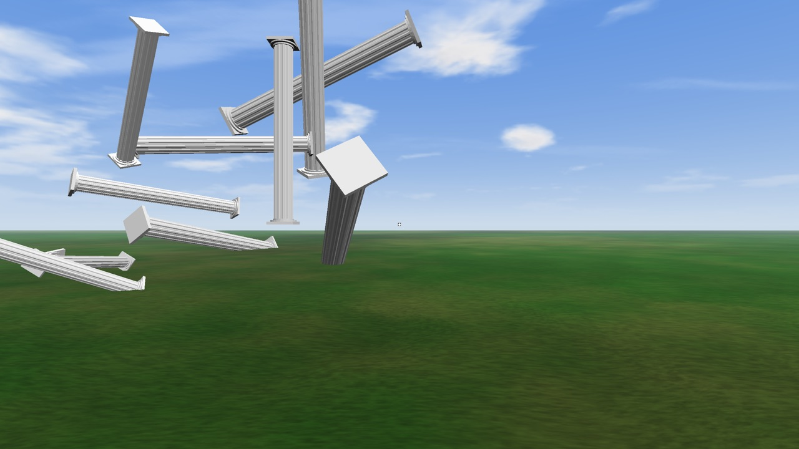
*Los doce fragmentos desde el punto de aparición del jugador, **fuera** del punto de estación: piezas sueltas a distintas profundidades, sin figura alguna.*


*A 10.06 m del punto de estación (0, 1.5, 6) y 64.2 grados fuera de su rayo, la calcomanía plana del muro z = -4.98 se escorza en un prisma vertical alto: queda la tapa a damero arriba y dos caras estiradas hacia abajo, sin ningún ángulo que cierre en cubo. La mira sigue siendo el punto blanco de «nada que tomar».*

*A 6.69 m del punto de estación, pero a solo 10.6 grados de su rayo: la misma calcomanía sigue leyendo como un cubo sólido, apenas más chico. Lo que delata la trampa no está en la imagen sino en la mira — punto blanco, no la mano de agarre — porque a esa distancia el `p_scale` del cubo real vale `HIDDEN`. Abajo a la izquierda se ven los cuatro tacos que marcan el punto.*

*Parado a 1.18 m del punto de estación — dentro de `SOLVE_ENTER` = 1.5 — y a 1.3 grados de su rayo: el damero de 5 x 5 por cara cierra en un cubo colgado en el aire y la mira ya es la mano de agarre, única señal de que `p_scale` pasó a 1.0. Con pitch +6.1 los tacos del piso quedaron fuera de cuadro: el marcador que te trajo hasta aquí no se ve desde aquí.*

*Mismo POS y mismo LOOK que la anterior, después de la **E**: el panel dice `holding #6`, el muro del fondo quedó liso y el cubo real ocupa casi el mismo rectángulo de pantalla que ocupaba la pintura (189 px contra 194 px de ancho). Y es visiblemente otro objeto: damero de 2 x 2 por cara y contraste mucho más bajo que el 5 x 5 horneado de la calcomanía, más el contorno blanco de lo sostenido.*

*Repetición del cuadro anterior un instante después — la línea `SAVED` ya nombra `the-painted-cube-004.png` —: lo que agrega es que el estado sostenido es estable, el cubo no cae ni se desplaza y conserva el mismo tamaño aparente de un cuadro al siguiente, que es lo que hace el acarreo por perspectiva forzada del capítulo 2.*

*Desde 2.57 m del punto de estación (994.4, 1.5, 1.55) — 5.7 veces la tolerancia de 0.45 m — y casi de frente al lienzo: la llave pintada se ve con su estiramiento completo, un aro elíptico de eje mayor doble que el menor y un vástago que cruza más de la mitad del ancho del cuadro sobre el corpiño oscuro. La mira es un punto: no hay objeto, solo pintura.*

*Desde 0.134 m del punto de estación — menos de un tercio del radio de 0.45 m — el lienzo de 0.8 m se ve de canto, reducido a una franja de unos 4 grados de ancho entre los dos montantes del marco, y la llave ya salió: un objeto dorado de unos 2 grados de largo (los 9 cm reales a 2.5 m), con la mano de agarre encima y `E  TAKE THE KEY` en el HUD. La pintada se apagó al completarse la emergencia.*

#### El principio común

Las tres formas de este capítulo son el mismo truco. Se elige primero **el punto de estación**:
la posición exacta donde va a estar el ojo del jugador cuando la ilusión funcione. Se define un
**plano de imagen virtual** que pasa por donde debería estar el objeto y es perpendicular a la
línea entre el punto de estación y ese lugar. Se dibuja el objeto en ese plano, sin deformar. Y
después se proyecta cada punto del dibujo, por **proyección central desde el punto de estación**,
sobre la superficie donde de verdad va a existir la pintura o los pedazos.

La consecuencia geométrica es la que hace todo el trabajo: cualquier punto sobre un mismo rayo que
sale del punto de estación se ve en el mismo lugar de la imagen. La profundidad a lo largo de ese
rayo es libre. Por eso el motor puede poner los fragmentos a 5 o a 14 unidades y desde el punto la
imagen no cambia; y por eso una mancha estirada sobre un lienzo puede leerse como una llave de 9 cm
flotando en el aire. Fuera del punto de estación el rayo ya no coincide con el del pintor: la
correspondencia se rompe, y lo que era una figura vuelve a ser escombro o mancha.

El resto es control de las **pistas de profundidad**. Si el jugador puede medir la distancia a cada
pieza por su tamaño aparente, la ilusión se cae aunque los rayos coincidan. Por eso `Level11`
escala cada fragmento proporcionalmente a su profundidad (`frag.scale = 0.02 * depth`,
`src/level11.rs:85`): todos subtienden el mismo ángulo, y la última pista se apaga.

La referencia histórica es explícita en el código: Hans Holbein el Joven, *Los embajadores* (1533),
donde una mancha gris alargada en el piso del cuadro se cierra en un cráneo cuando el espectador se
para en el borde derecho del lienzo y mira casi de canto. El comentario de `src/level11.rs:7-8` la
cita por nombre, y el `README` la vuelve a citar para la llave. La llave de la Mona Lisa es, en
sentido estricto, el cráneo de Holbein: una vista rasante, a 10.88 grados del plano del muro.

---

#### 3.8.1 `Level11` — "Anamorphic Chamber": doce fragmentos que forman un anillo [IMPLEMENTADO]

**Qué ve el jugador.** Un campo abierto con basura flotando: doce columnas blancas, tumbadas en
ángulos distintos, unas cerca y grandes, otras lejos y chicas, sin orden aparente. En el piso hay
cuatro tacos que marcan un lugar. Al pararse ahí y mirar de frente, la basura deja de ser basura:
las doce piezas caen en un círculo perfecto alrededor del centro de la vista. Si se sostiene el
lugar dos décimas de segundo, algo empieza a crecer desde la nada en el centro del anillo hasta
quedar del tamaño de una persona. Un paso al costado y el anillo se deshace y la figura se
desvanece.

**El truco.** El nivel se construye al revés. Primero se fija el ojo en `(0, 1.5, 10)`. Después,
para cada fragmento, se elige dónde debe aparecer *en la imagen* — un punto sobre un círculo de
radio 0.35 en espacio tangente — y se le asigna una profundidad cualquiera. La posición en el mundo
es `eye + normalize(u, v, -1) * depth`. Como todas las profundidades caen sobre el mismo rayo, la
imagen desde el ojo es idéntica para cualquier elección; desde cualquier otro lado, distinta. La
escala de cada pieza se multiplica por su propia profundidad para que todas se vean del mismo
tamaño, y una lógica de sala (`RoomLogic`) mide la distancia horizontal al punto y hace crecer la
recompensa mientras el jugador se quede ahí.

**Los números.**

| Parámetro | Valor | Dónde |
| --- | --- | --- |
| Punto de estación (`eye`) | `(0, 1.5, 10)` | `src/level11.rs:65` |
| Fragmentos (`FRAGMENTS`) | 12 | `:41` |
| Radio del anillo en espacio tangente (`RING_RADIUS`) | 0.35 → 19.29 grados de semiángulo | `:43` |
| Profundidades generadas | 5.017 a 13.846 unidades (razón 2.76:1) | `:75` |
| Escala de cada fragmento | `0.02 * depth` → 0.100 a 0.277 | `:85` |
| Rotación de cada fragmento | `euler = (θ·0.7, θ·1.3, θ·0.4)` | `:87` |
| Radio de solución (`SOLVE_RADIUS`) | 1.3 unidades, medido **solo en XZ** (`d.y = 0`) | `:45`, `:114` |
| Velocidad de revelado (`REVEAL_SPEED`) | 0.010 por paso fijo → 100 pasos = 0.2 s a 500 Hz | `:47` |
| Escala final de la recompensa | `MIN_SCALE + 1.6` con suavizado `t²(3−2t)` | `:126` |
| Recompensa (`suzanne.obj`) | `(0, 1.5, 0.5)`, es decir `eye − (0,0,9.5)` | `:95` |
| Marcadores de piso | 4 tacos en cruz: `(±0.6, 0, 0)` y `(0, 0, ±0.6)` respecto del punto, escala `(0.02, 0.004, 0.02)` | `:103-107` |
| Spawn del jugador | `(7, 1.5, 14)` | `:132` |
| Caja de límites | centro `(0,0,0)`, semiejes `(30, 8, 30)` | `:135-139` |
| Portales | 0 | — |

Las doce posiciones exactas que produce el constructor, para verificar la figura:

| k | θ | profundidad | escala | posición en el mundo |
| --- | --- | --- | --- | --- |
| 0 | 0° | 9.500 | 0.190 | (3.138, 1.500, 1.033) |
| 1 | 30° | 12.540 | 0.251 | (3.588, 3.571, −1.836) |
| 2 | 60° | 5.017 | 0.100 | (0.829, 2.935, 5.264) |
| 3 | 90° | 13.071 | 0.261 | (0.000, 5.818, −2.337) |
| 4 | 120° | 8.716 | 0.174 | (−1.440, 3.994, 1.773) |
| 5 | 150° | 7.085 | 0.142 | (−2.027, 2.670, 3.313) |
| 6 | 180° | 13.846 | 0.277 | (−4.574, 1.500, −3.068) |
| 7 | 210° | 5.506 | 0.110 | (−1.575, 0.590, 4.803) |
| 8 | 240° | 11.044 | 0.221 | (−1.824, −1.660, −0.424) |
| 9 | 270° | 11.217 | 0.224 | (0.000, −2.206, −0.587) |
| 10 | 300° | 5.424 | 0.108 | (0.896, −0.052, 4.880) |
| 11 | 330° | 13.794 | 0.276 | (3.946, −0.778, −3.019) |

**Cómo armo uno nuevo.**

1. Elijo el punto de estación `eye`. Si quiero que el jugador lo encuentre de pie, uso
   `GH_PLAYER_HEIGHT` (1.5) en y.
2. Dibujo la figura objetivo en coordenadas tangentes `(u, v)`, con `u` a la derecha y `v` hacia
   arriba. `u = v = 0` es el centro exacto de la vista. Un valor de 0.35 son 19.3 grados, cómodo
   dentro del semiángulo vertical de 30 grados de `GH_FOV`. No pasar de 0.5 (26.6 grados) si el
   jugador va a jugar en 4:3.
3. Para cada pieza elijo una profundidad. Conviene que sean irracionalmente espaciadas — el código
   usa `5.0 + 9.0 * (0.5 + 0.5 * sin(k * 2.399963))` — para que la nube no se vea periódica desde
   ningún otro lado.
4. Coloco la pieza en `eye + normalize(u, v, -1) * depth` y le doy escala `c * depth`. La constante
   `c` fija el tamaño aparente; 0.02 con `pillar.obj` da barras.
5. Roto cada pieza con ángulos distintos para que lea como escombro y no como un arco intencional.
6. Marco el piso. La ilusión que solo se encuentra por casualidad no es un puzle, es una lotería.
7. Agrego la `RoomLogic` que mide `(player_pos − eye)` con `y = 0` y premia por permanencia, no por
   pasar por encima.

**Qué puzles habilita.**

- **[PROPUESTA] Cerradura de perspectiva.** El anillo no revela una estatua sino un portal: solo
  existe mientras el jugador sostiene el punto, así que hay que cruzarlo caminando de espaldas o
  empujando un objeto agarrado por delante.
- **[PROPUESTA] Doble estación.** Dos conjuntos de fragmentos entrelazados en la misma sala, con
  dos puntos de estación distintos: desde uno forman una llave, desde el otro una cerradura, y cada
  fragmento pertenece a las dos figuras.
- **[PROPUESTA] El punto inalcanzable.** El punto de estación está a 4 m de altura. El jugador
  tiene que construir el mirador con cajas agarrables del capítulo 2, o crecer atravesando un túnel
  de escala para que sus ojos lleguen ahí.
- **[PROPUESTA] Anamorfosis móvil.** Los fragmentos cuelgan de una plataforma que gira lento: el
  punto de estación se desplaza por el piso, y el jugador tiene que caminar sosteniéndolo.

**Límites.**

- El punto tiene tolerancia XZ de 1.3 unidades pero **ninguna en altura**: `d.y = 0` antes de medir
  (`src/level11.rs:114`). Agacharse, saltar o crecer no rompe la solución aunque sí rompa la imagen.
  Si el truco depende de la altura del ojo, hay que quitar esa línea.
- La imagen solo cierra mirando hacia `-z` desde el punto. El código no verifica la orientación: el
  jugador parado en el punto y mirando a la pared opuesta "resuelve" igual y la recompensa crece a
  su espalda.
- El piso es opaco y está en `y = 0`. Cuatro de los doce fragmentos (k = 8, 9, 10, 11) tienen su
  origen por debajo de esa altura — hasta −2.206 en k = 9 — así que el arco inferior del anillo
  queda cortado por el horizonte del suelo. La ilusión funciona porque `pillar.obj` se extiende 32
  unidades hacia arriba desde su origen, no porque los fragmentos estén enteros.
- La escala nunca puede llegar a cero: `Object::world_to_local` divide por ella (`Object.cpp:42`).
  De ahí `MIN_SCALE = 0.001`. Cualquier objeto que "aparezca de la nada" necesita ese piso.

---

#### 3.8.2 `Level12` — "The Painted Cube": una pintura plana que se puede agarrar [IMPLEMENTADO]

**Qué ve el jugador.** Una sala de cuadrícula verde con una calcomanía en la pared del fondo: el
dibujo de un cubo, evidentemente un dibujo, evidentemente pegado en la pared. Hay tacos en el piso.
Parado en ellos, el dibujo deja de estar en la pared: es un cubo sólido colgado en medio de la sala,
a la altura de la cabeza. La mira se pone dorada. Al presionar **E** el jugador tiene un cubo real
en la mano, con volumen, que puede llevarse; la calcomanía desapareció de la pared.

**El truco.** No hay deformación. La calcomanía es una imagen plana, sin corregir: la línea de vista
está a 7.59 grados de la perpendicular al muro, así que el *keystone* es de 0.88 % e invisible. Lo
que crea la ilusión es el **tamaño angular**: la calcomanía subtiende, desde el punto de estación,
exactamente el ángulo que subtendería un cubo real en el lugar que representa, y trae ya pintado el
sombreado y la perspectiva del damero de un sólido. El ojo no tiene forma de distinguir una imagen
chica lejos de un objeto grande cerca. Detrás, el cubo "real" existe desde que carga el nivel, pero
**sin malla**: `Object::Draw` necesita malla y shader para dibujar (`Object.cpp:21`), y la esfera de
selección contra la que apunta `ext::grab` no depende de ninguna de las dos. Es invisible y
agarrable a la vez. Su `p_scale` es el interruptor: `HIDDEN` fuera del punto, 1.0 dentro, así que no
se puede sacar del aire desde un ángulo equivocado.

**Los números.**

| Parámetro | Valor | Dónde |
| --- | --- | --- |
| Punto de estación (`STATION`) | `(0, 1.5, 6)` | `src/level12.rs:59` |
| Posición del cubo (`CUBE_POS`) | `(0, 2.3, 0)` | `:62` |
| Semilado (`CUBE_HALF`) | 0.7 → cubo de 1.4 de lado; media diagonal 1.2124 | `:63` |
| Orientación (`CUBE_RY`, `CUBE_RX`) | 45° y 0.6154797 rad = 35.264° = `atan(1/√2)` (vista de vértice) | `:64-65` |
| Distancia estación → cubo | 6.053 unidades | derivado |
| Semiángulo del cubo desde la estación | 11.33° | derivado |
| Plano de la calcomanía (`WALL_Z`) | −4.98, con el muro en z = −5 (2 cm para no hacer z-fighting) | `:66` |
| Centro y semitamaño de la calcomanía | `STICKER_Y = 2.964`, `STICKER_HALF = 2.5` | `:69-70` |
| Distancia estación → calcomanía | 11.077 unidades | derivado |
| Semiángulo de la calcomanía | 12.72°, es decir 1.12× el del cubo (margen de textura) | derivado, test `:234` |
| Desviación de la perpendicular al muro | 7.59° → keystone 0.88 % | derivado |
| Proyección del cubo sobre el muro | radio 2.219 → borde inferior en y = 0.745 (despeja el piso) | derivado, test `:256` |
| Histéresis de "estar en el punto" | entra a 1.5, sale a 2.2 (`SOLVE_ENTER`/`SOLVE_EXIT`) | `:77-78` |
| `p_scale` bloqueado (`HIDDEN`) | 0.002 (nunca cero) | `:81` |
| Radio de selección declarado (`CUBE_PICK_RADIUS`) | 1.5 | `:84` |
| Radio de puntería **efectivo** | `bound_radius` = 0.5 (sin malla) × 0.7 = 0.35 → ±3.31° a 6.05 m | `ext/grab.rs:665-695`, `:898-902` |
| Alcance de agarre (`GRAB_REACH`) | 15 unidades | `ext/grab.rs:117` |
| Umbral de "se lo llevó" | desplazamiento² > 0.02, es decir 0.141 unidades | `src/level12.rs:164` |
| Sala | centro `(0,0,5)`, semiejes `(9,6,10)`; interior x[−9,9], y[0,6], z[−5,15] | `:73-74` |
| Spawn del jugador | `(5, 1.5, 12)` | `:203` |
| Portales | 0 | — |
| Horneado | `tools/bake_cube.py`, sombreado `dot(n, LIGHT) * 0.5 + 0.5` de `Shaders/texture.frag` | `:25-28` |

**Cómo armo uno nuevo.**

1. Elijo `STATION`, `CUBE_POS` y el tamaño del objeto. La regla dura es que el objeto quede **por
   encima de la altura del ojo**: proyectado desde un ojo a 1.5, un objeto centrado a 1.5 pierde su
   mitad inferior debajo de la línea del piso. Por eso el cubo cuelga a 2.3.
2. Elijo el muro y la separación (2 cm es lo que usa el nivel). Calculo el centro de la calcomanía
   como el punto donde la recta ojo→objeto corta ese muro: `STICKER_Y = 2.964` sale de ahí.
3. Dimensiono la calcomanía para que su semiángulo quede entre 1.0× y 1.6× el semiángulo del objeto.
   El test `decal_subtends_the_same_angle_as_the_cube` (`:234`) verifica exactamente ese rango:
   por debajo el objeto se sale de su marco, por encima se desperdicia textura.
4. Horneo la imagen: para cada téxel, rayo desde `STATION`, intersección con el objeto, sombreado
   con la misma fórmula de luz que usa el shader del objeto sólido. El horneador debe abortar si la
   proyección baja de la línea del piso.
5. Dibujo la calcomanía con el shader `cutout`, no `texture`: el fondo negro tiene que descartarse y
   la imagen ya viene iluminada, no puede sombrearse dos veces.
6. Creo el objeto real como `Grabbable` **sin malla**, con `p_scale = HIDDEN`, gravedad en cero y
   una `RoomLogic` que abra `p_scale` a 1.0 dentro del radio de entrada. Con histéresis: sin ella el
   estado oscila justo en el borde.
7. Detecto el robo por desplazamiento desde la posición de origen — el agarre reposiciona lo
   sostenido cada cuadro, así que no hace falta plomería extra. Al detectarlo, retiro la calcomanía
   (`p_scale = HIDDEN`) y le doy la malla al objeto.

**Qué puzles habilita.**

- **[PROPUESTA] Puente pintado.** Un tablón anamórfico sobre un vacío: solo existe como objeto desde
  una plataforma concreta, y hay que sacarlo desde ahí y llevarlo cargado hasta el vacío.
- **[PROPUESTA] Llave de dos vistas.** El mismo mural, horneado desde dos puntos de estación, cede
  dos objetos distintos. El jugador elige cuál necesita y pierde el otro para siempre.
- **[PROPUESTA] La pintura que se repone.** Al soltar el objeto sobre el marco original la
  calcomanía vuelve, y el nivel exige devolverlo para abrir la salida: sacar y devolver el mismo
  objeto son dos acciones distintas.
- **[PROPUESTA] Escala robada.** Al combinarse con el agarre por perspectiva forzada del capítulo 2,
  el cubo sacado del cuadro conserva su tamaño aparente: sacarlo de una calcomanía chica y soltarlo
  lejos lo convierte en un cubo enorme.

**Límites.**

- El comentario de `CUBE_PICK_RADIUS` promete que "cualquier punto del cubo pintado cuenta como
  apuntarle". No es lo que ocurre: `grab::aim` usa `bound_radius(base)`, no el radio de la esfera de
  colisión, y un objeto sin malla vale 0.5 por defecto. El radio efectivo es 0.35 y la tolerancia de
  puntería son ±3.31 grados contra los ±11.33 que ocupa la imagen. Hay que apuntar al centro.
- La ilusión es puramente de tamaño, así que **toda la escena tiene que respetar el mismo tamaño
  aparente**. Cualquier objeto conocido que quede cerca del cubo pintado (una silla, una puerta) le
  devuelve al ojo la escala y lo delata.
- La calcomanía no soporta estereoscopía ni movimiento de cabeza. Es un truco de cámara monocular y
  quieta; con VR se cae en el primer parpadeo de paralaje.
- La escala no uniforme de la sala es segura solo porque cada muro es paralelo a un eje: los
  rectángulos de colisión siguen siendo rectángulos con semiejes ortogonales, que es lo que asume
  `Collider::Collide` (`Collider.cpp:23-45`). Una sala rotada rompe eso.

---

#### 3.8.3 `ext/key.rs` y `ext/painting.rs` — la llave en el vestido de la Mona Lisa [IMPLEMENTADO]

Esta es la única de las tres que está en la campaña. Es la que abre la ventana de los Backrooms.

**Qué ve el jugador.** Un pasillo de oficina con ocho retratos. En el último de la pared norte, una
Mona Lisa, hay una mancha dorada sobre el vestido oscuro: parece un reflejo, o un desperfecto del
lienzo, y se estira más hacia un lado que hacia el otro. Caminando por el pasillo la mancha cambia
de largo pero nunca de naturaleza. En un punto concreto — casi contra la pared, mirando el cuadro
de canto — la mancha se cierra: es una llave. La pintura brilla, el HUD dice `TAKE THE KEY`, y en
medio segundo la llave sale del cuadro hacia el jugador, creciendo mientras la pintada se apaga.
Se puede tomar. Si el jugador se sale del punto antes de tomarla, se hunde de vuelta y vuelve a
ser pintura.

**El truco.** La llave "de verdad" vive en un plano de imagen virtual que pasa por el centro del
lienzo, perpendicular a la línea que va desde el punto de estación hasta ese centro. Lo que está
pintado sobre el lienzo es su proyección central desde el punto: para cada fragmento del lienzo el
shader lanza el rayo desde el punto, lo corta con el plano virtual, expresa el impacto en las
coordenadas `(u, v)` de ese plano en metros, y evalúa ahí el campo de distancias de la llave —
un aro, un vástago, dos dientes. Como la vista es rasante, la proyección estira: el extremo lejano
más que el cercano. `painting.rs` repite la misma suma en la CPU (`to_plane`, `to_canvas`) para
saber dónde poner la llave 3D. Cuando el jugador está en el punto, se instancia un objeto `Key`
sobre el lienzo y se lo anima hacia afuera; la llave 3D sale de `tools/gen_key.py`, extruida de
las mismas cifras que el campo de distancias del shader, así que la llave que sale es la llave que
estaba pintada.

Un detalle de diseño que vale copiar: la llave **no sale por la normal del muro**, sale por la línea
de vista. Desde una vista tan rasante, una llave a 10 cm de la pared se ve contra el muro 70 cm más
allá, detrás del montante del marco — y ahí es donde el rayo de colocación del agarre la pondría al
tomarla. Saliendo por la línea de vista se queda sobre el lugar donde estaba pintada.

**Los números.**

| Parámetro | Valor | Dónde |
| --- | --- | --- |
| Cuadro | quinto de la pared norte: `NORTH_X[4] = 997.0`, `HALL_NORTH_Z = 2.07`, `WALL_GAP = 0.02` → centro `(997.0, 1.6, 2.05)` | `src/level16.rs:111,117,222,226` |
| Retrato | `mona` (`HANGING[4] = 0`), fijado por aserción | `:109,:254` |
| Tamaño del lienzo | 0.8 m de ancho; alto por aspecto del retrato (861×1008 px → 0.9366 m) | `:227`, `painting.rs:727` |
| Punto de estación (`KeySpec::view`) | `(994.4, 1.5, 1.55)` | `:238` |
| Geometría del punto | 2.6 m al oeste sobre el muro, 0.5 m fuera de él, a la altura del ojo; 2.6495 m al centro | derivado |
| Ángulo respecto del plano del muro | **10.88 grados** (79.12° respecto de la normal): vista rasante | derivado |
| Tolerancia de posición (`radius`) | **0.45 m**, esfera completa, sin aplanar en y | `:239`, `painting.rs:533` |
| Tolerancia angular (`cone`) | **25 grados** de semiángulo hacia el centro del lienzo | `:240` |
| Duración de la emergencia (`EMERGE`) | **0.5 s**, la misma de ida y de vuelta | `painting.rs:477` |
| Separación final del muro (`KEY_OUT`) | 0.07 m medidos sobre la normal, recorridos sobre la línea de vista | `painting.rs:487` |
| Sitio de la llave en el plano virtual (`KEY_ON_PLANE`) | `(−0.010, −0.16)` m desde el centro del lienzo | `painting.rs:496` y `painting.frag` (mismos números) |
| Silueta de la llave | largo 0.09 m; aro exterior 0.019 / interior 0.010; semiancho del vástago 0.004; dientes en (0.034–0.045, prof. 0.013) y (0.020–0.028, prof. 0.010) | `Shaders/painting.frag:80-90` |
| Inclinación de la llave 3D (`KEY_PITCH`) | 25 grados sobre su eje largo, para que la luz cenital la agarre | `painting.rs:502` |
| Escala mínima durante la emergencia (`SCALE_FLOOR`) | 0.02 (cero no tiene inversa) | `ext/key.rs:111` |
| Alcance de uso (`USE_REACH`) | 2.5 m desde el ojo hasta la cerradura | `ext/key.rs:67` |
| Textos | `TAKE THE KEY` (pintura), `E  TAKE THE KEY` (objeto), `E  USE THE KEY` (cerradura) | `painting.rs:504`, `key.rs:106-108` |

Comando verificado por el autor para pararse en el punto y apuntar a la llave (no al centro del
lienzo — la llave está sobre el corpiño, un poco por debajo):
`--pos 994.4,1.5,1.55 --yaw=-100.4 --pitch=-1.3`. El yaw hacia el centro geométrico del lienzo es
−100.89 y el pitch +2.16; la diferencia entre ambos aim points cabe holgadamente dentro del cono de
25 grados.

**Cómo armo uno nuevo.**

1. Cuelgo el cuadro y anoto el centro del lienzo en el mundo. `Painting::new` ya construye el marco
   local: x sobre el muro, y arriba, z hacia la sala.
2. Elijo el punto de estación. Cuanto más rasante, más espectacular el estiramiento y más difícil de
   encontrar por accidente; 11 grados es lo que usa la campaña y es agresivo pero jugable.
3. Verifico qué parte del lienzo se ve desde ahí. Desde una vista rasante el montante cercano del
   marco tapa el lienzo más allá de x = 0.18 de su semiancho de 0.4. Ese recorte es el que decide el
   tamaño del objeto: por eso la llave mide 9 cm y está corrida 1 cm hacia el extremo lejano.
4. Elijo dónde pintarla sobre el sitter. Tiene que ser una zona oscura y de valor plano: sobre el
   vestido negro de la Mona el oro lee; un centímetro más abajo el borrón se cruzaba con la manga
   dorada.
5. Escribo `KEY_ON_PLANE` en `painting.rs` **y** en `Shaders/painting.frag`. Son dos copias de la
   misma constante; el archivo lo dice en mayúsculas y hay que respetarlo.
6. Ajusto `radius` y `cone` del `KeySpec`. `radius` es una esfera de tolerancia posicional; `cone`
   es cuánto puede desviarse la mirada del centro del lienzo.
7. Fijo con una aserción a qué retrato le toca la llave. `level16.rs:254` hace exactamente eso: si
   alguien reordena el colgado, la compilación de la escena falla en vez de enviar la llave sobre el
   sitter equivocado.
8. Si el objeto va a usarse contra algo, ese algo implementa `ObjectT::accepts_key` devolviendo
   `true` mientras esté cerrado. Nada más: la llave lo encuentra por esfera envolvente sobre la mira,
   dentro de `USE_REACH`, con línea de vista.

**Qué puzles habilita.**

- **[IMPLEMENTADO] La ventana del pasillo.** Es el puzle de la campaña: la llave abre la ventana
  cerrada de la pared norte, que da al nivel Overgrown.
- **[PROPUESTA] Cadena de cuadros.** El objeto sacado de un cuadro es el punto de estación del
  siguiente: hay que sostenerlo en la mano, en un lugar preciso, para que el segundo lienzo se
  resuelva.
- **[PROPUESTA] Anamorfosis inversa.** El jugador deja un objeto real frente a un lienzo en blanco;
  el cuadro lo "pinta" desde su propio punto de estación y el objeto original desaparece. Recuperarlo
  exige volver al punto exacto.
- **[PROPUESTA] El cuadro que se mueve.** El retrato cuelga de un carro que se desplaza por el
  pasillo: el punto de estación viaja con él y el jugador debe caminar en paralelo, manteniendo el
  ángulo, mientras la llave emerge en medio segundo.

**Límites.**

- El punto de estación es un lugar del mundo, no una relación con el cuadro. Mover el cuadro invalida
  el `KeySpec` en silencio; no hay derivación automática.
- La tolerancia de posición es una esfera de 0.45 m sin aplanar en y, a diferencia de `Level11` y
  `Level12`. Un jugador agachado a la altura correcta en XZ puede quedar fuera del radio.
- La constante `KEY_ON_PLANE` está duplicada entre Rust y GLSL. Si se separan, la llave 3D sale de un
  sitio distinto del que estaba pintado y no hay test que lo detecte en tiempo de ejecución.
- La emergencia es reversible en cualquier punto (`Emergence::step`), salvo la toma, que es final: el
  `on_grab` levanta una bandera compartida y la pintura queda sin llave para siempre.
- El shader dibuja la llave sobre **todo** el lienzo, así que el borrón compite con la pintura
  original. Solo funciona sobre zonas oscuras y planas: sobre un fondo con detalle el borrón se lee
  como suciedad y el jugador deja de buscar.

---

#### Cómo se autora una anamorfosis nueva: procedimiento común

Los tres casos comparten el mismo trabajo, en este orden:

1. **Punto de estación primero.** Nunca al revés. Todo lo demás se deriva de él.
2. **Plano de imagen virtual.** Perpendicular a la línea punto→objetivo, pasando por el objetivo. Ahí
   se dibuja la figura sin deformar, en metros.
3. **Proyección central.** Cada punto del dibujo se lleva por el rayo desde la estación hasta la
   superficie real (lienzo, muro, o el conjunto de posiciones de las piezas). En `Level11` esto se
   invierte: se elige el rayo y la profundidad es libre.
4. **Recorte por oclusión.** Hay que mirar de verdad desde el punto y ver qué tapa el marco, el
   piso, un montante. La figura solo puede ocupar lo que se ve. Los tres tests de `level12.rs` y el
   comentario de `KEY_ON_PLANE` son ese recorte hecho explícito.
5. **Apagar las pistas de profundidad.** Escala proporcional a la profundidad, sombreado horneado
   desde la estación, nada conocido cerca que devuelva la escala.
6. **Señalizar el punto.** Tacos en el piso, un brillo en la pintura, una línea del HUD. Un punto de
   estación no señalizado es un puzle de pixel hunting.
7. **Histéresis y tolerancia.** Radio de entrada distinto del de salida, para que el estado no
   parpadee en el borde. `Level12` usa 1.5/2.2; `Level11` y el `KeySpec` usan un único radio y por
   eso pueden oscilar.
8. **Salida clara.** Que el jugador vea qué cambió: la escala que crece, la mira dorada, el HUD.

---


#### 3.8.5 La tolerancia del punto de estación, vista desde el juego — **[IMPLEMENTADO]**

Las tres fichas anteriores dan los radios (`SOLVE_ENTER` 1.5, `SOLVE_RADIUS` 1.3, `KeySpec::radius`
0.45) pero no dicen qué le pasa a la **imagen** dentro de ese radio, ni fuera. Esta sub-sección
mide eso con las capturas: cuánto puede moverse el jugador antes de que la figura deje de leerse,
en qué dirección se rompe primero, y por qué la puerta que abre el juego no coincide con la puerta
que abre el ojo.

**Las siete tomas, medidas.** La columna que importa no es la distancia al punto sino el **ángulo
fuera del rayo** — el ángulo que forman, vistos desde el centro de la figura pintada, la posición
real del ojo y el punto de estación:

| Captura | POS | Distancia al punto | Ángulo fuera del rayo | ¿Compuerta abierta? | Qué muestra la imagen |
| --- | --- | --- | --- | --- | --- |
| `the-painted-cube-003` | (−0.23, 1.50, 7.16) | 1.18 m | 1.3° | sí (1.18 < 1.5) | cubo perfecto, mira = mano |
| `the-painted-cube-004` / `-005` | (−0.23, 1.50, 7.16) | 1.18 m | 1.3° | sí, ya tomado | `holding #6`, muro liso |
| `the-painted-cube-001` | (3.01, 1.50, 11.97) | 6.69 m | 10.6° | **no** | cubo perfecto, mira = punto |
| `the-painted-cube-002` | (5.39, 1.50, −2.49) | 10.06 m | 64.2° | no | prisma torcido |
| `anamorphic-key-005` | (994.52, 1.50, 1.49) | 0.134 m | 1.8° | sí (0.134 < 0.45) | llave 3D afuera, `E  TAKE THE KEY` |
| `anamorphic-key-004` | (996.46, 1.50, 0.02) | 2.57 m | 64.2° | no | mancha estirada, legible como llave larga |

La fila que rompe el modelo mental del capítulo es `the-painted-cube-001`. El jugador está a **6.69
metros** del punto de estación, cuatro veces fuera del radio de solución, y la calcomanía **sigue
leyendo como un cubo**. La compuerta está cerrada — la mira es un punto blanco, no la mano — pero
la ilusión no. El texto anterior decía "un paso al costado y vuelve a ser calcomanía": es falso en
una dirección y cierto en la otra.

**La tolerancia no es una esfera, es un tubo.** Para una anamorfosis por **coincidencia de tamaño**
(`Level12`), moverse *a lo largo* del rayo estación→figura casi no cuesta nada, porque no hay
ninguna referencia que contradiga la lectura. Los números de `the-painted-cube-001`:

- ojo → calcomanía: 17.28 u contra 11.08 u desde la estación → la pintura se achica **1.560×**;
- ojo → `CUBE_POS`: 12.37 u contra 6.05 u desde la estación → un cubo real allí se achicaría **2.043×**;
- razón 2.043 / 1.560 = **1.31**: la calcomanía subtiende 31 % más de lo que le correspondería.

Y no pasa nada: el ojo simplemente lee **un cubo un 31 % más cerca**. Como la sala no tiene ningún
objeto de tamaño conocido cerca del cubo (que es la regla que ya exige 3.8.2), no hay con qué
desmentir esa lectura. El error radial no destruye la figura, sólo la reubica en profundidad. Lo
que sí la destruye es el error **lateral**, que cambia el escorzo del quad: 64.2° en
`the-painted-cube-002` y no queda nada.

Consecuencia práctica: el radio circular de `src/level12.rs:77-78` mide la magnitud equivocada.
Rechaza lecturas que funcionan (toma 001) y acepta al jugador 1.5 m al costado, donde la línea de
vista ya giró 7.7° vistos desde la calcomanía. **[PROPUESTA]** medir el desplazamiento
perpendicular al rayo en lugar de la distancia al punto: `d_perp = |(pos − STATION) − ((pos −
STATION)·r̂) r̂|` con `r̂` el rayo unitario calcomanía→estación, y comparar `d_perp` contra el
radio. Son tres líneas y la compuerta pasa a coincidir con lo que el jugador ve.

**En la vista rasante se invierte.** Para la llave del cuadro la magnitud que manda no es el
desplazamiento lateral sino el **ángulo con el plano del muro** α, porque de él sale el factor de
estiramiento `S = 1 / sin α` con el que fue pintada la mancha. Desde el punto, α = 10.88° y
S = 5.30. Moviendo el ojo 0.45 m — el radio que sí existe hoy — en cada dirección:

| Ojo desplazado 0.45 m desde el punto | α | S = 1/sin α | Error de estiramiento |
| --- | --- | --- | --- |
| — (en el punto) | 10.88° | 5.30 | — |
| a lo largo del muro, hacia el cuadro (+x) | 13.08° | 4.42 | −17 % |
| a lo largo del muro, alejándose (−x) | 9.30° | 6.19 | +17 % |
| **perpendicular, alejándose del muro (−z)** | 20.06° | 2.92 | **−45 %** |
| **perpendicular, acercándose al muro (+z)** | 1.10° | 52.1 | **×9.8** |
| vertical (±0.45 m en y) | 10.79° | 5.34 | +0.8 % |

La esfera de `painting.rs:533` trata esos cinco casos como equivalentes y no lo son. A 0.45 m a lo
largo del muro la llave se lee con un 17 % de error de proporción — aceptable, se sigue viendo una
llave. A 0.45 m **hacia** el muro el estiramiento correcto sería diez veces el que está pintado: la
mancha no se parece a nada, y sin embargo la compuerta se abre y la llave sale igual. **[PROPUESTA]**
reemplazar `radius: f32` por tres semiejes en el marco del lienzo (`u` a lo largo del muro, `n`
perpendicular, `v` vertical) — para este cuadro, `(0.45, 0.10, 0.25)` mantiene el error de
estiramiento por debajo del 20 % en las tres direcciones.

Hay un segundo motivo para apretar el eje perpendicular: la emergencia se calcula desde
`spec.view`, **no desde el ojo real** (`emergence_path(rest, view, facing)`, `painting.rs`). El
mismo horneado vale para `Level12`: la calcomanía se cocinó una vez desde `STATION`. Es decir, la
mitad de la ilusión ya está congelada; la tolerancia sólo decide cuánto error del jugador se
tolera encima de ella, nunca lo corrige.

**El degradado es continuo; la compuerta es un escalón.** Ni el shader ni la calcomanía cambian con
la posición del jugador: lo que degrada es la proyección sobre su retina, y degrada suave. La
compuerta, en cambio, es binaria y sin punto medio. De ahí salen dos modos de falla opuestos, uno
por escena, ambos visibles en estas capturas:

- **`Level12`: la compuerta es más estrecha que la ilusión.** En `the-painted-cube-001` el jugador
  ve un cubo y no puede tomarlo. La lección que aprende no es "estoy en el lugar equivocado" sino
  "el juego miente", que es exactamente lo contrario de lo que el nivel quiere enseñar.
- **La llave: la compuerta es más ancha que la ilusión** en la dirección perpendicular (tabla de
  arriba). La llave puede salir desde un sitio donde la mancha se veía torcida, y el revelado se
  lee como arbitrario en lugar de como recompensa a la puntería.

A eso se suma que `armed` (`painting.rs`) usa **un solo radio**, sin histéresis: en el borde de la
esfera la llave sale y se hunde en ciclos. `Level12` sí tiene histéresis (1.5 / 2.2) y por eso su
borde no parpadea. **[PROPUESTA]** darle al `KeySpec` un par entrada/salida con la misma proporción
que usa `Level12` (1 : 1.47), es decir `0.45 / 0.66`.

**El tiempo también es tolerancia.** La emergencia dura `EMERGE` = 0.5 s y la esfera mide 0.90 m de
diámetro. A `GH_WALK_SPEED` = 2.9 u/s, cruzarla por el centro toma **0.31 s**: un jugador que
camina normal por el pasillo nunca ve la llave terminar de salir — llega a `blend` ≈ 0.62 y se
vuelve a hundir. La regla que falta en el capítulo:

> **diámetro de tolerancia ≥ velocidad de marcha × duración de la animación de recompensa.**

Para 0.5 s eso son 1.45 m; la llave tiene 0.90 m, el 62 %. `Level11` cumple con holgura (2.6 m de
diámetro contra 0.2 s de revelado: 0.90 s de exposición, 4.5×) y `Level12` no tiene animación, así
que la regla no lo ata. En el caso de la llave el incumplimiento es defendible como diseño — el
destello incompleto es justamente lo que invita a frenar — pero entonces hay que decidirlo, no
heredarlo: si se quiere que el jugador vea la llave entera al pasar caminando, el radio sube a
0.73 m o `EMERGE` baja a 0.31 s.

**Dónde poner el punto para que lo encuentren solos.** Las capturas muestran tres señales distintas
y conviene no confundirlas, porque responden preguntas distintas:

| Señal | Pregunta que responde | Dónde se ve | Alcance |
| --- | --- | --- | --- |
| Tacos de piso (`Level12`, 4 pilares en cruz a ±0.6 m) | **dónde** | `the-painted-cube-001`, abajo a la izquierda | se ven de lejos y **no** se ven desde el punto (`-003`, pitch +6.1 los saca de cuadro) |
| La mancha misma (la llave) | **dónde, de forma indirecta** | `anamorphic-key-004`: desde el frente ya se lee como una llave estirada | visible desde todo el pasillo |
| La retícula punto → mano | **ahora** | `-001` (punto) contra `-003` (mano) | sólo dentro de la compuerta |

El patrón que funciona es tener las dos: una señal de **dónde**, visible desde lejos y que
desaparece al llegar, y una de **ahora**, que confirma. `Level12` tiene las dos. La llave sólo tiene
la de ahora, y compensa con algo más barato y más elegante: **el punto está sobre el camino que el
jugador ya va a recorrer**. Los cuadros de la pared norte están en `x` = 981, 985, 989, 993, 997 y
el punto está en `x` = 994.4 a 0.5 m del muro — es decir, exactamente sobre la línea por la que
camina cualquiera que vaya mirando los cuadros en orden, entre el cuarto y el quinto. No hace falta
marcarlo porque el recorrido natural lo pisa.

Regla derivada, para una anamorfosis nueva: **poner el punto de estación donde el jugador ya se
detiene** — una esquina, el umbral de una puerta, el final de un pasillo, el sitio desde donde se
mira otra cosa — y reservar los marcadores de piso para cuando el punto cae en medio de un espacio
abierto, que es el caso de `Level11` y de `Level12`.

**Cuánta tolerancia dar, según el tamaño de la figura.** `D` es la distancia del ojo a la superficie
pintada (no a la figura); "lateral" es perpendicular al rayo estación→figura dentro del plano de esa
superficie; "radial" es a lo largo del rayo.

| Figura | Semiángulo desde el punto | `D` | Tol. lateral | Tol. radial | Tol. vertical | Cono de mirada | Lo primero que se rompe |
| --- | --- | --- | --- | --- | --- | --- | --- |
| Grande, sin detalle interno — cubo de 1.4 m de lado | 11.3° | 11.1 m | ±0.13·D ≈ ±1.4 m (7.5°) | libre (±50 % de `D`) | libre, aplanar en `y` | ≥ 20° | el escorzo del quad |
| Media, silueta cerrada — anillo de 12 piezas | 19.3° de radio | 5.0 – 13.8 m | ±0.13·D_min ≈ ±0.65 m | ±0.3·D | libre, aplanar en `y` | ≥ 25° | las piezas cercanas se salen del círculo |
| Chica, con detalle fino — llave de 9 cm, dientes de 13 mm, vista rasante (S = 5.3) | 1.0° | 2.65 m | ±0.13·D ≈ ±0.35 m **a lo largo del muro** | **±0.2·h ≈ ±0.10 m** (`h` = separación del ojo al muro) | ±0.09·D ≈ ±0.25 m | ≥ 25° | el factor de estiramiento, no la silueta |

Cómo se lee la tabla:

1. **La tolerancia lateral es un ángulo, no una distancia**: ±0.13·`D` son ±7.5° de giro de la línea
   de vista, y ese número no depende del tamaño de la figura. Las tomas lo acotan por los dos lados:
   a 1.3° y a 10.6° la figura se lee, a 64.2° no queda nada.
2. **La tolerancia radial la fija el tipo de anamorfosis, no el tamaño.** Si la ilusión es de tamaño
   (`Level12`), es prácticamente libre. Si es rasante, el eje perpendicular al muro es el más caro
   de todos y hay que apretarlo a una fracción de la separación del ojo al muro, no de `D`.
3. **El semiángulo de la figura no manda la tolerancia; manda el cono de mirada.** El cono tiene que
   cubrir el semiángulo de la figura más un margen para que apuntar al objeto — y no al centro del
   lienzo — siga contando. Los 25° de la llave sobre una figura de 1.0° son correctos justamente por
   eso: el yaw verificado hacia la llave (−100.4) y el yaw hacia el centro geométrico (−100.9)
   difieren en medio grado, pero el pitch difiere en 3.5°, y el cono absorbe los dos.
4. **El detalle interno más chico fija el techo del tamaño.** Los dientes de la llave miden 13 mm
   sobre una figura de 90 mm: un 14 %. Con el ±17 % de error de estiramiento que permite el radio
   actual a lo largo del muro, los dientes son lo primero que se pierde. Si la figura nueva depende
   de un detalle menor a un 10 % de su tamaño, la tolerancia se calcula desde el detalle y no desde
   la figura.

**Comandos de reproducción de las siete tomas** (línea `SHOT` del panel, tal como la imprime el
juego):

```
--scene 12 --pos 3.01,1.50,11.97 --yaw 8.8 --pitch 1.9
--scene 12 --pos 5.39,1.50,-2.49 --yaw 56.2 --pitch 11.9
--scene 12 --pos -0.23,1.50,7.16 --yaw=-2.0 --pitch 6.1      (las tres tomas -003, -004 y -005)
--scene 16 --pos 996.46,1.50,0.02 --yaw 106.5 --pitch=-3.8
--scene 16 --pos 994.52,1.50,1.49 --yaw 167.4 --pitch=-1.3
```

> **Aviso [PARCIAL].** Las dos líneas de la escena 16 imprimen un yaw que **no coincide** con la
> geometría de la toma: por la posición del cuadro y del ojo, la vista de `anamorphic-key-005`
> corresponde a un yaw mundial de −102.6 y la de `-004` a −163.5, es decir 270 grados menos que lo
> que dice el panel. El comando verificado que ya cita 3.8.3 (`--yaw=-100.4`) está en la convención
> mundial. La causa probable es que el panel imprime `cam_ry` solo (`engine.rs:677` →
> `Player::look_angles`) mientras `Player::cam_to_world` (`player.rs:289-293`) multiplica además
> `player.base.local_to_world()`, que en un pasillo alcanzado a través de los portales de las
> puertas arrastra un giro de 90°. Hay que verificarlo antes de publicar estas dos líneas como
> reproducibles; las de la escena 12, que no pasa por ningún portal, sí lo son.

**Una discontinuidad que las capturas dejan a la vista.** Comparando `the-painted-cube-003` con
`-004` — mismo POS, mismo LOOK, un cuadro de diferencia — el objeto que llega a la mano no es el que
estaba pintado: la calcomanía trae un damero de **5 x 5 por cara** casi en blanco y negro, y el cubo
real muestra **2 x 2 por cara** en dos grises. El horneado de `tools/bake_cube.py` y la textura
`checker_gray.bmp` que usa el `Grabbable` no comparten frecuencia ni contraste. El truco sobrevive
porque la silueta y el tamaño aparente coinciden (189 px contra 194 px de ancho en pantalla) y
porque la sustitución ocurre en el mismo cuadro en que el jugador aprieta **E**, pero es un cabo
suelto: **[PROPUESTA]** hornear la calcomanía leyendo la misma textura que va a llevar el objeto, o
darle al objeto la textura con la que se horneó.

### 3.9 Lo que solo se mueve cuando no lo miras

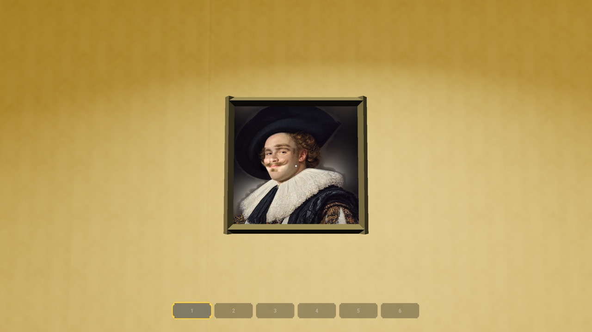
*Mientras lo miras, el Caballero Sonriente sonríe y sus ojos te siguen.*
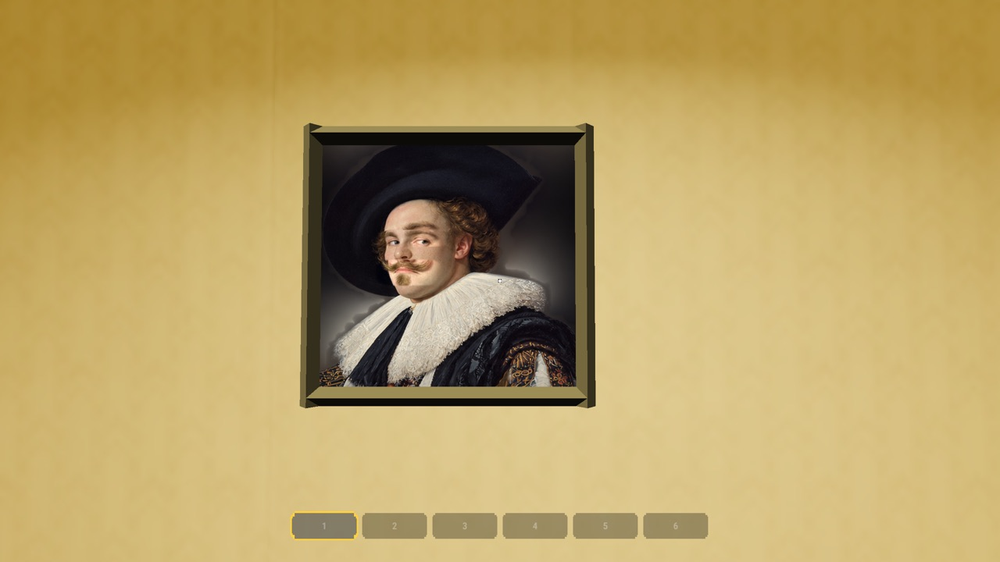
*El mismo cuadro después de 0.4 s fuera del cono de visión: llega con la boca cambiada y los ojos apartados hacia donde estabas.*


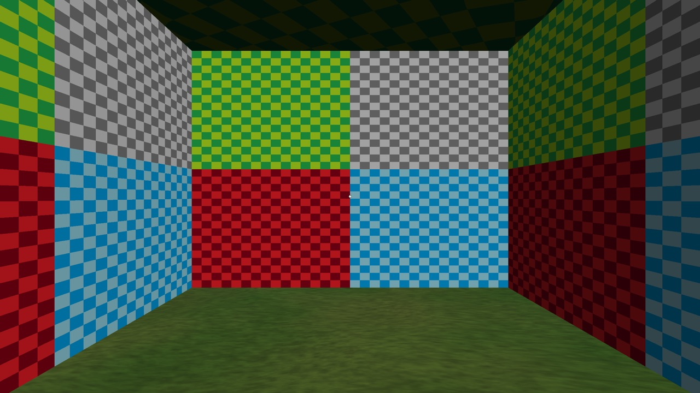
*Las estatuas de "Unobserved", quietas: mientras están en el encuadre no avanzan un milímetro, que es exactamente el mecanismo.*


*Etapa `Smile`: labios rojos entreabiertos con el punto de brillo debajo del labio, y los dos iris centrados en la cámara. La POS 993.44, 1.50, -0.12 que imprime el panel es exactamente la misma de la figura siguiente.*

*Mismo retrato, misma POS al centímetro, solo 6.4 grados menos de yaw: la boca es ahora una línea delgada y cerrada —y desapareció el brillo bajo el labio, porque el gesto se cambia sustituyendo el recorte entero— y el iris del ojo derecho está pegado al borde izquierdo de su abertura, con la esclerótica descubierta del otro lado. Es `SadAway`, y como el ojo del jugador no se movió entre las dos tomas, esa mirada desviada no puede venir del seguimiento.*

#### El test de observación

El motor original de CodeParade sí corre consultas de oclusión de GPU, pero solo para portales y
solo para podar recursión (`Engine::Render`, `Engine.cpp:233-251`). Reutilizarlas habría significado
enhebrar consultas nuevas por el camino de render portado. `ext/visibility.rs` hace lo contrario:
calcula la visibilidad **analíticamente, dentro de `update`**. Eso mantiene toda la mecánica dentro
de `ext/` y tiene una propiedad que la consulta de GPU no puede dar: la respuesta está disponible un
cuadro *antes* de que el pase de render pudiera reportarla.

Son dos pruebas, ambas baratas:

1. **Cono de visión.** Se toma la traslación de `cam_to_world` como ojo y su `-Z` como frente
   (`Object.cpp:33-35`), y se compara el coseno del ángulo hacia el punto contra
   `cos(WATCH_HALF_ANGLE)`.
2. **Rayo de línea de vista.** Se lanza un rayo del ojo al punto contra los colisionadores de la
   escena, deteniéndose 0.05 unidades antes del objetivo para que la propia superficie del objeto no
   cuente como obstáculo.

Observado = las dos cosas. Cobertura real: una estatua escondida detrás de un pilar puede avanzar
aunque esté nominalmente al frente. Eso es lo que hace que la sala se sienta deliberada y no rota.

---

#### 3.9.1 `Level10` — "Unobserved": estatuas que solo avanzan mientras no las miras [IMPLEMENTADO]

**Qué ve el jugador.** Una cámara de pilares. Hay estatuas doradas. Mientras se las mira son piedra
inerte, absolutamente quietas. Al girar la cabeza y volver, están más cerca — nunca se las ve
moverse. La cámara tiene una abertura, y por la abertura no hay muro: hay otra cámara, en vivo, con
sus propias estatuas. Vigilar una cámara significa darle la espalda a la otra. El portal es lo único
que permite mirar las dos a la vez, que es exactamente cuando las que están detrás del jugador
empiezan a caminar.

**El truco.** Cada paso fijo, cada estatua se pregunta si está observada con
`is_observed(&blockers, &ctx.cam_to_world, pos, None)`. Si lo está, no hace nada. Si no, avanza
`CREEP_SPEED` hacia el jugador y gira para encararlo, de modo que la aproximación lea como intención
y no como deriva. Las dos cámaras están separadas 200 unidades y unidas por el modismo `Level3` de
CodeParade (`Level3.cpp:24,38,52`), con `connect` cableando frente y dorso en los dos sentidos. La
estatua de la cámara donde el jugador no está no persigue al jugador: persigue **el punto homólogo
de su propia cámara**, con `target.x = target.x − player_chamber + origin.x`. Volver por el portal
tampoco es seguro.

**Los números.**

| Parámetro | Valor | Dónde |
| --- | --- | --- |
| Velocidad de avance (`CREEP_SPEED`) | 0.0012 unidades por paso fijo → **0.6 u/s** (`GH_DT = 0.002`, 500 Hz) | `src/level10.rs:47` |
| Distancia de parada (`STOP_DIST`) | 1.5 unidades (se agolpan, no atraviesan al jugador) | `:49` |
| Separación de cámaras (`CHAMBER_SPACING`) | 200 unidades | `:51` |
| Cámaras | 2 | `:68` |
| Sala por cámara | `pillar_room` escala 1.3 → interior x ±2.6, y 0–3.9, z −2.6 a 13 | `:71-73` |
| Portales | 2, unidos con `connect` (bidireccional) | `:114-128` |
| Portal de cada cámara | `origen + (0, 1.95, −1.3)`, `euler.y = −90°`, escala `(1.3, 1.95, 1.3)` | `props.rs:123-128` |
| Estatuas | 4 en total, 2 por cámara, en lados opuestos | `:93-104` |
| Cámara 0 | `suzanne.obj` en `(0, 1, −8)` escala 0.9; `teapot.obj` en `(7.5, 0.5, 2)` escala 0.5 | `:95-98` |
| Cámara 1 | `bunny.obj` en `(200, −0.4, −8)` escala 12; `suzanne.obj` en `(192.5, 1, 2)` escala 0.9 | `:100-103` |
| Pilares de cobertura | 4 por cámara en `(±3.5, 0, ±3.5)`, escala 0.12 | `:84-91` |
| Suelo por cámara | `ground` con escala ×2 | `:78-81` |
| Límites | caja por cámara, semiejes `(20, 8, 20)` | `:120-123` |
| Spawn del jugador | `(0, 1.5, 3)` | `:162` |

**Cómo armo uno nuevo.**

1. Junto en un `Vec` todo lo sólido de la escena — muros, pilares, muebles — como `blockers`. Esa
   lista es la cobertura. Lo que no esté ahí no tapa nada.
2. **No meto los agentes en `blockers`.** Se ocluirían a sí mismos. Por eso la llamada de `Level10`
   pasa `skip: None`: las estatuas simplemente no están en la lista.
3. Creo una `RoomLogic` que en cada paso recorra los agentes, pregunte `is_observed` y solo mueva a
   los que den `false`.
4. Calibro la velocidad contra la frecuencia del paso fijo, no contra el cuadro: 0.0012 por paso son
   0.6 u/s a 500 Hz. Rápido de más y el jugador ve el salto entre dos miradas; lento de más y no hay
   mecánica.
5. Le doy al agente una distancia de parada, o terminará dentro del jugador.
6. Si hay portales, decido si el agente persigue al jugador o al punto homólogo de su propia región.
   `Level10` elige lo segundo y por eso el portal es una trampa y no un refugio.
7. Pongo cobertura real. Sin pilares, el mecanismo es binario (adelante/atrás) y el jugador no tiene
   nada que leer.

**Qué puzles habilita.**

- **[PROPUESTA] Escolta.** El jugador tiene que llevar un objeto de A a B mientras cubre con la vista
  dos corredores: la ruta óptima es la que deja menos ángulo muerto, y el espejo del capítulo de
  portales lo cambia todo.
- **[PROPUESTA] El interruptor vigilado.** Una palanca solo se puede accionar sin mirarla. El jugador
  debe memorizar dónde está, girarse y accionarla de espaldas, mientras las estatuas aprovechan.
- **[PROPUESTA] Ronda de dos cámaras.** Dos salas unidas por portal con una estatua cada una: el
  jugador tiene que encontrar el único ángulo del que las dos entran en el cono, y sostenerlo
  mientras hace otra cosa con las manos.
- **[PROPUESTA] Cobertura móvil.** Pilares sobre rieles: el jugador los empuja para crear o cerrar
  sombras de línea de vista, convirtiendo la cobertura en un recurso administrable.

**Límites.**

- El test es de un solo punto por agente. Un objeto grande cuyo centro está oculto pero cuyo borde
  se ve se considera no observado y avanza a la vista. Para figuras grandes hay que sondear varios
  puntos.
- El rayo prueba contra rectángulos de colisión (`ext/raycast.rs`), no contra la malla. Una malla sin
  colisionadores — `bunny.obj`, `teapot.obj`, `suzanne.obj` no tienen ninguno — es transparente para
  la línea de vista aunque tape la pantalla.
- Ambas estatuas de cada cámara están colocadas **fuera de los muros de su sala**: `pillar_room`
  escala 1.3 cierra en z ∈ [−2.6, 13] y x ∈ [−2.6, 2.6], y las estatuas están en z = −8 y x = 7.5.
  Arrancan ocluidas por el muro y entran atravesándolo. Hay que verificar si es intencional.
- Las estatuas escriben `pos` directamente: no son cuerpos físicos y atraviesan geometría. Cualquier
  cobertura las estorba para *verlas*, no para *pasar*.
- El coste es lineal en objetos por agente por paso. `Level10` corre a 500 Hz con cuatro agentes; los
  retratos de la sección siguiente ya no pueden permitírselo (ver `WATCH_EVERY`).

---

#### 3.9.2 Los retratos de los Backrooms — el gesto que cambia a tus espaldas [IMPLEMENTADO]

**Qué ve el jugador.** Ocho cuadros a lo largo del pasillo de oficina. Los ojos lo siguen: no de
forma teatral, sino como sigue un retrato bueno. Al mirar uno de frente, sonríe. Al seguir caminando
y volver la cabeza, ya no sonríe: está triste, y los ojos ya no están sobre el jugador, están
clavados en el lugar donde lo vio por última vez. Una tercera mirada y está enojado, con los ojos de
vuelta encima. Nunca se lo ve cambiar. Y desde la puerta del prado, a mil unidades, los cuadros del
pasillo tampoco cambian: mirarlos por el vano cuenta como mirarlos.

**El truco.** Es el mecanismo de `Level10` aplicado a una expresión. Cada retrato corre una máquina
de estados de tres etapas (sonrisa → triste con los ojos desviados → enojado) que avanza **un paso
por cada racha sin ser observado**, y solo después de `GRACE` segundos: un vistazo de reojo, o un
giro de cabeza que lo saca del cono y lo devuelve, no cambian nada. El cambio se hace con un fundido
más corto que la gracia, así que la mirada que termina una racha encuentra la cara nueva ya
asentada, nunca a medio camino. La mirada tiene memoria aparte: mientras nadie mira, los ojos se
quedan en el punto desde donde vieron al jugador por última vez, y al ser mirados otra vez se
deslizan de ahí hasta el jugador en `REACQUIRE` segundos. Girarse y volver los encuentra en el sitio
que uno dejó.

La extensión importante frente a `Level10` es **ver a través de un portal**. `Watch::seen_from`
prueba primero la vista directa; si falla, para cada portal de la escena comprueba que el cuadro esté
del lado lejano, que su imagen bajo `Warp::delta` — la misma transformación con la que renderiza el
pase del portal — caiga en el cono, que la línea del ojo a esa imagen cruce el cuadrilátero del
portal, que la mitad cercana esté despejada, y que la mitad lejana — desde donde la línea sale del
portal de destino hasta el cuadro — esté despejada del edificio. La mitad lejana arranca en la puerta
lejana y no en el ojo deformado, a propósito: un jugador a un paso fuera de la puerta del prado está
a un paso *detrás* de la puerta lejana, que queda dentro del muro de fondo del pasillo, y un rayo
desde ahí choca contra el reverso del muro. Y solo mientras las puertas existan
(`Watch::while_doors_stand`): cuando la puerta de un solo sentido de los Backrooms desaparece, sus
portales se van con ella y no se ve nada por un vano que ya no está.

Además, como el shader recibe el ojo del **pase** que lo dibuja (`RenderCtx.eye`), un retrato visto a
través de un portal mira a la cámara del portal — a la persona que está en el vano — y no a un punto
del prado a mil unidades de distancia.

**Los números.**

| Parámetro | Valor | Dónde |
| --- | --- | --- |
| Semiángulo del cono (`WATCH_HALF_ANGLE`) | **1.05 rad = 60.16 grados** | `ext/visibility.rs:27` |
| Campo de visión del render (`GH_FOV`) | 60 grados **vertical** → 30 grados de semiángulo vertical | `game_header.rs:45` |
| Semiángulo horizontal a 1280×720 | 45.66 grados | derivado de `camera.rs:46-50` |
| Semiángulo horizontal corriendo (+8° de FOV) | 50.2 grados — sigue por debajo de 60 | derivado, `ext/sprint.rs` |
| Gracia antes de cambiar de gesto (`GRACE`) | **0.4 s** sin ser observado | `ext/painting.rs:85` |
| Fundido del cambio (`FADE`) | 0.25 s, bien dentro de la gracia | `:87` |
| Reenganche de la mirada (`REACQUIRE`) | 0.6 s de deslizamiento desde el recuerdo hasta el jugador | `:91` |
| Cadencia del test (`WATCH_EVERY`) | 1 test cada 10 pasos fijos = 50 Hz; cada cuadro en su propia fase | `:97` |
| Punto de sondeo (`PROBE_OUT`) | 0.15 m delante del lienzo, no sobre él | `:117` |
| Holgura del rayo de línea de vista | se detiene 0.05 unidades antes del objetivo | `ext/visibility.rs:60` |
| Etapas del gesto | 3: `Smile` → `SadAway` → `Angry` → `Smile` | `:185-222` |
| Núcleo del iris (`IRIS_CORE`) | 0.35 del radio de la abertura | `:120` |
| Ganancia de la mirada (`GAZE_K`) | 0.25 del ancho del ojo por unidad de tangente del ángulo | `:127` |
| Tope de la mirada (`GAZE_LIMIT`) | 12 % del ancho, 15 % del alto | `:132` |
| Cruce a los ojos "hacia la izquierda" (`LEFT_FULL`) | 2.5 veces el tope | `:135` |
| Cuadros en el pasillo | 8: norte en x = 981/985/989/993/997 (z = 2.07), sur en x = 983/991/999 (z = −1.52) | `src/level16.rs:111-117` |
| Separación del muro | 0.02 m, para no ser coplanar con el escaneo | `:224` |
| Alto del centro y ancho | 1.6 m y 0.8 m | `:227-228` |

**Cómo armo uno nuevo.**

1. Tomo el `Watch` **después** de que existan los portales y las puertas que quiero que cuenten.
   `Watch::new(objs, portals)` es una foto: lo que se construya después no está en ella.
2. Si esos portales pueden desaparecer, encadeno `.while_doors_stand(link)`. Si no, el objeto seguirá
   creyendo que se lo ve por un vano que ya no existe.
3. Sondeo un punto **separado de la superficie**: 0.15 m delante del lienzo. Un muro escaneado no es
   un plano, y un bulto de un centímetro ocluiría un punto sobre la propia cara.
4. Escalono los tests. Uno cada diez pasos son 50 Hz, más que suficiente para una gracia de 0.4 s, y
   cada instancia arranca en su propia fase para que los recorridos se repartan entre pasos.
5. Doy una gracia mayor que cualquier barrido accidental de la cabeza, y un fundido menor que la
   gracia.
6. Separo "qué cara pone" de "a dónde mira". Son dos máquinas: la expresión avanza por rachas sin
   observación, la mirada recuerda y se desliza. Juntas dan la sensación de intención.
7. Uso el ojo del **pase**, no el del jugador, para cualquier cosa que apunte al espectador. Es lo
   que hace que un retrato visto por un portal mire a quien está en el vano.

**Qué puzles habilita.**

- **[PROPUESTA] El testigo.** Un retrato indica con la mirada dónde está la siguiente pieza, pero solo
  mientras nadie lo mira: hay que leer su dirección por el reflejo de un cristal o por un portal.
- **[PROPUESTA] Contador de vistazos.** Una puerta se abre cuando los ocho retratos del pasillo están
  en la misma etapa. Como cada uno avanza por sus propias rachas, sincronizarlos es una ruta de
  recorrido.
- **[PROPUESTA] La sala que respira.** Geometría de sala, no de retrato: un pasillo que se acorta
  0.4 s después de dejar de mirarlo. El jugador avanza caminando de espaldas.
- **[PROPUESTA] Vigilancia por portal.** Un mecanismo que solo se congela mientras se lo observa, y
  el único ángulo posible es a través de un portal que hay que mantener abierto con las manos
  ocupadas.

**Límites.**

- Un solo punto de sondeo por cuadro (ver 3.9.1). Con lienzos grandes el borde puede estar a la vista
  y el punto oculto.
- La lista de `blockers` es una foto tomada en carga. Lo que se construya después — la ventana de los
  Backrooms se construye después de los retratos — no ocluye nada para este test.
- El cambio consume la racha: una racha larga produce **un solo** paso del ciclo, no varios. Atrapar
  la cara enojada exige dos rachas con una mirada entremedio, cosa que un `--shot` de cámara fija no
  puede producir.
- Las láminas de retratos no traen ojos mirando a la derecha. Hacia la izquierda el motor cruza a la
  variante dibujada; hacia la derecha el warp satura en su tope y se queda.
- El coste sube con la escena: el test recorre todos los objetos para hasta dos rayos. Ocho cuadros
  preguntando a 500 Hz serían cuatro mil recorridos por segundo para una respuesta que solo tiene que
  ser correcta dentro de una fracción de 0.4 s. De ahí `WATCH_EVERY`.

---

#### La lección de diseño: el cono es más ancho que la pantalla, a propósito

`WATCH_HALF_ANGLE` es 1.05 radianes, 60.16 grados de **semiángulo**. El frustum de render no llega
ni cerca: `GH_FOV` son 60 grados verticales, o sea 30 grados de semiángulo vertical, y a 1280×720 el
semiángulo horizontal es 45.66 grados. Corriendo, con los 8 grados extra de campo de visión del
sprint, sube a 50.2. El cono de vigilancia sigue siendo más ancho que el encuadre en todos los casos.

Esa diferencia no es holgura de implementación: es la decisión de diseño central de toda esta
sección. **Nada cambia jamás mientras está en pantalla.** Una estatua que avanza estando técnicamente
fuera de cuadro pero a un grado del borde no se lee como mecánica; se lee como un bug. El jugador no
piensa "aproveché mi ángulo muerto", piensa "el juego hizo trampa". Al hacer el cono de vigilancia
más ancho que el encuadre, la visión periférica cuenta como vigilancia, y el margen entre "lo veo" y
"cuenta como que lo veo" queda del lado seguro: el jugador siempre tiene la última palabra sobre lo
que vio.

La regla generalizable, para cualquier mecánica dependiente de la observación que se agregue después:
**el test de percepción debe ser estrictamente más permisivo que el render.** Si la mecánica se activa
en una zona donde el jugador podría haber visto algo, la mecánica está mal calibrada. Y como el
frustum horizontal depende de la relación de aspecto, el margen tiene que aguantar la pantalla más
ancha que se piense soportar: a 21:9 el semiángulo horizontal es 53.8 grados, todavía por debajo de
60, pero un formato más extremo obligaría a subir `WATCH_HALF_ANGLE` antes que a tocar cualquier otra
cosa.

---


#### 3.9.4 El ciclo de gestos, cuadro por cuadro — **[IMPLEMENTADO]**

El retrato no corre una máquina de estados: corre **dos, con tres relojes**, y la sensación de
intención sale de que no comparten ninguno.

| Reloj | Qué cuenta | Se reinicia con | Tope |
| --- | --- | --- | --- |
| `unseen` | segundos seguidos sin ser observado | cualquier paso observado | — |
| `faded` | segundos desde el último cambio de gesto | el cambio mismo | `FADE` = 0.25 s |
| `settled` | segundos seguidos **siendo** observado | cualquier paso no observado | `REACQUIRE` = 0.6 s |

Y un pestillo, `flipped`, que es la pieza que más se nota jugando: marca que **esta racha ya usó su
cambio**. Se levanta al cambiar y solo se baja con un paso observado.

**La racha, paso a paso.** El paso fijo dura `GH_DT` = 2 ms (500 Hz), pero la prueba de observación
corre una vez cada diez (`WATCH_EVERY`), o sea a 50 Hz y con cada cuadro en su propia fase:

| Tiempo desde que dejaste de mirarlo | Qué pasa |
| --- | --- |
| 0 s | último paso muestreado en que el cuadro estaba observado: `unseen` = 0, `flipped` = false |
| 0 – 0.4 s | `unseen` sube. **Nada cambia.** Un barrido de cabeza que lo saca del cono y lo devuelve muere aquí |
| 0.4 s (`GRACE`, 200 pasos fijos, 20 muestreos) | en el primer paso muestreado que pase de 0.4: `prev` = etapa vieja, `stage` = siguiente, `faded` = 0, `flipped` = **true** |
| 0.4 – 0.65 s | fundido cruzado. Los tres pesos de boca suman 1 y se reparten entre la vieja y la nueva con un smoothstep `t²(3−2t)`; `eyes_left` cruza en el mismo reloj |
| 0.65 s en adelante | **nada más**, dure lo que dure la racha. Media hora de espalda al cuadro = un solo paso del ciclo |
| al volver a mirarlo | `unseen` = 0 y `flipped` = false: la próxima racha vuelve a tener derecho a un cambio |

Consecuencias directas y comprobables:

* **El ciclo cuesta rachas, no tiempo.** `Smile` → `SadAway` → `Angry` → `Smile`. Para ver la cara
  enojada hacen falta **dos** rachas de 0.4 s con una mirada real entre ellas. Y "mirada real"
  significa por lo menos un paso muestreado, que a 50 Hz son 20 ms: un vistazo más corto que eso
  puede caer entre dos pruebas y no contar.
* **Provocar un cambio pide 60 grados, no salir de pantalla.** El cono de vigilancia es de 60.16° de
  semiángulo y el encuadre solo llega a 45.66° horizontales: hay que sacar el cuadro **bien** del
  borde de la pantalla, o cortarle la línea de vista con algo sólido, y sostenerlo 0.4 s.
* **Las dos figuras de arriba son un solo paso del ciclo.** Misma POS al centímetro, 6.4° de yaw de
  diferencia: 6.4 grados no sacan nada de un cono de 60, así que entre las dos capturas hubo una
  excursión que la secuencia no muestra. Lo que sí muestran es que el cambio ya estaba hecho y
  asentado cuando el cuadro volvió al encuadre.

**Qué hace cada etapa en el render.** El shader recibe tres cosas y las dos máquinas escriben en dos
de ellas:

| Etapa | `mouth_w` | `eye_left` | De dónde toma el punto al que apuntan los ojos |
| --- | --- | --- | --- |
| `Smile` | boca 0 (sonrisa) | `look_left` del warp | `Gaze::target(eye)`: se desliza del recuerdo al jugador en 0.6 s |
| `SadAway` | boca 1 (triste) | forzado a 1.0 | `Gaze::remembered(eye)`: **congelado** en el punto desde donde te vio por última vez |
| `Angry` | boca 2 (enojada) | `look_left` del warp | `Gaze::target(eye)`, otra vez con el deslizamiento |

Dos detalles finos que solo se ven comparando capturas. Primero, la boca no se deforma: se
**sustituye el recorte entero**, así que los brillos y sombras que caen dentro del parche
desaparecen con él — el punto de luz bajo el labio del retrato de la perla está en la etapa `Smile`
y no está en `SadAway`. Segundo, `eye_left` es `max(look_left, expression.eyes_left())`: en `SadAway`
la etapa **fuerza** la lámina de ojos mirando a la izquierda, por encima de lo que el warp del iris
hubiera pedido. Por eso una mirada desviada aparece aunque el jugador no se haya movido un
milímetro; el seguimiento de mirada por sí solo, con el ojo en el mismo punto, daría exactamente el
mismo cuadro.

**Por qué el jugador no atrapa la transición.** No es una sola razón, son cuatro apiladas:

1. La ventana en que la cara está a medio camino dura `FADE` = 0.25 s, y **se abre recién a los
   0.4 s** de racha.
2. Para que la racha exista, el cuadro tiene que estar a más de 60° del eje de la vista o tapado.
   Traerlo de vuelta al cono desde ahí es un movimiento de ratón largo.
3. El reloj `faded` **no se detiene al mirar**: avanza en todo paso, observado o no. El fundido se
   sigue terminando mientras se gira la cabeza, así que el viaje de vuelta consume la ventana.
4. La prueba corre a 50 Hz y cada cuadro tiene su propia fase, de modo que ni siquiera hay un
   instante común a los ocho retratos del pasillo al que apuntar.

**Corolario para quien documenta o testea.** Ninguna corrida de cámara fija puede fotografiar
`SadAway` ni `Angry`: el frustum es **estrictamente más angosto** que el cono, así que cualquier
cuadro que esté en la imagen está siendo observado, y una corrida `--scene … --pos … --yaw … --shot`
solo puede entregar la etapa con la que se cargó la escena (`Smile`). Hay exactamente dos salidas:
(a) ponerle un obstáculo delante del punto de sondeo —que está 0.15 m frente al lienzo, no sobre él—
de modo que el centro quede tapado y el borde no, y (b) una sesión a mano, con el panel encendido y
el acorde `Cmd`+`S`+`C`. Las dos figuras de esta sección son del caso (b), y por eso llevan el panel
encima: es la única evidencia de que la POS de las dos es la misma.

### 3.10 Reglas duras del portal y cómo se autora uno

Esta sección es la parte operativa: lo que hay que escribir para tener un portal, lo que el motor
prohíbe, lo que cuesta y cómo se ven los errores.

#### 3.10.1 Autorar un par de portales, paso a paso — [IMPLEMENTADO]

El procedimiento completo, tal como lo hace `src/level1.rs`, el ejemplo más simple del proyecto:

1. Crear y colocar la **geometría que enmarca** el vano (el túnel, el muro, la casa) y empujarla a
   `objs`.
2. Crear el portal con `Portal::new(res)`.
3. **Colocarlo**: posición, `euler` (solo `y`) y `scale`. El semiancho del vano es `scale.x` y la
   semialtura es `scale.y`, porque la malla es un quad de ±1.
4. Empujarlo a `portals` —a su propio vector, no a `objs`.
5. Repetir para el segundo portal.
6. **Recién ahora** llamar a `connect(&a, &b)`.
7. Colocar al jugador con `player.base.set_position(..)`.

El código real, del nivel "Tunnels" (escena 0):

```rust
let portal1 = Rc::new(RefCell::new(Portal::new(res)));
tunnel_set_door1(&tunnel1.borrow(), &mut portal1.borrow_mut());
portals.push(portal1.clone());

let portal2 = Rc::new(RefCell::new(Portal::new(res)));
tunnel_set_door1(&tunnel2.borrow(), &mut portal2.borrow_mut());
portals.push(portal2.clone());

let portal3 = Rc::new(RefCell::new(Portal::new(res)));
tunnel_set_door2(&tunnel1.borrow(), &mut portal3.borrow_mut());
portals.push(portal3.clone());

let portal4 = Rc::new(RefCell::new(Portal::new(res)));
tunnel_set_door2(&tunnel2.borrow(), &mut portal4.borrow_mut());
portals.push(portal4.clone());

connect(&portal1, &portal2);
connect(&portal3, &portal4);

player.base.set_position(Vector3::new(0.0, GH_PLAYER_HEIGHT, 5.0));
```

Línea por línea:

- `Portal::new(res)` construye el objeto: toma del caché la malla `double_quad.obj`, el shader
  `portal` y el shader `pink` de fin de cadena, y le asigna un identificador único. No toca la GPU
  ni reserva framebuffers: esos los tiene el motor.
- `Rc::new(RefCell::new(..))` es obligatorio, no decorativo: el pase de render puede volver a
  alcanzar el mismo portal mientras lo está dibujando, así que todo el camino de dibujo es
  inmutable y compartido.
- `tunnel_set_door1(&tunnel1.borrow(), &mut portal1.borrow_mut())` es el helper de la utilería
  (`src/props.rs`) que coloca el portal en la boca del túnel: pone su posición en el punto local
  `(0, 1, 1)` del túnel, le copia el `euler` del túnel y le da `scale = (0.6, 0.999, 1.0) *
  tunnel.scale.x`. Es decir, un vano de **1.2 de ancho por 2.0 de alto** centrado a 1 m del piso.
  Un nivel propio puede escribir esas tres líneas a mano; el helper no tiene nada de especial.
- `portals.push(portal1.clone())` mete el portal en el vector de portales. Los objetos comunes van
  a `objs`; un portal en `objs` no se cruzaría y uno en ambos se dibujaría dos veces.
- `connect(&portal1, &portal2)` empareja la boca del túnel largo con la del corto, y
  `connect(&portal3, &portal4)` hace lo mismo con los dos fondos. Con eso el túnel largo (9.6 u
  por fuera) mide 1.2 u por dentro, y el corto (1.2 u por fuera) mide 9.6 u por dentro.
- `set_position` mueve `pos` **y** `prev_pos` a la vez. Es importante: si solo se moviera `pos`, el
  segmento `prev_pos → pos` del primer paso barrería medio nivel y dispararía cualquier portal que
  cruzara en el camino.

| Cifra del nivel "Tunnels" (escena 0) | Valor |
|---|---|
| Túnel largo | `pos (-2.4, 0, -1.8)`, `scale (1, 1, 4.8)` → 9.6 u de largo, de z = 3.0 a z = −6.6 |
| Túnel corto | `pos (2.4, 0, 0)`, `scale (1, 1, 0.6)` → 1.2 u de largo, de z = 0.6 a z = −0.6 |
| Portales | 4 (dos por túnel), 2 llamadas a `connect` |
| `portal1` / `portal3` (túnel largo) | `(-2.4, 1.0, 3.0)` y `(-2.4, 1.0, -6.6)` |
| `portal2` / `portal4` (túnel corto) | `(2.4, 1.0, 0.6)` y `(2.4, 1.0, -0.6)` |
| Vano de todos ellos | `scale (0.6, 0.999, 1.0)` → 1.2 × 2.0, centro a y = 1.0 |
| Pasillo (malla `tunnel.obj`) | hueco de x ±0.6, techo a y = 2, muros de 0.2 de espesor, trinchera abierta hasta y = 6 |
| Relación adentro/afuera | 8:1 en ambos sentidos |
| Spawn | `(0, 1.5, 5)` |

#### 3.10.2 Tabla de reglas duras

| Regla | Razón técnica | Dónde |
|---|---|---|
| **Los portales son verticales, siempre.** `euler.x` y `euler.z` en cero. | `try_portal` solo reescribe `euler.y` al cruzar: un portal inclinado dejaría al jugador sin reorientar. `Portal::draw` lo afirma con `debug_assert!(euler.x == 0.0)` y `debug_assert!(euler.z == 0.0)`. | `Physical::try_portal`, `Portal::draw` |
| **Tope de recursión: 4.** Más allá, quad magenta. | El contador `rec_level` y los tres framebuffers compartidos. | `GH_MAX_RECURSION`, `engine.rs` |
| **Tope de 16 portales por escena.** | Los arreglos de oclusión y de visibilidad del pase de render son de tamaño fijo `GH_MAX_PORTALS`; pasarse es un índice fuera de rango, no una degradación elegante. | `Engine::render` |
| **No hay colisión objeto contra objeto en el camino portado.** | El pase prueba las esferas de cada `Physical` contra los *colisionadores de malla* de los demás: los props chocan con el nivel pero se atraviesan entre sí y no se apilan. | README, "Known limits" |
| **El jugador no se para encima de un prop.** | El cilindro del jugador es cinemático frente al mundo de cuerpos rígidos: el jugador empuja los props, los props no lo mueven a él. Saltar sobre el dado lo atraviesa. | README, "Known limits" |
| **No hay escaleras.** | La esfera del pie se traba en cada peldaño. Por eso el original solo usa rampas (Level4) y por eso `level13.rs` licúa las escaleras de "Relativity" en planos inclinados. | `level13.rs` (cabecera) |
| **El cruce prueba un punto, no un cuerpo.** El quad debe contener la altura del ojo (1.5) y ser más ancho que el jugador (0.4). | `intersects` recibe el segmento `prev_pos → pos` del centro del objeto. Un vano que no abarque y = 1.5 se ve pero no se cruza; uno más angosto que el jugador lo traba contra la jamba. | `Physical::try_portal` |
| **Un cruce por objeto y por paso.** | El bucle corta con `break` en cuanto un portal responde. Dos portales solapados no se cruzan en cadena en el mismo paso. | `Engine::update`, pase de portales |
| **Cualquier teletransporte propio va *después* del pase de portales.** | El pase consume un segmento `prev_pos → pos` continuo; mover al jugador antes le entrega un segmento kilométrico que barre todos los vanos del nivel. Por eso el respawn de sala y el envolvente toroidal del prado corren al final del paso. | `Engine::update` |
| **Conectar después de colocar.** | `connect` captura `local_to_world()` de ambos portales una sola vez. Nada recalcula los warps si el portal se mueve luego. | `connect_warps` |

#### 3.10.3 La consecuencia de diseño de la verticalidad — [IMPLEMENTADO]

Dicho sin rodeos, y **esto no es una decisión de arte, es del motor**:

- **Quedan descartados los portales de piso y de techo.** Nada de caer por un agujero y salir del
  techo de otra sala.
- **Quedan descartados los corredores tipo botella de Klein**, donde el pasillo se reintegra
  girado sobre sí mismo.
- **Quedan descartados los volteos de gravedad tipo Manifold Garden.** El jugador no puede cambiar
  de "abajo".

La causa es de una línea: al cruzar, el motor recalcula el rumbo con
`euler.y = -atan2(new_dir.x, -new_dir.z)` y no toca `euler.x` ni `euler.z`. Un portal inclinado
entregaría al jugador con la cámara desalineada respecto del mundo al que llegó, y el pase de
dibujo lo afirma explícitamente en debug.

Una salvedad y un precedente:

- La gravedad **por objeto** ya es un `Vector3` arbitrario (`Physical::gravity`), así que los
  props no están sujetos a esta limitación; el que no puede voltearse es el jugador.
- El proyecto ya vive con la regla y la resolvió a la vista: cuando el agarre acuesta la ventana
  de los Backrooms sobre un piso o un techo, su portal **no se inclina**, se estaciona 200 unidades
  bajo el mundo (`ext/window.rs`, constante `PARK`) y el HUD dice `STAND IT UP ON A WALL`. Ese es
  el patrón recomendado para cualquier objeto-portal manipulable: estacionar y pedirle al jugador
  que lo pare, nunca inclinar.

#### 3.10.4 Presupuesto: qué cuesta un portal en el cuadro

| Concepto | Costo | Fuente |
|---|---|---|
| Un portal a la vista | **~0.9 ms**, dibuje lo que dibuje adentro | README: saltarse el dibujo anidado, dibujar al framebuffer principal, limpiar antes o encoger el framebuffer a 256 miden lo mismo; el costo es el cambio de render target y el muestreo de una textura recién renderizada |
| Escena con portales anidados (Six Rooms) | 1.48 → **1.12 ms** por cuadro tras las optimizaciones | README |
| Escena con un portal a la vista (intro, título) | dentro del ruido de medición | README |
| Escena 0 "Tunnels" (4 portales) a 2560×1440 | promedio **0.96 ms**, p95 2.25 ms sobre 109 cuadros | medición con `--shot` en la máquina del autor |
| Consulta de oclusión | ya no cuesta un viaje CPU–GPU: el resultado que se usa es el del cuadro anterior exacto, y un portal fuera del frustum se resuelve en CPU sin preguntar | `ext/occlusion.rs` |
| Área del pase anidado | recortada por tijera a la huella en pantalla del quad, con 2 px de margen | `ext/scissor.rs` |
| Memoria | 3 framebuffers al tamaño del drawable para *toda* la escena (el port original daba tres de 2048² a *cada* portal, ~20 MB cada uno) | `engine.rs`, README |

Regla práctica para presupuestar un nivel: **contar portales visibles simultáneamente, no
portales colocados.** Un nivel con doce portales de los que solo se ven dos a la vez cuesta lo
mismo que uno con dos. Un nivel con tres portales que se ven entre sí cuesta mucho más que uno con
seis que no.

#### 3.10.5 Errores frecuentes al autorar uno, y cómo se ven cuando fallan

| Síntoma en pantalla | Causa | Arreglo |
|---|---|---|
| El vano es un rectángulo **magenta liso**. | La cadena de recursión se agotó: hay más de tres portales encadenados en la línea de visión. | Reducir la ramificación, tapar la línea de visión con geometría o aceptar el magenta donde no se ve. |
| El portal muestra **la misma sala en la que estoy**, un poco corrida, y cruzarlo no lleva a ningún lado. | Falta el `connect`, o se conectó el lado equivocado. Un warp sin conectar es la identidad. | Verificar que haya una llamada a `connect` / `connect_warps` por cada par de caras. |
| El jugador **cambia de tamaño** al cruzar sin que nadie lo haya pedido; el mundo se siente pesado o liviano. | Los dos quads tienen distinto `scale.x`. El factor de `p_scale` es el cociente de anchos. | Igualar `scale.x` en ambos portales, o asumir el cambio y documentarlo como truco de escala. |
| **Se ve el otro lado pero no se cruza.** El jugador camina contra el vano. | El quad no abarca la altura del ojo (1.5), o `passable` quedó en `false`, o hay un colisionador tapando el vano. | Subir `scale.y` / bajar el centro; revisar `passable`; sacar el colisionador. |
| El jugador **se traba en la jamba** justo al cruzar. | El vano es más angosto que el diámetro del jugador (0.4) o el marco de geometría es más chico que el quad. | Vano de al menos 0.8 de ancho útil; el quad, un poco más chico que el hueco de la malla, nunca más grande. |
| **Panic en debug** al entrar a la escena (`assertion failed: euler.x == 0.0`). | El portal quedó inclinado o rolado. En release no hay panic: el portal funciona a medias y deja al jugador mal orientado al cruzar. | `euler.x = 0`, `euler.z = 0`. Ver 3.10.3. |
| El portal **se ve desde atrás** o desde un ángulo donde no debería, como una lámina flotante. | La malla es un *double quad*: se dibuja por ambas caras. Sin un marco que lo esconda, el borde se nota. | Enmarcar el quad con geometría por los cuatro lados, como hace `tunnel.obj`. |
| **Se cruza atravesando una pared.** | `intersects` solo prueba el quad; no sabe que hay un muro delante. El pase de colisión después empuja al jugador afuera y el resultado es un tirón. | No dejar que el quad sobresalga de su marco. |
| El portal miente después de mover algo en tiempo de carga. | Se llamó a `connect` antes de colocar el portal. | Colocar, después conectar. |
| Al cargar la escena el jugador **aparece ya teletransportado**. | Se movió al jugador con `pos` en lugar de `set_position`, y el primer segmento barrió un portal. | Usar `set_position`, que mueve `pos` y `prev_pos` juntos. |

#### 3.10.6 Qué habilita todo esto — [PROPUESTA]

- **Puerta que audita**: un portal impasable a la entrada muestra la sala final desde el minuto
  cero; el puzle es llegar a ese mismo encuadre por dentro.
- **Ancho como recurso**: dos vanos de anchos deliberadamente distintos convierten cualquier
  corredor en un ajustador de tamaño, sin túnel de escala dedicado.
- **Doble puerta**: usar las dos caras de un mismo portal hacia destinos distintos, de modo que
  entrar por delante y por detrás del mismo vano lleve a lugares diferentes.

---

### 3.11 Qué truco resuelve qué problema

Las diez secciones anteriores están ordenadas por mecanismo. Esta lo está por problema: se entra
por la columna de la izquierda —lo que el diseñador quiere conseguir— y se sale con un truco, una
escena donde verlo funcionando y lo que cuesta ponerlo. El coste está expresado en lo que de
verdad se paga: geometría duplicada, portales simultáneamente visibles (~0.9 ms cada uno,
dibuje lo que dibuje adentro, 3.10.4) y niveles de recursión gastados de los cuatro que hay.

| Problema de diseño | Truco | Escena de referencia | Coste |
|---|---|---|---|
| **Quiero un pasillo más largo por dentro que por fuera** | Dos túneles con los *interiores* cruzados: boca de entrada con boca de entrada, boca de salida con salida (3.2.1) | Tunnels, `--scene 0` | 4 portales y una segunda malla de túnel; ningún anidamiento (1 nivel). El cuerpo del túnel largo sigue ocupando su sitio en el mundo |
| **Quiero una sala que no quepa en el edificio** | N copias de la sala a 200 u (`2 × GH_FAR`) encadenadas en ciclo con `connect_warps` (3.2.2) | Pillar Rooms, `--scene 3` | Una copia **entera** de la sala por eslabón: `Level3` empuja 12 objetos para tres cuartos. Sin instanciación |
| **Quiero que al jugador no le cuadre la cuenta de cuartos** | Anillo de vanos con 2 ó 3 portales que amputan o injertan cuadrantes (3.3.2, 3.3.3) | Three Rooms `--scene 1`, Six Rooms `--scene 2` | 2 portales (3 cuartos) ó 3 y una segunda casa (6 cuartos): ocho cuartos dibujados para recorrer seis |
| **Quiero que el jugador se pierda** | Dos anillos de tres portales, uno por eje, en una planta sellada sin ventanas (3.5.1) | Floorplan, `--scene 6` | 6 portales sobre **una** malla; sin copias. Pero el bucle tiene período 3 y se descubre en un minuto si no se alarga |
| **Quiero que el jugador cambie de tamaño** | Par de portales de anchos distintos: el factor es el cociente de `scale.x` (3.4.1) | Scaling Tunnel, `--scene 5` | Una copia entera del corredor **y de su suelo**, a 202.4 u, que además se dibuja. El factor se fija al cargar y no cambia |
| **Quiero que suba y suba sin llegar a ninguna parte** | Dos túneles en pendiente con las conexiones **cruzadas**, alto con bajo (3.4.4) | Sloped Tunnel, `--scene 4` | 4 portales y dos copias; el doble de geometría que una escalera equivalente, que además el motor no sabe subir (3.4.5) |
| **Quiero un descenso sin fondo** | Ciclo de N rampas: `connect(bottoms[i], tops[(i+1) % N])` (3.6.1) | Penrose Ascent, `--scene 8` | 2 portales y una copia del corredor por tramo. Mirando por la boca baja se ven cuatro tramos anidados: **agota `GH_MAX_RECURSION` y el quinto sale magenta** |
| **Quiero que una llave sea inalcanzable hasta que entienda algo** | Una boca de 0.6 × 1.0 u: `Portal::intersects` prueba el ojo, así que sólo la cruza quien ya tiene `p_scale ≲ 0.66` (3.4.1, 3.7.1) | Compound, `--scene 9` | Cero: es el mismo par escalador que ya está puesto. La llave de escala sale gratis del vano |
| **Quiero que un objeto pase por una puerta más chica que él** | Llevarlo **en mano**: es carga, no viajero, así que el portal no lo reescala y `fit_distance` lo encoge sólo mientras estorba (3.7.1) | Compound, `--scene 9` | Cero de código; hay que elegir props compactos, porque el ajuste es esférico y castiga lo largo y flaco |
| **Quiero enseñar el objetivo sin dejar llegar** | Portal con `passable = false` y `tint`: se sigue dibujando y recursando, no se cruza (3.1.6) | La ventana de los Backrooms, `--scene 16` | Un portal más a la vista (~0.9 ms) y un colisionador sobre el vano. El tinte es estado legible sin HUD |
| **Quiero obligar al jugador a pararse en un sitio exacto** | Anamorfosis: punto de estación, plano de imagen virtual, proyección central (3.8) | Anamorphic Chamber `--scene 11`; The Painted Cube `--scene 12`; la llave de la Mona, `--scene 16` | **Cero portales y cero recursión.** Doce props sin lógica, o una calcomanía, o un campo de distancias en un shader. Lo caro es el recorte por oclusión y señalizar el punto |
| **Quiero un objeto que sólo exista desde un ángulo** | `Grabbable` sin malla con `p_scale = HIDDEN`, abierto a 1.0 por una `RoomLogic` con histéresis (3.8.2) | The Painted Cube, `--scene 12` | Un objeto invisible y una lógica de sala. Cuidado con la puntería: el radio efectivo es 0.35, ±3.31° |
| **Quiero amenaza sin enemigo, sin daño y sin temporizador** | Avance sólo mientras nadie observa: cono más ancho que el encuadre + rayo de línea de vista (3.9) | Unobserved, `--scene 10`; los retratos, `--scene 16` | Un coseno y hasta dos rayos por agente y por paso. Con más de cuatro agentes hay que escalonar los tests (`WATCH_EVERY`) |
| **Quiero un edificio imposible que se pueda caminar** | Cáscara de rectángulos inclinados extraída de la malla por `tools/gen_walkable.py` (3.6.2) | Relativity, `--scene 13` | 660 274 caras, 47 MB y Git LFS. Sólo una de las tres gravedades del grabado es caminable: dos tercios son escenografía |

Dos lecturas transversales de la tabla. La primera: **la mitad de la columna de coste dice
"una copia entera"**. Duplicar geometría es la moneda de este capítulo, y el presupuesto real de
un nivel no se cuenta en portales colocados sino en portales visibles a la vez (3.10.4) y en
mallas duplicadas que igual hay que dibujar. La segunda: **las tres filas más baratas —la llave de
escala, el objeto en mano y la anamorfosis— no cuestan nada porque reutilizan reglas que el motor
ya tenía**. Ese es el patrón a buscar antes de escribir sistema nuevo.

#### Tres combinaciones que nadie ha probado

Los trucos del catálogo se combinan sin fricción porque todos escriben en los mismos tres sitios:
la posición, `p_scale` y lo que la cámara ve. Estas tres combinaciones no existen hoy en ninguna
escena, y ninguna necesita motor nuevo.

**[PROPUESTA] Anamorfosis con punto de estación fuera de escala.** Hoy `Level11` y `Level12` tienen
**cero portales** y el par escalador de `Level5` no tiene ninguna anamorfosis; son dos mitades del
proyecto que nunca se han tocado. El punto de estación es una posición del ojo, y la altura del ojo
es `1.5 × p_scale`: basta hornear una anamorfosis cuyo punto exija el ojo a 0.75 —o a 3.0— para que
la figura sólo cierre después de cruzar el túnel de escala, en el sentido correcto. La sala no
cambia; cambia la unidad con la que se la mira. Es la variante honesta de "El punto inalcanzable"
de 3.8.1, que hoy propone construir un mirador con cajas: el par escalador lo resuelve sin
plataformas, y de paso convierte el ida y vuelta del túnel en la solución de un puzle de imagen en
vez de un puzle de tamaño.

**[PROPUESTA] Vigilancia que sólo se sostiene por un portal.** `Watch::seen_from` ya sabe mirar a
través de un portal —lo hace por los retratos del pasillo, comprobando el cono bajo `Warp::delta`,
la mitad cercana y la mitad lejana del rayo (3.9.2)— pero las estatuas de `Level10` usan la prueba
directa y no la de portal, y su portal es una trampa, no una herramienta. Dándoles la versión que
ve por portales se invierte el signo: en una planta al estilo `Floorplan`, el único ángulo desde el
que dos agentes quedan congelados a la vez es un vano concreto, y sostenerlo obliga al jugador a
quedarse quieto en el sitio donde no puede hacer nada más. Se combina directamente con "El
interruptor vigilado" y con el agarre del capítulo 2: las manos ocupadas y la mirada comprometida
son dos recursos distintos, y este montaje los enfrenta.

**[PROPUESTA] Anillo que además reescala: la espiral.** `Floorplan` tiene seis portales de
**idéntica** `scale`, precisamente para que `p_scale` no se mueva (3.5.1), y `Penrose Ascent`
apunta la idea sin ejecutarla —"un ciclo que multiplica por 0.5 en cada vuelta es una espiral, no
una escalera" (3.6.1)—. Nadie la ha construido. Darle a **uno** de los tres portales de un anillo
un ancho distinto convierte el bucle de período 3 en una progresión geométrica: la misma planta,
recorrida cuatro veces, deja al jugador a `p_scale` 0.0625, con la caminata a 0.18 u/s y vanos de
oficina que ahora son catedrales. Resuelve de un golpe el límite declarado de 3.5 —que el bucle se
agota en un minuto porque nada cambia— y trae consigo el peligro que 3.7 ya documenta: nada acota
la escala del jugador, así que una espiral necesita su boca de rescate desde el primer día.


## 4. Sistemas de soporte

Diez sistemas sostienen la mecánica insignia (agarre por perspectiva forzada, `ext/grab.rs`). Todas las fichas
usan la misma estructura; las cifras salen del código o del README.

---

### 4.1 Inventario de 6 ranuras — `ext/inventory.rs`

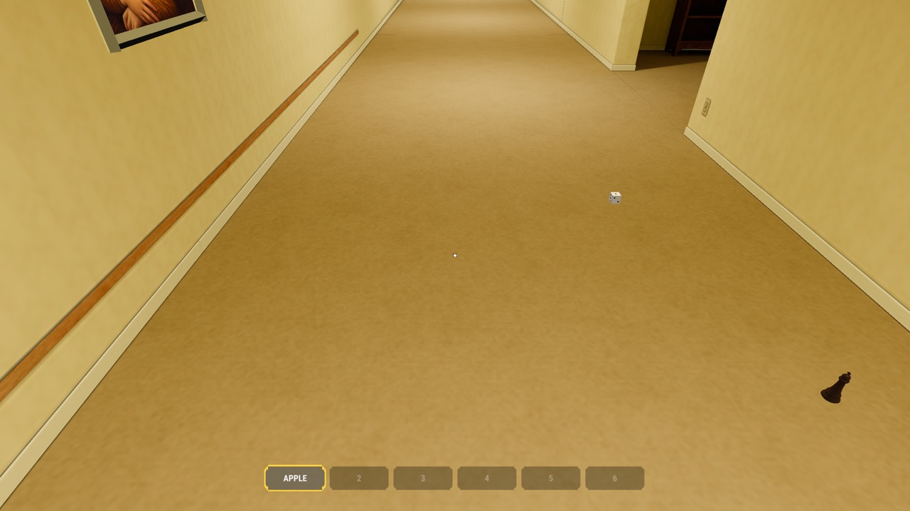
*Ranura 1 ocupada por APPLE. La manzana ya no está en la alfombra: la ranura posee el objeto real, no una copia.*


**Qué es.** **[IMPLEMENTADO]** Seis ranuras que sobreviven a un cambio de escena. La ranura posee el objeto
(`Rc<RefCell<dyn ObjectT>>`), no una descripción: la manzana que guardas en Backrooms es la que rueda en
Pool Rooms.

**Cómo se juega.**

| Entrada | Efecto |
|---|---|
| `F` con algo en mano | Guarda en la primera ranura libre y la selecciona (un segundo `F` deshace) |
| `F` con mano vacía | Saca el ítem **a la escala física (`p_scale`) con la que entró** |
| `G` | Lo deja frente al jugador a 0.9 u, o antes si hay algo más cerca |
| `1`–`6` / rueda | Selección directa / hacia ti = ranura siguiente, con fracciones acumuladas |
| Gamepad | **Sin asignación, deliberadamente** (el D-pad ya está tomado por la navegación de menús: `PadEvents` solo expone `menu_up/down/left/right`) |

Rechazos en la hint line durante 1.6 s: `POCKETS FULL`, `IT WILL NOT FIT`, `THAT SLOT IS EMPTY`.

**Reglas internas.** Guardar es `room::request_remove`; sacar, `room::request_spawn` — colas que el motor
aplica *entre* pasos fijos. Un retrieve queda en vuelo un frame y durante él `F`/`G` no hacen nada. Cuatro
hooks con default (`on_stow`, `on_unstow`, `can_stow`, `stow_label`) entregan y reconstruyen lo que el
objeto tenga atado a *la escena*: cuerpo rapier, oferta de la llave, `prev_pos`. `clear()` **no** corre en
una carga de escena, solo desde `MenuAction::starts_fresh`.

**Estado.** **[IMPLEMENTADO]** Completo y probado (`F`+`G` en un frame, doble `F` sin paso fijo intermedio).

**Ganchos.** **[IMPLEMENTADO]** Todo agarrable es guardable; para prohibirlo, `can_stow` = false. La fila
solo se dibuja si hay algo agarrable en la escena o algo guardado. **[PROPUESTA]** Puzle de transporte
entre pisos.

**Deuda.** **[IMPLEMENTADO]** Sin reordenar ranuras, sin íconos, sin acceso desde el pad.

---

### 4.2 Llave anamórfica y cerraduras — `ext/key.rs`, `ext/painting.rs`

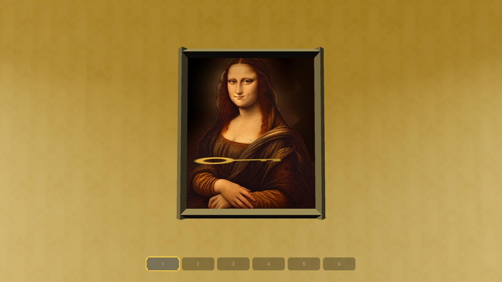
*De frente al cuadro, la llave es una mancha dorada estirada a lo ancho del vestido.*

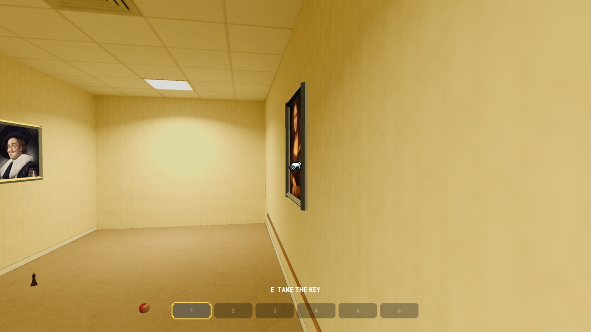
*Desde el punto exacto — 2.6 m al oeste y medio metro fuera de la pared — la anamorfosis cierra y aparece E TAKE THE KEY.*


*Llave tomada: cursor de mano cerrada, y la llave pintada desaparece del cuadro para siempre.*


**Qué es.** **[IMPLEMENTADO]** Una llave pintada en anamorfosis: solo se lee como llave desde un punto
de estación, y ahí emerge una llave real y agarrable.

**Cómo se juega.** A ≤ 0.45 m del punto de estación `V = (994.4, 1.5, 1.55)` y mirando el lienzo dentro de un cono de
25°, el HUD dice `TAKE THE KEY` y la llave sale en 0.5 s; salir del punto la hunde. En mano, apuntar a una
cerradura a ≤ 2.5 m muestra `E  USE THE KEY`.

**Reglas internas.** Cerradura = objeto con `accepts_key()` true (default false), buscado por esfera
envolvente bajo la mira y **con línea de vista**. La `E` del frame se reparte por orden de reclamo:
**ascensor → llave sostenida → agarre**, por eso usarla no es soltarla. `key::wants_use()` es una respuesta
**permanente** hasta que la llave la retire (un frame más rápido que 2 ms no corre ningún paso fijo); la
retiran `on_release`, `on_stow`, el paso en que la mira abandona la cerradura y **el paso que usa la llave**. Uso
único, y `window::unlocked()` lo recuerda para todo el proceso.

**Estado.** **[IMPLEMENTADO]** Cadena completa: pintura → emergencia → agarre → guardado → uso → desbloqueo.

**Ganchos.** **[IMPLEMENTADO]** Cerradura nueva = `accepts_key()` más consumir `room::take_unlock_window()`;
no necesita ser agarrable ni colisionar. **[PROPUESTA]** Segundo objeto anamórfico: ya caben varias `KeySpec`.

**Deuda.** **[IMPLEMENTADO]** `accepts_key` es booleano: **no hay tipos de llave**, y el canal `unlock` es
global (una sola cerradura por proceso).

---

### 4.3 La ventana que se vuelve puerta — `ext/window.rs`


*Estado 1 — cerrada: LOCKED - IT NEEDS A KEY.*

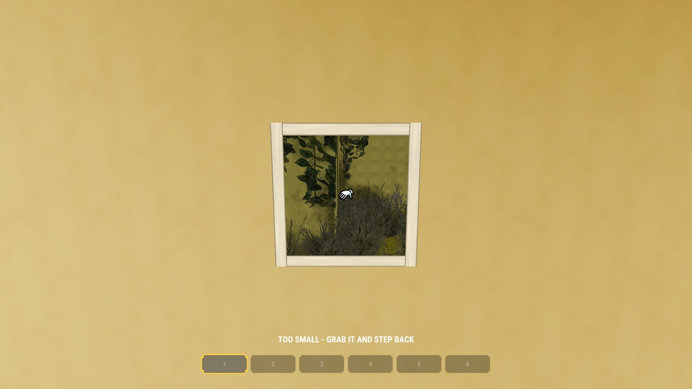
*Estado 2 — abierta pero pequeña: el vidrio se aclara y la hint line enseña el siguiente paso, TOO SMALL - GRAB IT AND STEP BACK.*


*Estado 3 — crecida a 2.1 m: el marco es una puerta y del otro lado está la sala Overgrown.*

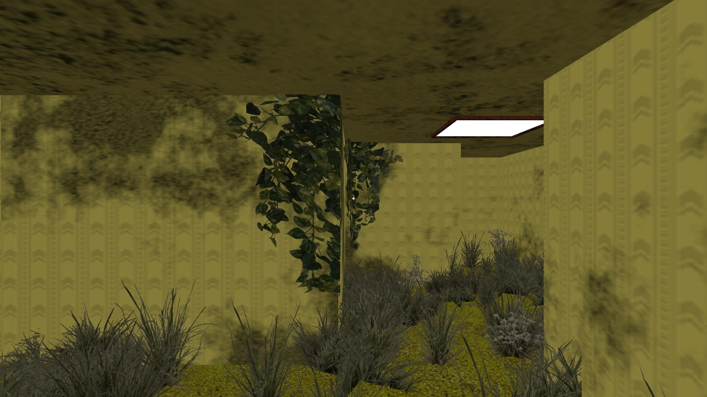
*Estado 4 — cruzada: el jugador está dentro de Overgrown, en las coordenadas de ese nivel.*


**Qué es.** **[IMPLEMENTADO]** Un marco de 30 × 30 cm cuya abertura es un `Portal` hacia Overgrown, y a la
vez un prop agarrable y redimensionable.

**Cómo se juega.** Cuatro estados (`Opening`), en este orden: cerrojo → pose → tamaño.

| Estado | Condición | Hint | Pasable |
|---|---|---|---|
| `Locked` | La llave no se usó | `LOCKED - IT NEEDS A KEY` | No (vidrio verde, α 0.45) |
| `Flat` | Apoyada en piso o techo | `STAND IT UP ON A WALL` | No (el portal se estaciona 200 m abajo) |
| `Small` | Vertical pero < 1.9 m | `TOO SMALL - GRAB IT AND STEP BACK` | No |
| `Open` | Vertical y ≥ `PASS_HEIGHT` = 1.9 m | — | Sí |

**Reglas internas.** El portal se **recoloca y reconecta cada paso fijo** (500 Hz), porque `connect` hornea
ambas transformadas y una ventana movida deformaría hacia una pose vieja. La abertura está 4.5 cm por fuera
del muro: la cabeza es una esfera de 0.2 y una abertura al ras no sería atravesable.
`max_scale(y) = min(y, 2.43 − y) / 0.15` (a 1.35 m da 7.2, una puerta de 2.16 m). `engine_collision` y
`static_collision` son false. Cruce de **una sola vía**: al este de `CROSSING_X` = 1500 un `RoomLogic` carga
el nivel real y pasa posición y mirada por `set_arrival` / `take_arrival`.

**Estado.** **[IMPLEMENTADO]** Con flags `--window-scale S` y `--unlock-window`.

**Ganchos.** **[IMPLEMENTADO]** Patrón replicable: cargar el nivel destino una segunda vez a `FAR2`
(x + 2000), poner el par de portales y un `RoomLogic` que cambie de escena al cruzar un plano.

**Deuda.** **[IMPLEMENTADO]** Sostenida no dibuja outline; las barras no llevan collider; mientras se carga,
la abertura va un frame detrás de las barras.

---


*Paso 1 de la secuencia. La mira está sobre el marco y el vano lleva el vidrio verde plano de `LOCKED_TINT` (α 0.45); en SCALE aparece `holding #30` — la llave está en la mano — y por eso la hint line no dice `LOCKED - IT NEEDS A KEY` sino `E  USE THE KEY`: el `insist` de la llave le gana al `pick_hint` de la ventana.*

*Paso 2, desde la misma POS que la anterior (987.85, 1.50, 1.04; yaw 50.6 → 50.4) para que lo único que cambie sea el estado: el vidrio plano dejó paso al tapiz de rayas verticales de Overgrown visto por un vano de 30 cm, `holding` desapareció de SCALE y la hint pasó a `TOO SMALL - GRAB IT AND STEP BACK` (estado `Opening::Small`).*

*Paso 3, ahora desde la sala contigua y a través de un vano ancho: el mismo marco crecido a tamaño de puerta, sin hint line porque `Opening::Open` no tiene ninguna, y con el pasto y el árbol de Overgrown recortados exactamente contra el plano de la abertura. El `p_scale 1.000` del panel sigue siendo el del jugador: quien creció es el marco.*

#### 4.3.1 El portal portátil: qué lo hace único — **[IMPLEMENTADO]**

El nombre que el autor le puso a la secuencia de capturas —*unlock and resize portal*— es la
definición más exacta de la pieza: en las 19 escenas del juego, **la ventana es el único portal
cuya transformada la escribe el jugador**. Todos los demás (los del port, los de las puertas, los
del túnel de escalado) los coloca el nivel en su `load` y se quedan ahí para siempre. Este se
levanta con `E`, se lleva caminando, se apoya donde apunte la mira y cambia de tamaño según a qué
distancia lo sueltes. Lo que sigue es lo que tiene que ocurrir por debajo para que un portal se
deje llevar.

**1. El par se recoloca y se reconecta cada paso fijo.** `window::place_portals` corre en el
`update` de la ventana, 500 veces por segundo, y reescribe **los dos extremos** antes de llamar a
`connect`:

| Qué se escribe | Extremo cercano (`here`) | Extremo lejano (`there`) |
|---|---|---|
| Posición | centro del marco + `forward * (DEPTH * p_scale)` — la cara exterior de la caja | `FAR2 + (PARTNER.x, here.pos.y, PARTNER.z)` |
| Yaw | el del marco, **y solo el yaw** | fijo, mirando +x hacia la sala |
| `scale` | media abertura, `(0.15, 0.15, 1)` | la misma |
| `p_scale` | el del marco | **copiado del marco** |

Es decir: el extremo lejano copia del cercano **la altura y la escala, nunca la planta**. Colgá la
ventana donde quieras dentro del hall: siempre salís al mismo corredor de Overgrown, pero a la
altura y con el tamaño de vano que le hayas dado. La razón de reconectar es que `Portal::connect`
**hornea** las dos transformadas en las matrices de deformación: un portal movido desde el último
`connect` deformaría hacia una pose vieja. El costo son dos productos de matrices; 500 por segundo
no se miden.

**2. El portal no puede seguir al objeto dentro del mismo paso.** Las cuatro barras del marco se
dibujan desde el cuerpo **tal como está en el frame** (`Window::draw` → `placed_bar`), porque un
marco dibujado desde la pose del paso fijo iría un frame atrás de la mira. El vano no puede hacer
lo mismo: su deformación quedó horneada en el paso y el camino de render sostiene los portales de
forma inmutable. Consecuencia observable y aceptada: **mientras la ventana va en la mano, la
abertura va un frame detrás de las barras**. Es la razón práctica de que la mecánica se lea como
"agarrar, retroceder, soltar y mirar", y no como un portal que se pasea abierto.

**3. La escala física decide el tamaño del vano — y el techo de enfrente decide la escala.** El
estado es una función pura de tres cosas, en este orden: cerrojo → pose → tamaño
(`window::opening`). El tamaño es `OPENING.1 * p_scale` contra `PASS_HEIGHT = 1.9`: 30 cm × 6.34 es
el mínimo que se cruza. El tope no lo pone el agarre sino la sala de destino:

```text
max_scale(y) = min(y, CEILING - y) / (0.5 * OPENING.1)      CEILING = 2.43  (level18)
max_scale(1.35) = 1.08 / 0.15 = 7.2   → un vano de 2.16 m
```

Pasado eso, el gemelo subiría por el techo de Overgrown o se hundiría en su piso, y el pase
anidado dibujaría el **exterior** del modelo como una banda negra cruzando la abertura. Por eso el
`MAX_P_SCALE = 25` del agarre (un vano de 7.5 m) nunca se alcanza: **el 7× es un límite impuesto
por la habitación del otro lado, no por el agarre**. El recorte se aplica dos veces —en
`on_rescale`, una vez por frame renderizado después de que el agarre escribe, y en `settle`, cada
paso— para que el marco dibujado y el portal nunca discrepen.

**4. Nada del motor lo mueve.** `engine_collision` y `static_collision` son false, la gravedad del
cuerpo está en cero y `Physical::update` **no se llama nunca** desde `Window::update`. Una ventana
apoyada se queda exactamente donde el jugador la dejó, sea muro, piso o techo. Sin eso, la esfera
de golpeo —centrada dentro del muro por construcción— sería expulsada del muro cada paso por el
pase de colisión, y el pase de portales podría deformar la ventana a través de su propia abertura,
cuyo plano está a un palmo de su centro.

**5. La pose tiene su propia regla, y no es el estado.** Los portales deben permanecer verticales
(`Physical::try_portal` solo reorienta el yaw de la cámara y `Portal::draw` lo afirma), así que un
marco acostado en el piso o el techo no inclina su portal: lo **estaciona 200 m abajo** (`PARK`).
El estacionamiento se decide por la **pose**, no por el estado, porque un marco cerrado tirado en
la alfombra dejaría si no un cuadro verde vertical atravesándola.

**6. El cerrojo tiene alcance y línea de vista.** `accepts_key` es true solo mientras está
cerrada. La llave la encuentra por esfera envolvente bajo la mira dentro de `USE_REACH = 2.5 m`
**y con línea de vista libre** (`raycast_ignoring`, con la propia cerradura exenta porque su panel
es donde termina el rayo): sin ese chequeo, la llave abriría la ventana a través del muro donde
cuelga. El desbloqueo viaja por `room::request_unlock_window`, se toma en el paso siguiente y queda
registrado en un `thread_local` para toda la vida del proceso: irse en ascensor y volver no
vuelve a cerrarla, aunque cada carga de Backrooms reconstruya el objeto y la llave ya esté gastada.

**7. La figura del paso 1 muestra la precedencia de la hint line.** Con la llave en la mano
apuntando a la ventana cerrada hay dos escritores en el mismo frame: el `pick_hint` de la ventana
(`LOCKED - IT NEEDS A KEY`, por `set`) y el paso de la llave (`E  USE THE KEY`, por `insist`).
Gana `insist`, cualquiera sea el orden: *lo que puede hacer lo que tenés en la mano le gana a la
descripción de lo que está bajo la mira*. El orden completo del canal es `insist` > `notice` >
`set`.

**8. Es el único agarrable que el inventario rechaza.** `can_stow()` es false. Sus dos portales
pertenecen al vector de portales de la escena: guardada en una ranura los dejaría atrás, y sacada
en otro nivel sería un marco alrededor de nada. Además es la salida, y una salida no se guarda en
el bolsillo. Las seis ranuras de la barra que se ven en las capturas nunca podrán contenerla.

**9. Un sonido, en la transición exacta.** `Sfx::WindowGrow` se dispara en el flanco
`!passable → passable` dentro de `update`, y deliberadamente **no** en `settle` —que también corre
en el constructor—, para que una ventana construida ya abierta y grande con
`--unlock-window --window-scale` no suene al cargar el nivel.

**Límites de hoy.** **[PARCIAL]**

* **Hay una sola, y su destino es una constante.** Un `WINDOW_SPOT`, un par de portales, y el otro
  extremo clavado en `PARTNER`. La salida no sigue al marco en planta: se puede colgar la ventana
  en cualquier punto del hall y siempre se sale al mismo corredor del muro oeste de Overgrown.
* **El cruce es de una sola vía.** No hay ventana del otro lado; el regreso es el ascensor.
* **La abertura va un frame detrás de las barras mientras se carga** (punto 2), no hay outline
  mientras se sostiene, y las barras no llevan collider.
* **El recorte de escala solo mira la altura.** `max_scale(y)` ignora qué hay realmente alrededor
  del gemelo; un marco arrastrado por el zócalo simplemente queda chico en vez de ser rechazado.
* **Apoyarla en el piso es legal.** `place_flat()` es true, así que el callejón sin salida
  `STAND IT UP ON A WALL` se produce y se explica, en lugar de impedirse.

**Qué se abriría con un segundo objeto portátil.** **[PROPUESTA]**

Toda la maquinaria de arriba ya es genérica: nada en `place_portals`, `connect` o el recorte de
escala sabe que hay una sola ventana. Un segundo marco portátil —conectado **al primero** en vez
de a una sala fija— convierte el agarre por perspectiva forzada en un editor de topología, y estos
puzles caen solos de las reglas que ya existen:

* **El vano que hay que ensanchar.** La altura del vano es `0.3 * p_scale`, y el agarre fija la
  *talla aparente* (`k = p_scale / distancia`): para agrandar un marco hay que **retroceder**. Un
  corredor de dos metros no puede producir una puerta; hay que llevar el marco a la sala grande,
  agrandarlo ahí y volver con él. La profundidad de cada cuarto pasa a ser el recurso del puzle.
* **El techo bajo como antagonista.** `max_scale(y)` recorta según el techo del **destino**, no del
  origen. Con dos marcos móviles, ese recorte se vuelve simétrico y jugable: colgar la salida bajo
  un techo de 2 m limita la entrada aunque la entrada esté en una nave.
* **Portal de escalado hecho a mano.** Hoy el gemelo copia el `p_scale` del marco justamente para
  que el cruce sea rígido. Si un segundo marco pudiera tener escala propia, la diferencia entre
  ambos extremos es exactamente lo que hace el túnel de escalado (escena 5) y lo que la escena 9
  compone: **un portal de escalado que el jugador construye eligiendo dónde para a soltar cada
  extremo**.
* **El marco que se cruza a sí mismo.** Hoy es imposible por construcción (el objeto nunca se
  deforma por portales y su centro está a un palmo de su propio plano). Con dos marcos, llevar uno
  a través del otro es la primera pregunta que hará el jugador y hay que responderla explícitamente
  —permitirlo con reencuadre del par, o rechazar el apoyo.

Costo estimado: ningún trabajo nuevo de render. Un objeto más con la forma de `Window`, dos
entradas más en el vector de portales de la escena, un `connect` extra por paso (cuatro productos
de matrices a 500 Hz) y **una regla de fusión para el canal de desbloqueo**, que hoy es una
bandera única (`room::request_unlock_window`) y no distingue destinatario.

### 4.4 Puertas y puertas de un solo sentido — `ext/door.rs`

**Qué es.** **[IMPLEMENTADO]** Una puerta blanca exenta con hoja animada: marco para un portal que llena
su vano.

**Cómo se juega.** Sin entrada. Abre por proximidad con histéresis (4.5 m / 5.5 m), gira 1.9 rad en ~0.45 s
y siempre **hacia el lado del jugador** (una hoja del lado lejano quedaría oculta tras la imagen del
portal). Abierta publica un charco de luz cálida en el suelo.

**Reglas internas.** `DoorLink::pair()` une las **dos caras** de una misma puerta, una por mundo: cada una
se abre si su pareja lo hace, y eso mantiene el portal simétrico. La hoja **no tiene collider** (solo los
montantes), así que nunca empuja al jugador. `DoorLink::vanish()` es permanente y compartido, y va siempre
acompañado de `room::request_remove_portals`: una puerta que ya no existe no debe dejar un agujero en el aire.

**Estado.** **[PARCIAL]** "Un solo sentido" existe como *desvanecimiento del par*, no como portal
direccional: el motor no tiene un portal que se cruce en un sentido y no en el otro.

**Ganchos.** **[IMPLEMENTADO]** La escena empuja la `Door`, arma el portal en `door.portal_transform()` y
guarda los ids; de una vía = un `RoomLogic` que llame `vanish()` y `request_remove_portals(&ids)`.

**Deuda.** **[IMPLEMENTADO]** El portal es tan alto como el vano (1.7 u) y el ojo camina a 1.5: un salto
bien medido pasa **por encima** del quad. `vanish` no tiene vuelta atrás.

---

### 4.5 El ascensor como hub entre niveles — `ext/elevator.rs`

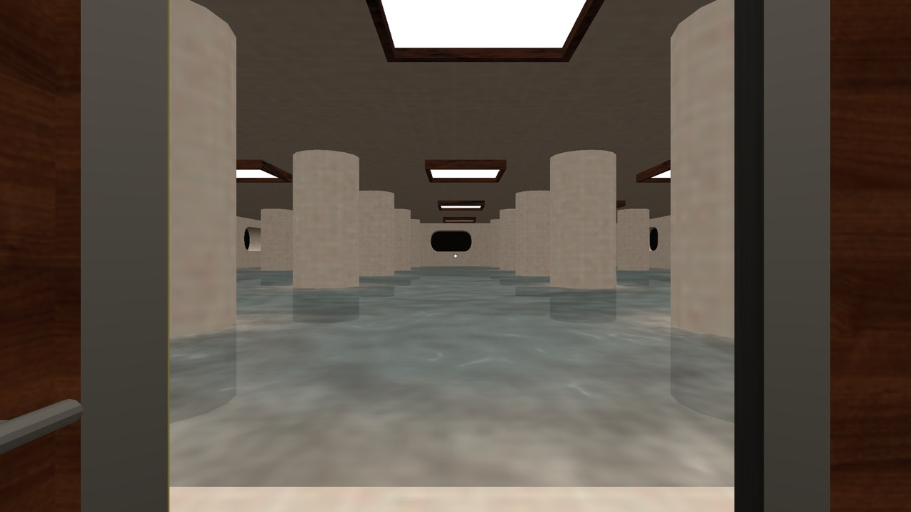
*Llegada por ascensor: las hojas se abren sobre las Pool Rooms desde dentro de la cabina.*


**Qué es.** **[IMPLEMENTADO]** Una cabina empotrada en el muro de cada interior: el único transporte
bidireccional del juego.

**Cómo se juega.** Entrar y pulsar `E`. El HUD dice `E  RIDE TO <PISO>` o `NO OTHER FLOORS`. El viaje dura
~4 s (1.5 s cierre, 0.5 s fundido, carga, 0.5 s fundido, 1.5 s apertura) y `E` se ignora fuera de la cabina
y mientras las puertas se mueven.

| Piso | Escena registrada | Etiqueta |
|---|---|---|
| 0 | `Backrooms` | `BACKROOMS` |
| 1 | `Pool Rooms` | `POOL ROOMS` |
| 2 | `Overgrown` | `OVERGROWN` |

**Reglas internas.** **Un ascensor por escena**: los canales (fade, press, hint, arrival) se escriben desde
su `update` y gana el último. Un piso no registrado se salta con un warning, así que `FLOORS` puede nombrar
un nivel antes de que exista; el viaje va al siguiente que resuelva, con vuelta al primero. El nivel construye **primero**
el ascensor y después el modelo que lo aloja, porque el vano se recorta del glTF con `lift.wall_cut()`. Las
hojas cerradas colisionan solo con apertura < 0.5 y responden `static_collision` false.

**Estado.** **[IMPLEMENTADO]** Tres pisos, máquina de estados probada con reloj falso, flags `--arrive` y
`--ride-at`.

**Ganchos.** **[IMPLEMENTADO]** Piso nuevo = una fila en `FLOORS` más un `Elevator::new` en el `load` (con
`take_arrival()` y `board(player)` si se llegó en viaje).

**Deuda.** **[IMPLEMENTADO]** Viaje no cancelable; sin selección de piso; sin ascensor en las escenas
portadas ni en el prado.

---


*Interior de la cabina con las hojas abiertas (estado `Idle`): a la izquierda, por el vano recortado del modelo anfitrión con `wall_cut`, se ve el pasillo amarillo de Backrooms sin ningún borde de corte. El tablero de ocho botones y el display de puntos del fondo son geometría del glTF, no controles — la única entrada es la `E` que anuncia la hint line, `E  RIDE TO POOL ROOMS`.*

#### 4.5.1 Lo que la cabina muestra y lo que la cabina hace — **[IMPLEMENTADO]**

La captura del interior deja ver la brecha más grande entre el modelo y el sistema: **el tablero
de ocho botones y el display de puntos del fondo son geometría, no interfaz**. El glTF se carga en
tres partes (`PARTS`): `cabin` —"todo lo que no se mueve", el tablero y el display incluidos— y las
dos hojas `door1` / `door2`. `Elevator::draw` dibuja esas tres partes y nada más; no hay un objeto
por botón, ni un blanco de selección, ni una textura que el código encienda. Las cifras del display
son las que trae el archivo y no cambian nunca.

La entrada real es una sola tecla, y su condición es un **test de caja**, no de proximidad al
tablero: `Elevator::update` calcula `inside = self.contains(ctx.player_pos)` contra la caja de la
cabina (`CABIN_LO`/`CABIN_HI`, unos 4.0 × 2.3 m de planta por 3 m de alto) y solo ofrece la `E`
si además `ride.is_idle()`. Parado en cualquier rincón de la cabina, de espaldas al tablero, la
oferta es la misma. El destino tampoco se elige: `next_floor(here)` devuelve el siguiente piso de
`FLOORS` que resuelva, con vuelta al primero, y el rótulo de la hint line es el `label` de esa fila
—por eso, desde `Backrooms` (índice 0), la línea de la figura solo puede decir
`E  RIDE TO POOL ROOMS`.

La hint del ascensor se publica con `hint::set`, el nivel más bajo del canal. Un `insist` —el
prompt de lo que el jugador tenga en la mano— la taparía. Hoy no hay conflicto porque el ascensor
toma la `E` antes de que el agarre mire, y la llave solo insiste con una cerradura bajo la mira;
pero cualquier objeto nuevo que insista dentro de la cabina apagaría el único cartel que explica
el viaje.

**El vano de la izquierda es la prueba de `wall_cut`.** Desde adentro se ve el pasillo amarillo del
anfitrión y **ningún borde de corte**: los triángulos del muro detrás de la puerta desaparecieron
del dibujo y de la colisión (`Load::cut_boxes`, `ext/carve.rs`), y la losa del modelo —más ancha que el
corte por cada lado, y `PROUD` = 3 cm por fuera de la cara del muro anfitrión, lo justo para que
las dos superficies nunca queden coplanares— tapa los cantos. (`CUT_MARGIN` = 0.1 es otra cosa:
cuánto baja el corte por debajo del piso de la cabina y cuánto pasa por detrás de su fondo, para
que el piso del anfitrión no haga z-fighting con el de la cabina.) De ahí la regla de orden que el nivel debe respetar: **primero el ascensor,
después el modelo que lo aloja**, porque la caja a recortar se le pide al ascensor mientras el glTF
se parsea.

**Las hojas de la figura no colisionan.** El vano abierto mide `OPENING_X` = 1.78 m de luz (hay un
`const assert` que exige más de 1.5) y las hojas solo aportan colisión por debajo de
`DOORS_BLOCK_BELOW = 0.5` de apertura, en un objeto auxiliar (`ElevatorDoors`) separado porque
`ObjectT::trimesh` es una malla por objeto y la de la cabina tiene que estar siempre. Abiertas
están dentro del muro y no estorban a nadie.

**Si algún día hay selección de piso.** **[PROPUESTA]** El modelo ya trae los botones dibujados,
así que el trabajo es de lógica, no de arte: un blanco por botón resuelto como resuelve la llave su
cerradura (`ray_sphere` bajo la mira dentro de un alcance corto y con línea de vista), reemplazar
`next_floor` por el índice elegido, y una hint por botón en lugar de una por cabina. El dato que
falta es solo el destino: `Arrival { from_floor }` ya cruza la carga de escena, y la máquina de
estados (`Ride`) ya recibe el destino como parámetro (`step(..., next)`), así que aceptar un piso
elegido no le cambia una sola transición. Encender el display pediría, en cambio, lo que hoy no
existe: una textura de la cabina escrita en tiempo de ejecución.

### 4.6 Física rígida: manzana, dado, rey de ajedrez — `ext/physics.rs`, `ext/rigid.rs`

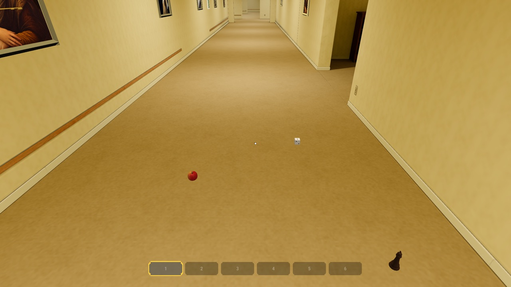
*Los tres props de rapier en reposo sobre la alfombra: manzana, dado y rey de ajedrez.*

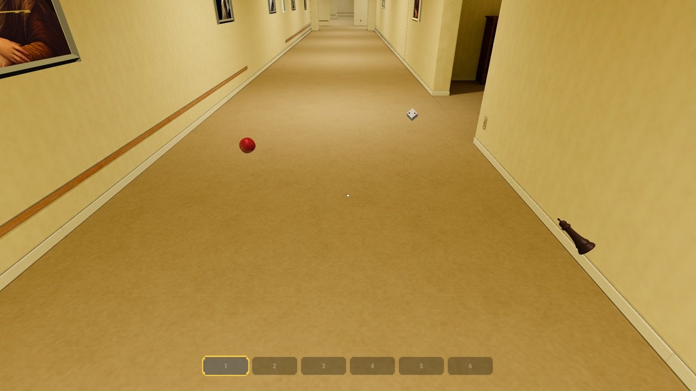
*Los mismos soltados desde un metro: ruedan, vuelcan y se duermen solos.*


**Qué es.** **[IMPLEMENTADO]** Un mundo rapier3d paralelo, dueño de los props que ruedan y se vuelcan. El
motor portado no los toca (`engine_collision` = false).

**Cómo se juega.** Se agarran y sueltan como cualquier prop. Soltar con la vista en movimiento es **lanzar**:
velocidad de la mano con tope 12 u/s y giro de 2 rad/s por unidad. Caminar contra un prop lo empuja.

**Reglas internas.** Rapier posee **solo** los cuerpos de los props; el jugador sigue en la física portada y
se espeja como cilindro cinemático (radio 0.28, base a 3 cm del suelo). El mundo estático es un **snapshot
del load** (mallas y rectángulos, salvo los de más de `RECT_CAP` = 1024, que son terreno): lo que aparece,
desaparece o se mueve debe responder `static_collision` false. Corre a 500 Hz, 3–6 µs dormido y 9–12 µs
rodando. `on_grab` vuelve el cuerpo cinemático, `on_release` lo devuelve a dinámico, `on_rescale` reconstruye
el collider y la masa sigue al volumen por densidad.

**Estado.** **[IMPLEMENTADO]** Tres props y cinco formas: `Ball`, `Cuboid`, `RoundCuboid`, `Cylinder`,
`Capsule` (las dos últimas **se apoyan** en el origen de la malla).

**Ganchos.** **[IMPLEMENTADO]** Un prop nuevo es un constructor en el `load`: `RigidProp::new(res, name,
"x.obj", "x.bmp", shape, material, pos)`. **[PROPUESTA]** Dominó o balanza: los props sí colisionan entre sí.

**Deuda.** **[IMPLEMENTADO]** **No se puede pararse sobre un prop** (el cilindro es cinemático: relación de
una vía). Un prop que se escapa por un hueco del escaneo cae para siempre.

---


*Cursor de punto —el retículo apunta a la pared, donde no hay nada agarrable— y la manzana dormida contra el zócalo con el rabillo hacia arriba: la pose de reposo del `Ball { radius: 0.045 }`. Contra el pitch -24.9 del panel mide unos 30 cm de diámetro, así que se la soltó agrandada y el collider se rehizo a esa escala.*

*La misma manzana agrandada, ahora varios metros pasillo abajo y volteada: el rabillo apunta hacia abajo y a la derecha, y la cara amarilla que antes daba a la izquierda cambió de lado. Rodó sobre sí misma; el retículo sigue siendo un punto, así que nadie la sostiene.*

### 4.7 Correr y saltar — `ext/sprint.rs`, `ext/jump.rs`

**Qué es.** **[IMPLEMENTADO]** Dos verbos que el original no tenía (CodeParade escribió el salto y lo dejó
en un `#if 0`).

| Verbo | Teclado | Pad | Efecto |
|---|---|---|---|
| Correr | `Shift` (mantener) | L3 (alterna, o mantenido) | Velocidad ×1.8, aceleración ×1.5, bob ×1.35, FOV +8° |
| Saltar | `Space` | Cross | Ápice 0.62 m, ~0.71 s en el aire |

**Cómo se juega.** Solo corre **hacia adelante**: la componente frontal del movimiento debe ser ≥ 0.3 de su
longitud (una diagonal es 0.71). Strafe y retroceso van a paso de caminata.

**Reglas internas.** El tope de velocidad se suaviza (0.1 s) y encaja exacto en 1.0 al bajar, para que la
caminata siga siendo bit a bit idéntica al port. El impulso del salto **se deriva del ápice**: 3.911 u/s,
medidos de vuelta en 0.617 m y 0.714 s, y escala con `p_scale` igual que la gravedad. Coyote time y buffer,
0.12 s cada uno; lockout de despegue 0.05 s; un aterrizaje pide 0.08 s de aire y 4.0 u/s separa el golpe
suave del duro. El botón se lee como **nivel**, no como flanco. **Ninguna superficie de las escenas
enviadas se sube saltando**: el sillón de la escena 16 tiene brazos a 0.82 m.

**Estado.** **[IMPLEMENTADO]** Ambos, con eventos `just_jumped` / `just_landed` y `--jump-at N`.

**Ganchos.** **[IMPLEMENTADO]** El ápice de 0.62 m es el presupuesto de plataformas: por debajo se sube, por
encima no; cambiar `APEX` recalcula el impulso solo.

**Deuda.** **[IMPLEMENTADO]** Sin doble salto y sin control aéreo distinto del terrestre.

---

### 4.8 Portales, escala y geometría observada — ver el capítulo 3

**Estos dos sistemas tienen capítulo propio.** Los portales (`src/portal.rs`), el `p_scale` que
un cruce multiplica, y la geometría que solo se mueve cuando nadie la mira
(`ext/visibility.rs`, los retratos de `ext/painting.rs`) son las mecánicas centrales del motor,
no sistemas de soporte, y están documentadas como catálogo de herramientas de diseño en
**3. Geometría imposible**: el funcionamiento del portal en 3.1, las reglas duras y cómo se
autora uno en 3.10, y la observación en 3.9.

Lo único que hace falta repetir aquí es la consecuencia que ata este capítulo con aquel:
**`p_scale` es escala física, no un truco de render**. Alimenta la gravedad, la velocidad de
caminata y el epsilon de colisión, y tanto el agarre por perspectiva forzada (capítulo 2) como
un portal de escalado escriben sobre la misma variable. Por eso se componen.

---

### 4.9 Canales compartidos: hint line, spawn/remove, unlock — `ext/hint.rs`, `ext/room.rs`

**Qué es.** **[IMPLEMENTADO]** **Este es el mecanismo por el que un nivel comunica algo al HUD.** Un objeto
del vector de escena no ve la entrada, el HUD ni el audio, y **nada sobrevive a una carga de escena salvo el
motor**: lo que cruza esas líneas es ambiental (thread-locals). El jugador solo ve una línea de texto bajo
la mira.

| Canal | Escritura | Aplicación | Regla |
|---|---|---|---|
| `hint::set` | Cada frame que la oferta vale | `hint::take()`, 1 vez por frame | Gana el último; dejar de escribir borra la línea |
| `hint::notice` | Rechazos del inventario, 1.6 s | idem | Gana a `set`, pierde ante `insist` |
| `hint::insist` | Lo que puede el objeto **en la mano** | idem | Gana siempre (`E  USE THE KEY` sobre `LOCKED`) |
| `request_spawn` / `request_remove` | Objetos, `RoomLogic`, inventario | Tras el pase de portales | Se cancelan por identidad: un spawn borra un remove pendiente del mismo objeto |
| `request_unlock_window` / `take_…` | La llave | La ventana, en su siguiente paso | Flag de un disparo; queda alzado hasta que lo tomen |
| `request_respawn` | Un `RoomLogic` | Tras el pase de portales | Gana el último; mueve `prev_pos` con `pos` |
| `request_remove_portals` | Un `RoomLogic` | idem | Por id, no por índice |
| `request_scene_load` | Ascensor, ventana | Tras el bucle de pasos fijos | Nunca a mitad de un paso: la carga reemplaza el vector que el paso recorre |

**Reglas internas.** El vector de objetos se recorre **por índice** durante todo el paso: quitar un objeto
desplaza los índices posteriores y el agarre guarda uno entre frames, así que `apply_removes` devuelve los
índices que se fueron y el motor se los pasa a `GrabState::on_removed`.

**Estado.** **[IMPLEMENTADO]** Los ocho canales, con pruebas de consumo y de cancelación por identidad.

**Ganchos.** **[IMPLEMENTADO]** Lógica por frame = empujar un `RoomLogic::new(closure)`: un `ObjectT` sin
malla ni shader, que nunca se dibuja pero sí se actualiza. Todo lo que va al HUD se escribe **cada frame**
en que la oferta sigue vigente.

**Deuda.** **[IMPLEMENTADO]** Una sola casilla por canal y sin fusión: hoy cabe un ascensor por escena y una cerradura
por proceso. **[PROPUESTA]** Si un nivel necesita dos, el canal pasa de `Cell<T>` a un mapa por id **antes**
de escribir el nivel.

---

### 4.10 Matriz de compatibilidad

**[IMPLEMENTADO]** `OK` = compone sin trabajo extra; `CUIDADO` = con una condición; `CHOCA` = prohibido o roto.

| Combinación | Veredicto | Motivo |
|---|---|---|
| Inventario × Física rígida | **OK** | `on_stow` retira el cuerpo rapier; `on_unstow` lo reconstruye |
| Inventario × Llave | **OK** | La llave entrega su oferta al guardarse; `on_grab` la restaura |
| Inventario × Ventana | **CHOCA** | `can_stow` = false → `IT WILL NOT FIT`: su abertura son portales de la escena |
| Inventario × Ascensor / ventana | **OK** | Una carga de escena **no** vacía las ranuras |
| Inventario × Portales | **CUIDADO** | Toda colocación debe usar `set_position` o el pase barre cada puerta |
| Llave × Ascensor | **CUIDADO** | El ascensor reclama la `E` primero: en la cabina la llave no se usa |
| Llave × Ventana | **OK** | El par diseñado: `accepts_key` con cerrojo, `unlock` de un disparo |
| Ventana × Física rígida | **OK** | `static_collision` false: fuera del snapshot de rapier |
| Ventana × Portales | **CUIDADO** | Reconectar cada paso; apoyada plana el portal se estaciona |
| Puertas × Portales | **OK** | Uso previsto; `DoorLink` mantiene la simetría |
| Puertas × Salto | **CUIDADO** | El quad es tan alto como el vano (1.7 u): un salto pasa por encima |
| Ascensor × Física rígida | **CUIDADO** | Las hojas deben responder `static_collision` false |
| Ascensor × Ascensor | **CHOCA** | Comparten fade, press, hint y arrival; gana el último |
| Física rígida × Salto | **CHOCA** | Cilindro cinemático: no se puede pararse sobre un prop |
| Física rígida × Portales | **CHOCA** | `engine_collision` = false: el pase no warpea un `RigidProp` |
| Física rígida × Terreno | **CHOCA** | Mallas con > 1024 rectángulos quedan fuera del mundo estático |
| Correr × Portales | **OK** | `try_portal` warpea también la velocidad |
| Observación × Portales | **OK** | El test se extiende por portales |
| Canales × sistema duplicado | **CHOCA** | Un solo slot, sin merge |

---

### 4.11 Las tres reglas de oro

**[IMPLEMENTADO]** No son estilo: romper cualquiera produce un bug reproducible que ya ocurrió.

1. **Nada que sea mobiliario de portal se guarda ni se lleva.** Si el estado de un objeto vive en el vector
   de portales de la escena, `can_stow` debe ser false. La ventana es el caso canónico: guardarla dejaría
   sus portales atrás y la devolvería en otro nivel como un marco alrededor de nada — `IT WILL NOT FIT`.

2. **Un escritor por canal, y escribiendo cada frame.** Un ascensor por escena, una cerradura por proceso,
   un `hint::set` por situación. Los canales son casillas únicas con "gana el último": dos escritores no se
   mezclan, se pisan. Si el nivel necesita dos, primero se cambia el canal.

3. **El mundo se muta por las colas de `room`, nunca dentro de un paso, y los portales son verticales.**
   Toda alta, baja, respawn o cambio de escena pasa por `request_*` y lo aplica el motor entre pasos; toda
   colocación pasa por `set_position`. Ningún portal se inclina ni se rola: `try_portal` solo reescribe el
   yaw, y `Portal::draw` lo afirma.


## 5. Bucle de juego, progresión y ritmo

### 5.1 El bucle momento a momento (10-30 s)

**[IMPLEMENTADO]** El verbo central es uno solo: agarrar y soltar, los dos con `E`. Todo lo demás
—caminar, correr, saltar, rotar (`R`), guardar (`F`), dejar en el suelo (`G`)— existe para colocar
el ojo donde la perspectiva hace el trabajo. El ciclo completo, tal como corre hoy en `ext/grab.rs`:

```
   ┌─────────────────────────────────────────────────────────────────────┐
   │                                                                     │
   v                                                                     │
 (1) OBSERVAR ──> (2) IDENTIFICAR ──> (3) AGARRAR ──> (4) REPOSICIONAR ──┤
   punto blanco     mano abierta       mano cerrada    la escala sigue    │
   bajo la mira     + hint line        + Sfx::Grab     al rayo de la mira │
                                                              │           │
                                                              v           │
                                                 (5) VERIFICAR ──> (6) AVANZAR
                                                  ¿el hueco cede?    E suelta,
                                                  ¿calla la hint line?    Sfx::Release
```

| Paso | Qué hace el jugador | Retroalimentación que recibe | Fuente en el código |
|---|---|---|---|
| 1. Observar | Barre la sala con la mira | Cursor **punto** (`Cursor::Dot`), sin línea de texto | `ext/hud.rs` |
| 2. Identificar | La mira toca algo tomable dentro de 15 m | Cursor **mano abierta** (`Cursor::Open`); si el objeto ofrece `pick_hint`, aparece la línea al 86% de la altura | `GRAB_REACH = 15.0`, `hint::set` en `grab.rs:518` |
| 3. Agarrar | E | Cursor **mano cerrada** (`Cursor::Closed`), `Sfx::Grab`, y el objeto **no cambia de tamaño en pantalla**: se fija `k = p_scale / distancia` | `grab.rs`, `Sfx::Grab` |
| 4. Reposicionar | Camina y mira | El objeto se apoya contra lo que la mira toca: `d = hit_dist / (1 + r·k)`, `p_scale = k·d`. La escala real se interpola con `SCALE_EASE = 0.25` por frame, así que el encogimiento se lee como movimiento y no como salto | `grab.rs` |
| 5. Verificar | Comprueba que cabe | Si el ajuste le quitó más del 15% a la escala pedida (`GHOST_THRESHOLD = 0.85`), se dibuja un **fantasma** translúcido en la colocación pedida mientras el objeto real queda encogido donde sí entra | `draw_ghost`, `Shaders/ghost.*` |
| 6. Avanzar | E de nuevo | `Sfx::Release`. Un objeto simple **cae muerto**: gravedad restaurada y velocidad a cero. Un prop rígido recibe en `on_release` la velocidad de la mano del último frame (tope `MAX_THROW` = 12 u/s), así que soltar con la vista en movimiento es lanzar | `ext/rigid.rs`, `ext/physics.rs` |

Tres límites duros acotan el bucle y son, en la práctica, enseñanza: la escala vive en
`0.05..=25` (`MIN_P_SCALE` / `MAX_P_SCALE`), el rayo de colocación llega a 60 m
(`MAX_PLACE_DIST`) y el objeto nunca puede tragarse la cámara (`PLAYER_CLEARANCE = 0.3` m).
Un objeto plano —la ventana, un cuadro— se coloca **sobre** la superficie con un pelo de
separación (`FLAT_OFFSET = 0.01`) y se selecciona por su cara, no por su esfera.

**[PARCIAL]** El inventario ya tiene voz de rechazo (`Sfx::Refuse` más la línea `IT WILL NOT
FIT`), pero el agarre no tiene un "no" audible cuando el ajuste muerde: el fantasma lo dice solo
en imagen. **[PROPUESTA]** Un `Sfx::Fit` seco y muy bajo la primera vez que `fit_shrunk` se
enciende en un agarre.

### 5.2 El bucle de sala (2-5 min)

**[IMPLEMENTADO]** El bucle es: entrar → leer el volumen (¿dónde está el hueco? ¿qué es lo único
movible?) → el bucle de 4.1 dos o tres veces → cruzar. El pasillo de las Backrooms es el ejemplar
canónico: ocho retratos, tres props físicos sobre la alfombra (`apple`, `dice`, `king`), una
ventana cerrada y, al fondo del corredor sur, el ascensor. Nada de eso pide texto.

| Densidad medida en el build | Valor |
|---|---|
| Puzles obligatorios en el pasillo de las Backrooms | 2 (llave anamórfica, ventana→puerta) |
| Objetos tomables no obligatorios | 3 props rígidos + la propia ventana |
| Puzles en Pool Rooms | 0 — solo el ascensor |
| Puzles en Overgrown | 0 — solo el ascensor y la llegada de la ventana |

**[PROPUESTA]** Objetivo de diseño para el juego completo: **1 puzle obligatorio cada 90-150 s**
y **1 objeto tomable decorativo por cada obligatorio**. El decorativo es lo que permite fallar sin
costo y es donde el jugador aprende de verdad; el obligatorio es donde demuestra lo aprendido.

### 5.3 El bucle de nivel (10-20 min)

**[PROPUESTA]** Un nivel son de tres a cinco salas con un tema geométrico común y una salida que
el jugador construye con sus propias manos. Estructura fija:

| Tramo | Duración | Función |
|---|---|---|
| Vestíbulo | 1-2 min | Establece la regla nueva del nivel sin cerrar puertas: se puede jugar mal y no pasa nada |
| Desarrollo | 5-10 min | Dos o tres salas que combinan la regla nueva con las viejas |
| Espectáculo | 30-60 s | Un plano ancho, sin puzle: la sala que existe para ser mirada |
| Cierre | 2-4 min | Una sala que exige la regla del nivel en su forma más limpia |
| Ascensor | ~4 s de tránsito | Respiro forzado y corte de escena (ver 5.7) |

### 5.4 Estructura macro ACTUAL del build

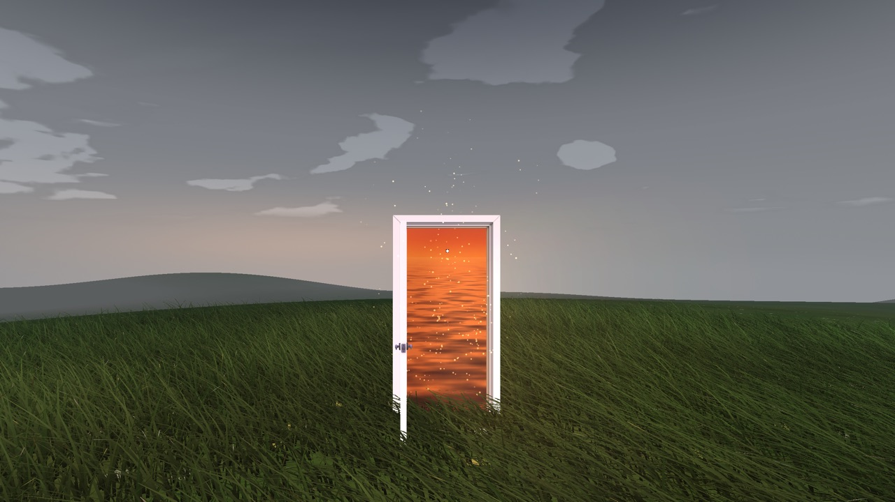
*El punto de partida: el prado gris y la puerta blanca.*

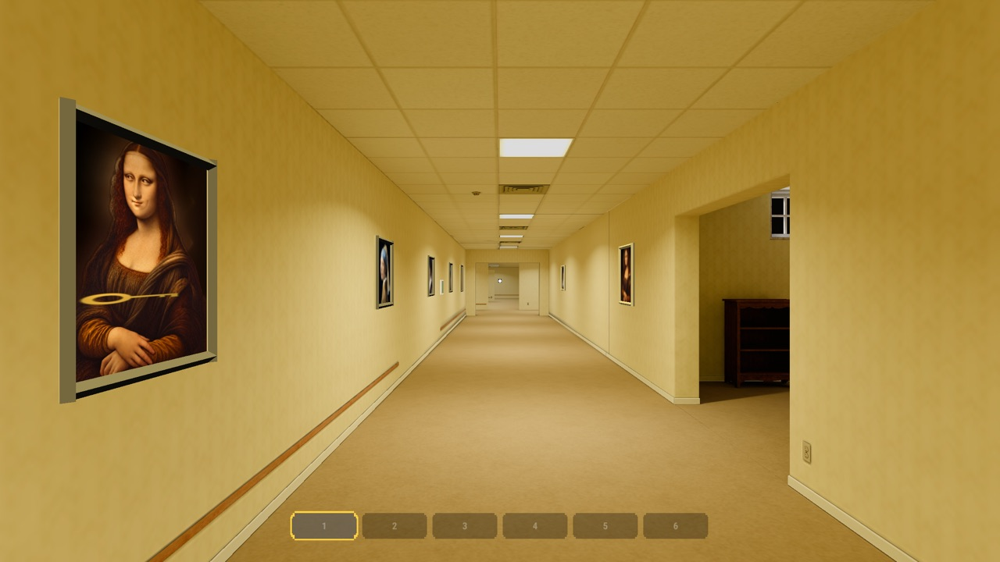
*El pasillo de llegada de los Backrooms. La puerta por la que entraste ya no existe.*


**[IMPLEMENTADO]** Diecinueve escenas registradas en `ext/scenes.rs`. Siete son el port del
original y funcionan como galería técnica accesible desde SWITCH LEVEL; la campaña real usa tres
(16, 17 y 18) más el fondo del título (15). `scenes::INTRO` resuelve a **"Backrooms"** (índice 16) y `scenes::TITLE` a **"Intro"**
(índice 15) —dos índices distintos, resueltos por nombre en tiempo de compilación.

```
  [Intro]  idx 15  ── fondo vivo del menú de título; el jugador NUNCA camina aquí.
     (prado + puerta blanca sobre un mar en el atardecer; la cámara está estacionada
      y nunca cruza, por eso la puerta del fondo no se desvanece nunca)

  NEW GAME  ──> load_scene(INTRO) + inventory.clear()   [apply_menu_action, engine.rs]
                          │
                          v
  ┌──────────────────────────────────────────────────────────────────────────┐
  │  [Backrooms]  idx 16                                                     │
  │                                                                          │
  │   prado ══════ puerta blanca ═════>>> pasillo de la alfombra             │
  │                 (UN SOLO SENTIDO: al primer paso en el mundo lejano,     │
  │                  ambas puertas y ambos portales dejan de dibujarse,      │
  │                  de colisionar y de brillar, para siempre)               │
  │                                                                          │
  │   cuadro "Mona con la llave"  ──[punto de estación]──> llave real (un solo uso) │
  │                    │                                                     │
  │                    v                                                     │
  │   ventana del muro norte ──[llave]──> desbloqueada                       │
  │                    │                                                     │
  │                    └──[agarrar + retroceder hasta ≥ 1.9 m]──> es puerta  │
  │                                       │                                  │
  └───────────────────────────────────────┼──────────────────────────────────┘
                                          v   UN SOLO SENTIDO (no hay ventana de vuelta)
                                    [Overgrown] idx 18

  Ascensor (ext/elevator.rs, tabla FLOORS) — CICLO DE UN SOLO SENTIDO:

     [Backrooms] ──E──> [Pool Rooms] ──E──> [Overgrown] ──E──> [Backrooms]
          ^                                                          │
          └──────────────────────────────────────────────────────────┘
```

**Corrección importante sobre el ascensor.** No es bidireccional. `next_floor` toma el
**siguiente** piso de `FLOORS` que resuelva, con vuelta al primero, y nunca el propio: desde Pool
Rooms no se puede volver a Backrooms en un viaje, hay que pasar por Overgrown. Es un anillo, no
un eje. El HUD dice siempre a dónde va (`E  RIDE TO <label>`) o `NO OTHER FLOORS` si no hay
destino registrado, de modo que la dirección es legible antes de pulsar.

| Enlace | Sentido | Reversible | Mecanismo |
|---|---|---|---|
| Prado → pasillo Backrooms | Uno | No | `DoorLink::vanish`, disparado por `meadow::in_far_world` |
| Cuadro → llave | Uno | No (la llave es de un solo uso) | `ext/key.rs`, `Emergence` |
| Llave → ventana | Uno | No | `room::request_unlock_window`; el desbloqueo es **del proceso** (`window::unlocked`), sobrevive a recargas de escena |
| Ventana → Overgrown | Uno | No | `RoomLogic` sobre `window::CROSSING_X` |
| Backrooms → Pool Rooms | Uno | Vía el ciclo | `FLOORS[0] → FLOORS[1]` |
| Pool Rooms → Overgrown | Uno | Vía el ciclo | `FLOORS[1] → FLOORS[2]` |
| Overgrown → Backrooms | Uno | Vía el ciclo | `FLOORS[2] → FLOORS[0]`, vuelta al primero |

El inventario de 6 ranuras **cruza** todos esos enlaces: `apply_menu_action` solo lo vacía en las
cuatro acciones que declaran `starts_fresh()` (NEW GAME, RESTART LEVEL, SWITCH LEVEL, MAIN MENU),
nunca en un viaje de ascensor ni al atravesar la ventana. Eso hace del inventario el único estado persistente de la progresión actual.

### 5.5 **[PROPUESTA]** Estructura macro objetivo

**Esta tabla es la única fuente de actos y nombres de acto del GDD.** El capítulo 6 cuenta la
historia de estos mismos cinco actos y el capítulo 7 etiqueta sus fichas contra ellos; si alguno
se mueve, se mueve aquí primero.

| Acto | Nombre | Niveles | Duración | Mecánica que introduce | Espacio |
|---|---|---|---|---|---|
| 0 | **La postal** | 1 | 3-5 min | Mirar, caminar, cruzar un umbral que no se puede deshacer | El prado, `Intro` (15), `ext/meadow.rs` |
| I | **La invitación** | 3 | 35-45 min | Agarre por perspectiva forzada; el fantasma como advertencia; la llave pintada como primer punto de estación | `Backrooms` (16) + dos hermanas del mismo escaneo |
| II | **El edificio tiene pisos** | 3 | 35-45 min | Colocación plana (paredes, techos, superficie del agua); el inventario como puente entre escenas | `Pool Rooms` (17) y variantes |
| III | **Los pisos que no caben** | 3 | 35-45 min | Geometría dependiente de la observación; anamorfosis generalizada (el objeto que solo existe desde un punto) | `Overgrown` (18) + `Unobserved` (10), `Anamorphic Chamber` (11), `The Painted Cube` (12), `Relativity` (13) |
| IV | **El noveno marco** | 2 | 20-30 min | Ninguna. Recombinación de los tres actos anteriores y cierre | Vuelta a `Backrooms` (16), pasillo de los retratos |

Total objetivo: **12 niveles jugables, 2 h 15 m - 3 h**. Ninguna mecánica nueva después del acto
III: el acto IV es composición pura. El ascensor pasa de 3 a 8-10 entradas en `FLOORS` —la tabla
ya tolera pisos cuya escena no está registrada (los salta con un aviso), así que la lista puede
nombrar niveles antes de que existan.

### 5.6 Curva de enseñanza (onboarding sin texto)

**[PROPUESTA]**, salvo donde se marca lo contrario. Regla rectora: el jugador tiene **todos sus
verbos desde el minuto uno**; lo que crece es la comprensión, nunca el inventario de habilidades.

| Momento | Mecánica introducida | Cómo se enseña sin texto | Cómo se verifica que entendió | Qué pasa si falla |
|---|---|---|---|---|
| 0:00 prado | Mirar y caminar | La puerta blanca es lo único iluminado del prado; el portal muestra otro mundo | Cruza | Nada: el prado no tiene fondo. Puede dar vueltas indefinidamente |
| 0:40 alfombra | E toma / E suelta **[IMPLEMENTADO]** | La manzana, el dado y el rey están a la altura del ojo, contra una alfombra lisa. El cursor cambia a mano abierta al apuntarlos | Levanta uno | Ninguno: los props tienen física real (`ext/rigid.rs`) y ruedan; volver a tomarlos es gratis |
| 1:10 alfombra | **Escala = distancia** | Sostener el dado y caminar hacia el fondo del pasillo: el dado crece hasta ser un mueble y el jugador lo ve con `SCALE_EASE` | Suelta algo grande y camina alrededor | Suelta algo diminuto contra la pared. También válido: es la mitad de la lección |
| 2:00 alfombra | **El ajuste**: no se puede meter algo mayor que la sala | Un nicho estrecho; el objeto se encoge y el **fantasma** muestra lo que se pidió | Retrocede para pedir menos | El fantasma sigue ahí; el objeto real nunca atraviesa la pared |
| 3:00 retratos | Los ojos siguen la cámara **[IMPLEMENTADO]** | Ocho retratos, gestos que cambian solo cuando nadie mira | Se detiene a mirar (medible por tiempo de permanencia) | Nada. Es atmósfera, no puerta |
| 4:00 el cuadro | **Anamorfosis** **[IMPLEMENTADO]** | Desde cualquier sitio la llave es una mancha dorada estirada; a 0.45 m del punto y dentro de 25° se cierra en una llave de 9 cm, el HUD dice `TAKE THE KEY` y la llave sale del lienzo en 0.5 s | La toma con E | Sale del punto y la llave se hunde y se vuelve pintura otra vez; se puede repetir sin límite |
| 5:00 la ventana | **Una llave abre una cerradura** **[IMPLEMENTADO]** | Al apuntarla, la hint line dice `LOCKED - IT NEEDS A KEY`; con la llave en la mano y a menos de 2.5 m dice `E  USE THE KEY` | `Sfx::KeyUse`, el vidrio se aclara | La llave es de un solo uso, pero el desbloqueo es del proceso: no se puede perder |
| 6:00 la ventana | **Un objeto plano se hace puerta** **[IMPLEMENTADO]** | La hint line pasa a `TOO SMALL - GRAB IT AND STEP BACK`, y si se deja en el suelo, a `STAND IT UP ON A WALL` | Pasa `PASS_HEIGHT` (1.9 m) y la hint line calla; suena `Sfx::WindowGrow` | La hint line reaparece. Un rectángulo colisionable tapa el hueco mientras no sea pasable |
| 7:00 el paso | El umbral irreversible, otra vez | La habitación del otro lado ya se ve desde antes de cruzar | Cruza | No hay ventana de vuelta; el ascensor es la salida (y el HUD la nombra) |
| 9:00 el ascensor | **El hub** **[IMPLEMENTADO]** | El cursor no cambia, pero la línea `E  RIDE TO POOL ROOMS` aparece solo dentro de la cabina | Pulsa E dentro | E fuera de la cabina simplemente agarra: no hay estado de error |

Dos principios que el build ya respeta y que la propuesta conserva: **ninguna hint line es una
instrucción**, todos son un diagnóstico del estado actual del objeto ("está cerrada", "es
demasiado pequeña"); y **ningún fallo cierra una puerta**, porque toda la enseñanza es repetible
in situ.

### 5.7 Ritmo

**[PROPUESTA]** El juego alterna en bloques de 3-6 minutos. La unidad de calma no es una sala
vacía: es un tránsito con una tarea nula.

| Bloque | Duración | Estado | Qué lo produce |
|---|---|---|---|
| Tensión | 3-6 min | Sala cerrada, un puzle obligatorio, geometría legible | Densidad ~1 puzle / 2 min |
| Espectáculo | 30-60 s | Sin puzle. Un plano que solo se mira | Ver lista abajo |
| Calma | 4-8 s | Cero entradas útiles | Viaje de ascensor |

**Los planos de impacto.** Cuatro existen ya y deben quedarse donde están:

1. **[IMPLEMENTADO]** El prado con la puerta blanca abierta sobre el mar en el atardecer: el
   portal se gradúa como atardecer mientras el prado sigue nublado, en el mismo frame
   (`ext/view.rs`). Es la primera imagen del juego y la portada.
2. **[IMPLEMENTADO]** El pasillo de las Backrooms visto desde el prado a 1.000 unidades, con la
   niebla amarillo-parda tragándose el fondo.
3. **[IMPLEMENTADO]** La ventana de 30 cm con la habitación de maleza entera renderizada detrás
   del vidrio —el pase anidado dibuja el cuarto completo, hierba incluida, y cuesta ~1 ms.
4. **[IMPLEMENTADO]** El hall de Pool Rooms: 31 × 25 m de pilares sobre agua a 0.78 m, con la luz
   de las ventanas arqueadas por encima de 1.82 m.

**[PROPUESTA]** Dos más: la cabina abriéndose sobre un vacío, y la sala final del acto IV vista
desde dentro de un objeto que el propio jugador agrandó hasta poder entrar en él.

**El ascensor como respiro y como corte.** Un viaje son ~4 s repartidos: 1.5 s de puertas
(`CLOSE_SECS`), 0.5 s de fundido a negro (`FADE_SECS`), la carga sobre negro, 0.5 s de vuelta y
1.5 s de apertura (`OPEN_SECS`), con cuatro sonidos —botón, puertas, motor, campana— marcando cada
tramo. Durante el negro no se le pide nada al jugador, y esa es la función. Además esconde el
coste de `load_scene`: unos 255 ms en las Backrooms, por la copia de la habitación de maleza.

### 5.8 Gating y progresión

**[IMPLEMENTADO]** Hoy hay una sola cadena de llave: pintura anamórfica → llave → ventana →
Overgrown. Es un gate de **conocimiento envuelto en un ítem**: la llave no es un permiso, es la
prueba de que el jugador encontró el punto de vista.

**[PROPUESTA]** El resto del sistema, respetando que no hay habilidades acumulables:

| Tipo de gate | Cómo se abre | Ejemplo | Qué mide realmente |
|---|---|---|---|
| Gate de tamaño | Agrandar algo hasta un umbral | La ventana a 1.9 m — ya existe | ¿Entendió que la distancia es la escala? |
| Gate de punto de vista | Ver un objeto anamórfico desde su punto | La llave — ya existe | ¿Se mueve para mirar, o solo mira? |
| Gate de puente | Colocar un objeto grande como suelo o rampa | Una regla apoyada entre dos plataformas | ¿Entendió que un objeto colocado es geometría? |
| Gate de transporte | Guardar algo en el inventario y sacarlo en otra escena | Ya soportado: el inventario cruza cargas | ¿Entendió que el objeto es el mismo objeto? |
| Gate de ausencia | Quitar de la sala lo único que la tapa | Un cuadro que oculta un hueco | ¿Mira lo que ya vio? |
| Gate de composición | Dos gates anteriores encadenados en un orden forzado | Acto IV entero | ¿Compone? |

Ningún gate consume nada permanentemente salvo la llave, y esa excepción está protegida: el
desbloqueo vive en el proceso (`window::unlocked`), no en la escena. Regla propuesta: **todo gate
abierto queda abierto para el resto de la partida**, y ningún gate exige un objeto que pueda
perderse —o es indestructible, o se regenera (como la llave pintada mientras no se ha tomado).

### 5.9 Fallo y castigo

**[IMPLEMENTADO]** Hoy no hay muerte, ni daño, ni tiempo, ni estados de derrota. Lo único que
existe es una red de seguridad: un `RoomLogic` devuelve al jugador al punto de llegada mirando por
el pasillo cuando cae medio metro por debajo del suelo (`backrooms::fell_out`, `room::Respawn`), y
lo mismo hacen los interiores construidos con `ext/interior.rs` (valla, tapa de suelo y respawn por
caída). Los rechazos tienen voz —`Sfx::Refuse` y una línea de HUD como `IT WILL NOT FIT`— pero no
consecuencia.

**[PROPUESTA]** Mantener exactamente esa política y hacerla explícita como regla de diseño:

| Situación | Política | Justificación |
|---|---|---|
| Caer fuera del mundo | Respawn instantáneo en el punto de llegada, sin fundido, sin sonido de derrota | Ya implementado. Un fundido convertiría un bug de colisión en un evento narrativo |
| Colocar algo mal | Cero castigo. El objeto se recoge otra vez | El bucle de 4.1 es la enseñanza; castigarlo es castigar el aprendizaje |
| Pedir una escala imposible | El fantasma y el encogimiento | Un "no" que además explica por qué |
| Perder un objeto necesario | Imposible por construcción | Ver 4.8 |
| Quedarse atascado | Sin pistas automáticas por tiempo | Un juego de percepción cuya pista aparece sola ha resuelto el puzle por el jugador |

La única concesión propuesta: si el jugador pasa **más de 6 minutos** en una sala sin cambiar el
estado de ningún objeto, la iluminación de la solución sube un 10% —no una flecha, no un texto,
solo un ojo empujado. Es reversible y el jugador nunca sabe que ocurrió.

### 5.10 Condición de victoria y final

**[PROPUESTA]** No hay jefe ni cuenta atrás. El final es el **Noveno Marco** —la opción B del
capítulo 6, con el gesto de A dentro—, y este apartado y aquel describen el mismo desenlace.

La condición de victoria encadena dos gates de 4.8. Primero uno **de tamaño invertido**: en la sala
que precede al cierre, el jugador debe hacer *pequeño* un marco que ya es enorme, apoyándolo contra
una pared cercana hasta que quepa en la mano. Después uno **de transporte**: guardarlo en una
ranura, subir al ascensor y sacarlo en el pasillo de los retratos del acto I, donde hay nueve
ganchos y ocho cuadros. Colgarlo del noveno es `place_flat` sobre una pared: exactamente el verbo
que la ventana enseñó en el acto I.

Colgado, el marco no muestra pared: muestra el prado del acto 0, con la puerta blanca abierta sobre
el mar en el atardecer. La primera imagen del juego, vista ahora desde dentro de un cuadro. Al
apartar la vista y volver hay una figura de espaldas dentro; al tercer regreso se ha dado vuelta, y
es el Visitante. Créditos sobre el prado en tiempo real, con la puerta abierta y sin nadie
cruzándola.

**El jugador nunca vuelve al prado caminando.** La regla que el juego estableció en su primer paso
—la salida se cierra a tus espaldas y nadie te avisa— se respeta hasta el último plano: el prado se
recupera como imagen, no como lugar. Mecánicamente no hace falta ningún verbo nuevo; lo único que
se produce es una tercera textura de retrato y una lógica de tres pasos sobre el cono de
`ext/visibility.rs`, que es el sistema que ya produjo el mejor momento del acto I.


## 6. Historia, tono y narrativa

**[PROPUESTA]** El build de hoy no tiene historia escrita: no hay guion ni un solo texto en el
mundo que cuente algo. Todo este capítulo es propuesta, salvo el inventario de abajo. La regla que
lo gobierna: la historia se apoya en lo ya construido antes de pedir un asset nuevo.

### 6.1 Cimientos narrativos ya construidos

**[IMPLEMENTADO]** Existe en el build y ya narra, aunque nadie lo haya escrito.

| Elemento | Dónde | Lo que ya dice sin texto |
|---|---|---|
| `DAYDREAMS` sobre un prado gris | `menu.rs::TITLE_TEXT` | El título es la tesis: sueño diurno, no pesadilla nocturna |
| Prado nublado con una puerta blanca al atardecer marino | escena `Intro` (15), `view::MOOD_DUSK` | Todo lo cálido sale de la puerta: 340 motas, 16 rebanadas de haz, una luz de 19 unidades. Acá es frío; allá invita |
| La misma puerta da a una oficina Backrooms | escena `Backrooms` (16), la de NEW GAME | La promesa se rompe entre la portada y la partida, y nadie lo anuncia |
| La puerta desaparece al primer paso | `DoorLink::vanish`, vía `meadow::in_far_world` | La única decisión irreversible ya está codificada. Llegar en ascensor también cuenta |
| Ocho retratos que siguen la mirada y ciclan sonrisa → tristeza → enojo → sonrisa, solo sin ser vistos | `ext/painting.rs`: 5 al norte, 3 al sur | Cono de 60°, 0.4 s sin mirar para cambiar, ojos clavados en el último avistamiento y de vuelta en 0.6 s. El edificio recuerda, y el arco emocional ya está animado |
| Llave anamórfica en el pecho de una Mona Lisa | `ext/key.rs`, `Shaders/painting.frag` | Legible solo desde `(994.4, 1.5, 1.55)`, radio 0.45 m, 25° de tolerancia; sale en 0.5 s. Alguien la pintó **para** un punto de pie exacto |
| Ventana que se agranda hasta ser puerta | `ext/window.rs`, pasable sobre `PASS_HEIGHT` = 1.9 m | Colgada a 1.35 m el tope es 7.2× → puerta de 2.16 m. La salida existe, pero hay que fabricarla con las manos |
| Ascensor de tres pisos en ciclo | `elevator::FLOORS` | `BACKROOMS` → `POOL ROOMS` → `OVERGROWN` → vuelta. El edificio es más grande de lo que la primera sala admite |
| Salas inundadas (agua a 0.78 m, 31 × 25 m) y una oficina comida por la maleza con EXIT rojos y dos puertas oxidadas | escenas `Pool Rooms` (17) y `Overgrown` (18) | Un lugar hecho para nadar sin nadie nadando; y otro donde la naturaleza ya ganó y los EXIT siguen encendidos sobre puertas cerradas |

### 6.2 Premisa

**[PROPUESTA]** Una frase: *alguien cruza una puerta blanca porque del otro lado se veía el mar al
atardecer, y del otro lado hay una oficina que llevaba tiempo esperándolo, con una llave ya
pintada en la pared.*

Un párrafo: el juego empieza con la imagen más bonita que tiene —un prado, una puerta abierta, un
sol sobre el agua— y la cobra de inmediato. Al primer paso sobre la alfombra la puerta y su portal
se borran del mundo, y detrás solo queda pared. No hay persecución ni castigo: hay un pasillo con
ocho retratos que ya sabían dónde ibas a pararte, y una llave *pintada* en anamorfosis sobre el
vestido de una Mona Lisa que solo se lee desde un punto exacto. El edificio no la escondió, la
dispuso. De ahí en adelante es un descenso tranquilo por pisos que no caben en el mismo edificio,
buscando una salida que hay que construir con las manos —una ventanita agrandada hasta que quepa
un cuerpo— mientras las caras de la pared se ponen tristes, luego furiosas, luego amables otra
vez, y nunca lo hacen mientras las miras.

### 6.3 Tono y temas

**[PROPUESTA]** Tres temas, cada uno anclado a una mecánica que ya existe.

| Tema | Frase de trabajo | Mecánica que lo sostiene |
|---|---|---|
| **Irreversibilidad** | La salida se cierra a tus espaldas y nadie te avisa | `DoorLink::vanish`: un paso, sin confirmación, sin retorno |
| **Ser mirado** | El miedo no es que te persigan, es que te hayan visto | Retratos que recuerdan el último avistamiento y solo cambian a tus espaldas |
| **El tamaño miente** | Nada mide lo que parece, y eso es herramienta, no trampa | Agarre por perspectiva forzada con `p_scale` como escala física; la ventana que crece hasta ser puerta |

**El juego es X, no Y:**

- Es **melancolía**, no terror de sustos.
- Es **un edificio que te observa**, no un monstruo que te persigue.
- Es **una llave mal leída**, no un acertijo de combinaciones.
- Es el **zumbido de un fluorescente**, no un golpe de cuerdas.
- Es **soledad poblada** (ocho caras te miran), no vacío.
- Es **una salida que se cierra**, no una muerte que te devuelve al checkpoint.
- Es **una sola imagen cara**, no cinco secuencias espectaculares.

#### Postura sobre el horror

**[PROPUESTA]** La estética Backrooms viene con susto de salto de fábrica. **Lo rechazamos**, por tres
razones defendibles:

1. **Pelea contra la mecánica insignia.** La llave anamórfica exige quedarse quieto y observar:
   tolera 0.45 m y 25°, y tarda 0.5 s en salir del lienzo. Un juego que entrena a no mirar las
   paredes es un juego que nadie resuelve.
2. **No hay sistema al que colgarlo.** No existe muerte, salud, combate ni IA de persecución. Un
   perseguidor es una vertical de producción entera para comprar dos segundos.
3. **Ya tenemos el miedo caro y no el barato.** Un salto se compra con un sonido fuerte; la
   sensación de *haber sido visto* es difícil, y `ext/painting.rs` ya la entrega.

La categoría correcta es **lo siniestro**: lo familiar apenas corrido de lugar. Una sola excepción,
en el Acto III: una figura inmóvil que no se mueve, no suena y no se acerca. Si el jugador
retrocede, se asustó solo.

### 6.4 Personaje jugador

**[PROPUESTA]**

| Pregunta | Decisión | Justificación |
|---|---|---|
| ¿Nombre? | Ninguno en pantalla; internamente **el Visitante** | El equipo necesita una palabra, el jugador no |
| ¿Habla? | Nunca: cero voz en off, cero monólogo, cero texto en primera persona | Silencio por presupuesto y por tono a la vez |
| ¿Cuerpo visible? | No. **[IMPLEMENTADO]** las manos son hoy un cursor de HUD de tres estados, no geometría. **[PROPUESTA]** no añadir brazos | Unos brazos exigirían animación que contradiga `p_scale`: la mano tendría que sostener un objeto de 7 m |
| ¿Qué sabe? | Menos que el jugador: no reconoce las Backrooms ni sabe qué es la llave | Se descubre a la par, no por detrás |
| ¿Qué quiere? | Acto I: llegar al mar. Acto II: salir. Acto IV: que dejen de mirarlo | Un deseo por acto |
| ¿Por qué entró? | Sin explicar: la puerta estaba abierta y del otro lado era verano | Cualquier justificación lo empeora |

### 6.5 Antagonista o presencia: el Inquilino

**[PROPUESTA]** No hay antagonista. Hay un **Inquilino**: el edificio ejerciendo autoría. Reglas
que no se rompen nunca.

| Regla | Consecuencia de diseño |
|---|---|
| Nunca se muestra como criatura | Sin modelo, sin animación, sin costo de arte |
| Se manifiesta solo por tres canales: gestos de retratos, puertas que se abren o se van, y objetos dispuestos para ti | Los tres ya están implementados |
| Nunca persigue, nunca daña, nunca hace ruido propio | Sin sistema de amenaza que construir |
| La llave pintada es una invitación, no un hallazgo | Recontextualiza un puzle existente sin tocar código |
| Los ocho retratos son sus ojos alquilados, no ocho entidades | Un antagonista, ocho cámaras |
| Su único acto directo en todo el juego es borrar la puerta | Ya codificado, y es lo primero que pasa |

La lectura: el Inquilino no quiere matar al Visitante, quiere **conservarlo**. Un edificio cuyos
ocho retratos ya no dan abasto para mirar necesita un noveno marco. Eso hace coherentes las dos
piezas: una puerta que se cierra a tus espaldas y unas caras que solo cambian cuando no las ves.

### 6.6 Arco en actos

**[PROPUESTA]** Los cinco actos son los de la tabla 4.5, que es la fuente única; aquí se cuenta lo
que pasa en cada uno. Índices reales de `ext/scenes.rs` (19 escenas registradas, 0..18).

| Acto | Escenas | Qué pasa | Siente | Mecánica | Imagen que resume |
|---|---|---|---|---|---|
| **0. La postal** | `Intro` (15) **[IMPL.]** | El título corre sobre el prado; el mar arde en la puerta | Deseo | Ninguna: campo de 36° y ojo bajo para que se vea el sol sobre el agua | La puerta blanca en el tercio derecho, con el haz cruzando el pasto |
| **I. La invitación** | `Backrooms` (16) **[IMPL.]** | Primer paso, la puerta se borra. Pasillo de retratos, punto justo, llave, ventana | Traición, luego curiosidad | Agarre por perspectiva forzada, llave anamórfica, ventana redimensionable | La pared lisa donde estaba la puerta |
| **II. El edificio tiene pisos** | `Pool Rooms` (17) **[IMPL.]** | El ascensor revela que hay más edificio del que cabe; ninguno de los pisos tiene salida | Resignación, escala | Ascensor de 3 pisos en anillo, ~4 s por viaje; colocación plana; el inventario como puente | Agua a la rodilla en un salón de 31 × 25 m, sin una sola huella |
| **III. Los pisos que no caben** | `Overgrown` (18) **[IMPL.]** y **[PROPUESTA]** `Unobserved` (10), `Anamorphic Chamber` (11), `The Painted Cube` (12), `Relativity` (13) | La naturaleza ya ganó un piso; después el ascensor abre donde no hay piso listado y la geometría deja de obedecer | Vértigo, y por primera vez miedo | Geometría dependiente de la observación y anamorfosis generalizada; escenas no euclidianas ya portadas y entradas nuevas en `elevator::FLOORS` | Las escaleras de Relativity vistas desde una cabina cuyas puertas siguen abiertas detrás de ti |
| **IV. El noveno marco** | **[PROPUESTA]** vuelta a `Backrooms` (16) | El pasillo tiene nueve ganchos y ocho cuadros | Reconocimiento | Ninguna nueva: se camina y se mira | El marco vacío a 1.6 m, con la luz del prado detrás |

### 6.7 Entrega narrativa

**[PROPUESTA]** Reparto del peso narrativo, y por qué.

| Canal | Peso | Justificación |
|---|---|---|
| Narrativa ambiental (arquitectura ya comprada) | 45 % | Cuatro escaneos CC-BY ya cargados y con colisión. Cada metro cuadrado ya cuenta algo; escribir encima es pagar dos veces |
| Los retratos | 20 % | Único sistema con estado emocional: el arco se cuenta con quién sonríe y cuándo |
| Objetos y props | 15 % | La física rígida ya existe. Un objeto dejado donde no debería cuenta una escena sin una línea de texto |
| Texto diegético (letreros, HUD, etiquetas) | 20 % | Barato: hay tipografía de 176 px y una hint line. Único canal donde podemos ser explícitos |
| Voz en off / diálogo | **0 %** | Actores, mezcla, subtítulos y una localización de audio por idioma. Y una voz que explica un pasillo vacío destruye el tema: el juego trata de que nadie te habla |
| Cinemáticas | **0 %** | No hay cámara scriptada, y la única imagen que necesitábamos ya la da la portada en tiempo real a 1.8 ms el frame |

### 6.8 Guion de textos diegéticos

**[PROPUESTA]** Letreros de pared. Mayúsculas, ASCII puro, tipografía del HUD. Corporativos y
secos: el terror es que suenen a nota interna.

| # | Ubicación | Texto |
|---|---|---|
| S1 | Pasillo, junto al primer cuadro | `PLEASE DO NOT TOUCH THE PAINTINGS` |
| S2 | Pasillo, bajo el Caballero | `THIS FLOOR IS MONITORED FOR YOUR COMFORT` |
| S3 | Pared lisa donde estaba la puerta | `EXIT REMOVED 04 / 11` |
| S4 | Junto al ascensor, Backrooms | `IN CASE OF FIRE USE THE STAIRS` (no hay escaleras en ninguna escena) |
| S5 | Cabina del ascensor | `CAPACITY: 9 PERSONS` |
| S6 | Pool Rooms, sobre el agua | `POOL CLOSED UNTIL FURTHER NOTICE` |
| S7 | Pool Rooms, columna central | `NO LIFEGUARD ON DUTY` |
| S8 | Overgrown, junto a una puerta oxidada | `THIS DOOR IS ALARMED` (nunca suena) |
| S9 | Overgrown, bajo un EXIT del escaneo | `EXIT` / `SALIDA` |
| S10 | Pasillo, junto al noveno gancho | `RESERVED` |

**Etiquetas de inventario.** **[IMPLEMENTADO]** hoy solo existen `KEY` (`ext/key.rs`) e `ITEM` (el
valor por defecto de `ObjectT::stow_label`). Se dibujan en mayúsculas y, si no caben, **la
tipografía se encoge en vez de truncarse** (`hud::draw_inventory`): el límite real es de
legibilidad y son **9 caracteres** a tamaño completo.

| Objeto | EN | ES | Estado |
|---|---|---|---|
| Llave anamórfica | `KEY` | `LLAVE` | **[IMPLEMENTADO]** |
| Ventana | `WINDOW` | `VENTANA` | **[PROPUESTA]** — hoy no se puede guardar, responde `IT WILL NOT FIT` |
| Manzana / rey / dado | `APPLE` / `KING` / `DIE` | `MANZANA` / `REY` / `DADO` | **[PARCIAL]** — props existentes; la etiqueta solo aparece en tests |
| Genérico | `ITEM` | `OBJETO` | **[IMPLEMENTADO]** |

### 6.9 Idioma y localización

**[PROPUESTA]** **Se publica en inglés y español.** El inglés es el idioma de origen; el español
es el del equipo y del mercado inmediato. Dos advertencias verificadas en el código:

1. **No existe infraestructura de idioma.** Las cadenas son literales `&'static str` repartidos por
   `ext/inventory.rs`, `ext/window.rs`, `ext/key.rs`, `ext/elevator.rs` y `ext/menu.rs`, y
   `settings.toml` solo guarda `mouse_sensitivity`, `pad_sensitivity` y `muted`.
2. **El atlas tipográfico es ASCII 32..=126 y nada más** (95 glifos en `ext/ui_atlas.rs`, generado
   por `tools/gen_ui.py` con `range(32, 127)`). `Ui::glyph` devuelve `None` fuera de rango y
   `draw_text` **salta el carácter en silencio** —hay un test que afirma `Ui::glyph('é').is_none()`:
   `AÑOS` se dibujaría como `AOS` sin ningún error. Faltan **9 glifos** (`Á É Í Ó Ú Ñ Ü ¿ ¡`), lo
   que exige extender el rango del generador y cambiar el índice plano `c - 32` por una tabla.

**ES sin acentos** se puede enviar hoy sin tocar el atlas; **ES final** entra tras los 9 glifos. El
tope geométrico de la hint line ronda los 140 caracteres (la cadena más larga de hoy ocupa el
20 % del ancho a 16:9), así que el límite que fijamos es de legibilidad: **40 caracteres**.

| Constante / origen | EN (actual, verificado) | ES sin acentos | ES final | Límite |
|---|---|---|---|---|
| `inventory::FULL_HINT` | `POCKETS FULL` | `BOLSILLOS LLENOS` | `BOLSILLOS LLENOS` | 40 |
| `inventory::REFUSED_HINT` | `IT WILL NOT FIT` | `NO CABE` | `NO CABE` | 40 |
| `inventory::EMPTY_HINT` | `THAT SLOT IS EMPTY` | `ESA RANURA ESTA VACIA` | `ESA RANURA ESTÁ VACÍA` | 40 |
| `window::Opening::Small` | `TOO SMALL - GRAB IT AND STEP BACK` | `MUY PEQUENA - TOMALA Y RETROCEDE` | `MUY PEQUEÑA - TÓMALA Y RETROCEDE` | 40 |
| `window::Opening::Locked` | `LOCKED - IT NEEDS A KEY` | `CERRADA - NECESITA UNA LLAVE` | `CERRADA - NECESITA UNA LLAVE` | 40 |
| `window::Opening::Flat` | `STAND IT UP ON A WALL` | `PONLA DE PIE EN UNA PARED` | `PONLA DE PIE EN UNA PARED` | 40 |
| `key::TAKE_HINT` | `E  TAKE THE KEY` | `E  TOMA LA LLAVE` | `E  TOMA LA LLAVE` | 40 |
| `key::USE_HINT` | `E  USE THE KEY` | `E  USA LA LLAVE` | `E  USA LA LLAVE` | 40 |
| `elevator.rs:645` | `E  RIDE TO <piso>` | `E  SUBIR A <piso>` | `E  SUBIR A <piso>` | 40 con piso |
| `elevator.rs:646` | `NO OTHER FLOORS` | `NO HAY OTROS PISOS` | `NO HAY OTROS PISOS` | 40 |
| `FLOORS[0..2].label` | `BACKROOMS` / `POOL ROOMS` / `OVERGROWN` | `BACKROOMS` / `LAS PISCINAS` / `LA MALEZA` | igual | 18 |
| `object.rs::stow_label` | `ITEM` | `OBJETO` | `OBJETO` | 9 |
| `key.rs::stow_label` | `KEY` | `LLAVE` | `LLAVE` | 9 |
| `TITLE_ROWS` | `NEW GAME` / `OPTIONS` / `CREDITS` / `EXIT` | `NUEVA PARTIDA` / `OPCIONES` / `CREDITOS` / `SALIR` | …`CRÉDITOS`… | 22 |
| `PAUSE_ROWS` | `CONTINUE` / `RESTART LEVEL` / `SWITCH LEVEL` / `MAIN MENU` | `CONTINUAR` / `REINICIAR NIVEL` / `CAMBIAR NIVEL` / `MENU PRINCIPAL` | …`MENÚ PRINCIPAL` | 22 |

Dos cadenas del build **no estaban en el inventario que recibimos** y también hay que traducirlas:
`STAND IT UP ON A WALL`, y el texto real del candado, que es `LOCKED - IT NEEDS A KEY` y no
`LOCKED`. Las de la llave llevan además el prefijo `E` seguido de **dos** espacios. El título
`DAYDREAMS` no se traduce en ningún idioma.

### 6.10 Momentos clave

**[PROPUESTA]** Los cinco momentos que el jugador le va a contar a un amigo.

| # | Beat | Cámara | Audio | Imagen |
|---|---|---|---|---|
| 1 | **El primer paso** | Primera persona a 60°; cruza el umbral y el juego **no** le quita el control. A dos o tres pasos gira solo | Un `Sfx::Portal`, y después el tono de sala: un zumbido de fluorescente que **no estaba** en el prado | Donde había una puerta blanca al mar hay pared amarilla. Sin marco, sin bisagra, sin hueco |
| 2 | **El punto justo** | Se para en `(994.4, 1.5, 1.55)`, a 11° de rasante; el oro deja de ser mancha y cierra en una llave de 9 cm | `Sfx::KeyTake` al salir. Antes nada: el silencio hace que se oiga su propio "ahí está" | La llave saliendo del vestido de la Mona Lisa mientras la pintada se desvanece |
| 3 | **La cara que cambió** | Sin corte: camina de lado mirando la pared y un retrato entra en cuadro **ya cambiado** —el Caballero llega triste, los ojos clavados donde él estaba hace un momento | Nada. Ningún sonido señala el cambio; ese es el punto | Unos ojos pintados mirando un lugar del pasillo donde ya no hay nadie |
| 4 | **La ventana se vuelve puerta** | Sostiene la ventanita frente a una pared y retrocede; el marco crece bajo el cursor hasta pasar `PASS_HEIGHT` (1.9 m) | `Sfx::WindowGrow` en el umbral pasable: el único sonido que dice "sí, ya" | Un agujero verde y húmedo de 2.16 m en una pared de oficina, con el pasto al nivel de la alfombra |
| 5 | **El piso que no está en la lista** | Entra a la cabina, presiona E, ve el fundido y las puertas abrirse en 1.5 s. Sale, y la cabina detrás es lo único vertical que queda | `Sfx::ElevatorDing`, idéntico al de los otros dos pisos, y luego el ambiente de Relativity | Un rellano de oficina abierto sobre una escalera que sube en tres direcciones a la vez |

### 6.11 Final

**[PROPUESTA]** Dos candidatos.

| | **A. La puerta blanca de vuelta** | **B. El noveno marco** |
|---|---|---|
| Qué pasa | En el último piso hay una puerta blanca idéntica a la del prado. Se cruza y aparece en el prado, de noche, con el mar apagado | El pasillo tiene nueve ganchos; en el noveno cuelga un marco vacío que muestra el prado con la puerta abierta. Al mirar a otro lado y volver hay una figura de espaldas dentro. Al tercer regreso se dio vuelta, y es él |
| Pros | Cierra el círculo con la imagen más fuerte del juego y reusa `ext/meadow.rs` entero: costo casi cero | Usa el mejor sistema del juego en su último gesto y convierte "cambian cuando no miras" en el desenlace. Reescribe los ocho retratos hacia atrás: eran gente |
| Contras | Traiciona el tema. El juego está construido sobre que **no hay vuelta**; devolverlo al prado desarma su única decisión irreversible. Y es el final que el jugador espera desde el minuto uno | Un final sin salida puede leerse como derrota. Pide una tercera textura por retrato y una lógica de tres pasos sobre el cono de 60° |
| Costo | Bajo: una `Door` más y un cambio de `mood` | Medio: tres estados nuevos en una sola pintura, sin código de sistema nuevo |

**Recomendación: B, con el gesto de A adentro** (desarrollado como condición de victoria en 4.10)**.** El marco vacío muestra el prado: el jugador ve la
salida, y la ve *desde dentro de un cuadro*. Se conserva la imagen que abre el juego, se respeta la
regla establecida en el primer paso, y el último recurso técnico que se gasta es el mismo que
produjo el mejor momento del Acto I. Los créditos entran sobre el prado en tiempo real, con la
puerta abierta y sin nadie cruzándola.

### 6.12 Biblia de nombres

**[PROPUESTA]** **Aviso verificado en código:** la columna *Nombre de registro* son claves, no
texto de pantalla. `elevator::FLOORS` resuelve sus pisos por ese nombre (`scenes::index_of`) y un
piso cuyo nombre no resuelve **se salta con un warning en el log**, en silencio para el jugador;
además `scenes::INTRO` y `scenes::TITLE` hacen `index_of` en tiempo de compilación y **entran en
`panic!` si el nombre no está**. Renombrar `"Backrooms"` es un error de compilación; renombrar
`"Pool Rooms"` borra un piso del ascensor sin avisar. El nombre en pantalla ya vive aparte, en
`Floor { scene_name, label }`.

| Índice | Nombre de registro (NO TOCAR) | En pantalla EN | En pantalla ES | Estado |
|---|---|---|---|---|
| 15 | `Intro` | The Meadow | El Prado | **[IMPLEMENTADO]** escena de la portada |
| 16 | `Backrooms` | The Backrooms | Las Backrooms | **[IMPLEMENTADO]** arranque de NEW GAME |
| 17 | `Pool Rooms` | The Pool Rooms | Las Piscinas | **[IMPLEMENTADO]** |
| 18 | `Overgrown` | The Overgrown Floor | La Maleza | **[IMPLEMENTADO]** |
| 10 | `Unobserved` | The Unobserved | Los No Vistos | **[PROPUESTA]** piso del Acto III |
| 11 | `Anamorphic Chamber` | The Anamorphic Chamber | La Cámara Anamórfica | **[PROPUESTA]** piso del Acto III |
| 12 | `The Painted Cube` | The Painted Cube | El Cubo Pintado | **[PROPUESTA]** piso del Acto III |
| 13 | `Relativity` | The Stairwell | La Escalera | **[PROPUESTA]** piso del Acto III |

| Cosa | EN | ES | Nunca decir |
|---|---|---|---|
| La presencia | the Tenant | el Inquilino | "el monstruo", "la entidad" |
| El personaje jugador | the Visitor | el Visitante | "el protagonista"; jamás un nombre propio |
| El edificio entero | the Building | el Edificio | "el complejo" |
| La puerta que desaparece | the First Door | la Primera Puerta | "el portal": es el término técnico |
| La llave anamórfica | the Painted Key | la Llave Pintada | "la llave dorada" |
| El punto de estación del pasillo | the Sweet Spot | el Punto Justo | "el punto mágico", "el punto de estación" |
| La ventana redimensionable | the Small Window | la Ventana | "el marco", que es el noveno |
| El marco vacío del final | the Ninth Frame | el Noveno Marco | "el cuadro final" |
| Los ocho retratos como grupo | the Watchers | los Vigías | "los cuadros embrujados" |
| Los tres gestos | glad / sad / cross | contento / triste / molesto | "feliz/enojado": demasiado grande |
| El ascensor | the Lift | el Ascensor | "el elevador" |


## 7. Niveles: catálogo, plantilla y guía de construcción

### 7.1 Catálogo completo de las 19 escenas

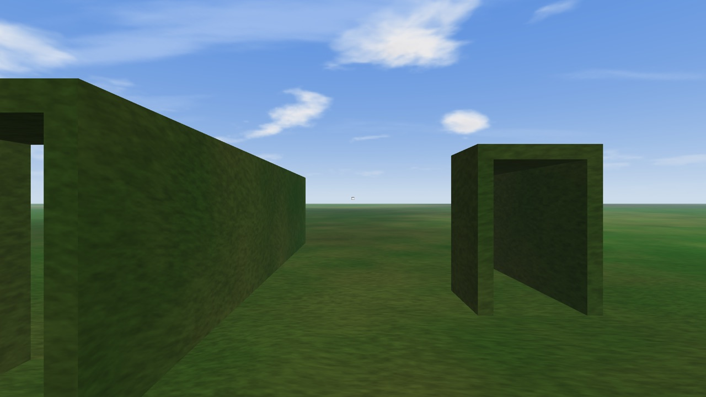
*Escena 0, Tunnels: los túneles que se enlazan consigo mismos, del original de CodeParade.*

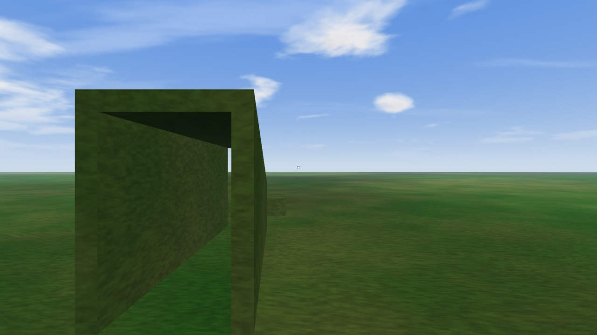
*Escena 5, Scaling Tunnel: recorrerlo cambia tu escala.*

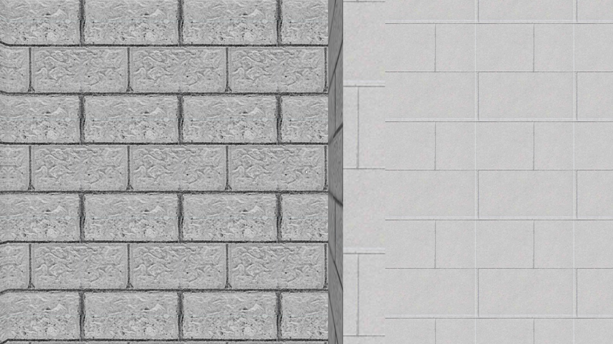
*Escena 6, Floorplan: una planta infinita.*

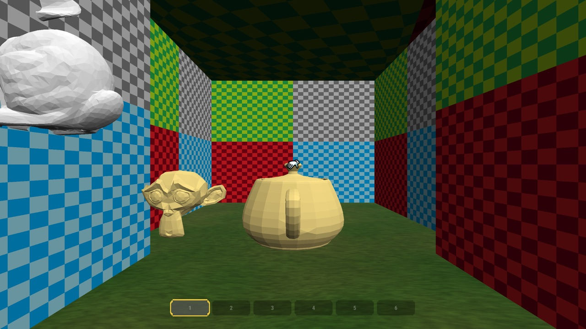
*Escena 7, Perspective Gallery: el laboratorio de la perspectiva forzada.*


*Escena 8, Penrose Ascent: cuatro pasillos descendentes cerrados en ciclo.*

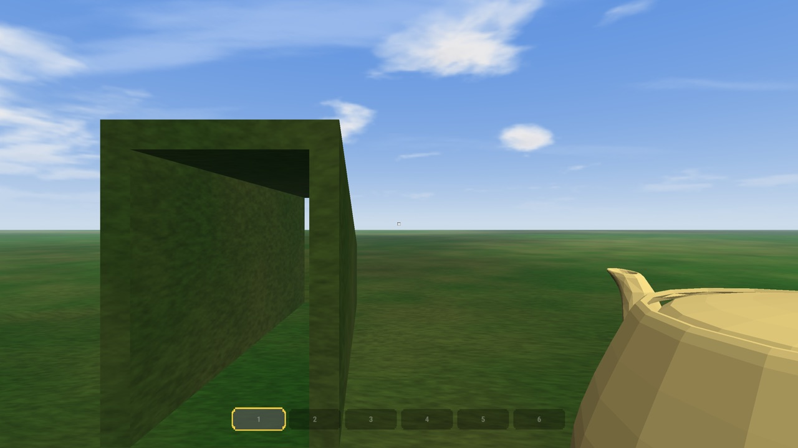
*Escena 9, Compound: agarre y portal de escalado multiplicándose.*


*Escena 10, Unobserved: estatuas que solo se mueven cuando no las miras.*


*Escena 11, Anamorphic Chamber: doce fragmentos que solo forman un anillo desde un punto.*


*Escena 13, Relativity: la Relatividad de Escher, con las escaleras convertidas en rampas.*

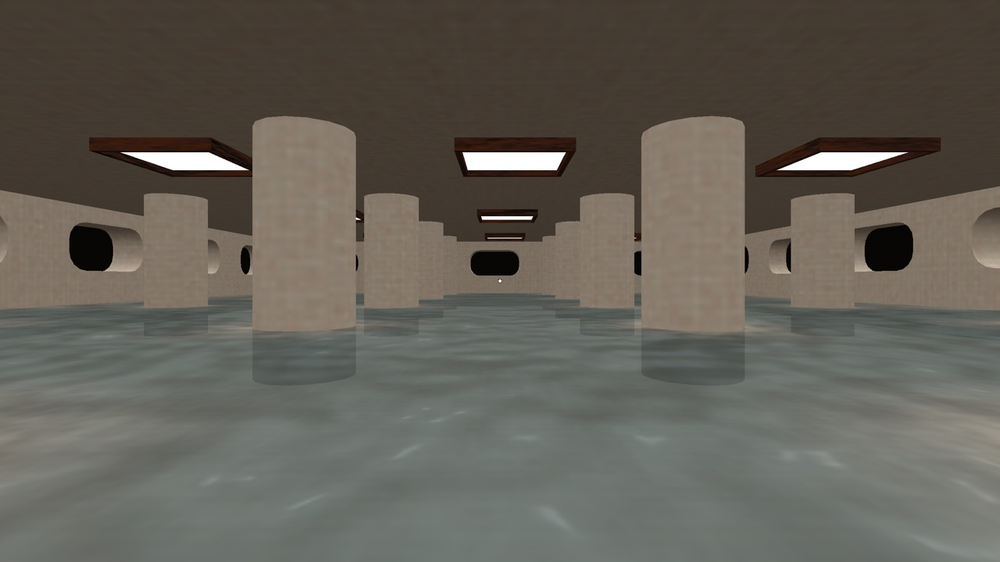
*Escena 17, Pool Rooms: el vadeo real sobre azulejo blanco.*

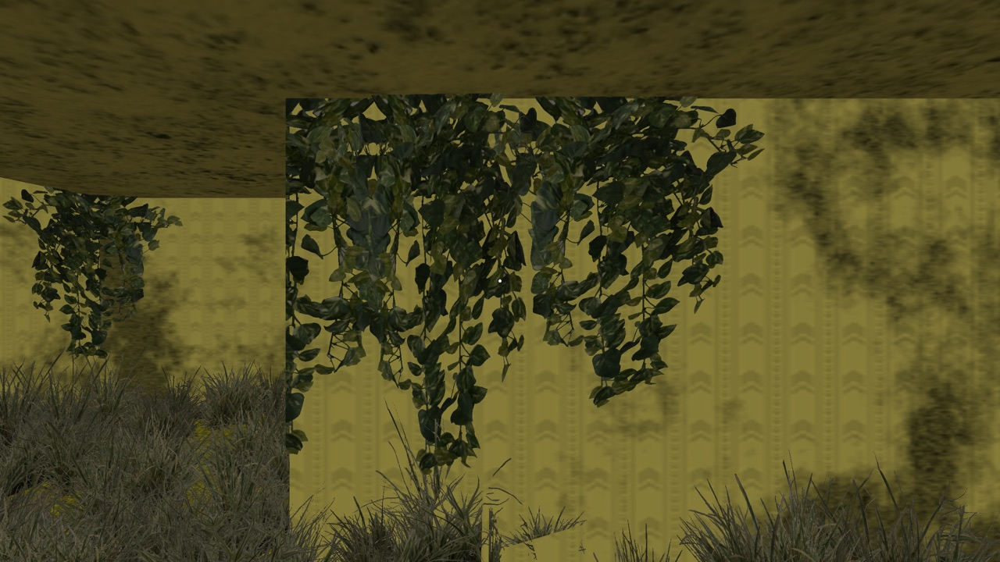
*Escena 18, Overgrown: la oficina comida por la maleza.*


**[IMPLEMENTADO]** El registro vive en `src/ext/scenes.rs`: una sola tabla `SCENES` de `SceneEntry { name, make }`. `Engine` construye su vector desde ahí, el menú SWITCH LEVEL lee los nombres de ahí, y `--scene N` valida `N` contra su longitud. Agregar una escena es agregar una fila; no hay nada más que tocar.

El índice de la tabla es el que consume `--scene` (base 0, rango `0..=18`). Las escenas 0-6 son el port de CodeParade y están intactas; las 7-18 son nuevas (`src/level7.rs` .. `src/level18.rs`).

| # | Nombre | Origen | Idea central | Mecánica que exhibe | Estado | Rol |
|---|--------|--------|--------------|---------------------|--------|-----|
| 0 | Tunnels | Port CodeParade | Túneles enlazados por portales | Portal básico | Demostración | Pruebas |
| 1 | Three Rooms | Port CodeParade | Tres casas que son una sola | Portales en cuatro puertas | Demostración | Pruebas |
| 2 | Six Rooms | Port CodeParade | Dos casas y seis cuartos en un circuito de tres portales | La casa imposible llevada al doble (ver 3.3) | Demostración | Pruebas |
| 3 | Pillar Rooms | Port CodeParade | Tres salas a 200 u que parecen contiguas | Portales + separación espacial | Demostración | Pruebas |
| 4 | Sloped Tunnel | Port CodeParade | Túnel en pendiente | Rampa + portal (la referencia de "sin escaleras") | Demostración | Pruebas |
| 5 | Scaling Tunnel | Port CodeParade | Atravesar el túnel te cambia de tamaño | Portal de escalado (`p_scale` del jugador) | Demostración | Pruebas |
| 6 | Floorplan | Port CodeParade | Planta imposible de 85 colisionadores | Muchos portales en una planta | Demostración | Pruebas / benchmark |
| 7 | Perspective Gallery | Nueva | Dónde sueltas algo decide su tamaño real | Agarre por perspectiva forzada (`ext/grab.rs`) | Caja de arena | Pruebas |
| 8 | Penrose Ascent | Nueva | Cuatro rampas descendentes en ciclo cerrado | Topología imposible sin trucos de cámara | Caja de arena | Pruebas |
| 9 | Compound | Nueva | Perspectiva y portal de escalado se multiplican | `p_scale` como escala física compuesta | Caja de arena | Pruebas |
| 10 | Unobserved | Nueva | Las estatuas solo avanzan si no las miras | `ext/visibility.rs` (cono de visión + raycast) | Caja de arena | Pruebas |
| 11 | Anamorphic Chamber | Nueva | 12 fragmentos que forman un anillo desde un punto | Anamorfosis por punto de estación | Caja de arena | Pruebas |
| 12 | The Painted Cube | Nueva | Una calcomanía plana que se vuelve un cubo real | Anamorfosis + objeto sin malla pero agarrable | Caja de arena | Pruebas |
| 13 | Relativity | Nueva | Escultura de 660k triángulos, caminable | Malla ajena convertida en cáscara de colisión (`c` lines) | Jugable | Pruebas |
| 14 | Meadow | Nueva | Colinas, pasto y cúmulos | Terreno + campo de pasto + cielo horneado | Caja de arena | Pruebas / vitrina técnica |
| 15 | Intro | Nueva | Prado gris, puerta blanca, mar en atardecer | Dos climas en una escena (`MOOD_SPLIT_X`) | Jugable | Fondo del título (`scenes::TITLE`) |
| 16 | Backrooms | Nueva | La misma puerta abre a una oficina escaneada | Colisión de malla, retratos, llave, ventana, ascensor | Jugable | **Campaña, escena inicial (`scenes::INTRO`)** |
| 17 | Pool Rooms | Nueva | Nave de azulejo inundada a 0.78 m | Agua translúcida vadeable, interior glTF completo | Jugable | Campaña, `FLOORS[1]` |
| 18 | Overgrown | Nueva | Laberinto de papel tapiz tomado por la vegetación | Follaje alfa que no colisiona, `metallic_override` | Jugable | Campaña, `FLOORS[2]` |

Honestidad sobre el estado: de 19 escenas, **tres forman la campaña** (16, 17, 18, enlazadas por `elevator::FLOORS`), **una es el fondo del título** (15) y **quince son escaparates de una idea o del port original**. Ninguna de las cajas de arena tiene entrada, salida ni objetivo; se entra por el selector de nivel o por `--scene`.


*POS -8.85, 1.50, -8.91 con yaw -92.2 es casi exactamente el punto y el rumbo de `window::PARTNER` (-8.86, 0, -9.3, mirando +x): esto es lo que se ve al salir por la ventana, con el muro del laberinto pegado a la derecha, la hiedra sobre el tabique de enfrente y el musgo y los pastos — cartas con alfa que no colisionan — cubriendo el piso hasta el zócalo.*

#### 7.1.1 Overgrown (escena 18): las dos entradas y el punto de llegada — **[IMPLEMENTADO]**

Overgrown es el único nivel del juego con **dos entradas distintas**, y la captura está tomada en
la segunda:

| Entrada | Dónde | Rumbo de llegada |
|---|---|---|
| Ascensor (`FLOORS[2]`) | muro sur exterior, z = +10.01 mirando −z; el único tramo de 4.5 m de muro con 4 m de piso libre delante que no es puerta | mira −z hacia el laberinto: es el rumbo por defecto, y por eso el modelo **no se rota**, solo se desplaza para que el punto de llegada sea el origen |
| Ventana (`ext/window.rs`) | cara interior del muro oeste (x = −9.11), gemelo en `PARTNER` (−8.86, 0, −9.3) | mira +x hacia adentro de la sala (`PARTNER_FACING`) |

La POS de la figura (−8.85, 1.50, −8.91) con yaw −92.2 es ese segundo punto: **lo que ve el
jugador el instante después de cruzar la ventana**. Tres decisiones de diseño se leen ahí mismo:

* **El gemelo cuelga a la altura de la ventana, no a una altura fija.** `place_portals` le copia el
  `pos.y` del marco. Así, un ojo que entra a cierta altura por encima del centro del marco sale a
  esa misma altura por encima del centro del gemelo, y nadie aparece dentro del piso ni del techo.
  Ese techo de 2.43 m es, a su vez, lo que recorta la ventana en 7.2× (ver 4.3.1).
* **El gemelo está a un cuarto de metro del muro, no a un par de centímetros.** El jugador llega un
  pelo pasado el plano; una esfera de cabeza que empezara el paso dentro del muro sería expulsada
  de un tirón, y la transición lo mostraría. El hueco no lo ve nadie: el pase anidado que dibuja la
  copia está recortado al plano de la abertura y el muro queda detrás de ese plano.
* **El sitio se eligió por despeje y hay un test que lo mide.** Un muro del laberinto a 1.5 m hacia
  +z —el que domina el lado derecho de la figura— y la sala abriéndose 5.8 m adelante: un vano de
  tamaño de puerta queda libre de todo salvo del muro donde cuelga (`level16.rs` lo comprueba).

La figura también documenta dos reglas de render del nivel que el catálogo enuncia pero no muestra:
**todo lo verde son cartas con alfa que no colisionan** (`GltfModel::solid_triangles` las excluye,
así que el musgo, los pastos y los arbustos se atraviesan caminando y ninguna carta acostada puede
hacerse pasar por piso), y **los arbustos vienen con la metalicidad 1.0 por omisión del glTF**: sin
`Load::metallic_override` se dibujarían como metal oscuro en vez de la hoja mate que se ve. El piso
es un único quad de musgo de 20 m a y = 0 y no hay escaleras: la sala entera es alcanzable.

**Deuda del punto de llegada.** **[PARCIAL]** La salida no sigue a la ventana en planta: el gemelo
copia altura y escala, pero su x y su z son la constante `PARTNER`. Colgar el marco en otro punto
del hall no cambia dónde se sale. Hacer que la siguiera exigiría una regla de correspondencia entre
las dos plantas y un chequeo de que el destino no cae dentro de un muro del laberinto —hoy el sitio
es una constante elegida a mano y respaldada por un test.

### 7.2 Anatomía de un nivel de DayDreams

**[PROPUESTA]** Ninguna escena actual cumple esta estructura completa; es el contrato que las fichas de 6.6 asumen. Presupuesto para un nivel de 8 minutos:

| Parte | Qué hace | Presupuesto | Regla de oro |
|-------|----------|-------------|--------------|
| **Llegada** | El jugador aparece parado, mirando el nivel de frente. Ya existe: `interior::arrival` lo deja a `SPAWN_AHEAD` = 1.5 m de la puerta del ascensor, mirando `-z`. | 15-30 s | Nada se mueve ni pide nada durante los primeros 5 s. |
| **Lectura del espacio** | El jugador recorre y aprende dónde están las superficies, la profundidad y la salida. La profundidad es el recurso: sin fondo largo no hay perspectiva forzada. | 1.5-2 min | La salida debe verse desde la llegada, aunque sea inalcanzable. |
| **El problema** | Una sola pregunta. Un nivel = una pregunta. Los sub-pasos son variaciones, no preguntas nuevas. | 3-4 min | Si el jugador necesita dos mecánicas nuevas, son dos niveles. |
| **La verificación** | El momento en que el jugador comprueba que entendió: suelta el objeto y encaja, se para en el punto y la figura cierra, la ventana crece hasta ser puerta. | 30-60 s | Debe ser reversible: fallar no puede costar el nivel. |
| **La salida** | Cabina del ascensor, puerta con portal, o ventana agrandada. Siempre visible y siempre de una sola dirección. | 30-45 s | Una salida por nivel. Un solo `Elevator` por escena (los canales de `ext/elevator.rs` son "último que escribe gana"). |

### 7.3 Cómo se construye un nivel HOY, paso a paso

**[IMPLEMENTADO]** Existen exactamente dos rutas en el código. Ambas implementan `Scene::load(gl, res, objs, portals, player)`.

#### Ruta (a): geometría del motor

1. Modelar en `.obj` y anotar la colisión con líneas `c` dentro del mismo archivo. `mesh.rs` (línea 240 en adelante) acepta `c a b c` con índices de vértice, o `c *` que toma los tres últimos vértices declarados. Cada línea produce un `Collider` rectangular (`src/collider.rs`). Referencias reales: `tunnel.obj` 10 colisionadores, `square_rooms.obj` 33, `floorplan.obj` 85, `escher_relativity.obj` más de 300 (generados por `tools/gen_walkable.py`).
2. Instanciar props con `crate::props` (`ground`, `tunnel`, `pillar`, `pillar_room`, `house`, `floorplan`, `statue`) y empujarlos a `objs`.
3. Crear portales con `Portal::new`, colocarlos y enlazarlos con `portal::connect(&a, &b)`. Un portal de escalado sale de la diferencia de escala entre los dos extremos (`level5.rs`, `level9.rs`).
4. Objetos agarrables: `Grabbable::new(radius)`, con `mesh`, `shader "texture"`, `texture` y `scale`; luego `g.base.set_position(pos)`.
5. Registrar en `src/ext/scenes.rs`.

#### Ruta (b): escaneo glTF/GLB con `interior::load`

Es la ruta de los niveles 17 y 18, y la más barata: un nivel es un `Load`, una colocación y un puñado de constantes medidas del archivo.

1. Inspeccionar el archivo: `cargo run --release --example glb_probe -- PATH`, y `daydreams --windowed --view-glb PATH --shot out.bmp` para verlo.
2. Escribir el `Load`: `path`, `parts` (`PartSpec { name, roots, skip, frame: Frame::Scene, anchor: Anchor::Hinge }`), `fit: Fit::Identity` (metros y origen del archivo), `max_map` (1024 en ambos niveles: nada se remuestrea), `translucent` (en Pool Rooms, `"Water.002"`), `metallic_override` (en Overgrown, `Bush_*`, `Grass_*` y `Thick_Moss` a 0.0, porque glTF lee la ausencia de `metallicFactor` como metal puro) y `cut_boxes`.
3. Medir a mano dónde está el piso (`FLOOR_Y`), la cara interna del muro que va a alojar el ascensor y el tramo libre frente a él. Escribir `placement()`: un `Object` con `euler.y` para girar el modelo y `pos` calculado de modo que **el punto de llegada caiga en el origen del mundo con el piso en y = 0 y el jugador mirando -z**. Así `--yaw 0` sigue significando "de frente" en todos los niveles.
4. La colisión es la malla de triángulos de las caras **sólidas** únicamente (`GltfModel::solid_triangles`): el agua se vadea y el follaje se atraviesa.
5. `interior::load` agrega, además del modelo: una valla invisible a `FENCE_MARGIN` = 1.0 m del contorno, una tapa de suelo oscura (`backrooms::GroundCap`) y un `RoomLogic` de respawn por caída — necesario porque los muros de un escaneo son de una sola cara y una esfera atrapada dentro de un tabique sale por el lado donde está su centro, que puede ser el lado sin piso.

#### El fragmento real: cómo un nivel agrega un ascensor

De `src/level17.rs` (Pool Rooms); `src/level18.rs` es idéntico salvo constantes.

```rust
let arrived = elevator::take_arrival();
let lift = Elevator::new(gl, res, ELEVATOR_SPOT, ELEVATOR_YAW, arrived);
let openings = Openings { cut: &[lift.wall_cut()], also_inside: &[lift.world_bounds()] };
let arrival = interior::arrival(ELEVATOR_SPOT, ELEVATOR_YAW);
interior::load(gl, res, objs, player, &load_spec(), &placement(), openings, 0.0, arrival);
if arrived.is_some() {
    lift.board(player);
}
objs.push(Rc::new(RefCell::new(lift.doors())) as Rc<RefCell<dyn ObjectT>>);
objs.push(Rc::new(RefCell::new(lift)) as Rc<RefCell<dyn ObjectT>>);
```

Línea por línea:

| Línea | Qué hace |
|-------|----------|
| `elevator::take_arrival()` | Consume el canal ambiente que dejó el viaje anterior. `Some(Arrival)` significa "te trajo el ascensor": pantalla en negro y puertas cerradas. `None` significa carga directa (menú o `--scene`) y las puertas arrancan abiertas. |
| `Elevator::new(gl, res, ELEVATOR_SPOT, ELEVATOR_YAW, arrived)` | Planta la cabina con el centro de su umbral en `ELEVATOR_SPOT` — a nivel de piso, sobre la cara externa de la losa — mirando en el yaw dado. En ambos niveles `ELEVATOR_SPOT` es `(0, 0, 1.5)` y `ELEVATOR_YAW` es `pi`. |
| `lift.wall_cut()` | Caja en coordenadas de mundo que el modelo anfitrión debe perder: todo lo que hay detrás de la cara de la losa y que ocupa el ascensor. Sin este recorte, los triángulos del muro se dibujarían a 3 cm delante de las hojas y frenarían al jugador en el umbral. |
| `lift.world_bounds()` | Contorno completo de la cabina, que la valla debe **incluir**: la cabina se hunde en el muro y sobresale por fuera del edificio. |
| `interior::arrival(ELEVATOR_SPOT, ELEVATOR_YAW)` | Deriva el punto de aparición del ascensor en vez de escribirlo aparte, para que spawn y ascensor no puedan desalinearse. |
| `interior::load(..., openings, 0.0, arrival)` | Carga el modelo con los recortes aplicados **durante el parseo** (`Load::cut_boxes`), fija el piso en `0.0`, y para al jugador en `arrival`. El orden importa: **el ascensor se construye antes que el modelo**, porque la caja tiene que ser conocida cuando el glTF se parsea. |
| `lift.board(player)` | Solo si llegó en ascensor: mete al jugador al centro de la cabina, mirando las puertas, con velocidad en cero. |
| `lift.doors()` | Colisionador de las hojas, empujado como objeto aparte: solo bloquea mientras la apertura está por debajo de 0.5. |

#### `ext/carve.rs`: la herramienta que permite meter puertas en escaneos ajenos

**[IMPLEMENTADO]** Es lo que hace posible la ruta (b) con modelos de terceros. `clip_outside_box` recorta una caja alineada a los ejes de una sopa de triángulos: un triángulo es un polígono convexo, y un polígono convexo cortado por un plano da dos polígonos convexos, así que las seis caras de la caja se aplican en cadena — cada una desprende la parte de afuera y pasa la de adentro a la siguiente. Lo que sigue adentro después de la sexta cara se descarta. `clear_of_box` es el atajo: si el triángulo queda entero fuera en algún eje, se conserva sin tocar.

Dos detalles que importan al diseñar:

- El recorte es **genérico sobre el vértice**. La sopa de colisión son solo posiciones; la malla dibujada lleva UV, normal y tangente, y un vértice creado sobre una arista cortada las interpola (`lerp`), o la textura se rompería en el corte.
- Se aplica **al parsear**, no después, así que el mismo triángulo desaparece de lo que se dibuja y de lo que colisiona. No hay forma de que uno y otro se desincronicen.

En la práctica: para meter una puerta, un ascensor o un pasadizo en un escaneo que no lo tiene, se declara la caja del hueco en `Load::cut_boxes` y se tapa el borde con geometría propia que sobresalga (`elevator::PROUD` = 0.03 m) para que las dos superficies nunca sean coplanares.

### 7.4 Reglas duras del motor (no hagas esto)

**[IMPLEMENTADO]** Cada una es una limitación real del código, no una preferencia de estilo.

| No hagas | Por qué | Qué hacer en su lugar |
|----------|---------|-----------------------|
| Portales en piso o techo, inclinados o rolados | `Physical::try_portal` solo reescribe `euler.y` al teletransportar; el jugador saldría desorientado. Quedan descartados los corredores tipo Klein y los giros de gravedad estilo Manifold Garden | Portales verticales únicamente. La gravedad **por objeto** sí es un `Vector3` arbitrario |
| Escaleras | La esfera del pie se detiene en cada contrahuella | Rampas. `level13.rs` desdibuja cada tramo de escalera de Relativity en una pendiente, con la contrahuella implícita en ~0.17 m |
| Puzles que exijan apilar props | No hay colisión objeto contra objeto en la ruta portada: los props colisionan con la geometría del nivel, no entre sí | Los cuerpos rígidos de `ext/physics.rs` sí chocan entre ellos, pero con nada de la ruta portada salvo el cilindro del jugador |
| Pararse sobre un prop | Ese cilindro es **cinemático**: el jugador empuja, nada lo empuja a él. Saltar sobre el dado lo atraviesa | Usar geometría del nivel para toda plataforma |
| Confiar en que un muro de escaneo tiene dos caras | Son quads de una sola cara. Una esfera atrapada dentro sale por el lado de su centro, y ese lado puede no tener piso | Valla + `fell_out` respawn, que `interior::load` ya arma |
| Dos ascensores en una escena | Los canales de `ext/elevator.rs` son ambientes y gana el último que escribe: el segundo borraría el hint y el fade del primero cada paso | Un `Elevator` por escena. Para dos haría falta antes una regla de mezcla |
| Un `p_scale` de 0 | No tiene inverso y deforma el portal con NaN | Los agarres se acotan a `MIN_P_SCALE` = 0.05 y `MAX_P_SCALE` = 25.0 |

### 7.5 Plantilla de ficha de nivel (en blanco)

**[PROPUESTA]** Copiar tal cual por nivel nuevo.

```
NOMBRE:            (nombre de registro, en inglés, único en SCENES)
ARCHIVO:           src/levelNN.rs
ACTO:              0 / I / II / III / IV  (nombres canónicos en 4.5)
DURACIÓN OBJETIVO: N min (llegada / lectura / problema / verificación / salida)
RUTA DE CONSTRUCCIÓN: (a) geometría del motor  |  (b) escaneo glTF con interior::load
MECÁNICAS:         (una principal, cero o una de refuerzo ya enseñada)
PROPS NECESARIOS:  (malla, textura, radio de agarre, si es cuerpo rígido)
ASSETS:            (archivos nuevos, licencia y crédito en THIRD_PARTY.md)
AUDIO:             (superficie de pasos ext/audio.rs; eventos)
HITOS DE PUESTA EN ESCENA:
  1. ...
  2. ...
CRITERIOS DE TERMINADO:
  [ ] Registrado en src/ext/scenes.rs
  [ ] Test que mide del archivo las constantes de colocación
  [ ] Llegada en el origen, piso en y = 0, mirando -z
  [ ] Salida alcanzable sin apilar, sin escaleras, sin portal horizontal
  [ ] Coste por frame dentro del techo (ver 7.8)
COMANDOS DE CAPTURA:
  daydreams --windowed --mute --no-gamepad --no-vsync --scene NN --shot a.bmp --frames 120
  daydreams --windowed --mute --no-gamepad --scene NN --arrive --frames 300 --shot llegada.bmp
```

### 7.6 [PROPUESTA] Seis fichas de nivel completas

Todas construibles con lo que el motor ya hace. Ninguna existe en el build.

---

**1. NOMBRE: Loading Bay** — `src/level19.rs` — **Acto I, La invitación** — 5 min — **Ruta (a)**
**Mecánicas:** agarre por perspectiva forzada, solo y sin adornos.
**Props:** tres cajas (`Grabbable`, radio del mesh × 0.8), `ground.obj`, cuatro `pillar.obj` en retroceso.
**Assets:** ninguno nuevo. **Audio:** `Surface::Tile`.
**Hitos:** (1) al llegar, la puerta de salida se ve al fondo, de 2.1 m, y la única caja disponible es más alta que ella; (2) el jugador levanta la caja cerca y la suelta contra el muro cercano: encoge y ya pasa; (3) si la suelta en el pilar lejano crece un orden de magnitud y bloquea el pasillo — error reversible, se vuelve a levantar.
**Terminado:** la solución no requiere apilar; la caja grande no puede quedar atascada de forma irrecuperable.
**Captura:** `--scene 19 --pos 0,1.5,12 --yaw 0 --e-at 60,300 --frames 400 --shot bay.bmp`

---

**2. NOMBRE: The Long Side** — `src/level20.rs` — **Acto I, La invitación** (cierre del acto) — 8 min — **Ruta (a)**
**Mecánicas:** agarre por perspectiva forzada **× portal de escalado** — las dos se multiplican porque `p_scale` es escala física real; es lo que la escena `Compound` ya demuestra en caja de arena.
**Props:** tetera y cubo agarrables a ambos lados de la frontera de tamaño; geometría de la escena `Scaling Tunnel` (5): túnel de escalado + `ground`.
**Assets:** ninguno nuevo. **Audio:** `Surface::Tile`.
**Hitos:** (1) del lado grande, una ranura minúscula en el muro es la salida; (2) el jugador toma la tetera de cerca (ya pequeña), la lleva por el túnel que vuelve a multiplicar su `p_scale`, y la suelta pegada al muro del lado largo, donde la perspectiva la multiplica por tercera vez; (3) la tetera resultante es la llave física de la ranura.
**Terminado:** el objeto compuesto pesa, camina y colisiona a su tamaño nuevo, no solo se ve grande.
**Captura:** `--scene 20 --pos 0,1.5,20 --yaw 0 --e-at 60,900 --frames 1200 --shot compound.bmp`

---

**3. NOMBRE: The Long Gallery** — `src/level21.rs` — **Acto I, La invitación** — 9 min — **Ruta (b)**, sobre el escaneo de Backrooms
**Mecánicas:** **retratos que observan** (`ext/painting.rs`) + llave anamórfica (`ext/key.rs`).
**Props:** ocho retratos de 0.8 m de ancho, centro a 1.6 m, 2 cm despegados de la cara del muro; una ventana cerrada con llave (`ext/window.rs`).
**Assets:** atlas de retratos ya existente (`tools/gen_portraits.py`); ningún archivo nuevo. **Audio:** `Surface::Carpet`.
**Hitos:** (1) los ojos siguen al jugador y las caras solo cambian de gesto mientras nadie mira — el jugador aprende que la sala reacciona a su atención; (2) uno de los ocho lleva la llave pintada, visible solo desde su punto de estación; (3) la llave sale del lienzo en 0.5 s y abre la ventana, que agrandada por el agarre se convierte en la salida.
**Terminado:** los ocho retratos no suben el coste por frame de forma medible (referencia real: 1.22 ms contra 1.19 ms con el shader procedural anterior, ruido).
**Captura:** `--scene 21 --pos 994.4,1.5,1.55 --yaw=-100.4 --pitch=-1.3 --e-at 3000 --frames 3200 --shot take.bmp`

---

**4. NOMBRE: The Deep End** — `src/level22.rs` — **Acto II, El edificio tiene pisos** — 7 min — **Ruta (b)**, sobre `level_37_flooded_tiled_complex.glb`
**Mecánicas:** vadeo (línea de agua a 0.78 m, ojo a 1.5 m) + agarre por perspectiva forzada contra 31 m de nave despejada.
**Props:** dos objetos flotantes agarrables; el ascensor en la cara interna del muro oeste.
**Assets:** modelo ya en el repositorio (CC-BY-4.0, crédito en `THIRD_PARTY.md`). **Audio:** `Surface::Tile(&[(0.0, 0.78), (4.2, 4.54)])` — chapoteo por debajo de la línea de agua.
**Hitos:** (1) la escalera de caracol al sur-oeste se ve y **no** es usable, y el nivel lo dice visualmente antes de que el jugador lo intente; (2) el problema se resuelve a lo largo de la nave, usando las hileras de pilares en malla de 6 m como referencia de profundidad; (3) el ventanal sobre el ascensor es la única fuente de luz exterior.
**Terminado:** ningún camino previsto pasa por escalera; el agua no colisiona (solo los sólidos lo hacen).
**Captura:** `--scene 22 --pos 0,1.5,3 --yaw 180 --forward --frames 240 --shot wade.bmp`

---

**5. NOMBRE: Nobody Watching** — `src/level23.rs` — **Acto III, Los pisos que no caben** — 8 min — **Ruta (b)**, sobre `backrooms_room_with_plants_overgrown.glb`
**Mecánicas:** geometría dependiente de la observación (`ext/visibility.rs`) dentro de un laberinto de 20 × 20 m con techo a 2.43 m.
**Props:** cuatro estatuas con `RoomLogic` de avance (referencia: `CREEP_SPEED` 0.0012 u por paso fijo, `STOP_DIST` 1.5 m).
**Assets:** modelo y estatuas ya en el repositorio. **Audio:** `Surface::Grass`.
**Hitos:** (1) el laberinto da esquinas: la cobertura es real, porque el segundo test es un raycast de línea de vista y una estatua tapada por un muro avanza aunque esté "al frente"; (2) el jugador debe cruzar el laberinto sin dar la espalda dos veces al mismo corredor; (3) los carteles EXIT rojos marcan las dos puertas selladas, y el ascensor del muro sur es la salida real.
**Terminado:** el follaje no colisiona; ninguna estatua puede acorralar al jugador contra la valla.
**Captura:** `--scene 23 --pos 0,1.5,3 --yaw 0 --frames 600 --shot creep.bmp`

---

**6. NOMBRE: The Way Back** — `src/level24.rs` — **Acto IV, El noveno marco** — 6 min — **Ruta (a)** + `ext/meadow.rs`
**Mecánicas:** puerta con portal de una sola dirección + agarre por perspectiva forzada como último gesto.
**Nota narrativa:** este prado es el que se ve **dentro del Noveno Marco** (5.10, capítulo 6), no un regreso caminando al acto 0. El jugador nunca vuelve al prado por su propio pie.
**Props:** la puerta blanca compartida (`meadow::door_with_portal`), un objeto que el jugador ha cargado desde el acto I.
**Assets:** ninguno nuevo. **Audio:** `Surface::SplitX { at: MOOD_SPLIT_X, west: Grass, east: ... }`.
**Hitos:** (1) el mundo lejano se construye en torno a `meadow::FAR` = `(1000, 0, 0)`, con su propio clima gracias al `mood` por cámara de pase; (2) el jugador debe agrandar el objeto que trae para poder trancar la puerta abierta; (3) al primer paso pasado el split, ambas puertas y ambos portales desaparecen (`DoorLink::vanish`, `room::request_remove_portals`) — el nivel se cierra detrás.
**Terminado:** la desaparición no deja un agujero en el aire; el prado sigue cargado y se sigue dibujando para el título.
**Captura:** `--scene 24 --pos 0,1.5,4 --yaw 0 --forward --frames 240 --shot cross.bmp`

### 7.7 Herramientas de nivel disponibles

**[IMPLEMENTADO]** Verificado contra `src/app/cli.rs`. Los marcados como ocultos no salen en `--help` pero funcionan. Los que dicen "con `--scene`" son error de uso sin él.

| Flag | Para qué sirve en el trabajo diario |
|------|-------------------------------------|
| `--scene <N>` | Saltar el título y cargar la escena N (base 0). `--scene 99` es error de uso con el rango en el mensaje |
| `--shot <FILE>` | Escribir captura y salir. Solo, sin `--scene`, fotografía la pantalla de título |
| `--frames <K>` | Frames antes de la captura; por defecto **90**. Subirlo para que la física se asiente |
| `--pos <X,Y,Z>` | Parar al jugador en un punto exacto. Tres componentes o error |
| `--yaw <DEG>` / `--pitch <DEG>` | Apuntar la cámara. Aceptan negativos (`--yaw=-100.4`) |
| `--forward` / `--strafe` / `--sprint` | Mantener W / A / Shift todo el run. Sirve para medir distancia recorrida en el `[shot]` |
| `--jump-at <FRAME>` | Un salto en el frame N (Space sostenido 30 frames). Con `--log-level debug` imprime `[jump] launched`/`landed` con posición |
| `--arrive` | Cargar la escena como la entregaría el ascensor: puertas cerradas, pantalla negra, dentro de la cabina. Fotografiar la llegada |
| `--ride-at <FRAME>` | Pulsar E una vez en el frame N, solo como viaje de ascensor. Con suficientes `--frames` después, el `[load]` y la captura muestran el piso destino |
| `--e-at <FRAMES>` | Pulsar E como lo haría el teclado, en lista (`--e-at 200,900`): agarrar, usar la llave, agarrar otra vez |
| `--stow-at <FRAMES>` | Pulsar F: guardar lo que está en la mano o sacar la ranura seleccionada |
| `--drop-at <FRAMES>` | Pulsar G: dejar el objeto de la ranura frente al jugador. Muestra que su cuerpo rígido volvió a estar vivo |
| `--slot-at <SLOT@FRAME>` | Pulsar la fila numérica (`--slot-at 3@120,1@240`). Ranuras desde 1 hasta `inventory::CAPACITY` = 6 |
| `--wheel-at <FRAMES>` | Girar la rueda un paso hacia el jugador: única forma de mover la selección sin ratón |
| `--hold-key` | Empezar con la llave del cuadro ya en la mano, sin la caminata al punto de estación |
| `--window-scale <S>` | Construir la ventana de Backrooms a esa escala física (dentro de 0.05..=25), para fotografiarla del tamaño de una puerta sin agarrarla |
| `--unlock-window` | Construir la ventana ya desbloqueada |
| `--drop-props <H>` | Levantar todos los props de cuerpo rígido H metros al cargar, y ver dónde caen en las líneas `[prop]` |
| `--view-glb <PATH>` | Abrir una escena con un solo modelo glTF, a su escala, bajo luz de interior. Incompatible con `--scene` |
| `--view-translucent <NAMES>` | Con el anterior: materiales a dibujar translúcidos en vez de alfa-test |
| `--windowed` | Ventana de 1280×720. **Obligatorio en runs automatizados**: pantalla completa roba el foco |
| `--mute` | Silencio para este run (o `DAYDREAMS_MUTE=1`). No toca el archivo de ajustes |
| `--no-gamepad` | Ignorar mandos: un stick con deriva sobre el escritorio inyecta look y arruina la reproducibilidad |
| `--no-vsync` | Swap interval 0, para que el `[shot]` mida el renderer y no el panel |
| `--assets <DIR>` / `--log-level <LEVEL>` / `--no-log-file` | Raíz de assets (o `DAYDREAMS_ASSETS`), nivel de log (o `DAYDREAMS_LOG`, por defecto `info`), y log solo a terminal |
| `gen-terrain` | Subcomando: regenerar `Meshes/meadow_tile.obj` desde `ext::terrain::height` y salir |

Las líneas `[shot]`, `[load]` y `[grass]` son de nivel **info**: `--log-level warn` las oculta y las herramientas que las buscan dejan de funcionar.

### 7.8 Presupuesto de rendimiento por nivel

**[IMPLEMENTADO]** Cifras reales del README. Dos bancos distintos, no comparables entre sí.

Banco A — M3 Max a 3456×2168, `--no-vsync`, promedio de 590 frames tras asentar:

| Medición | Coste |
|----------|-------|
| Frame de pantalla de título (escena 15) | **2.28 ms** (p95 3.6) |
| Spawn del prado mirando la puerta (portal a la vista) | **1.77 ms** |
| Spawn del prado de espaldas (sin portal a la vista) | **1.13 ms** |
| Six Rooms (portales anidados, el peor caso del port) | **1.12 ms** |
| Un portal a la vista, cualquiera sea su contenido | **~0.9 ms** |
| Carga de escena (`Engine::load_scene`) | **34 ms** |
| Recarga (título → NEW GAME / MAIN MENU / RESTART) | **< 1 ms** |
| Arranque del proceso al primer frame | **0.62 s** |
| Residente pico | **269 MB** |

Banco B — M3 Max compartido a 2560×1440 con `glFinish` por frame (números pesimistas a propósito):

| Medición | Coste |
|----------|-------|
| Spawn del prado en Intro | **8.1 ms** |
| Mismo spawn en Backrooms (el portal ya dibuja la nave) | **8.6 ms** |
| De pie en la nave, mirando a lo largo | **6.1 ms** |
| Mirando de vuelta a la puerta (el portal dibuja el prado) | **8.0 ms** |
| Nave con la ventana a la vista (sin vsync, 600 frames) | **1.9-2.0 ms** |
| Misma nave con la ventana fuera de vista | **0.9-1.0 ms** |
| Fila de ocho retratos | **1.22 ms** (contra 1.19 del shader procedural: ruido) |
| Carga de Backrooms con la copia de Overgrown | **255 ms** (desde 165) |
| Cruce por la ventana, con el modelo compartido | **2 ms** |

**Techo para un nivel nuevo:**

| Métrica | Techo | Por qué |
|---------|-------|---------|
| Frame, banco A, sin portal a la vista | **≤ 2.0 ms** | Deja margen sobre el 1.13 ms del prado, que ya es la escena más pesada del juego |
| Frame, banco A, con portal a la vista | **≤ 3.0 ms** | Un portal a la vista cuesta ~0.9 ms fijos por el cambio de render target |
| Portales visibles simultáneamente | **≤ 2** | Cada uno es un pase anidado con su propio framebuffer por nivel de recursión |
| Carga de escena (`[load] scene N in M ms`) | **≤ 300 ms** | Backrooms con su copia de Overgrown está en 255 ms y es el máximo aceptado hoy |
| Triángulos sólidos de colisión | **≤ 70k** | Lo que pesa el escaneo de Backrooms; por encima, hay que generar cáscara como `tools/gen_walkable.py` |
| Mapas por material | **≤ 1024²** | Ambos interiores lo cumplen y nada se remuestrea al cargar |

Regla de aceptación: un nivel se mide con `--no-vsync --frames 600 --shot` en al menos cuatro yaws (0, 90, 180, 270) desde el punto de llegada, y el peor de los cuatro es el número que cuenta.

### 7.9 Métricas del jugador (hoja de referencia)

**[IMPLEMENTADO]** salvo las tres filas marcadas. Todo lo que hay que saber para maquetar un
espacio sin abrir el código. Las cifras son a `p_scale` = 1; el salto y la gravedad escalan con
`p_scale`, la geometría no.

| Medida | Valor | Consecuencia al maquetar |
|---|---|---|
| Altura del ojo | 1.5 m (`GH_PLAYER_HEIGHT`) | Es la altura de encuadre de todo. Un dintel a 1.7 m se cruza rozando |
| Cuerpo en la ruta portada | dos esferas de radio 0.2 m: una en el ojo, otra 1.3 m debajo | Ancho ocupado real ≈ 0.4 m |
| Cuerpo en rapier | cilindro **cinemático**, radio 0.28 m, base a 0.03 m del suelo | El jugador empuja props; ningún prop lo empuja a él |
| Ancho mínimo de paso | **[PROPUESTA]** 1.2 m | 0.4 m de cuerpo más holgura para girar sin rozar los dos muros |
| Altura mínima de techo | 2.43 m es la de Overgrown, la más baja enviada | Por debajo de ~2.1 m el espacio se lee como conducto |
| Caminar / correr | 2.9 u/s · aceleración 50 u/s² / ×1.8 = 5.22 u/s | 10 m de pasillo son ~3.5 s andando |
| Correr solo de frente | componente frontal ≥ 0.3 del vector (`FORWARD_MIN`) | Un pasillo que obligue a ir de lado se recorre a paso de caminata |
| Salto | ápice **0.62 m**, ~0.71 s en el aire, coyote y buffer 0.12 s | Es el presupuesto de plataforma entero: por debajo se sube, por encima no |
| Subir sin saltar | ≈ 0.2 m (el radio de la esfera). **No hay lógica de step-up** | Nada de escaleras. Rampas, o desniveles del orden del radio |
| Contrahuella de rampa segura | ~0.17 m (lo que usa `level13.rs` para Relativity) | Referencia probada de pendiente caminable |
| Alcance de agarre | 15 m (`GRAB_REACH`) | Un objeto más lejos no se puede tomar aunque se vea |
| Alcance de colocación sin impacto | 60 m (`MAX_PLACE_DIST`) | Apuntar al vacío da el tamaño máximo |
| Alcance de uso de la llave | 2.5 m (`USE_REACH`) | Distancia a la que una cerradura se ofrece |
| Rango de escala | 0.05 – 25.0 (`MIN_P_SCALE` / `MAX_P_SCALE`) | 25× sobre un prop de 0.2 m de radio son 5 m de radio |
| Hueco mínimo ojo–objeto | 0.3 m (`PLAYER_CLEARANCE`) | Un objeto nunca puede tragarse la cámara |
| Profundidad útil de una sala | **[PROPUESTA]** ≥ 12 m de línea de vista libre | Sin fondo largo no hay rango de escala: la sala deja de ser una regla graduada |
| Vano pasable | ≥ 1.9 m (`PASS_HEIGHT`, la ventana) | Por debajo el hint dice `TOO SMALL` y el hueco sigue tapado |
| Portal de puerta | 1.7 u de alto, y el ojo camina a 1.5 | **Un salto pasa por encima del quad.** Dintel con colisión o no lo pongas donde saltárselo rompa el nivel |
| Línea de agua vadeable | 0.78 m (Pool Rooms), ojo a 1.5 m | El agua no colisiona; solo los sólidos lo hacen |
| Caída que suena a golpe | 4.0 u/s (`HARD_LANDING`), ≈ 0.85 m | Umbral entre roce y golpe al aterrizar |
| Respawn por caída | medio metro por debajo del suelo | `interior::load` ya arma valla, tapa de suelo y `RoomLogic` |

**[PROPUESTA] Regla de aceptación de layout:** antes de texturizar, un nivel se camina con
`--forward` desde la llegada en los cuatro yaws de 6.8 y se comprueba que (1) la salida se ve desde
la llegada, (2) hay al menos una línea de vista de 12 m, y (3) ningún desnivel del camino previsto
supera 0.62 m.


## 8. UI, HUD y experiencia de usuario

**[IMPLEMENTADO]** Toda la UI se dibuja con una sola primitiva 2D (`Ui::fill_rect` sobre `quad.obj` a través de `Shaders/ui.*`) más un atlas de glifos y uno de cursores. No hay librería de UI, ni modo retenido, ni animación: cada frame se redibuja completo. El espacio de pantalla es **píxeles desde la esquina superior izquierda** del drawable físico; las constantes de layout son **fracciones de la ALTURA** del drawable, salvo las marcadas como fracción de ancho.

Módulos: `ext/menu.rs`, `ext/hud.rs`, `ext/hint.rs`, `ext/ui.rs`, `ext/ui_atlas.rs` (generado), `ext/settings.rs`, `tools/gen_ui.py`.

---

### 8.1 Inventario de pantallas

**[IMPLEMENTADO]** El estado de menú es un `enum Screen` de seis variantes más un índice de selección `sel`. No hay pila: `back()` está codificado por pantalla. `is_title()` reporta en qué de los **dos stacks** está la pantalla actual, porque cada stack quiere un mundo distinto detrás.

| Pantalla (`Screen`) | Stack | Encabezado dibujado | Capa de fondo | Filas seleccionables |
|---|---|---|---|---|
| `Title` | título | ninguno centrado; el nombre `DAYDREAMS` es póster a la izquierda | degradado horizontal `POSTER_DIM_LEFT` 0.55 -> `POSTER_DIM_RIGHT` 0.04, más un pie vertical de 0.34h a alpha 0.42 | 4 (`TITLE_ROWS`) |
| `Pause` | juego | `"PAUSED"` | plana `DIM_READING` = 0.62 | 4 (`PAUSE_ROWS`) |
| `Options` | título | `"OPTIONS"` | plana `DIM_SHOWCASE` = 0.35 | 5 (`OPTIONS_LABELS`) |
| `Controls` | título | `"CONTROLS"` | plana `DIM_READING` = 0.62 | 1 (`CONTROLS_ROWS`) |
| `Credits` | título | `"CREDITS"` | plana `DIM_READING` = 0.62 | 1 (`CREDITS_ROWS`) |
| `Levels` | juego | `"SWITCH LEVEL"` | plana `DIM_READING` = 0.62 | `scene_count` (hoy **19**, `ext/scenes.rs`) |

Detrás del stack de título corre la escena `scenes::TITLE` ("Intro") viva, pasada por la cadena de post de `ext/postfx.rs`. Detrás del stack de juego está el frame congelado del nivel.

#### Title — `TITLE_ROWS`

Textos exactos, en orden: `"NEW GAME"`, `"OPTIONS"`, `"CREDITS"`, `"EXIT"`.

| Índice | Texto | Posición | Confirm dispara | Destino |
|---|---|---|---|---|
| 0 | `NEW GAME` | columna izquierda, y = 0.505h | `MenuAction::NewGame` | carga `scenes::INTRO` ("Backrooms"), cierra el menú, vacía el inventario |
| 1 | `OPTIONS` | y = 0.568h | `MenuAction::None` | `Screen::Options`, `sel = 0` |
| 2 | `CREDITS` | y = 0.631h | `MenuAction::None` | `Screen::Credits`, `sel = 0` |
| 3 | `EXIT` | **esquina inferior derecha**, y = 0.925h, alineado a la derecha con margen 0.04w | `MenuAction::Quit` | cierra el programa |

`EXIT` sale de la columna pero **no sale del ciclo de selección**: sigue siendo el índice 3, el wrap de arriba/abajo pasa por él y el marcador `>` se dibuja a su izquierda calculando el ancho del texto con `Ui::measure`. Back (Esc / Backspace / Circle) en Title devuelve `MenuAction::None`: **no hace nada**, deliberadamente — la esquina ya es de `EXIT`. Por eso el pie de página del título omite la línea `"ESC  BACK"`.

#### Pause — `PAUSE_ROWS`

Textos exactos: `"CONTINUE"`, `"RESTART LEVEL"`, `"SWITCH LEVEL"`, `"MAIN MENU"`. Columna centrada desde `LIST_Y` = 0.62h, paso `LINE_H` = 0.065h, tamaño `ITEM_SIZE` = 0.052h.

| Índice | Texto | Confirm dispara | `starts_fresh()` | Efecto |
|---|---|---|---|---|
| 0 | `CONTINUE` | `Continue` | no | cierra el menú, conserva inventario |
| 1 | `RESTART LEVEL` | `RestartLevel` | sí | recarga la escena actual, vacía el inventario |
| 2 | `SWITCH LEVEL` | `None`, y luego `SwitchLevel(i)` desde `Levels` | sí (en `SwitchLevel(i)`) | va a `Screen::Levels` **solo si `scene_count > 0`**; el cambio de nivel vacía el inventario |
| 3 | `MAIN MENU` | `MainMenu` | sí | vuelve al título, vacía el inventario |

Back en la raíz de pause equivale a `CONTINUE`. Nota de implementación crítica: el frame en que se presiona Esc, `Engine::run_frame` llama `open_pause()` y **salta** `Menu::update`, porque ese mismo Esc leído como `back` cerraría el menú antes de dibujarlo (test `escape_frame_opens_pause_without_closing_it`).

#### Options — `OPTIONS_LABELS`

Textos exactos: `"MOUSE SENSITIVITY"`, `"GAMEPAD SENSITIVITY"`, `"MUTE AUDIO"`, `"CONTROLS"`, `"BACK"`. Se dibujan desde `LIST_Y - LINE_H` = **0.555h**, con paso `LINE_H` = 0.065h.

| Índice | Fila | Tipo | Izq/Der | Confirm | Valor mostrado |
|---|---|---|---|---|---|
| 0 `OPT_MOUSE` | `MOUSE SENSITIVITY` | valor | `settings::adjust_mouse(±1)` | atajo de "siguiente valor" (`adjust(1)`) | entero 1–10 |
| 1 `OPT_PAD` | `GAMEPAD SENSITIVITY` | valor | `settings::adjust_pad(±1)` | idem | entero 1–10 |
| 2 `OPT_MUTE` | `MUTE AUDIO` | valor binario | cualquiera de los dos invierte | `MenuAction::ToggleMute` | `ON` / `OFF` |
| 3 `OPT_CONTROLS` | `CONTROLS` | botón | inerte | `Screen::Controls` | — |
| 4 `OPT_BACK` | `BACK` | botón | inerte | `back()` -> `Screen::Title` | — |

Las filas de valor son **dos columnas que flanquean el centro**, no una cadena centrada: la etiqueta alineada a la derecha en `0.5w - VALUE_GUTTER` (0.012w) y el valor alineado a la izquierda en `0.5w + VALUE_GUTTER`. Así el número no empuja su propia etiqueta al ganar un dígito. Las flechas `<` y `>` se dibujan **solo en la fila seleccionada y solo del lado que todavía tiene recorrido**: la ausencia de flecha es el mensaje de "estás en el extremo" (la saturación no envuelve). Pie propio centrado: `"LEFT/RIGHT  CHANGE"` en y = 0.90h.

#### Controls — `CONTROLS_ROWS`

Una sola fila: `"BACK"`. El cuerpo es la tabla `KEYMAP`, **14 filas** en tres columnas a 0.10w / 0.42w / 0.68w, con encabezados `ACTION` / `KEYBOARD` / `GAMEPAD` en `DIM` a tamaño `HINT_SIZE`. Tiene su propia métrica (`KEYMAP_Y` 0.305, `KEYMAP_LINE_H` 0.035, `KEYMAP_SIZE` 0.030) porque a la métrica compartida de sub-pantallas la fila `BACK` caía sobre el pie. La acción va en `WHITE` y sus dos asignaciones en `DIM`. `BACK` se dibuja en `0.305 + 14.8 * 0.035` = **0.823h**.

`Controls` cuelga de `Options`, no del título: back devuelve a `Screen::Options` **con `sel = OPT_CONTROLS`**, no al tope de la lista.

La tabla es documentación mantenida a mano: las asignaciones reales viven como literales dispersos en `Nav::read`, `Player::update_player` y `Gamepads::poll`. **Riesgo conocido: se desincroniza si alguien mueve una tecla sin tocar esta tabla.**

#### Credits — `CREDITS_ROWS`

Una fila: `"BACK"`. Encima, `CREDITS_TEXT`: 9 líneas centradas desde `SUB_LIST_Y` = 0.36h con paso `SMALL_LINE_H` = 0.042h y tamaño `SMALL_SIZE` = 0.034h (incluye una línea vacía como separador). `BACK` se coloca en `CREDITS_BACK_Y` = `0.36 + (9 + 1) * 0.042` = **0.78h**, derivado de `CREDITS_TEXT.len()`: agregar un crédito empuja la fila hacia abajo en vez de encimarla. El test `credits_fit_above_the_footer` es un `const assert`.

#### Level select — `Screen::Levels`

Ventana deslizante de `LEVEL_WINDOW` = **10** filas sobre las 19 escenas, con la selección aproximadamente centrada (`level_window_start`) y sin desbordar los extremos. Cada fila es `"{n}. {nombre}"` con **n uno-basado** (`1. Tunnels` … `19. Overgrown`). Si hay filas ocultas arriba se dibuja `"..."` en `SUB_LIST_Y - SMALL_LINE_H`; si las hay abajo, en `SUB_LIST_Y + 10 * SMALL_LINE_H`. Confirm dispara `MenuAction::SwitchLevel(i)`; back vuelve a `Screen::Pause`.

---

### 8.2 Mapa de navegación

**[IMPLEMENTADO]**

```
                        ( arranque del programa )
                                   |
                                   v
  +--------------------------------------------------------------+
  |  STACK DE TITULO  --  is_title() == true                      |
  |  fondo: escena "Intro" VIVA + postfx                          |
  |                                                               |
  |    +---------+  OPTIONS   +---------+  CONTROLS  +----------+ |
  |    |  TITLE  |----------->| OPTIONS |----------->| CONTROLS | |
  |    |         |<-----------|         |<-----------|          | |
  |    |         |  Esc/BACK  +---------+  Esc/BACK  +----------+ |
  |    |         |              (vuelve con sel = OPT_CONTROLS)   |
  |    |         |  CREDITS   +---------+                         |
  |    |         |----------->| CREDITS |                         |
  |    |         |<-----------|         |                         |
  |    +---------+  Esc/BACK  +---------+                         |
  |      |   ^                                                    |
  |  Esc |   | (no-op: back en TITLE devuelve None)               |
  |      +---+                                                    |
  +--------|--------------------------------|--------------------+
           | NEW GAME                       | EXIT
           v                                v
   [ JUEGO: escena INTRO ]            ( fin del proceso )
           |   ^
       Esc |   | CONTINUE / Esc
           v   |
  +--------------------------------------------------------------+
  |  STACK DE JUEGO  --  is_title() == false                      |
  |  fondo: frame congelado del nivel                             |
  |                                                               |
  |    +---------+  SWITCH LEVEL   +----------+                   |
  |    |  PAUSE  |---------------->|  LEVELS  |                   |
  |    |         |<----------------|          |                   |
  |    +---------+   Esc/BACK      +----------+                   |
  |      |     |                        |                         |
  |      |     | RESTART LEVEL          | SwitchLevel(i)          |
  |      |     +----> recarga escena ---+---> [ JUEGO ]           |
  |      | MAIN MENU                                              |
  +------|-------------------------------------------------------+
         v
    [ TITLE ]  (Menu::new(): sel = 0, muted releido de settings)
```

Reglas del diagrama: `goto()` siempre resetea `sel = 0`, **excepto** el retorno `Controls -> Options`, que restaura `sel = OPT_CONTROLS`. Toda transición marcada `starts_fresh()` vacía el inventario en `Engine::apply_menu_action`.

#### Entradas de navegación (`Nav::read`)

| Acción | Teclado | Gamepad | Ratón |
|---|---|---|---|
| Arriba | Flecha ↑, `W` | D-pad ↑ | **no soportado** |
| Abajo | Flecha ↓, `S` | D-pad ↓ | **no soportado** |
| Izquierda (cambiar valor) | Flecha ←, `A` | D-pad ← | **no soportado** |
| Derecha (cambiar valor) | Flecha →, `D` | D-pad → | **no soportado** |
| Confirmar | `Enter`, `Espacio`, `E` | Cross (South) | **no soportado** |
| Atrás | `Esc`, `Backspace` | Circle (East) | **no soportado** |
| Abrir/cerrar pausa | `Esc` | Options (se fusiona con `menu_back` si ya hay menú abierto) | — |

**El ratón no navega ningún menú.** No hay detección de clic, puntero encima ni pulsación en `menu.rs`, y el puntero del SO está oculto y capturado (`set_cursor_visible(false)` + `CursorGrabMode::Locked`) durante toda la sesión, menús incluidos. Esto es una decisión con consecuencia: un jugador que llega con el ratón en la mano no tiene forma de clicar `NEW GAME`. Ver backlog, ítem P1-6.

Sonido de menú (`ext::audio::Sfx`): `UiMove` al mover selección **solo si hay más de una fila**; `UiMove` también cuando una fila de valor acepta izquierda/derecha (una fila sin valor queda en silencio, y ese silencio es el mensaje); `UiBack` en back; `UiConfirm` en confirm. El frame en que se abre un menú se salta `update`, así que **abrir un menú es siempre silencioso**.

---

### 8.3 Especificación del HUD de juego


*Estado Open: mano abierta sobre algo agarrable.*


*Estado Closed: mano cerrada mientras sostienes.*


*Hint line en 0.86 de la altura y fila de seis ranuras abajo: el centro de la pantalla queda limpio.*


*La ranura seleccionada se dibuja más clara y muestra la etiqueta del objeto, no su número.*


**[IMPLEMENTADO]** El HUD se dibuja al final del frame, **solo en el pase principal** (dentro de `Engine::render` se pintaría también en cada framebuffer de portal). Orden de dibujo: cursor -> fila de ranuras -> hint line -> fundido a negro del ascensor (que tapa incluso el cursor).

#### Los tres estados del cursor

Hoja de sprites `Textures/ui_cursors.bmp`, atlas 256x128.

| Estado | Condición exacta (`engine.rs`) | Sprite (atlas) | Tamaño dibujado |
|---|---|---|---|
| `Cursor::Closed` — mano cerrada | `ext.grab.held.is_some()` | `CURSOR_CLOSED` 49x42 en (187, 0) | 44 px de alto |
| `Cursor::Open` — mano abierta | no sostiene nada **y** `ext.grab.hover` | `CURSOR_OPEN` 55x41 en (130, 0) | 44 px de alto |
| `Cursor::Dot` — punto | ninguna de las anteriores | `CURSOR_DOT` 128x128 en (0, 0) | 9 px de alto |

La prioridad es estricta: sostener gana sobre apuntar. Siempre centrado en `(0.5w, 0.5h)`, tinta `WHITE`, aspecto preservado. **`DOT_PX` = 9.0 y `HAND_PX` = 44.0 están en píxeles absolutos, no en fracciones de altura**: el cursor es la única pieza de UI que no escala con la resolución. En 4K se ve la mitad de grande que en 1080p. Ver backlog P2-3.

#### La hint line

| Propiedad | Valor |
|---|---|
| Posición | centrada en `0.5w`, tope de caja en **0.86h** (`HINT_Y`) |
| Tamaño | **0.022h** (`HINT_SIZE`), el mismo del pie de los menús, para que las dos lean como una sola voz |
| Color | `WHITE` |
| Canal | **una sola casilla**; `hint::take()` la consume una vez por frame renderizado |

Tres rangos, resueltos en `take()` como `insist().or(notice).or(plain)` — las tres casillas se vacían siempre, gane quien gane:

| Rango | API | Para qué | Ejemplos reales |
|---|---|---|---|
| 1 (más alto) | `hint::insist` | lo que el objeto **en la mano** puede hacer | `"E  USE THE KEY"` |
| 2 | `hint::notice` | lo que el jugador **intentó y no pudo**; se mantiene `NOTICE_SECS` = **1.6 s** | `"POCKETS FULL"`, `"IT WILL NOT FIT"`, `"THAT SLOT IS EMPTY"` |
| 3 | `hint::set` | descripción de lo que está **bajo la mira** | `"E  RIDE TO ..."`, `"LOCKED - IT NEEDS A KEY"` |

Un escritor que deja de escribir hace desaparecer la línea al frame siguiente sin limpiar nada; una carga de escena tampoco limpia. El orden de llegada no importa: un `insist` gana aunque el `set` llegue después. Motivo del rango 2 por debajo del 1: un rechazo que borrara `"E  USE THE KEY"` durante 1.6 s se leería como que la llave dejó de funcionar.

#### La fila de 6 ranuras

Geometría, toda en fracciones de la **altura** del drawable:

| Constante | Valor | Derivado |
|---|---|---|
| `SLOT_W` | 0.115 | ancho de una ranura |
| `SLOT_H` | 0.046 | alto de una ranura |
| `SLOT_GAP` | 0.010 | separación |
| `SLOT_BOTTOM` | 0.959 | borde inferior de la fila |
| — | **0.913** | tope de la fila (`0.959 - 0.046`), libre de la caja del hint (0.86 + 0.022 = 0.882) |
| — | **0.740h** | ancho total: `6 * 0.115 + 5 * 0.010`; a 16:9 son 41.6 % del ancho, centrado |
| `SLOT_CORNER` | 0.010 | radio; escalera de `CORNER_BANDS` = 3 tiras por esquina, 7 rectángulos por tile |
| `SLOT_BORDER` | 0.0030 | grosor del contorno, **solo en la seleccionada**, color `GOLD` |
| `SLOT_LABEL` | 0.017 | tamaño de etiqueta; se reduce proporcionalmente si excede `SLOT_W - 2 * (SLOT_W * 0.12)` |

Colores RGBA exactos:

| Rol | Constante | RGBA |
|---|---|---|
| Ranura vacía | `FILL_EMPTY` | `[0.00, 0.00, 0.00, 0.30]` |
| Ranura con objeto | `FILL_FULL` | `[0.00, 0.00, 0.00, 0.52]` |
| Ranura seleccionada | `FILL_PICKED` | `[0.34, 0.34, 0.34, 0.66]` |
| Etiqueta de objeto | `LABEL_FULL` | `[0.97, 0.97, 0.97, 1.00]` |
| Número de ranura vacía | `LABEL_EMPTY` | `[1.00, 1.00, 1.00, 0.32]` |
| Borde de selección | `GOLD` | `[1.00, 0.82, 0.25, 1.00]` |

Los rellenos son **oscuros y translúcidos, no blancos**: la fila cuelga sobre el piso del nivel, y la alfombra de las Backrooms es casi exactamente el `GOLD` del borde — un tile pálido desaparecía en ella. La seleccionada es gris más claro y más opaca, para ser la más brillante sea cual sea el fondo.

Contenido de la etiqueta: el `stow_label` del objeto **en mayúsculas** (los props se nombran en su propia voz — "apple", "chess king" — y el HUD habla en capitales), o el **número de ranura 1–6** si está vacía. Centrada sobre la altura de mayúscula, no sobre la caja de línea (`cap_middle` = 0.575 del tamaño por debajo del tope).

**Regla de visibilidad:** la fila se dibuja si y solo si `scene_has_grabbable || !inventory.is_empty()`. Las escenas portadas del motor original no tienen nada agarrable y no reciben adorno permanente para una mecánica que no tienen; la fila reaparece en cuanto haya algo en una ranura, sin importar cómo llegó ahí.

---

### 8.4 Wireframes ASCII

**[IMPLEMENTADO]** Medidas anotadas como fracción de la **altura** del drawable (`h`), salvo donde dice `w`.

#### Pantalla de título (16:9)

```
+=================================================================+ 0.000h
|<--0.105w-->                          .---.                      |
|            capa: degradado horizontal | ~ |  <- puerta blanca   |
|            0.55 alpha ------> 0.04    |   |     en el TERCIO    |
| DDDD   AA  YY  YY                     |   |     DERECHO         |
| D   D AAAA  YYYY   DAYDREAMS          |   |  (meadow::title_view|
| DDDD  A  A   YY    size 0.230h        |   |   FOV 36 grados)    |
|                    squeeze 0.62       '---'                     | 0.225h  <- tope caja
|                                                                 |
| > NEW GAME      <- sel: GOLD + marcador ">" a 0.018w a la izq.  | 0.505h
|   OPTIONS                                     size 0.048h       | 0.568h
|   CREDITS                                     paso 0.063h       | 0.631h
|                                                                 |
|.................................................................| 0.660h  <- pie: capa
| capa vertical: 0.0 alpha arriba -> 0.42 abajo, alto 0.34h       |            vertical
| UP/DOWN  SELECT     ENTER  CONFIRM                       EXIT   | 0.925h / 0.940h
+=================================================================+ 1.000h
  ^0.04w                                                   ^0.04w
  (sin hint "ESC BACK": back en TITLE es no-op)
```

#### HUD de juego

```
+=================================================================+ 0.000h
|                                                                 |
|                                                                 |
|                   EL CENTRO QUEDA LIMPIO                        |
|                                                                 |
|                          (\_/)   <- cursor centrado en 0.5w/0.5h| 0.500h
|                                     dot 9 px / mano 44 px       |
|                                                                 |
|                                                                 |
|                     E  RIDE TO POOL ROOMS                       | 0.860h  size 0.022h
|                                                                 |
|      +------+ +------+ +------+ +------+ +------+ +------+      | 0.913h
|      | APPLE| |  2   | |[KEY] | |  4   | |  5   | |  6   |      |
|      +------+ +------+ +------+ +------+ +------+ +------+      | 0.959h
+=================================================================+ 1.000h
        |<0.115h>|<->|                    total = 0.740h, centrado
                 0.010h                   [ ] = borde GOLD 0.0030h
```

#### Menú de pausa

```
+=================================================================+ 0.000h
|            capa plana negra alpha 0.62 (DIM_READING)            |
|                        P A U S E D                              | 0.140h  size 0.110h
|                                                                 |
|                       > CONTINUE                                | 0.620h  size 0.052h
|                         RESTART LEVEL                           | 0.685h  paso 0.065h
|                         SWITCH LEVEL                            | 0.750h
|                         MAIN MENU                               | 0.815h
|                                                                 |
| UP/DOWN  SELECT     ENTER  CONFIRM                   ESC  BACK  | 0.940h  size 0.022h
+=================================================================+ 1.000h
```

#### Opciones

```
+=================================================================+ 0.000h
|            capa plana negra alpha 0.35 (DIM_SHOWCASE)           |
|                       O P T I O N S                             | 0.140h
|                                                                 |
|          > MOUSE SENSITIVITY | < 7 >                            | 0.555h
|            GAMEPAD SENSITIVITY | 5                              | 0.620h
|            MUTE AUDIO        | OFF                              | 0.685h
|                       > CONTROLS <- fila plana, centrada        | 0.750h
|                         BACK                                    | 0.815h
|                    LEFT/RIGHT  CHANGE                           | 0.900h
| UP/DOWN  SELECT     ENTER  CONFIRM                   ESC  BACK  | 0.940h
+=================================================================+ 1.000h
                       ^      ^
        etiqueta -> 0.5w-0.012w | 0.5w+0.012w <- valor
        (flechas < > solo en la fila seleccionada y solo del lado
         que aun tiene recorrido; sin flecha = extremo del rango)
```

#### Selección de nivel

```
+=================================================================+ 0.000h
|                    S W I T C H   L E V E L                      | 0.140h
|                            ...          <- hay filas arriba     | 0.318h
|                       8. Penrose Ascent                         | 0.360h  size 0.034h
|                       9. Compound                               | 0.402h  paso 0.042h
|                     > 10. Unobserved                            | 0.444h
|                       11. Anamorphic Chamber                    | 0.486h
|                       ... (ventana de 10 filas sobre 19) ...    |
|                       17. Backrooms                             | 0.738h
|                            ...          <- hay filas abajo      | 0.780h
| UP/DOWN  SELECT     ENTER  CONFIRM                   ESC  BACK  | 0.940h
+=================================================================+ 1.000h
```

---

### 8.5 Sistema de diseño

#### Tipografía

**[IMPLEMENTADO]** Dos familias, una por trabajo. La **de interfaz** es **Playpen Sans Bold**, vendorizada en `assets/fonts/PlaypenSans[wght].ttf` (SIL OFL): pone todo lo que dicen los menús. Es variable con eje 100–800 cuyo default es Regular, así que `tools/gen_ui.py` fija la instancia `"Bold"` **antes** de medir o rasterizar. Atlas horneado a **176 px**, 2048x1024 px, 95 glifos (ASCII 32–126, padding 2 px), `FONT_ASCENT` = 206. Lo más grande que dibuja es un encabezado de pantalla a 0.110h — 158 px en 1440p —, así que 176 px lo lleva por encima de 1:1 hasta 1440p sin desbordar el atlas a una segunda banda.

La **de título** es **Henny Penny**, en `assets/fonts/HennyPenny-Regular.ttf` (SIL OFL), y pone una sola cadena: el nombre del juego. Su atlas, `Textures/ui_title.bmp`, es de 1024x512 px y horneado a **224 px** porque lleva únicamente los once caracteres de ese nombre. `gen_ui.py` escribe el nombre (`TITLE_TEXT`) y su tabla de glifos juntos, de modo que no pueden separarse; el test `the_title_face_covers_the_name` lo verifica.

`Ui::draw_text` escala los rects del atlas a cualquier tamaño; `y` es el **tope de la caja de línea**, y cada glifo lleva su propio desplazamiento `by` desde ese tope. `Ui::draw_title` es lo mismo contra el atlas de título — la única puerta a esa cara, porque cualquier otra cadena saldría con huecos.

Escala tipográfica real, en fracciones de altura:

| Rol | Constante | Tamaño | Dónde |
|---|---|---|---|
| Nombre del juego (póster) | `POSTER_TITLE_SIZE` | 0.126h, cara de título | Title |
| Encabezado de pantalla | `TITLE_SIZE` | 0.110h | Pause, Options, Controls, Credits, Levels |
| Opción de título | `POSTER_ITEM_SIZE` | 0.048h | Title |
| Opción de lista | `ITEM_SIZE` | 0.052h | Pause, Options, filas `BACK` |
| Fila pequeña | `SMALL_SIZE` | 0.034h | Credits, Levels |
| Tabla de controles | `KEYMAP_SIZE` | 0.030h | Controls |
| Hint line / pie / encabezados de columna | `HINT_SIZE` | 0.022h | menús y HUD |
| Etiqueta de ranura | `SLOT_LABEL` | 0.017h | HUD |

**Todo el texto va en MAYÚSCULAS.** El atlas hornea ambas cajas, pero las capitales aguantan mejor sobre un fondo fotografiado, donde la caja mixta a estos tamaños empieza a nadar. Los nombres de escena en `SWITCH LEVEL` son la única excepción: se muestran tal como los declara `ext/scenes.rs` (`"Pool Rooms"`, `"Penrose Ascent"`).

#### Paleta

| Token | RGBA | Uso |
|---|---|---|
| `WHITE` | `[1.00, 1.00, 1.00, 1.00]` | texto por defecto, filas no seleccionadas, hint del HUD, cursor |
| `GOLD` | `[1.00, 0.82, 0.25, 1.00]` | fila seleccionada, marcador `>`, borde de ranura seleccionada |
| `DIM` | `[0.35, 0.35, 0.35, 1.00]` | pies de página, asignaciones de la tabla de controles, `"..."` de la ventana de niveles |
| Capa de lectura | `[0, 0, 0, 0.62]` | Pause, Controls, Credits, Levels |
| Capa de escaparate | `[0, 0, 0, 0.35]` | Options (el fondo está para mirarse) |

`GOLD` es el único acento del juego. Hace triple trabajo: seleccionar en menús, marcar la ranura activa y — fuera de la UI — es el color de la llave anamórfica. Ver 7.7, daltonismo.

#### Espaciado, marcador y degradado

- **Ritmo vertical.** Listas grandes: paso 0.065h con texto de 0.052h (leading 1.25). Pequeñas: 0.042h / 0.034h. Controles: 0.035h / 0.030h, con `const assert` de `KEYMAP_SIZE < KEYMAP_LINE_H`.
- **Marcador `>`.** En pantallas centradas se **prefija al texto** (`"> CONTINUE"`), porque la fila ya se recentra. En el título se dibuja **en el margen**, a `MARKER_GAP` = 0.018w a la izquierda y alineado a la derecha: en una columna alineada a la izquierda, prefijar empujaría la etiqueta de lado y el desplazamiento se ve.
- **Degradado del título (`fill_rect_grad`).** Un solo draw con dos colores y un eje, no una tira de rectángulos: una rampa aproximada por tiras produce bandas visibles a 8 bits, justo lo que el degradado vino a evitar. Dos capas: horizontal 0.55 -> 0.04 (oscuro donde están las palabras, limpio sobre la puerta) y vertical 0.0 -> 0.42 en el 0.34h inferior (el pasto cercano es lo más brillante del cuadro y la columna se apoya encima).
- **Sin glow en el texto.** Decisión explícita y de mantener: el tipo es lo único del cuadro que no es parte de la fotografía, y hacerlo brillar lo convierte en un efecto aplicado a una imagen en vez de un título sobre ella. El bloom de `ext/postfx.rs` corre **antes** de la capa 2D y no la toca.

---

### 8.6 Reglas de UX que el build ya defiende

**[IMPLEMENTADO]** Estas no son preferencias: hay código y en varios casos tests que las sostienen. Romper cualquiera es una regresión.

| # | Regla | Cómo se sostiene hoy |
|---|---|---|
| 1 | **El centro de la pantalla queda limpio.** Lo único en el centro es el cursor: hint line a 0.86h, ranuras a 0.913–0.959h. | `HINT_Y` / `SLOT_*` en `ext/hud.rs` |
| 2 | **La fila de ranuras no se desvanece.** `F` y `G` actúan sobre la ranura **seleccionada**, así que debe ser legible en el instante en que el jugador decide presionar una — exactamente el instante en que un fade la habría escondido. | dibujo incondicional en `engine.rs` |
| 3 | **Un rechazo dura 1.6 s.** Una pulsación se acaba en un frame; el mensaje de lo que no se pudo hacer tiene que sobrevivirla. | `NOTICE_SECS`, canal `hint::notice` |
| 4 | **Un rechazo nunca tapa una acción disponible.** `insist` > `notice` > `set`. | test `a_notice_beats_a_set_line_and_loses_to_an_insisted_one` |
| 5 | **Nada carga una escena desde una tecla suelta.** Las teclas 1–6 del original son las ranuras del inventario (`inventory::CAPACITY` = 6; la `7` ya no hace nada); un nivel se elige desde `SWITCH LEVEL`. | `ext/inventory.rs` |
| 6 | **Un valor de ajuste satura, no envuelve**, y la flecha que desaparece lo comunica. | `settings::adjust_*`, test `options_sensitivity_rows_adjust_and_saturate` |
| 7 | **Cambiar un valor no mueve la selección**, e izquierda/derecha en una fila sin valor no hace nada: ni confirma, ni cae a otra fila, ni suena. | test `left_right_is_inert_off_the_value_rows` |
| 8 | **Abrir un menú es silencioso.** El primer tick que se oye es una fila a la que el jugador se movió. | `run_frame` salta `update` en el frame de apertura |
| 9 | **Volver de `CONTROLS` cae en la fila que lo abrió.** | test `controls_opens_from_options_and_returns_to_its_row` |
| 10 | **La escritura de `settings.toml` no ocurre en el camino del input**: se marca sucio y el motor hace flush una vez por frame, para que un D-pad sostenido no ponga un write entre el jugador y su valor. | `settings::DIRTY` / `flush` |
| 11 | **Ninguna lista desborda el pie de página.** Los presupuestos de fila son `const assert`, no capturas. | `credits_fit_above_the_footer`, `the_key_map_fits_between_the_heading_and_the_footer` |

---

### 8.7 **[PROPUESTA]** Backlog de UI priorizado

Esfuerzo en días-persona de un dev de gameplay/UI que ya conoce `ext/ui.rs`. Nada de esto existe hoy.

| Prio | Ítem | Qué es concretamente | Esfuerzo | Dependencia técnica |
|---|---|---|---|---|
| P0-1 | **Pantalla de fin de partida** | Hoy no hay final: `Overgrown` es la última escena y no pasa nada al terminarla (el final propuesto está en 4.10). `Screen::Ending` en el stack de juego, filas `["PLAY AGAIN", "MAIN MENU", "EXIT"]` reusando `draw_rows`. | 2 d | un evento de fin de nivel disparado desde un `ObjectT` de meta |
| P0-2 | **Transición de carga** | Cargar las Backrooms (70k triángulos, 27 mapas) bloquea el hilo y la ventana se congela. Mínimo viable: extender `elevator::fade()` — ya es un `fill_rect` negro a pantalla completa sobre el HUD — a todo `load_scene`, con el nombre de la escena a `ITEM_SIZE`. | 1 d (fade) / 5 d (carga asíncrona) | el fade, ninguna; la carga real exige sacar `Resources` del hilo de render |
| P1-3 | **Retroalimentación de escala al soltar** | La mecánica insignia es la escala física por perspectiva y la única retroalimentación es el objeto mismo. Número de escala relativa (`x0.4` / `x2.7`) junto al cursor mientras se sostiene, `GOLD` a `HINT_SIZE`, y `WHITE` cuando el ajuste está bloqueado. | 2 d | leer `p_scale` de `ext/grab.rs`; casilla de HUD nueva — no reusar la hint line, la llave la necesita |
| P1-4 | **Indicador de objeto guardado** | Al hacer `F` la ranura destino no se anuncia: el objeto simplemente desaparece de la mano. Pulso de 0.25 s en el relleno, de `FILL_PICKED` a `GOLD` al 0.35 de alpha y de vuelta. | 0.5 d | `draw_inventory` necesita `t` y el instante del último stow |
| P1-5 | **Ajustes de vídeo** | Añadir filas de valor `FULLSCREEN` (existe Alt+Enter, sin fila), `RESOLUTION`, `FIELD OF VIEW` (`GH_FOV`, hoy 60) y `BLOOM`. El patrón de fila de valor ya existe. | 3 d | claves nuevas en `settings.toml` (parser tolerante por diseño); `GH_FOV` es `const` y hay que volverlo ajustable |
| P1-6 | **Ratón en los menús** | Hoy no navega nada y el puntero está capturado. En frames de menú: `set_cursor_visible(true)` + `CursorGrabMode::None`, detección por rectángulo de fila, puntero encima = seleccionar, pulsación = confirmar. Teclado y pad siguen siendo la ruta principal. | 3 d | `draw_*` debe publicar los rects de fila; hoy dibuja y descarta |
| P2-7 | **Remapeo de teclas** | `KEYMAP` es una tabla a mano que puede desincronizarse de `Nav::read` / `Player::update_player` / `Gamepads::poll`. El remapeo y el arreglo de esa deuda son la misma tarea: una tabla única de la que `CONTROLS` se derive. | 6 d | refactor de input transversal; esa es la dependencia real, no la UI |
| P2-8 | **Gamepad en el inventario** | **Excluido a propósito** y conviene mantenerlo: no quedan botones libres, y un botón que significa dos cosas según cuánto lleves jugando es peor que ningún botón. Si se hace, la única forma defendible es un **radial** con `L2` sostenido y las 6 ranuras en círculo bajo el stick derecho. | 4 d | ninguna; es decisión de diseño |
| P2-9 | **Subtítulos** | No hay diálogo ni voz, sólo `Sfx` y música: subtítulos de habla no aplican. Lo que sí aplica son **captions de sonido** (`[ELEVATOR ARRIVES]`, `[DOOR OPENS]`) en la hint line. | 2 d | un cuarto rango por debajo de `set` en `ext/hint.rs`; `audio::request` debe llevar etiqueta |
| P3-10 | **Mapa o brújula** | **Recomendación: no implementarlo.** El género es desorientación deliberada y las Backrooms se sostienen sobre no saber dónde estás. Ante una queja real de navegación, la respuesta es señalética diegética (números de puerta, marcas en la alfombra), no adorno de HUD. | — | — |

---

### 8.8 Accesibilidad

#### Qué hay hoy **[IMPLEMENTADO]**

| Función | Detalle | Dónde |
|---|---|---|
| Sensibilidad de ratón | 10 muescas, escalera geométrica x1.25, rango 0.41x–3.05x, muesca 5 = 1.0x exacto | `OPTIONS`, fila 0 |
| Sensibilidad de gamepad | mismo rango, **muesca independiente** (un stick es control de tasa, un ratón de desplazamiento) | `OPTIONS`, fila 1 |
| Mute de audio | fila de valor `ON`/`OFF`, más tecla `M` y botón Create; persiste en `settings.toml` | `OPTIONS`, fila 2 |
| Modo ventana | el juego **arranca en pantalla completa** (`GH_START_FULLSCREEN` = true); `--windowed` lo abre en 1280×720 y Alt+Enter alterna en caliente | `main.rs` (`start_fullscreen`) |
| Navegación completa con D-pad | toda pantalla de menú es alcanzable y operable sólo con el pad | `Nav::read` |
| Persistencia tolerante a fallos | un `settings.toml` corrupto degrada campo por campo, nunca impide arrancar | `ext/settings.rs` |

#### Qué falta **[PROPUESTA]**

| Prio | Ítem | Justificación específica de este build | Implementación concreta |
|---|---|---|---|
| A0-1 | **Marcador de forma para la llave** | La llave anamórfica es **dorada sobre un vestido oscuro**, y `GOLD` `[1.00, 0.82, 0.25, 1.00]` es además el borde de ranura seleccionada. Con deuteranopía o protanopía el oro colapsa hacia el marrón-verdoso del vestido y del fondo de las Backrooms — y el puzle depende de ver la llave. | Realce de silueta sobre la llave con `ext/outline.rs` (ya dibuja el contorno del objeto sostenido), disparado por proximidad. Y desacoplar el token de selección de UI del color de objeto: introducir `SELECT` (hoy = `GOLD`) con alternativa azul `[0.30, 0.75, 1.00, 1.00]`. |
| A0-2 | **Reducción de head-bob** | El bob existe y **se intensifica al correr**: `GH_BOB_FREQ` 8.0 por `SPRINT_BOB_FREQ` 1.35 = 10.8 Hz corriendo, con `GH_BOB_OFFS` 0.015. Un motor no euclidiano con portales ya es un caso fuerte de mareo; el bob acelerado lo agrava. | Fila `HEAD BOB` con tres escalones: `FULL` / `REDUCED` (`GH_BOB_OFFS` x 0.4) / `OFF` (0.0), como multiplicador leído donde ya se lee `Factors::bob`. Agrupar con `FOV` en un bloque `COMFORT`. |
| A1-3 | **Invertir eje Y** | No existe inversión, ni de ratón ni de stick. Es la petición de accesibilidad más común y más barata que hay. | Dos filas booleanas `INVERT Y (MOUSE)` / `INVERT Y (PAD)`, dos claves en `settings.toml` y un factor `-1.0` en `Player::update_player` y `Gamepads::poll` — los mismos dos puntos donde ya se lee `mouse_scale()` / `pad_scale()`. |
| A1-4 | **Tamaño de texto** | La escala es resolución-independiente pero **no** escalable por el jugador: 0.022h de la hint line son 24 px en 1080p, por debajo de lo cómodo a distancia de sofá, y la etiqueta de ranura a 0.017h (18 px) es peor. | Fila `TEXT SIZE` (1.0 / 1.25 / 1.5) como multiplicador global en `Ui::draw_text`. **Precaución:** a 1.5 fallan los `const assert` de presupuesto de filas; hay que bajar `LEVEL_WINDOW` y hacer scrollable la tabla de `CONTROLS`. |
| A1-5 | **Contraste de la hint line** | Es `WHITE` plano **sin fondo ni contorno**, a 0.86h sobre lo que haya. Sobre la alfombra clara de las Backrooms y los azulejos de las Pool Rooms es ilegible. Las ranuras de abajo sí tienen relleno oscuro: el hint es la única pieza sin protección. | Reusar `fill_round_rect` (ya está en `hud.rs`) para una caja `[0, 0, 0, 0.45]` detrás de la línea, ancho por `ui.measure()` y radio `SLOT_CORNER`. Coste: un draw más. Alternativa barata: sombra dura negra a 2 px, 2x el coste de glifos. |
| A2-6 | **FOV ajustable** | `GH_FOV` es 60 grados fijo y compilado. Un FOV bajo es disparador clásico de mareo, y aquí la cámara cruza portales. | Cubierto por P1-5; agrupar con `HEAD BOB`. |
| A2-7 | **Indicador visual de audio** | Con `MUTE AUDIO` en `ON` se pierden las señales del ascensor y de las puertas sin sustituto visual. | Cubierto por P2-9; activar los captions automáticamente cuando `settings::muted()`. |

---

### 8.9 Entregables de UI y presupuestos de texto

Este apartado existe para que un diseñador de UI pueda producir algo el primer día sin abrir el
código ni preguntar por un pipeline.

#### Qué se puede entregar, y en qué formato

| Entregable | Formato y ruta | Cómo entra al build | Estado |
|---|---|---|---|
| Atlas tipográfico | `assets/fonts/PlaypenSans[wght].ttf` (SIL OFL), instancia **Bold** fijada antes de medir; `assets/fonts/HennyPenny-Regular.ttf` (SIL OFL) para el título | `python3 tools/gen_ui.py` hornea el atlas de interfaz (2048×1024, 176 px, ASCII 32–126, padding 2 px) a `Textures/ui_font.bmp`, el de título (1024×512, 224 px, once glifos) a `Textures/ui_title.bmp`, y regenera `src/ext/ui_atlas.rs` | **[IMPLEMENTADO]** |
| Atlas de cursores | `assets/ui/cursors_src.png` → `Textures/ui_cursors.bmp`, 256×128, tres sprites (ver 8.3) | El horneado existe pero **no está documentado**; confírmalo con programación antes de tocar el archivo | **[PARCIAL]** |
| Layout de pantalla | Constantes en `ext/menu.rs` / `ext/hud.rs`, en fracciones de la **altura** del drawable | Cambio de constante, sin assets | **[IMPLEMENTADO]** |

**Lo que no se puede entregar, y por qué.** No hay animación de UI: cada frame se redibuja completo
y no existe interpolación (los dos únicos movimientos son el fundido del ascensor y el pulso
propuesto en P1-4, ambos calculados a mano). No hay imágenes de UI más allá de los dos atlas: todo
lo demás es `fill_rect`, `fill_round_rect` y `fill_rect_grad`. No hay degradados por tiras —
producen bandas a 8 bits. No hay tipografía mixta: una familia, un peso, mayúsculas.

#### Presupuesto de caracteres

**[IMPLEMENTADO]** los anchos; **[PROPUESTA]** los topes, que son de legibilidad y no del motor.
Coincide con la tabla de localización del capítulo 6, que es donde viven las cadenas reales.

| Pieza | Tamaño | Tope | Qué pasa si se pasa |
|---|---|---|---|
| Hint line | `HINT_SIZE` 0.022h | **40 caracteres** | El motor la dibuja igual hasta ~140; a partir de 40 deja de leerse de un vistazo |
| Etiqueta de ranura | `SLOT_LABEL` 0.017h | **9 caracteres** | La tipografía **se encoge**, no se trunca: a 12 caracteres ya es ilegible |
| Fila de menú | `ITEM_SIZE` 0.052h | **22 caracteres** | Se sale de la columna centrada |
| Etiqueta de piso del ascensor | dentro de la hint line | **18 caracteres** | `E  RIDE TO <piso>` pasa de 40 |
| Nombre de escena en `SWITCH LEVEL` | `SMALL_SIZE` 0.034h | el que declare `ext/scenes.rs` | Única excepción a las mayúsculas: se muestra tal cual |

**El atlas es ASCII 32–126 y nada más.** `draw_text` **salta en silencio** cualquier carácter fuera
de rango: `AÑOS` se dibuja `AOS` sin error ni aviso. Cualquier maqueta con acentos, `¿` o `¡` está
proponiendo trabajo de programación (ver capítulo 6, "Idioma y localización": son 9 glifos y un
cambio de índice).

#### Resoluciones y aspectos

**[IMPLEMENTADO]** El layout es fracción de la altura del drawable, así que escala solo con la
resolución. Dos excepciones que hay que tener presentes al maquetar: el **cursor está en píxeles
absolutos** (`DOT_PX` 9, `HAND_PX` 44) y no escala — en 4K se ve la mitad de grande que en 1080p
(P2-3); y todo lo alineado a los márgenes usa fracción de **ancho** (0.04w), de modo que en 21:9 los
márgenes se separan mientras las listas centradas no se mueven.

**[PROPUESTA]** Aspectos soportados: de 4:3 a 21:9. Toda pantalla nueva se revisa a **1280×720** y
a **3456×2168**, que son las dos resoluciones en las que ya se prueba el build, y en 21:9 para
confirmar que el pie de página no se despega del contenido.


## 9. Dirección de arte, audio, controles y producción

### 9.1 Dirección de arte

**[IMPLEMENTADO] El lenguaje visual ya existe en el build y es defendible sin agregar una sola línea de shader.** Está compuesto por cinco elementos: espacios liminales escaneados y horneados (light-baked), materiales unlit que se niegan a ser iluminados otra vez, un prado gris bajo un panorama de nubes horneado, luz cálida que entra **solo** por las puertas, y niebla por distancia al cuadrado en interiores.

**Regla de iluminación del juego, en una frase:** *el mundo no tiene luces — la iluminación ya está horneada en los mapas, y la única fuente que el motor calcula en tiempo real es la puerta.*

Esa regla no es retórica: `Shaders/gltfunlit.frag` ignora deliberadamente el uniforme `mood` ("the place is its own weather"), y `ext/doorlight.rs` es el único emisor real de la escena — una piscina de luz de 19 unidades, 16 rebanadas transparentes para los haces (shafts) y 340 motas dibujadas en un solo `GL_POINTS`, todas atenuadas por la apertura de la hoja de la puerta.

#### 9.1.1 Niebla, moods y el truco del portal

**[IMPLEMENTADO]** La niebla interior es exponencial en el **cuadrado** de la distancia: `fog = 1.0 - exp(-d*d)` con `d = length(world - cam) * 0.0195` (`gltfunlit.frag`, replicada en `painting.frag` y `prop.frag`). Concretamente: 1 % a 5 m, 19 % al final del hall de 23 m, 92 % a 80 m — justo antes de que `GH_FAR` (100) recorte. Nada a distancia de brazo se ensucia; todo lo lejano se disuelve.

`ext/view.rs` publica un `mood` por **pase de render**, elegido por dónde está el ojo de ese pase:

| Constante | Valor | Qué grada | Estado |
|---|---|---|---|
| (sin split) | `-1.0` | Luz diurna simple | **[IMPLEMENTADO]** |
| storm | `0.0` | Prado bajo tormenta (default del lado cercano) | **[IMPLEMENTADO]** |
| `MOOD_SUNSET` | `1.0` | El mar del atardecer detrás de la puerta | **[IMPLEMENTADO]** |
| `MOOD_INTERIOR` | `2.0` | Backrooms: el "cielo" es el negro de un edificio sin luz | **[IMPLEMENTADO]** |
| `MOOD_DUSK` | `3.0` | Overcast al final del día, violeta-azul arriba (solo el Intro lo pide) | **[IMPLEMENTADO]** |
| `MOOD_SPLIT_X` | `250.0` | La x del mundo que separa los dos climas | **[IMPLEMENTADO]** |

El truco central: **el pase del portal se gradúa distinto que el pase principal en el mismo frame**. En la pantalla de título, el pase que mira por la puerta se gradúa como `MOOD_SUNSET` mientras el pase principal sigue bajo tormenta/dusk — mismo panorama horneado, dos grados de color, el costo de un uniforme. Darle atardecer también al prado destruye la premisa: *la puerta deja de ser una salida de algún lado*.

El panorama de nubes se hornea una vez en 1536×768 RGBA (`ext/skybake.rs`, `Shaders/cloudbake.*`) y se re-hornea cada 6 s con tiempo de ruido avanzado. **El canal A es la cobertura por separado**, no la luminancia — derivarla de la luminancia lee la bruma brillante del horizonte como nubarrón y planta una franja crema sobre el mar. Para `MOOD_DUSK` la cobertura se **pisa en 0.85** en el grado (no en el bake) y el manto **multiplica** el cielo en vez de reemplazarlo.

#### 9.1.2 La cadena de post (`ext/postfx.rs`, `Shaders/post_*`)

**[IMPLEMENTADO], solo en frames de título.** `Engine::render_menu_frame` la corre; el gameplay conserva su camino directo a la ventana y su presupuesto de frame intacto.

| Paso | Qué hace | Detalle real |
|---|---|---|
| 1. Bright pass | Todo lo que pasa la rodilla, a 1/4 de resolución | `DOWNSCALE = 4`; en el título eso es el atardecer por la puerta y nada más |
| 2. Blur | Una gaussiana separable, H y luego V | Kernel de 9 taps con filtrado lineal ≈ 40 px a resolución completa |
| 3. Resolve | Escena + bloom **dos veces**, viñeta, dither | Una vez como luz; otra como **velo**: la escena levantada hacia el color del bloom, más donde está más oscura |

El velo es "la parte de sueño" y además es físico: la luz que se dispersa en el aire entre el ojo y algo brillante **lava las sombras**, no aclara todo por igual. El resultado es que la única fuente cálida del cuadro contamina el aire gris que la rodea, que es exactamente lo que hace que el prado del título se lea como recuerdo y no como escenario. Costo medido: **1.8 ms a 2560×1440**, lo mismo que el frame sin la cadena.

#### 9.1.3 Reglas de composición de una toma

**[IMPLEMENTADO]** en `meadow::title_view`, y son las reglas que debe seguir cualquier toma promocional o cinemática futura:

1. **La luz entra por un hueco, no por el cielo.** Toda la calidez del cuadro sale de la puerta.
2. **Tercio derecho para el objeto de deseo**, fijado por desplazamiento angular y no por distancia, para que aguante cualquier aspecto; el tipo y la columna de opciones ocupan la izquierda.
3. **Párese del lado hacia el que la hoja se abre** (`+x` local de la puerta): del otro lado la hoja tapa el atardecer.
4. **Lente largo:** `TITLE_FOV` = 36° contra los 60° de `GH_FOV`. Aplana las colinas y duplica el tamaño aparente de la puerta sin caminar la cámara.
5. **Ojo bajo:** `EYE_H` ≈ 2/3 de la altura de pie. Desde un ojo de pie, un vano de 1.7 unidades muestra agua; el sol sobre el horizonte solo entra al hueco con el ojo bien bajo el dintel.
6. **Sin glow en la tipografía.** Es el único elemento que no es parte de la fotografía.

#### 9.1.4 Guía para artistas

**[IMPLEMENTADO] Por qué dominan los materiales unlit:** el motor portado no tiene pipeline de iluminación en tiempo real más allá de la dirección de luz original. Los escaneos que usamos ya traen la luz horneada y declaran `KHR_materials_unlit`; el loader respeta esa bandera y **omite el empaquetado PBR por completo** — el mapa base sube tal cual, con su tamaño y su wrap. Una parte se dibuja con un solo shader, así que **todos los materiales de una parte deben ser unlit o todos PBR** (el loader lo verifica y falla si se mezclan).

| Criterio | Qué encaja | Qué NO encaja |
|---|---|---|
| Estilo | Escaneos fotogramétricos, light-bakes de interiores, geometría dura sin bisel dramático | Assets stylized/cartoon, PBR "hero" con roughness map de lujo, cualquier cosa que espere luces dinámicas |
| Materiales | `KHR_materials_unlit` con la luz horneada; emisivos para carteles (EXIT, difusores) | Materiales que dependen de reflejos, SSR, sombras dinámicas o normal maps para leerse |
| Alpha | Alpha test (`alpha_cutoff`) para follaje y cartas | Alpha blend por capas profundas: no hay orden global por-fragmento |
| Escala | Metros reales, Y-up, origen usable (`Fit::Identity`) | Modelos "a ojo" que hay que reescalar a mano: la mecánica de agarre usa `p_scale` como escala **física** |

**Resolución de mapas y presupuesto de triángulos** (cifras de lo que ya está en disco):

| Asset | Triángulos | Mapas | Nota |
|---|---|---|---|
| `backrooms_vr.glb` | 70 k, 29 primitivas | 27 | Todo unlit; techo práctico de una escena-escenario |
| `level_37_flooded_tiled_complex.glb` | 15 k | 11 (11 materiales PBR) | Pool Rooms |
| `backrooms_room_with_plants_overgrown.glb` | 8.6 k | 17 (18 materiales PBR) | Overgrown |
| `elevator_with_animation_lowpoly.glb` | 1 054 | 9 | Clip "Doors open", 10.4 s |
| `psx_essential_doors_pack.glb` | — | — | Media vuelta en Y sobre los dos nodos que usa el juego (`tools/turn_white_door.py`); geometría, UVs, materiales y el mapa 1024×256 intactos. Sustituye a `Classic_Interior_Door.glb`, que se redujo de 4096² a 512² con `tools/shrink_glb.py` (79 MB → 1.3 MB) antes de quedar sin uso y ser borrado |

**[PROPUESTA] Presupuesto para assets nuevos:** ≤ 20 k triángulos por escenario nuevo (sin contar el escaneo anfitrión), ≤ 2 k por prop agarrable, mapas base a 1024² como máximo y 512² por defecto (es lo que el loader usa para props con `max_map`), sin normal/roughness salvo que la parte sea PBR declarada. Regla dura: **si un asset necesita una luz para verse bien, no entra**.

---

### 9.2 Audio

#### 9.2.1 Lo que ya existe

**[IMPLEMENTADO]** `ext/audio.rs` sobre **kira** (elegido sobre `rodio` porque el cambio de escena quiere fundidos cruzados reales, y kira expone tweens de fade en start y en stop).

| Hecho | Cifra real |
|---|---|
| Loops de ambiente | **5**, de **30 s exactos**, mono 32 kHz, ≈ −20 dBFS RMS |
| Periodicidad | Exactamente periódicos: el salto en el wrap mide **12 a 27 dB menos** que el salto p99 entre muestras adyacentes |
| Efectos en disco | **42 archivos** `.flac`, mono 44.1 kHz, 90–900 ms, pico normalizado a −3 dBFS |
| Sonidos nombrados | **27 stems**: 22 variantes de `Sfx` + 5 sets de pasos (`footstep_carpet/tile/water/moss/grass`, 4 archivos cada uno) |
| Total generado | **47 archivos, 5.8 MB**, por `tools/gen_sfx.py`. **Ninguno es una grabación** |
| Variación por reproducción | Nunca repite el archivo anterior del set; ±2 dB de ganancia y ±4 % de playback rate (2/3 de semitono) |
| Enlace pista→escena | Prefijo numérico contando desde **uno**: `17-backrooms.flac` → `SCENES[16]` (`src/level16.rs`) |
| Fundido cruzado | Salida 0.8 s + entrada 1.2 s; sin pista, stop de 1.0 s; al silenciar, 0.3 s |
| Streaming vs memoria | Música **en streaming** (y `tick` drena la cola de errores del handle cada frame); efectos **decodificados al inicio** |
| Override del título | La pantalla de título ignora la pista de su escena de fondo y toma la del prado (`Audio::set_on_title`) |
| Volúmenes por defecto | música 0.7, efectos 0.9 |

Los pasos se resuelven **donde están los pies**, no por escena: `Surface::SplitX { at: MOOD_SPLIT_X, .. }` divide prado/alfombra, y `Surface::Tile(&[(0.0, 0.78), (4.2, 4.54)])` da los dos pisos inundados de las Pool Rooms como pares `(piso, superficie del agua)`. Los pies son el ojo menos `GH_PLAYER_HEIGHT` (1.5) **por `p_scale`**. Todo el módulo degrada a no-op: sin dispositivo, sin `assets/` o sin archivos, el juego arranca igual.

#### 9.2.2 Eventos sonoros

| Evento | Stem | Dónde dispara | Estado |
|---|---|---|---|
| Agarrar / soltar | `grab`, `release` | Bordes del grab (`ext/grab.rs`) | **[IMPLEMENTADO]** |
| Guardar / sacar | `stow`, `retrieve` | Canal de eventos del inventario | **[IMPLEMENTADO]** |
| Dejar en el piso | `drop` | Inventario | **[IMPLEMENTADO]** |
| Negativa | `refuse` | Algo que no entra donde se lo puso | **[IMPLEMENTADO]** |
| Salto / caída | `jump`, `land_soft`, `land_hard` | `ext/jump.rs`; el umbral es `HARD_LANDING` = 4.0 u/s (≈ 0.85 m de caída) | **[IMPLEMENTADO]** |
| Llave | `key_take`, `key_use` | Al salir del cuadro y al girar en la cerradura | **[IMPLEMENTADO]** |
| Ventana | `window_grow` | El paso en que la ventana se vuelve transitable | **[IMPLEMENTADO]** |
| Portal | `portal` | Pase de portales, **solo** en niveles que declaran superficie (`portal_audible`) | **[IMPLEMENTADO]** |
| Ascensor (4) | `elevator_button`, `elevator_doors`, `elevator_ride`, `elevator_ding` | Pulsación, puertas, motor tras la pantalla negra, llegada | **[IMPLEMENTADO]** |
| Menú | `ui_move`, `ui_confirm`, `ui_back` | Navegación (mudo el frame en que abre) | **[IMPLEMENTADO]** |
| Puerta del intro | `door_open`, `door_close` | Batiente pesado de madera | **[IMPLEMENTADO]** |
| Pasos (5 sets) | `footstep_*` | Contador de bob, por superficie | **[IMPLEMENTADO]** |
| Cambio de ranura | `ui_slot` | Rueda del ratón / fila numérica: hoy es silencioso y es la acción más frecuente sin retorno | **[PROPUESTA]** |
| Inventario lleno | `inv_full` | Intento de `stow` con 6 ranuras ocupadas | **[PROPUESTA]** |
| Impacto de prop rígido | `impact_soft` / `impact_hard` | `ext/physics.rs`, por velocidad de contacto | **[PROPUESTA]** |
| Escala del objeto sostenido | `scale_hum` (loop corto) | `on_rescale`: la mecánica insignia no suena | **[PROPUESTA]** |
| Vadeo continuo | `wade_loop` | Moverse dentro del agua de las Pool Rooms | **[PROPUESTA]** |
| Respiración de sprint | `breath_in/out` | `ext/sprint.rs`, encadenado al kick de FOV | **[PROPUESTA]** |
| Retrato que cambia de gesto | `portrait_shift` | `ext/painting.rs`, muy bajo, casi subliminal | **[PROPUESTA]** |
| Pistas 08–15 | `08-gallery.flac` … `15-…` | Las escenas nuevas 8–15 hoy caen al drone `ambient` | **[PROPUESTA]** |

#### 9.2.3 Advertencia de producción

> **[IMPLEMENTADO — y hay que revertirlo antes del release]** `assets/music/ost.mp3` (19 MB) es una **pista prestada**: sus propios tags ID3 la identifican como un tema de la banda sonora de *Demon's Souls* resubido por un tercero. **No es distribuible.** Está ahí a propósito, como marcador de posición **solo para demos**, porque una pantalla de título necesita música.
>
> **Salir es trivial y ya está previsto en el código:** `index_music` prefiere cualquier pista sin prefijo que no sea la generada, así que **borrar el archivo devuelve el trabajo al `ambient.flac` generado** — sin cambios de código, sin renombres. Lo que **no** es trivial: el blob de 19–20 MB sigue en la historia de Git. Hay que reescribirla (`git lfs migrate` / `git filter-repo`) **antes del primer push a un remoto**.

#### 9.2.4 Especificación de entrega de audio

**[PROPUESTA]** Deriva de lo que `ext/audio.rs` ya consume (8.2.1); existe para que un compositor
pueda entregar sin preguntar. **La ruta exacta de cada carpeta bajo `assets/` hay que confirmarla
con programación antes del primer envío** — la única verificada en este documento es
`assets/music/`.

| Tipo | Formato | Duración | Nivel | Nombre |
|---|---|---|---|---|
| Pista de ambiente por escena | FLAC, mono, 32 kHz | **30 s exactos**, perfectamente periódicos | ≈ −20 dBFS RMS | Prefijo numérico contando desde **uno**: `17-backrooms.flac` es `SCENES[16]` |
| Efecto | FLAC, mono, 44.1 kHz | 90–900 ms | pico normalizado a **−3 dBFS** | El nombre del stem: `key_take.flac` |
| Set de variantes | igual que un efecto | igual | igual | Mismo stem con sufijo; el motor nunca repite el archivo anterior del set |

**Criterio de aceptación de un loop:** el salto en el punto de wrap debe medir **≥ 12 dB por debajo**
del salto p99 entre muestras adyacentes de la propia señal. Es la prueba que ya pasan los cinco
ambientes enviados, y es la razón de los 30 s exactos.

**Sin pista, el juego no falla:** cae al drone `ambient` generado, y todo el módulo degrada a no-op
si no hay dispositivo o no hay archivos.

---

### 9.3 Controles

#### 9.3.1 Teclado y ratón

**[IMPLEMENTADO].** Fuente: `KEYMAP` en `src/ext/menu.rs` (la misma tabla que el jugador ve en **Options → Controls**) y las asignaciones literales en `Nav::read`, `Player::update_player` y `Gamepads::poll`.

| Acción | Teclado / ratón |
|---|---|
| Mirar | Ratón |
| Caminar | `W` `A` `S` `D` |
| Correr | Mantener `Shift` |
| Saltar | `Espacio` |
| Agarrar / soltar | `E` |
| Usar / viajar (ascensor, llave) | `E` — el motor ofrece `E` al ascensor, luego a la llave sostenida, y recién después al grab |
| Rotar el objeto sostenido | Mantener `R` + ratón |
| Guardar / sacar del inventario | `F` |
| Dejar en el piso | `G` |
| Elegir ranura | `1` – `6`, o rueda del ratón |
| Menú de pausa | `Esc` |
| Menú: mover | Flechas / `W A S D` |
| Menú: confirmar | `Enter` / `Espacio` |
| Silenciar | `M` |
| Pantalla completa | `Alt` + `Enter` |
| Cargar escena 1–7 (legado) | Las teclas numéricas ya **no** cargan escenas: son ranuras. Se cambia de escena por SWITCH LEVEL en el menú de pausa |

**Nota de riesgo documentada en el propio código:** esa tabla es documentación, no está derivada de las asignaciones; si alguien mueve una asignación sin tocarla, la pantalla de controles miente.

#### 9.3.2 Gamepad

**[IMPLEMENTADO]** vía `gilrs` + la base de datos de controles de SDL (una DualSense mapea por USB o Bluetooth sin código específico).

| Acción | Gamepad | Nota |
|---|---|---|
| Mover | Stick izquierdo (analógico) | Se suma al teclado y clampea correctamente |
| Correr | L3 (clic del stick) | Alterna; termina al centrar el stick o en la siguiente pulsación. Mantenerlo también corre |
| Saltar | Cross | Se mudó desde el grab: un botón no puede ser "saltar" y "levantar esto" |
| Mirar | Stick derecho | |
| Agarrar / soltar | Square o R2 | |
| Rotar sostenido | Mantener R1 + stick derecho | |
| Menú: mover / confirmar / volver | D-pad, Cross, Circle | |
| Menú: cambiar ajuste | D-pad ← → | |
| Pausa | Options | |
| Silenciar | Create | |
| Pantalla completa | Botón PS | Salir **no** vive aquí: el PS también despierta el mando |

**Lo que el gamepad NO hace, a propósito:** `STOW / TAKE OUT`, `PUT DOWN` y `PICK SLOT` figuran como `-` en la tabla del juego. **El inventario se dejó fuera** porque el esquema de 6 ranuras se diseñó alrededor de la rueda del ratón y la fila numérica — dos formas de selección directa que un D-pad ya ocupado por el menú no reproduce sin un modo dedicado. **Un jugador de mando hoy puede terminar el juego solo si ninguna solución exige guardar un objeto.**

**[PROPUESTA] Esquema de gamepad completo pendiente:**

| Acción faltante | Asignación propuesta |
|---|---|
| Guardar / sacar | Triangle |
| Dejar en el piso | Circle (fuera de menú) |
| Elegir ranura | L1 / R1 ciclan; o rueda radial manteniendo Triangle con el stick derecho |
| Rotar sostenido | Reasignar R1 → L2 si L1/R1 pasan a ranuras |

**[IMPLEMENTADO] Nota real sobre el feel del ratón en macOS:** en Windows el original registra raw input y evita la curva de aceleración del sistema. En macOS, `DeviceEvent::MouseMotion` de winit **no es realmente raw**: los deltas ya pasaron por la aceleración del puntero, así que la sensibilidad es **no lineal con la velocidad** — un flick recorre más que el mismo desplazamiento hecho lento. `GH_MOUSE_SENSITIVITY` está sin tocar respecto al original: la diferencia es por diseño, no por tuning. La única salida sería tomar el dispositivo con `IOHIDManager`, o sea una dependencia nueva. La sensibilidad configurable son 10 muescas geométricas (×1.25 por muesca, 0.41× a 3.05×), con la muesca 5 exactamente en 1.0×, y muescas separadas para ratón y mando.

---

### 9.4 Producción

#### 9.4.1 Estado real

**[IMPLEMENTADO]** `cargo build --release`: 0 errores, 0 warnings. `cargo build --profile dist`: limpio. `cargo test --release`: **419 pasan, 0 fallan** (el árbol tiene hoy 429 atributos `#[test]`, así que la cifra del README va una revisión atrás). `cargo clippy --release --all-targets -- -D warnings`: limpio, sin allows a nivel de crate. `cargo fmt --check`: limpio. `cargo deny check`: advisories, bans, licencias y fuentes OK. CI en `macos-14`, `ubuntu-latest` y `windows-latest`; el job `dist` corre solo en tags `v*`.

#### 9.4.2 Rendimiento como restricción de diseño

**[IMPLEMENTADO]** El renderizador portado **redibuja la escena completa dentro del framebuffer de cada portal**, hasta 4 niveles de recursión. Todo lo caro se paga varias veces. Esa es la restricción que define qué se puede diseñar.

| Métrica (M3 Max, escena 15) | Antes | Ahora |
|---|---|---|
| Frame de título | 4.94 ms (p95 7.3) | **2.28 ms** (p95 3.6) |
| Spawn mirando la puerta (portal a la vista) | 4.22 ms | **1.77 ms** |
| Spawn de espaldas | 3.60 ms | **1.13 ms** |
| Carga de escena | 0.86 s tibia / 1.45 s fría | **34 ms** |
| Recarga (título → NEW GAME) | 0.72–0.83 s | **< 1 ms** |
| Arranque hasta el primer frame | 1.46 s | **0.62 s** |
| Residente pico | 1107 MB | **269 MB** |

En Backrooms a 2560×1440 con `glFinish`: 6.1 ms mirando el hall, 8.0 ms mirando la puerta de vuelta, 8.6 ms en el spawn. La física a 500 Hz con el colisionador de triángulos cabe adentro (3–6 µs por paso dormida, 9–12 µs despierta). **Consecuencia de diseño:** cada portal en cámara cuesta ~0.9 ms fijos (el round trip de render target de GL-sobre-Metal), sin importar qué se dibuje dentro. **Presupuesto: máximo 2 portales visibles simultáneos por toma jugable.**

#### 9.4.3 Riesgos

| # | Riesgo | Tipo | Prob. | Impacto | Mitigación |
|---|---|---|---|---|---|
| R1 | `assets/music/ost.mp3` en el build o en la historia de Git | Licencias | **Alta** si nadie lo hace | **Crítico** (imposible distribuir) | Borrar el archivo (el fallback generado toma el relevo solo) + `git filter-repo`/`git lfs migrate` antes del primer push. Dueño: producción, esta semana |
| R2 | Los 4 GLB de Sketchfab son CC-BY-4.0 según su propia metadata, pero falta verificar cada página | Licencias | Media | Alto | Abrir las 4 páginas, capturar la licencia, firmar el `THIRD_PARTY.md`. Los créditos in-game ya están |
| R3 | ~~`Classic_Interior_Door.glb`: autor y licencia **no registrados**~~ **CERRADO** — la puerta del intro y la de los Backrooms son la blanca del pack CC-BY de Icevanilla (`Meshes/psx_essential_doors_pack.glb`, `src/ext/door.rs`); el archivo antiguo y su `intro_door.ATTRIBUTION.txt` están borrados del árbol | Licencias | — | — | Nada pendiente en el árbol. El blob antiguo sigue en el historial de git: lo limpia el `git lfs migrate` que ya está previsto antes del primer push (README, «Git LFS») |
| R4 | `Shaders/grassblade.frag` cita ideas de un Shadertoy CC BY-NC-SA 3.0 | Licencias | Media | Medio | Lectura legal, o re-derivar las tres constantes (dos colores, una raíz cuadrada, un fresnel) |
| R5 | `LICENSE` dice "DayDreams contributors" (placeholder) y `assets/ui/cursors_src.png` no tiene procedencia | Licencias | Alta | Medio | Definir titular y año; declarar el arte del cursor como original o registrar su origen |
| R6 | Git LFS aún sin migrar: hoy los patrones cubren **110 MB en 34 archivos** (el README dice 70 MB / 26, cifra vieja) | Técnico | Alta | Medio (clones eternos, push imposible) | Correr la migración una vez, sin ramas a medio mergear, antes del remoto |
| R7 | Los portales deben quedar verticales (`Physical::try_portal` solo reescribe `euler.y`) | Técnico | Baja | Alto si se diseña contra eso | Regla de diseño: nada de portales en piso/techo ni gravedad de jugador |
| R8 | Un mando no puede usar el inventario | Alcance | Alta | Medio | Ver 8.3.2; o garantizar que ningún puzle obligatorio requiera `stow` |
| R9 | La tabla `KEYMAP` es documentación manual y se desincroniza | Técnico | Media | Bajo | Test que compare `KEYMAP` con las constantes de asignación |
| R10 | 19 escenas registradas y un solo autor de contenido | Equipo | Alta | Alto | Congelar el set jugable en las cuatro escenas nuevas con audio propio (15–18) y tratar 8–15 como cajas de arena |
| R11 | Crash logs del perfil `dist` sin símbolos | Técnico | Media | Medio | Mantener `debug = 1`, generar `.dSYM` por tag |

#### 9.4.4 Roadmap por hitos

| Hito | Contenido | Criterio de salida |
|---|---|---|
| **H1 — Limpieza legal** (1 semana) | R1, R2, R3, R5, R6 | `THIRD_PARTY.md` sin ningún **ACTION REQUIRED**; `git lfs ls-files` lista los 34 archivos; el repo arranca y suena sin `ost.mp3` |
| **H2 — Vertical slice jugable** (3 semanas) | El recorrido canónico de 1.7: título → Backrooms → llave → ventana → Overgrown → ascensor → Backrooms → ascensor → Pool Rooms, sin callejones | Un jugador externo lo termina sin ayuda verbal, con mando **y** con teclado; ninguna toma supera 10 ms de frame |
| **H3 — Paridad de mando y audio** (2 semanas) | Esquema de gamepad completo (8.3.2) + los 7 eventos **[PROPUESTA]** + pistas 08–15 | La columna gamepad de `KEYMAP` sin ningún `-`; ninguna acción del jugador queda muda |
| **H4 — Build firmado** (2 semanas) | `.app` firmado y notarizado, icono `.icns`, bundle id definitivo (hoy `com.daydreams.game` es placeholder), zips Win/Linux | Instala en una máquina limpia de cada OS sin advertencia de Gatekeeper |

#### 9.4.5 Reparto por rol — primera tarea de esta semana

| Rol | Qué necesita de este capítulo | Primera tarea concreta |
|---|---|---|
| Diseñador de niveles | La regla de iluminación (8.1), el límite de 2 portales visibles (8.4.2), portales verticales (R7), y que cada nivel declara su `Surface` en una línea de su `load` | Auditar las cuatro escenas nuevas (15–18): contar portales visibles por toma jugable y confirmar que cada una llama a `audio::set_surface` |
| Artista | 8.1.4 completo: unlit obligatorio, ≤ 20 k tris por escenario, mapas 512²–1024², metros reales y Y-up | Entregar **un** prop agarrable de prueba (≤ 2 k tris, unlit, 512²) y verificar que el agarre lo escala sin atravesar paredes |
| Programador | 8.4.2 (el costo fijo por portal), 8.4.1 (CI en verde bajo `-D warnings`), R9 | Escribir el test que valida `KEYMAP` contra las asignaciones reales, y cerrar R6 (migración LFS) |
| Diseñador de UI | 8.1.3 punto 6 (sin glow en el tipo), el atlas de fuente a 176 px, el cursor de 3 estados (`CURSOR_DOT`, `CURSOR_OPEN`, `CURSOR_CLOSED`) y la hint line única | Diseñar la retroalimentación visual del cambio de ranura, que hoy es la acción más frecuente sin retorno visual ni sonoro |
| Compositor | 8.2 entero: 30 s exactamente periódicos, mono, ≈ −20 dBFS RMS, nombre con prefijo numérico contando desde uno | Componer `08-gallery.flac` como piloto y verificar que el salto en el wrap queda ≥ 12 dB bajo el p99 de la señal |

#### 9.4.6 Definición de terminado

**Un nivel está terminado cuando:** está en `ext/scenes.rs` con nombre y constructor (la tabla `SCENES` es solo `SceneEntry { name, make }`: ya no hay tecla por escena); declara `audio::set_surface`, su `mood` y su `wrap` en `load` (y no filtra nada al siguiente, porque el motor los resetea); tiene colisión real (rectángulos, trimesh o ambos) sin costuras por las que caerse; corre bajo 10 ms en la peor toma a 2560×1440; tiene pista propia o cae al fallback a propósito; toda su geometría de terceros está en `THIRD_PARTY.md` con licencia confirmada; y un tester externo lo cruza sin instrucciones.

**Una mecánica está terminada cuando:** vive en `src/ext/` con `// EXT:` y doc de módulo que explique el *porqué*; tiene tests unitarios sobre su parte pura; tiene asignación de teclado **y** de mando (o una razón escrita para no tenerla, como el inventario); dispara al menos un evento de audio y, si es reversible, dos; aparece en `KEYMAP`; y tiene una hint line (`ext/hint.rs`) en la situación en que el jugador se puede trabar.

**Una pantalla de UI está terminada cuando:** se navega completa con D-pad y con teclado; cada movimiento suena (`ui_move`/`ui_confirm`/`ui_back`, muda el frame en que abre); persiste lo que deba persistir en `settings.toml` escribiendo como máximo una vez por frame y solo si algo cambió; se lee a 1280×720 y a 3456×2168; y sobrevive a una pérdida de foco sin quedar con una tecla trabada.

#### 9.4.7 Glosario español–inglés

| Español | Término del proyecto | Qué es |
|---|---|---|
| Portal | `portal` | Superficie que teletransporta y reorienta; el motor la redibuja recursivamente |
| Deformación / salto | `warp` | El acto de cruzar un portal (posición, rotación y escala reescritas) |
| Objeto suelto del mundo | `prop` | Objeto del mundo, agarrable o rígido (`rapier3d`) |
| Agarre | `grab` (`ext/grab.rs`) | Sostener un objeto a distancia fija angular |
| Agarre por perspectiva forzada | forced-perspective grab | La mecánica insignia: dónde lo sueltas decide qué tan grande **es** |
| Escala física | `p_scale` | **No** es un truco visual: es escala física real; alimenta gravedad, colisión, velocidad y audio |
| Tamaño aparente | — | Cuántos píxeles ocupa un objeto en pantalla. El agarre lo congela; `p_scale` es lo que cambia |
| Hint line | `hint line` (`ext/hint.rs`) | La única línea de HUD; un canal, con prioridades `insist` > `notice` > `set` |
| Ambiente / grado de color | `mood` (`ext/view.rs`) | Qué clima grada un pase de render, según dónde está su cámara |
| Horneado | `bake` | Precalcular a textura (nubes, iluminación de los escaneos) |
| Escaneo | `scan` | Modelo fotogramétrico con la luz ya horneada, unlit |
| Ranura | `slot` | Una de las 6 posiciones del inventario |
| Superficie | `Surface` | El suelo que declara un nivel, para elegir el set de pasos |
| Set de sonidos | `SfxSet` | Varios archivos bajo un mismo stem; nunca repite el anterior |
| Velo | `veil` | El segundo uso del bloom en el resolve: levanta las sombras hacia el color de la luz |
| Rebanadas / haces | `shafts` | Las 16 láminas transparentes que fingen volumétricos |
| Motas | `motes` | Las 340 partículas en el haz de la puerta, calculadas por semilla en el vertex shader |


## Anexo A. Cómo se reproducen las capturas de este documento

Todas las imágenes de este GDD son **capturas reales del build**, no maquetas. Se tomaron con el
arnés de captura del propio juego (`--shot`), lo que significa que cualquiera del equipo puede
volver a tomarlas — idénticas, o desde otro ángulo — después de cambiar el código o un asset.

### Modo debug: la forma cómoda de tomarlas **[IMPLEMENTADO]**

No hace falta adivinar coordenadas. El juego trae un modo de desarrollo (`src/ext/debug.rs`):

| Tecla / flag | Qué hace |
|---|---|
| `F3` | Muestra u oculta el panel de desarrollo |
| `--debug` | Arranca con el panel ya visible |
| `Cmd`+`S`+`C` (macOS) · `Ctrl`+`S`+`C` (Windows/Linux) | Guarda el frame como PNG en `Documentos/DayDreams/` |
| `--save-at FRAME[,FRAME]` | El equivalente sin manos del atajo, para corridas automatizadas |
| `--p-scale S` | Para el jugador a esa escala física, como lo habría dejado un túnel escalador |

El panel muestra escena, posición, yaw y pitch, `p_scale`, FOV y el costo del frame — y debajo,
**la línea de comando que reproduce exactamente esa vista**, lista para copiar:

```
SHOT   --scene 16 --pos 999.00,1.50,0.60 --yaw 90.0 --pitch=-5.0
```

El flujo para cualquier figura de este documento es entonces: caminar hasta que la toma se vea
bien, leer la línea del panel, y guardarla con `Cmd`+`S`+`C`. El PNG sale a resolución completa
del drawable (2560x1440 en un panel retina) y se numera solo — `backrooms-001.png`,
`backrooms-002.png` — así que dos sesiones nunca se pisan.

Si la vista está a una escala distinta de 1 —porque cruzaste un túnel escalador— la línea
incluye además `--p-scale 0.500`, que es lo que hace que el comando devuelva **esa** vista y no
la misma posición a tamaño natural. Sin ese dato, la captura de media escala se reproducía como
una foto distinta de un lugar distinto.

Dos detalles que evitan sorpresas: mientras tengas `Cmd` presionado **el jugador no se mueve**
(si no, armar el atajo con `S` te caminaría hacia atrás fuera de la toma), y el panel sale
dibujado en la captura, así que si quieres la imagen limpia presiona `F3` antes de guardar.

### El arnés automatizado

Para tomas que hay que repetir igual después de cada cambio, o que dependen de tiempos exactos,
está el arnés de línea de comandos. Reglas de la casa para cualquier corrida de captura:

- **Siempre `--windowed`.** Una corrida a pantalla completa roba el foco y cualquier tecla suelta
  contamina la toma.
- **Siempre `--mute`.** Nadie quiere que el juego arranque a sonar encima de lo que esté haciendo.
- `--no-gamepad` evita que un mando conectado mueva la cámara.
- `--no-vsync` acorta el frame a menos de 1 ms: úsalo para todo **menos** cuando la toma dependa
  de tiempo real de reloj (una animación, una puerta de ascensor). Ahí los frames tienen que
  alcanzar los segundos que dura la animación.
- Las imágenes salen a 2560x1440 en BMP; `sips -s format jpeg -Z 1280` las deja listas para el
  documento.

| Figura | Comando (desde la raíz del repo, con `./target/release/daydreams`) |
|---|---|
| Pantalla de título | `--windowed --mute --no-gamepad --frames 120 --shot title.bmp` |
| Prado del Intro | `--windowed --mute --no-gamepad --no-vsync --scene 15 --frames 90 --shot x.bmp` |
| Pasillo de los Backrooms | `--scene 16 --pos 999,1.5,0.6 --yaw 90 --frames 90` |
| Cursor de mano abierta | `--scene 16 --pos 999.4,1.5,0.6 --yaw 90 --pitch=-36 --frames 30` |
| Cursor de mano cerrada | `--scene 16 --pos 999.4,1.5,0.6 --yaw 90 --pitch=-36 --e-at 30 --frames 90` |
| Objeto sostenido en la galería | `--scene 7 --pos 0,1.5,8 --yaw 0 --pitch=-10 --e-at 30 --frames 90` |
| Ranura ocupada (APPLE) | `--scene 16 --pos 999.4,1.5,0.6 --yaw 90 --pitch=-36 --e-at 30 --stow-at 60 --frames 90` |
| Props en reposo | `--scene 16 --pos 999.3,1.5,0 --yaw 90 --pitch=-30 --frames 240` |
| Props soltados desde 1 m | `--scene 16 --pos 999.3,1.5,0 --yaw 90 --pitch=-30 --drop-props 1 --frames 240` |
| Llave: la mancha (de frente) | `--scene 16 --pos 997,1.5,0.6 --yaw 180 --pitch 2 --frames 60` |
| Llave: el punto exacto | `--scene 16 --pos 994.4,1.5,1.55 --yaw=-100.4 --pitch=-1.3 --frames 30` |
| Llave tomada | `--scene 16 --pos 994.4,1.5,1.55 --yaw=-100.4 --pitch=-1.3 --e-at 3000 --frames 3200` |
| Retrato mirándote | `--scene 16 --pos 989,1.5,0.3 --yaw 180 --pitch 3 --frames 60` |
| Retrato cambiado | `--scene 16 --pos 984.5,1.5,0.6 --yaw 180 --pitch 2 --strafe --frames 2380` |
| Ventana cerrada | `--scene 16 --pos 987,1.5,0.5 --yaw 180 --frames 60` |
| Ventana abierta, pequeña | `--scene 16 --hold-key --pos 987,1.5,1.2 --yaw 180 --pitch=-10 --e-at 200 --frames 400` |
| Ventana crecida a puerta | `--scene 16 --unlock-window --window-scale 7 --pos 987,1.5,3.0 --yaw 180 --frames 60` |
| Cruzando la ventana | `--scene 16 --unlock-window --window-scale 7 --pos 987,1.5,1.0 --yaw 180 --forward --frames 240` |
| Llegada del ascensor | `--scene 16 --pos 995.23,1.5,-8.25 --yaw 180 --ride-at 500 --frames 9000` (**sin** `--no-vsync`) |
| Cualquier escena, vista general | `--scene N --frames 60` con `--yaw` / `--pitch` / `--pos` a gusto |

**La trampa que costó tiempo y conviene no repetir:** el viaje en ascensor dura unos 4 segundos de
reloj (1.5 s cerrando + 0.5 s de fundido + carga + 0.5 s + 1.5 s abriendo). En una corrida sin
vsync un frame dura 0.86 ms, así que `--frames 600` son medio segundo y la captura sale **antes**
de que el ascensor haya hecho nada. Para tomas con animación hay que contar los frames contra el
reloj, no contra la intuición: 9 000 frames a 0.86 ms son unos 7.7 s, y ahí sí aparece
`[load] scene 17` en el log.

### Nota de mantenimiento para el repo

Tres cosas que salieron a la luz al verificar este documento contra el código y que conviene
arreglar en el `README.md`, porque hoy dicen lo contrario de lo que hace el build:

1. **`README.md`, sección "Known limits"** — sigue afirmando *"No HUD. There is no crosshair, so
   aiming a grab is currently guesswork at screen centre"*. Es falso desde que existe
   `src/ext/hud.rs`: hay retículo de tres estados, hint line y fila de ranuras.
2. **La tabla "New scenes"** asigna teclas de carga de escena (`8`, `9`, `0`, `'`, `,`, `.`), pero
   la fila numérica es del inventario desde hace tiempo y ninguna tecla suelta carga una escena.
   Son etiquetas históricas, no controles.
3. **`src/ext/menu.rs`**, doc comment de `MenuAction::NewGame`: dice "Start a fresh game at scene 0"
   cuando `engine.rs` carga `scenes::INTRO`, que es Backrooms.
